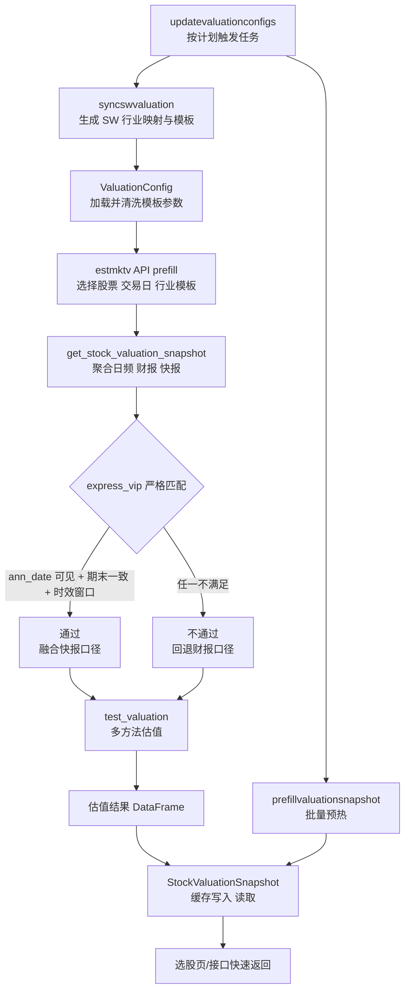

# 估值流程总览

这份文档不是讲某一个局部细节，而是把当前项目里的估值流程从头到尾串起来，帮助你回答三个问题：

1. 估值参数是怎么来的。
2. 单只股票是怎么被估出来的。
3. 为什么系统里还会出现快报、缓存、预填充和调度这些环节。

如果你只想先建立整体理解，建议先读这份总览，再看两份专题文档：

- 模板构建专题：`docs/valuation-template-construction.md`
- 调度与快报专题：`docs/valuation-update-schedule.md`
- 估值变更日志：`docs/valuation-changelog.md`
- 无前台选股专题：`docs/buy-strategy-cli-runbook.md`

## 1. 一句话理解整个体系

当前系统的估值不是“直接拿一只股票的 PE/PS/PB 算一下”这么简单，而是分成两层：

1. 先给行业构建一套可直接传给 `test_valuation` 的估值模板参数。
2. 再把单只股票的实时/财报/快报数据代入这套参数，得到 PE、PS、PB、PEG、DCF、DDM 等结果。

也就是说：

- 行业模板负责回答“这类公司应该用什么估值假设”。
- 个股快照负责回答“这家公司当前基本面是多少”。
- `test_valuation` 负责把两者合并，输出估值结果。

## 2. 先看输入端：估值模板是怎么来的

行业模板的核心产物是：

- `static/valuation_config/sw_industry_mapping_CN.json`
- `static/valuation_config/valuation_defaults_CN_sw.json`

生成入口是：

- `python manage.py syncswvaluation --params-only`

它的作用可以理解成：

1. 先建立股票和申万 L1/L2/L3 行业之间的映射关系。
2. 再根据行业成分股的横截面估值、市值、成长和 ROE，把每个行业的参数模板推出来。

这里有一个很重要的设计：

- 模板不是纯中位数直接生成。
- 模板也不是完全靠老的手工配置。

而是“旧模板做锚点 + 新横截面数据做修正”。

所以它兼顾两件事：

- 保持稳定，不会被单日极端值带偏。
- 又能随着行业估值与成长变化慢慢更新。

如果你想看这一步的细节，去看 `docs/valuation-template-construction.md`。

## 3. 再看参数层：行业模板怎么被取出来

单票估值时，并不是直接手写一组 `pe_target`、`ps_target`，而是先通过 `ValuationConfig` 取模板。

主路径通常是：

1. 按股票代码查它的申万行业归属。
2. 找到对应 L3/L2/L1 的模板参数。
3. 把模板参数清洗成可直接传给 `test_valuation` 的 kwargs。

这里的关键点是：

- 模板 JSON 里保存的字段名，本身就是 `test_valuation` 的参数名。
- 所以加载后不需要再做额外业务映射，只需要清洗空值、嵌套字典等。

这一步相当于把“行业经验”标准化成一个可执行的参数包。

## 4. 单票入口：estmktv 到底在做什么

你常用的入口是：

- `python manage.py estmktv --tscode ...`

它做的事情，可以按顺序理解为：

1. 先决定这只股票要用哪一组行业参数。
2. 再调用 `test_valuation` 做真正估值。
3. 最后把估值结果按表格打印出来。

这里有三种典型路径：

1. 默认路径

- 直接按股票代码找到申万模板。

2. 强制行业路径

- 手动指定某个申万行业，让股票按该行业模板估值。

3. 业务文本匹配路径

- 根据公司主营业务文字去匹配多个可能行业。
- 如果匹配不够可靠，就回退到 CITIC/SW 更稳妥的行业模板。

所以 `estmktv` 本质上不是“估值算法本身”，而是“模板选择 + 估值调用 + 输出展示”的外层编排器。

## 5. 核心计算：test_valuation 在做什么

`test_valuation` 是估值总入口。

你可以把它理解成一个估值 orchestrator：

1. 先取单票的基础快照。
2. 再调用多种估值方法。
3. 把各方法结果拼成一个 DataFrame。
4. 再额外给出区间、情景分析、敏感性分析。

它不会只算一种方法，而是会尽可能计算：

- Market Cap
- PE
- PS
- PB
- PEG
- EV/EBITDA
- FCFF DCF
- DDM

某个方法缺少必要输入时，会跳过，而不是让整个流程失败。

## 6. 单票基础快照：估值真正代入的是什么数据

在进入各种估值方法前，系统会先构造一个统一的个股快照。

这个快照会尽量收集：

- `daily_basic`：PE、PS、PB、总市值、总股本、收盘价
- `fina_indicator`：利润增速、ROE、EBITDA 等
- `income`：净利润、营收
- `balancesheet`：现金、债务、净资产
- `cashflow`：经营现金流、资本开支
- `dividend`：分红
- `express_vip`：业绩快报

系统的目标是把这些原始表整合成一个统一 snapshot，供所有估值方法复用。

这样做的好处是：

- 各估值方法不需要自己重复拉 Tushare。
- 快报、正式财报、交易数据可以在同一层做融合和约束。
- 诊断时可以直接看一份统一输入，而不是追多个接口。

## 7. 为什么快报会影响估值

行业模板只决定“应该给这类公司什么估值倍数或折现参数”。

但单票估值结果真正变动的原因，很多时候来自个股快照里的基本面变化，例如：

- 净利润变了，PE 会变。
- 营收变了，PS 会变。
- 利润增速变了，PEG 会变。

这就是为什么快报一旦被允许进入 snapshot，估值会马上变。

换句话说：

- 行业模板是相对稳定的“估值框架”。
- 快报是更及时的“个股输入更新”。

## 8. 为什么快报不能直接无条件使用

`express_vip` 有一个天然问题：

- 只要股票曾经发过快报，接口通常就还能查到。

但“查得到”不等于“这次估值应该用它”。

所以系统现在给快报加了三道硬门槛：

1. 公告可见性

- `ann_date <= trade_date`
- 目的是防止未来数据穿越。

2. 报告期一致性

- `express_end_date >= base_end_date`
- 目的是防止旧期快报覆盖新期财报。

3. 时效窗口

- `trade_date - ann_date <= N`
- 默认 `N = 180`
- 目的是防止很老的快报长期污染估值。

只有通过这三关，快报才会进入 snapshot。

如果没有通过，系统会回退到正式财报口径，并在诊断输出里给出 block reason。

## 9. 各估值方法分别依赖什么

为了更容易理解结果，可以这样记：

1. PE

- 需要净利润
- 由 `netprofit * target_pe` 得到

2. PS

- 需要营收
- 由 `revenue * target_ps` 得到

3. PB

- 需要净资产
- 由 `equity_book_value * target_pb` 得到

4. PEG

- 需要利润增速
- 本质上先把 `target_peg * growth_rate_pct` 转成目标 PE，再走 PE 估值

5. EV/EBITDA

- 需要 EBITDA、现金、债务

6. FCFF DCF

- 需要 FCFF 或可推导的现金流基础
- 更依赖模板里的 `dcf_kwargs`

7. DDM

- 需要分红数据或手动给定股利参数
- 更依赖模板里的 `ddm_kwargs`

所以你看到某只股票某个方法缺失时，通常不是“系统坏了”，而是该方法的输入条件没有满足。

## 10. 为什么要有估值快照缓存

单票命令临时算一次没问题，但选股页往往要同时看很多股票。

如果每只股票都实时调用 `test_valuation`，会有两个问题：

1. 慢
2. 重复计算太多

所以系统引入了 `StockValuationSnapshot`：

- 如果缓存里已有该股票、该交易日、该方法的估值，就直接读缓存。
- 如果没有，就实时计算一次，并把结果写回缓存。

这就是典型的 cache-aside 模式。

它的意义不是改变估值逻辑，而是把“算得出”变成“查得快”。

## 11. 为什么还要做 prefill 预热

仅靠 cache-aside 仍然有一个问题：

- 某只股票第一次被访问时，还是会慢。

所以系统增加了：

- `python manage.py prefillvaluationsnapshot`

它会批量把一批股票的估值先算好，提前写入 `StockValuationSnapshot`。

这样选股页第一次命中时，就能直接从缓存返回。

现在 prefill 和单票估值使用的是同一套快报严格规则，所以离线预热和实时估值不会口径漂移。

## 12. 为什么还要做调度

如果行业模板、快照缓存都要靠手工刷新，系统很快会过期。

所以又加了一层调度：

- `updatevaluationconfigs`

它负责任务编排，例如：

- 定期更新申万映射
- 定期更新申万参数模板
- 定期预热估值快照
- 定期更新关键词/CITIC 映射规则

这样整套估值系统才会形成闭环：

1. 模板能更新
2. 快照能预热
3. 线上查询能复用缓存

## 13. 你可以怎么理解“估值全过程”

把整个过程压缩成一条线，就是：

1. `syncswvaluation`

- 生成行业映射和行业模板

2. `ValuationConfig`

- 把行业模板装载成 `test_valuation` 可用参数

3. `estmktv` / API / prefill

- 选定股票、交易日、行业模板

4. `get_stock_valuation_snapshot`

- 取单票交易数据、财报、快报，并做严格筛选

5. `test_valuation`

- 运行多种估值方法并输出结果

6. `StockValuationSnapshot`

- 缓存估值结果，供选股页快速读取

7. `updatevaluationconfigs`

- 周期性刷新模板和缓存

## 14. 建议你的阅读顺序

如果你接下来想真正把这套系统吃透，建议按这个顺序看：

1. 先看这份总览，建立主线。
2. 再看 `docs/valuation-template-construction.md`，理解行业模板为什么这样构造。
3. 再看 `docs/valuation-update-schedule.md`，理解快报、缓存、预热、调度为什么存在。
4. 最后回到代码里看这几个核心入口：
   - `prediction/services/validation_loader.py`
   - `prediction/utils/prediction_util.py`
   - `prediction/management/commands/estmktv.py`
   - `prediction/management/commands/prefillvaluationsnapshot.py`
   - `prediction/management/commands/updatevaluationconfigs.py`

## 15. 一句话总结

你现在这套估值系统，本质上是一个“行业模板驱动、单票快照代入、缓存加速、调度维持新鲜度”的估值流水线。

模板负责给估值框架，快报/财报负责给个股输入，`test_valuation` 负责出结果，缓存和调度负责把这件事变成线上可用、且持续更新的能力。

## 16. 代码地图

如果你接下来想从文档走到代码，建议按下面这张地图找入口。

### 16.1 行业模板与参数加载

1. `prediction/services/sw_valuation.py`

- 这里是申万模板构建的核心服务实现。
- 主要负责根据申万行业成分、横截面估值、成长和 ROE 去生成模板参数。

2. `prediction/management/commands/syncswvaluation.py`

- 命令入口。
- 你执行 `python manage.py syncswvaluation ...` 时，实际从这里进入。

3. `prediction/services/validation_loader.py`

- `ValuationConfig`：参数装载入口。
- `normalize_test_valuation_kwargs`：把模板清洗成 `test_valuation` 可直接使用的参数。
- `get_sw_params_by_industry`：按申万行业取模板。
- `get_sw_params_by_tscode`：按股票代码取模板。

这一组文件解决的是“行业模板从哪里来”和“如何变成可执行参数”。

### 16.2 单票命令入口

1. `prediction/management/commands/estmktv.py`

- `_load_sw_valuation_params`：默认按股票代码加载申万模板。
- `_load_forced_sw_valuation_params`：强制按指定行业加载模板。
- `_match_business_industries`：按主营业务文本匹配行业。
- `handle`：命令整体编排入口。

你用 `estmktv` 时，可以把这个文件理解成“模板选择器 + 估值调用器 + 输出格式化器”。

### 16.3 单票基础快照与快报修正

1. `prediction/utils/prediction_util.py`

- `get_stock_valuation_snapshot`：单票估值快照总入口。
- `_is_express_vip_eligible`：快报严格匹配规则。
- `_apply_express_vip_adjustments`：把快报融合进 snapshot。

这是整个估值系统最关键的一层之一，因为所有估值方法最终都依赖这里准备出来的单票输入。

### 16.4 各估值方法与统一估值总入口

还是在 `prediction/utils/prediction_util.py` 里：

1. 相对估值方法

- `estimate_by_pe`
- `estimate_by_ps`
- `estimate_by_pb`
- `estimate_by_peg`
- `estimate_by_ev_ebitda`

2. 绝对估值方法

- `estimate_by_fcff_dcf`
- `estimate_by_ddm`

3. 聚合入口

- `estimate_all_supported_methods`
- `test_valuation`

如果你只看一个函数来理解“估值结果怎么出来”，优先看 `test_valuation`。

### 16.5 估值缓存与选股页复用

1. `prediction/models.py`

- `StockValuationSnapshot`：估值快照缓存模型。

2. `api/views.py`

- `_get_cached_method_price`：先查缓存。
- `_save_valuation_snapshot`：把实时计算结果回写缓存。
- `_evaluate_stock_valuation`：选股页估值读取入口。

这一层对应的是“为什么线上选股页不需要每次都全量实时估值”。

### 16.6 批量预热与调度

1. `prediction/management/commands/prefillvaluationsnapshot.py`

- 批量预热估值快照。
- 本质上是批量循环调用 `test_valuation`，然后把结果写入 `StockValuationSnapshot`。

2. `prediction/management/commands/updatevaluationconfigs.py`

- 调度任务总入口。
- 负责按计划运行 `syncswvaluation`、`prefillvaluationsnapshot` 等任务。

3. `static/valuation_config/update_schedule_CN.json`

- 线上实际调度配置。
- 包含 cadence、task steps 和 kwargs。

这几部分对应的是“为什么估值系统可以持续保持最新，而不是一次性脚本”。

## 17. 你可以怎么跟代码走一遍

如果你想真正把代码跑通到脑子里，建议按下面顺序读：

1. 先看 `prediction/management/commands/estmktv.py`

- 搞清楚命令是怎么决定用哪组行业参数的。

2. 再看 `prediction/services/validation_loader.py`

- 搞清楚模板参数是怎么被加载和清洗的。

3. 再看 `prediction/utils/prediction_util.py`

- 先看 `get_stock_valuation_snapshot`
- 再看 `test_valuation`
- 最后看具体估值方法

4. 然后看 `prediction/models.py` 和 `api/views.py`

- 理解缓存如何把单票估值能力复用到选股页。

5. 最后看 `prefillvaluationsnapshot.py` 和 `updatevaluationconfigs.py`

- 理解为什么系统能批量预热并自动维持新鲜度。

## 18. 一个最短理解路径

如果你今天只打算花 20 分钟，建议只看这 5 个入口：

1. `prediction/management/commands/estmktv.py`
2. `prediction/services/validation_loader.py`
3. `prediction/utils/prediction_util.py` 里的 `get_stock_valuation_snapshot`
4. `prediction/utils/prediction_util.py` 里的 `test_valuation`
5. `prediction/models.py` 里的 `StockValuationSnapshot`

看完这 5 个点，你基本就能建立这套估值系统的骨架理解。

## 19. 流程图（步骤 1）

下面这张图把“模板更新 -> 单票估值 -> 缓存复用 -> 批量预热 -> 调度闭环”放在一张图里。



## 20. 实战跟读路径（步骤 2）

这一段是“从命令到函数”的教学化走读。建议你一边开终端跑命令，一边按顺序点开代码。

### 20.1 先跑一个最小命令

建议命令（你刚才已经在用这一条主线）：

```bash
python manage.py estmktv --tscode 688002.SH --match-business-industries --business-match-level L2 --business-topn 2 --show-source --show-profit-source
```

你只需要盯三个输出块：

1. 行业参数来源（默认 SW / 强制 SW / 业务匹配 / fallback）
2. 快报诊断（apply reason、block reason、base -> effective）
3. 各估值方法输出（哪些方法成功，哪些方法跳过）

### 20.2 按函数调用顺序跟进代码

1. 命令入口

- `prediction/management/commands/estmktv.py` 的 `handle`
- 先确认参数解析与模板选择分支

2. 模板装载与清洗

- `prediction/services/validation_loader.py` 的 `ValuationConfig`
- 看 `get_sw_params_by_tscode` 和 `normalize_test_valuation_kwargs`

3. 个股快照构建

- `prediction/utils/prediction_util.py` 的 `get_stock_valuation_snapshot`
- 看快照字段是怎么从多张 Tushare 表拼出来的

4. 快报严格匹配

- 同文件 `_is_express_vip_eligible`
- 重点看三条硬规则触发条件

5. 多方法估值总入口

- 同文件 `test_valuation`
- 看它怎么调度 PE/PS/PB/PEG/EV/EBITDA/DCF/DDM

### 20.3 你应该能回答的 6 个问题

跟完上面的调用链后，尝试自己回答：

1. 当前股票最终用了哪组行业参数，为什么？
2. 本次快报是否被采用？如果没有，被哪条规则挡住？
3. PEG 的增长率来自基础财报还是快报修正？
4. 哪些估值方法被跳过，跳过是因为缺什么输入？
5. 结果有没有进入 `StockValuationSnapshot` 缓存？
6. 如果要批量提前算，应该走哪个命令和哪个调度任务？

## 21. 可勾选阅读清单（步骤 3）

你可以把下面清单当作 60 分钟学习版路线。

### 21.1 Phase A（10 分钟）建立骨架

- [ ] 通读本文件第 1~13 节
- [ ] 打开 `prediction/management/commands/estmktv.py`，定位 `handle`
- [ ] 打开 `prediction/utils/prediction_util.py`，定位 `test_valuation`

完成标准：

- 你能口头说出“模板 -> 快照 -> 估值 -> 缓存”的主链路。

### 21.2 Phase B（20 分钟）理解输入来源

- [ ] 阅读 `prediction/services/validation_loader.py` 里的 `ValuationConfig`
- [ ] 阅读 `prediction/services/sw_valuation.py` 的模板构建主流程
- [ ] 对照 `static/valuation_config/valuation_defaults_CN_sw.json` 抽看 1~2 个行业参数

完成标准：

- 你能判断某个参数是模板固化值、实时输入值，还是快报修正值。

### 21.3 Phase C（20 分钟）理解快报治理与方法结果

- [ ] 阅读 `get_stock_valuation_snapshot`
- [ ] 阅读 `_is_express_vip_eligible`
- [ ] 阅读 `estimate_all_supported_methods` 与 `test_valuation`
- [ ] 跑一次带 `--show-profit-source` 的单票命令

完成标准：

- 你能解释“为什么这次估值会变 or 不变”。

### 21.4 Phase D（10 分钟）理解线上性能闭环

- [ ] 阅读 `prediction/models.py` 中 `StockValuationSnapshot`
- [ ] 阅读 `api/views.py` 中 `_get_cached_method_price`、`_save_valuation_snapshot`、`_evaluate_stock_valuation`
- [ ] 阅读 `prediction/management/commands/prefillvaluationsnapshot.py` 与 `prediction/management/commands/updatevaluationconfigs.py`

完成标准：

- 你能解释“为什么线上查得快，以及为什么离线预热和实时估值口径一致”。

## 22. 你现在可以怎么用这份文档

1. 当你要理解单次估值结果时：

- 看第 20 节，按命令 + 函数链路跟读。

2. 当你要排查快报口径争议时：

- 看第 8 节 + 第 20.2 节第 4 步。

3. 当你要做新人交接或自测时：

- 直接用第 21 节清单逐项打勾。

## 23. 带行号代码导航

下面是“点开即看实现”的行号导航。建议按 23.1 -> 23.7 顺序阅读。

### 23.1 单票命令入口

- [estmktv.handle](prediction/management/commands/estmktv.py#L521)
- [estmktv._load_sw_valuation_params](prediction/management/commands/estmktv.py#L264)
- [estmktv._load_forced_sw_valuation_params](prediction/management/commands/estmktv.py#L270)
- [estmktv._match_business_industries](prediction/management/commands/estmktv.py#L276)

### 23.2 模板加载与清洗

- [ValuationConfig](prediction/services/validation_loader.py#L8)
- [normalize_test_valuation_kwargs](prediction/services/validation_loader.py#L207)
- [get_sw_params_by_industry](prediction/services/validation_loader.py#L311)
- [get_sw_params_by_tscode](prediction/services/validation_loader.py#L398)

### 23.3 个股快照与快报治理

- [get_stock_valuation_snapshot](prediction/utils/prediction_util.py#L977)
- [_is_express_vip_eligible](prediction/utils/prediction_util.py#L601)
- [_apply_express_vip_adjustments](prediction/utils/prediction_util.py#L667)

### 23.4 估值总入口与方法聚合

- [estimate_all_supported_methods](prediction/utils/prediction_util.py#L1568)
- [test_valuation](prediction/utils/prediction_util.py#L1708)

### 23.5 缓存与接口复用

- [StockValuationSnapshot](prediction/models.py#L2418)
- [_get_cached_method_price](api/views.py#L96)
- [_save_valuation_snapshot](api/views.py#L114)
- [_evaluate_stock_valuation](api/views.py#L151)

### 23.6 批量预热与调度入口

- [prefillvaluationsnapshot.handle](prediction/management/commands/prefillvaluationsnapshot.py#L229)
- [updatevaluationconfigs.handle](prediction/management/commands/updatevaluationconfigs.py#L124)
- [syncswvaluation.handle](prediction/management/commands/syncswvaluation.py#L50)

### 23.7 调度配置文件

- [update_schedule_CN.json](static/valuation_config/update_schedule_CN.json)
- [valuation_defaults_CN_sw.json](static/valuation_config/valuation_defaults_CN_sw.json)
- [sw_industry_mapping_CN.json](static/valuation_config/sw_industry_mapping_CN.json)

## 24. 运维决策表

如果你以后不想每次重新推理“到底该补缺失、增量刷新还是全量 refresh”，可以直接按这张表判断。

| 场景 | 推荐动作 | 原因 |
| --- | --- | --- |
| 日常月度维护 | 跑普通 prefill | 只补缺失快照，成本最低 |
| 季报/快报披露窗口 | 跑 disclosure 增量刷新 | 只重算公告日期晚于现有快照的股票 |
| 估值逻辑改动 | 跑全量 refresh | 旧快照口径已过时 |
| SW 模板发生明显变化 | 跑全量 refresh | 行业假设整体变了 |
| 新增估值方法 | 跑全市场补齐或全量 refresh | 需要补新方法快照 |
| 数据修复或回补 | 跑全量 refresh | 要清除旧缓存影响 |

你可以把三种模式简单理解为：

1. 普通 prefill：补缺失，不重算旧快照
2. disclosure 增量刷新：只重算“披露日期比快照更新时间更新”的股票
3. 全量 refresh：忽略已有快照，统一重算