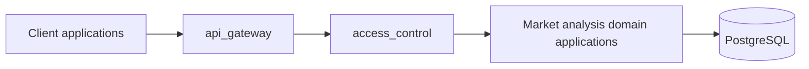

# Market Analysis Module Design

## Ownership

`manniu_backend` owns the following domain module boundaries. The seven domain applications listed below are registered in the current Django project.

| Application | Responsibility |
| --- | --- |
| `traditional_valuation` | Traditional valuation capabilities |
| `predictive_valuation` | Predictive valuation capabilities |
| `stock_selection` | Stock-selection capabilities |
| `backtest_engine` | Backtesting capabilities |
| `financials` | Financial-data capabilities |
| `market_data` | Market-data capabilities |
| `indices` | Index-data capabilities |

The detailed, implementation-ready design for `market_data` is maintained in [Market Data Backend Design](market-data-backend-design.md). Its data model, CLI, API, and PostgreSQL contracts are planned and not yet implemented.

## Backend Architecture

The backend separates HTTP transport and access control from domain capabilities. Domain applications own their calculation, query, and persistence logic; they must not implement automated trading execution.

### External API Module: `api_gateway`

`api_gateway` is the planned boundary for external HTTP APIs. It will own URL routing under `/api/`, request parsing, response serialization, versioning, and consistent error envelopes. It delegates business operations to the domain applications and must not duplicate their valuation, selection, backtest, financial, market-data, or index logic.

No external API endpoint is implemented in the current project. The only existing route is Django Admin at `/admin/`.

### Access Control Module: `access_control`

`access_control` is the planned boundary for authentication and authorization of external APIs. It will own credential validation, identity resolution, permission checks, and audit-context propagation before requests reach domain services.

The Django project currently includes the standard `django.contrib.auth` application and `AuthenticationMiddleware`; it does not yet implement API authentication, role/permission policy, access-control models, or authorization endpoints.

### Request Flow

1. A client sends a request to an endpoint owned by `api_gateway`.
2. `api_gateway` routes the request to `access_control` for identity and permission validation.
3. Authorized requests call the relevant domain application service.
4. The domain application reads or writes PostgreSQL through its own data layer.
5. `api_gateway` serializes the result using the documented response contract.

## Database Contract

No database models, migrations, tables, or schema fields are added by the current scaffold. Future domain data and access-control persistence remain PostgreSQL-only under the existing backend database configuration. SQLite must not be introduced as a persistence fallback.

## API Contract

No external API endpoints, request fields, or response fields are currently implemented. When `api_gateway` is implemented, endpoint-specific request and response schemas must be documented in this module directory and confirmed before development.

## Test Case Definition

### Core Flow

- Every declared application configuration has the expected Django application name.
- Every application is present in `INSTALLED_APPS`.
- A future external request reaches a domain service only after `access_control` grants permission.

### Boundary Scenarios

- All empty modules load under Django's static configuration check.
- An unauthenticated request to a future protected external API receives a documented authentication failure response.

### Failure Scenarios

- A missing `INSTALLED_APPS` entry or application-name mismatch fails the unit test.
- A request with insufficient permission is denied before any domain write operation.