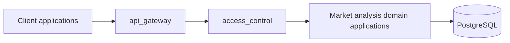

# Market Analysis Module Design

## 1 Ownership

`manniu_backend` owns the following domain module boundaries. The seven domain applications listed below are registered in the current Django project.

| Application | Responsibility |
| --- | --- |
| `traditional_valuation` | Traditional valuation capabilities |
| `predictive_valuation` | Predictive valuation capabilities |
| `stock_selection` | Stock-selection capabilities |
| `backtest_engine` | Backtesting capabilities |
| `financials` | Financial-data capabilities |
| `market_data` | Market-data capabilities |
| `indices` | Index-data capabilities |
| `market_sentiment` | Market and stock end-of-day sentiment indicators |

The detailed, implementation-ready design for `market_data` is maintained in [Market Data Backend Design](market-data-backend-design.md). Its data model, CLI, API, and PostgreSQL contracts are planned and not yet implemented.

The detailed financial-data and CLI designs for the registered `financials` app are maintained in [Financials Backend Design](financials-backend-design.md) and [Financials Sync CLI Design](financials-sync-cli-design.md). The app owns financial-statement ingestion and financial read models; it consumes `market_data.Security` and does not own market trading history.

`market_sentiment` is a planned Django application and is not yet registered or implemented. Its market-level and stock-level daily indicator design is maintained in [Market Sentiment Backend Design](market-sentiment-backend-design.md). It consumes PostgreSQL data from `market_data` and never owns Tushare ingestion, trading history, or automated trading execution.

## 2 Backend Architecture

The backend separates HTTP transport and access control from domain capabilities. Domain applications own their calculation, query, and persistence logic; they must not implement automated trading execution.



### 2.1 External API Module: `api_gateway`

`api_gateway` is the planned boundary for external HTTP APIs. It will own URL routing under `/api/`, request parsing, response serialization, versioning, and consistent error envelopes. It delegates business operations to the domain applications and must not duplicate their valuation, selection, backtest, financial, market-data, or index logic.

No external API endpoint is implemented in the current project. The only existing route is Django Admin at `/admin/`.

### 2.2 Access Control Module: `access_control`

`access_control` is the planned boundary for authentication and authorization of external APIs. It will own credential validation, identity resolution, permission checks, and audit-context propagation before requests reach domain services.

The Django project currently includes the standard `django.contrib.auth` application and `AuthenticationMiddleware`; it does not yet implement API authentication, role/permission policy, access-control models, or authorization endpoints.

### 2.3 Request Flow

1. A client sends a request to an endpoint owned by `api_gateway`.
2. `api_gateway` routes the request to `access_control` for identity and permission validation.
3. Authorized requests call the relevant domain application service.
4. The domain application reads or writes PostgreSQL through its own data layer.
5. `api_gateway` serializes the result using the documented response contract.

### 2.4 Feature And Projection Ownership Principles

The system separates canonical financial facts from model-specific features:

```text
Tushare
  -> financials raw records
	  -> predictive_valuation feature builder
		  -> PredictiveFinancialFeaturePanel / PredictiveFinancialFeatureLatest
			  -> predictive inference and prediction snapshots
```

`financials` owns trusted, auditable financial facts and their publication-time
semantics. Its responsibilities include Tushare raw-record ingestion, provider-field
normalization, disclosure and effective-public-date resolution, revision history,
as-of queries, ingestion audit, and idempotent persistence. It must not own a generic
feature panel whose fields are defined by one downstream model contract.

`predictive_valuation` owns the feature contract required by its active models. Its
responsibilities include selecting report types and eligible records, constructing
`PredictiveFinancialFeaturePanel` and `PredictiveFinancialFeatureLatest`, applying
model-specific field mappings and feature provenance, enforcing point-in-time rules,
and performing model-specific imputation and inference. These projections are
downstream, rebuildable views of `financials` records rather than a second source of
financial truth.

The predictive feature builder currently consumes raw records from `income_vip`,
`balancesheet_vip`, `cashflow_vip`, `fina_indicator_vip`, and `disclosure_date`.
Synchronizing `forecast_vip`, `express_vip`, `dividend`, `fina_audit`, or
`fina_mainbz_vip` stores auditable financial raw data but does not imply that those
records are part of the current predictive feature contract. A future consumer may
adopt them through an explicit feature-contract change.

`sync_financials` and predictive projection rebuild are separate operational steps.
`sync_financials` commits raw records and can identify affected securities and report
periods for downstream consumers; it does not write predictive projection tables,
invoke predictive inference, or guarantee that predictive feature tables or prediction
snapshots are current. Projection freshness and rebuild counts belong to the downstream
consumer run. In particular, the legacy `projection_rebuild_count` field on a
financial ingestion run is a compatibility placeholder and must not be interpreted as
an actual predictive rebuild count until an explicit integration contract is
implemented.

If a projection becomes useful to multiple domains, it must first be defined as a
stable, domain-neutral canonical financial fact with an explicit unit, provenance, and
as-of contract. Model-specific naming, imputation, normalization, report-type logic,
and model-version dependencies remain inside the owning downstream domain.

## 3 Database Contract

No database models, migrations, tables, or schema fields are added by the current scaffold. Future domain data and access-control persistence remain PostgreSQL-only under the existing backend database configuration. SQLite must not be introduced as a persistence fallback.

## 4 API Contract

No external API endpoints, request fields, or response fields are currently implemented. When `api_gateway` is implemented, endpoint-specific request and response schemas must be documented in this module directory and confirmed before development.

## 5 Test Case Definition

### 5.1 Core Flow

- Every declared application configuration has the expected Django application name.
- Every application is present in `INSTALLED_APPS`.
- A future external request reaches a domain service only after `access_control` grants permission.

### 5.2 Boundary Scenarios

- All empty modules load under Django's static configuration check.
- An unauthenticated request to a future protected external API receives a documented authentication failure response.
- `financials` raw ingestion does not imply a predictive projection rebuild.
- Predictive feature projections remain owned by `predictive_valuation` and are built only from their explicit feature contract.
- Financial raw records consumed by predictive features preserve publication-time and as-of boundaries.

### 5.3 Failure Scenarios

- A missing `INSTALLED_APPS` entry or application-name mismatch fails the unit test.
- A request with insufficient permission is denied before any domain write operation.

### 5.4 TODO List

- [ ] 按本文档完成模块注册、访问控制边界及对应单元测试，并在测试通过后更新本条状态。
