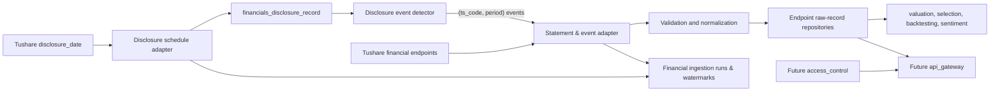

# Financials Backend Design

## Status And Ownership

`financials` is an already registered but currently empty `manniu_backend` Django app. It will own the ingestion, PostgreSQL persistence, auditability, period/as-of selection, and read-optimized snapshots of Tushare corporate financial data. No financial models, migrations, sync command, public API, or data write is implemented by this design.

`financials` consumes `market_data.Security` for stock identity and listing lifecycle. `market_data` remains the owner of trading bars, market master data, and Tushare market-data ingestion. `financials` supports research, valuation, selection, backtesting, and decision support only; it must never create or execute trading orders.

## Source Coverage

| Domain dataset | Tushare endpoint | Primary use |
| --- | --- | --- |
| Income statement | `income_vip` | Revenue, profit, EPS, historical statements |
| Balance sheet | `balancesheet_vip` | Assets, liabilities, equity, debt and liquidity |
| Cash flow | `cashflow_vip` | Operating, investing, and financing cash flow |
| Performance forecast | `forecast_vip` | Forecast range and expected profit change |
| Performance express | `express_vip` | Earnings flash updates |
| Dividend/corporate action | `dividend` | Cash/share dividends and ex-date data |
| Financial indicators | `fina_indicator_vip` | ROE, ROA, margins, growth, solvency, turnover |
| Audit opinion | `fina_audit` | Audit result and fees |
| Main business composition | `fina_mainbz_vip` | Segment/product/region sales and profit |
| Disclosure schedule | `disclosure_date` | Announcement, planned, actual, and modified dates |

All source records retain the provider response identity and dates. The data model does not collapse revisions into a single untraceable row.

## Architecture

Financial data updates are event-driven: the upstream `disclosure_date` endpoint serves as the primary event definition source. When new announcements, confirmed actual disclosure dates (`actual_date`), or modified schedules are detected from `disclosure_date`, the system identifies the affected securities and reporting periods `(security_id, period)`. The statement and event adapters (`income_vip`, `balancesheet_vip`, `cashflow_vip`, `fina_indicator_vip`, `fina_audit`, `fina_mainbz_vip`, `forecast_vip`, `express_vip`, `dividend`) then execute targeted queries for only the affected symbols rather than scanning the entire market. Downstream consumers own any model-specific projection rebuild after raw records commit.

The adapter owns explicit endpoint projections, Tushare paging, transient-error handling, and secret-safe errors. Normalization owns `NaN` conversion, scalar conversion, endpoint date selection, and deterministic row signatures. Repositories own PostgreSQL writes. Query services select only data that was public at an explicit `as_of_date`; public API handlers must delegate to those services after `access_control` authorization.

## PostgreSQL Persistence Design

### Raw Endpoint Records

Each Tushare endpoint uses a dedicated raw-record table instead of a single sparse mega-table. Every table has a `security_id` foreign key to `market_data.Security`, original `ts_code`, provider dates, `row_signature`, `source_revision_at` when available, `source`, `imported_at`, and raw endpoint fields.

The common natural key is `(security_id, ann_date, end_date, period, row_signature)`. `row_signature` is a SHA-1 or equivalent deterministic hash of normalized provider fields that distinguish repeated rows, such as business-composition item or dividend proposal. It permits different valid disclosures for the same report date while making identical repeats idempotent.

| Planned table | Endpoint | Core fields | Required indexes |
| --- | --- | --- | --- |
| `financials_income_record` | `income_vip` | revenue, total revenue, operating/total/net profit, attributable profit, EPS | unique natural key; `(security_id, end_date DESC)`; `(ann_date)` |
| `financials_balance_sheet_record` | `balancesheet_vip` | total assets/liabilities/equity, cash, receivables, inventory, short/long borrowings | same |
| `financials_cashflow_record` | `cashflow_vip` | operating, investing, financing, net cash change | same |
| `financials_forecast_record` | `forecast_vip` | forecast type, change range, profit range | same |
| `financials_express_record` | `express_vip` | revenue, net profit, assets, EPS | same |
| `financials_dividend_record` | `dividend` | cash/share distribution, record date, ex-date | natural key; `(security_id, ex_date DESC)`; `(ann_date)` |
| `financials_indicator_record` | `fina_indicator_vip` | profitability, growth, margin, solvency, turnover, cash-flow ratios | same |
| `financials_audit_record` | `fina_audit` | audit result, audit fee | same |
| `financials_main_business_record` | `fina_mainbz_vip` | item/category, sales, profit | same |
| `financials_disclosure_record` | `disclosure_date` | announcement, planned, actual, modified disclosure dates | natural key; `(ann_date, security_id)`; `(security_id, end_date DESC)` |

Date fields are PostgreSQL `DATE` when supplied in valid `YYYYMMDD` format. Provider values that have no date meaning remain text. Financial amounts and ratios use documented `NUMERIC` precision, not floats: monetary quantities and shares use `NUMERIC(24, 4)`, per-share values use `NUMERIC(18, 6)`, and percentages/ratios use signed `NUMERIC(18, 6)`. The implementation must document the provider unit for each endpoint field and never silently convert units.

### Consumer Projections

Raw endpoint records optimize audit and replay. `financials` does not own generic
feature-panel or latest-feature tables. Each downstream domain owns its own projection
schema and rebuild policy so persisted fields match its feature contract.
`predictive_valuation`, for example, owns its point-in-time financial panel/latest
projections and constructs them from these raw records before inference.

## As-Of And Revision Rules

Financial data is publication-time sensitive. A feature used on trade date $t$ may only use a raw record with an effective public date no later than $t$:

$$
effectiveDate = actualDate \;\text{when present, otherwise}\; annDate
$$

Rows without both dates are retained for audit but excluded from consumer time-sensitive
projections until a valid date is available. A `disclosure_date` revision causes the
relevant consumer's versioned, idempotent projection rebuild. An amendment creates a
new raw signature or source revision and does not erase the previous evidence.

Forecasts, express reports, dividends, and audits may have multiple events per period.
They remain endpoint records and are selected by explicit consumer policy; they are not
silently merged into a statement value. Backtests must request an explicit `as_of_date`;
each consumer enforces its own point-in-time projection boundary.

## Ingestion Control And Reliability

`FinancialIngestionRun` stores endpoint list, requested scope/date coverage, start/finish time, status, source/accepted/upserted/rejected counts, pagination/retry counts, and sanitized error summary. `FinancialIngestionWatermark` is unique by `(endpoint, scope_key)` and records the last complete announcement-date or endpoint-specific source cursor.

Endpoint writes occur in transactions per bounded page/chunk. A successful chunk writes raw records and its counters together. A watermark advances only after every requested page and coverage check succeeds. Logs, database records, and errors must never contain `TUSHARE_TOKEN`, database passwords, or raw connection strings.

## Consumer And API Boundary

No API is defined or implemented. Future `api_gateway` read APIs must accept bounded symbol/date/range queries and delegate to `financials` as-of query services. `access_control` must authorize public reads before the service call. Operational import runs, raw endpoints, error details, and broad export access are operator-only.

## Test Case Definition

### Core Flow

- Every endpoint maps to its dedicated raw model, deterministic natural key, and documented projection fields.
- `disclosure_date` detects new/amended disclosure events and accurately drives targeted statement and event ingestion for affected securities without all-market scanning.
- A repeated normalized provider row upserts idempotently, while a material revision remains auditable.
- An eligible statement/indicator set is available for an authorized downstream consumer projection rebuild.
- A consumer historical as-of projection uses only disclosure records public on or before the requested date.

### Boundary Scenarios

- Multiple dividend or main-business rows for one security/report period remain distinct through row signatures.
- Missing/invalid optional publication dates are retained as raw data but excluded from time-sensitive projections.
- Consumers that require latest projections maintain their own one-row snapshots rather than scanning raw history.
- A provider field not in a typed projection remains in the endpoint raw payload under the endpoint schema policy.

### Failure Scenarios

- A malformed required endpoint payload, exhausted page limit, or failed chunk leaves the endpoint watermark unchanged.
- A projection cannot use a statement whose effective date is after the requested as-of date.
- Tokens, passwords, and connection strings are absent from command output and persisted error summaries.
- No financial calculation or API path creates an automatic trading action.

## Implementation Sequence

1. Confirm concrete table names, core typed field list/units for every endpoint, row-signature policy, and effective-date precedence.
2. Implement raw endpoint models, run/watermark models, PostgreSQL migrations, indexes, and model-contract tests.
3. Implement adapter, normalization, pagination, and endpoint repository upserts with mocked Tushare tests.
4. Implement disclosure-date ingestion and event detection; downstream domains rebuild their own as-of projections with no-lookahead tests.
5. Implement the operator CLI, backfill/quarterly scheduling, reconciliation artifacts, and failure exit behavior.
6. Confirm API and authorization contracts before implementing read endpoints.