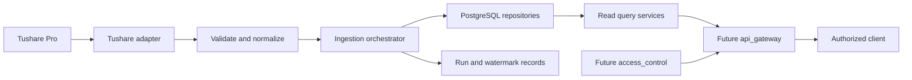

# Market Data Backend Design

## Status And Ownership

This document is the implementation design for the registered `manniu_backend.market_data` Django application. The first schema layer is implemented and migrated to PostgreSQL: its Django models cover securities, geography/industry dimensions, company profiles, daily trading history/latest snapshots, stock fundamental history/latest snapshots, stock cost history/latest snapshots, index fundamental history/latest snapshots, and ingestion run/watermark control. An initial `sync_market_data` CLI is implemented for master/company/daily datasets; paging/retry/resume, complete adjustment processing, PostgreSQL partition DDL, weekly/monthly derivation, public APIs, and production ingestion runs remain pending.

`market_data` owns end-of-day market-data ingestion, PostgreSQL persistence, reconciliation, and read-optimized query services for stocks and indices. The `indices` application consumes index data for index-domain analysis and does not own index synchronization or tables.

The module supports analysis and decision support only. It must never place or automate trading orders.

## Scope

| Dataset | Asset scope | Tushare source | Frequency |
| --- | --- | --- | --- |
| Security master | Stocks and indices | `stock_basic`, `index_basic` | On demand and daily delta |
| Company profile | Stocks | `stock_company` | On demand and daily delta |
| Trading bars and adjusted prices | Stocks | `stk_factor` | Daily, derived weekly/monthly |
| Daily fundamentals | Stocks | `daily_basic` | Daily, derived weekly/monthly |
| Cost distribution | Stocks | `cyq_perf` | Daily, derived weekly/monthly |
| Trading bars | Indices | `index_daily` | Daily, derived weekly/monthly |
| Daily fundamentals | Indices | `index_dailybasic` | Daily |

The design deliberately excludes intraday data, request-time calls to Tushare, automated trading, public HTTP endpoints, and access-control implementation. `api_gateway` and `access_control` are future consumers of the read services defined here.

## Architecture



### Layer Responsibilities

- **Tushare adapter**: owns SDK access, explicit field selection, paging, timeouts, rate-limit backoff, and conversion of provider exceptions into typed ingestion failures. Credentials remain server-side and are never returned through APIs or CLI logs.
- **Validation and normalization**: validates required columns before any write; converts dates, decimals, units, nulls, and codes; deduplicates natural keys; rejects invalid rows with a reason.
- **Ingestion orchestrator**: chooses `backfill` or `daily` coverage, divides work into bounded chunks, coordinates transactions, writes run state, and advances a watermark only after a complete successful chunk.
- **Repositories**: use PostgreSQL bulk upserts and read query methods. They are the only component allowed to write market-data tables.
- **Read query services**: provide bounded, index-backed EOD reads to future API handlers. They never invoke Tushare as a cache miss fallback.
- **CLI boundary**: synchronization commands are operator-only maintenance tools, not public HTTP endpoints. Future external reads must pass `access_control` before reaching a read query service.

### Environment Configuration

`manniu_backend/.env` is the local runtime configuration file and is excluded from version control. It uses `DB_ENGINE`, `DB_NAME`, `DB_USER`, `DB_PASSWORD`, `DB_HOST`, `DB_PORT`, and `TUSHARE_TOKEN`, aligned with the UAT earnings-service environment contract. `DB_ENGINE` must be `django.db.backends.postgresql`; missing database variables or any other engine stops Django during settings loading. The Tushare token is available only to future server-side adapters and must never be returned in an API response, written to a report, or emitted in CLI logs.

## PostgreSQL Data Model

All identifiers, timestamps, and lifecycle fields use Django conventions when implemented. All monetary and price fields use `NUMERIC`, not binary floating point. Provider text values are trimmed, but source values are retained where they are business-significant.

### Security Master

`Security`

| Field | Type and constraint | Notes |
| --- | --- | --- |
| `id` | Primary key | Internal stable identifier |
| `ts_code` | `VARCHAR(16)`, unique | Canonical Tushare code for both stocks and indices |
| `asset_type` | constrained text | `STOCK` or `INDEX` |
| `symbol`, `name`, `full_name` | nullable text | Provider master fields |
| `market`, `exchange`, `list_status` | nullable indexed text | Provider classification and lifecycle state |
| `list_date`, `delist_date` | nullable date | Source dates |
| `is_hs` | nullable text | Stock Connect marker for stocks |
| `source_updated_at`, `synced_at` | timestamp with time zone | Provider/source audit and local audit |

Unique key: `ts_code`. Check constraint: `asset_type IN ('STOCK', 'INDEX')`.

### Company, Geography, And Industry

`CompanyProfile` has one optional row per stock `Security`; index securities do not receive a company profile. It stores company fields from `stock_company`, including chairman, manager, secretary, registered capital, establishment date, website, contact data, employees, main business, business scope, and source update timestamps.

The geographic and industry design separates raw provider input from canonical dimensions:

| Entity | Key fields | Rules |
| --- | --- | --- |
| `Province` | `name` unique, `source_name` | Stores normalized provider province/area names. |
| `City` | unique `(province_id, name)` | City names are not globally unique. |
| `Industry` | `name` unique, `source_system`, `source_version` | `stock_basic.industry` is a Tushare industry taxonomy, not interchangeable with future SW taxonomies. |
| `Region` | `code` unique, `name` | The seven codes are `NORTH`, `NORTHEAST`, `EAST`, `CENTRAL`, `SOUTH`, `SOUTHWEST`, and `NORTHWEST`. |
| `ProvinceRegionMapping` | unique `(province_id, mapping_version, effective_from)` | Links a province to a region, with effective dates and mapping version. |

`Security` stores nullable references to its Tushare `area` province and industry. `CompanyProfile` stores nullable registered `province` and `city` references. The raw `province_name`, `city_name`, and `industry_name` received from Tushare are retained for traceability.

`stock_company.province` maps to registered province and `stock_company.city` maps to registered city. `stock_basic.area` maps to security area, while `stock_basic.industry` maps to security industry. The two province sources can differ and must not silently overwrite each other. A missing source value remains null with an ingestion-quality record; it must never be invented as Shanghai. Region is derived through the active versioned province mapping, not written as an untraceable text value.

### Trading History And Latest Snapshots

Daily trading history is the source of record and is stored separately from current snapshots. This avoids using `MAX(trade_date)`, unbounded ordering, or window functions over tens of millions of rows for a frontend latest-price request.

`MarketBarDailyHistory` stores stock and index EOD bars. It is a PostgreSQL range-partitioned table on `trade_date`, with one monthly partition per calendar month. The parent table has no default partition: a missing future partition fails the ingestion run before data is misplaced. An operator maintenance task creates partitions for the next three months and monitors partition size and index bloat.

| Field group | Fields |
| --- | --- |
| Identity | `security_id`, `trade_date`, `frequency` (`D`, `W`, `M`) |
| Raw provider values | `open`, `high`, `low`, `close`, `pre_close`, `change`, `pct_change`, `volume`, `amount` |
| Adjustment | `adj_factor`, `open_qfq`, `high_qfq`, `low_qfq`, `close_qfq`, `pre_close_qfq`, `change_qfq`, `pct_change_qfq`, `open_hfq`, `high_hfq`, `low_hfq`, `close_hfq`, `pre_close_hfq`, `change_hfq`, `pct_change_hfq` |
| Audit | `source_updated_at`, `calculated_at`, `synced_at` |

The daily-history unique key is `(security_id, trade_date)`. `volume >= 0` and `amount >= 0` when present. Prices and adjustment factor use `NUMERIC(20, 6)` or an approved equivalent; `pct_change` uses `NUMERIC(12, 6)` and represents percentage points.

For stocks, `stk_factor` is the authoritative Tushare interface for raw daily bars and adjusted prices. It must provide raw OHLC/pre-close values, `adj_factor`, and the corresponding qfq/hfq values; the adapter maps those directly to the raw and adjustment columns in `MarketBarDailyHistory`. `daily` and `adj_factor` are not a substitute for this first implementation, because an ordinary daily refresh can otherwise leave the qfq/hfq columns null. The adapter validates the required `stk_factor` columns before each write and records a quality failure rather than silently publishing incomplete adjusted data.

For indices, `index_daily` values are raw provider values. Adjustment fields remain null unless a separately approved index factor source is added; raw index prices must not be copied into qfq/hfq fields and labeled as adjusted.

`MarketBarWeeklyHistory` and `MarketBarMonthlyHistory` are independent physical tables, not `frequency` rows mixed into the daily partitioned table. They have the same business columns and unique key `(security_id, trade_date)`, where `trade_date` is the completed period end date. This keeps daily indexes compact and makes 1Y/3Y lower-frequency chart queries predictable.

`MarketBarLatest` has at most one row per `(security_id, frequency)`, where frequency is `D`, `W`, or `M`. It stores the latest completed bar's trade date, selected OHLCV/raw and adjusted values, source revision timestamp, and local sync timestamp. It is a denormalized read model, not a replacement for historical data.

### Corporate Actions And Adjustment Rebuilds

Stock qfq/hfq history is mutable when a new ex-dividend or ex-rights event becomes effective. A routine daily `stk_factor` refresh only obtains current-period records; it must not be assumed to rewrite previously stored adjusted prices. The planned `dividend` event handler addresses this explicitly:

1. After the stock daily-data run, request Tushare `dividend` for a bounded lookback window with `ts_code`, announcement, record, ex-date, payout, and share-change fields.
2. Normalize each provider event into a future `CorporateActionEvent` table using a unique provider event identity or a deterministic natural key comprising security, ex-date, and action attributes.
3. Detect a new event or a material revision whose ex-date is within the synchronized history of the affected stock.
4. Enqueue one idempotent `rebuild-adjusted-history` job for that security. The job re-requests the complete retained history window from `stk_factor`, upserts every daily historical row's raw and qfq/hfq fields, then recalculates the daily latest snapshot.
5. Commit the stock-specific rebuild atomically, invalidate only that security's EOD chart/fundamental cache keys, and record the source event and rebuilt coverage in `IngestionRun`/`IngestionWatermark`.

The event handler must not rewrite other securities, invoke real-time trading behavior, or advance a normal stock-bars watermark until the rebuild succeeds. A failed rebuild preserves its event as pending/retryable and keeps existing history visible with a data-quality warning.

### Fundamentals And Cost Distribution

`StockDailyFundamentalHistory` stores `daily_basic` with unique key `(security_id, trade_date)`. Its `StockDailyFundamentalLatest` counterpart has unique `security_id`. Both use the identical business field set below, plus `trade_date`, `source_updated_at`, and `synced_at`.

| Field group | Fields and storage contract |
| --- | --- |
| Price | `close NUMERIC(18,4)`, Tushare unit: yuan per share |
| Rates | `turnover_rate`, `turnover_rate_f`, `dv_ratio`, `dv_ttm` as `NUMERIC(12,4)`, Tushare unit: percentage points; `volume_ratio NUMERIC(14,6)`, dimensionless |
| Valuation | `pe`, `pe_ttm`, `pb`, `ps`, `ps_ttm` as signed `NUMERIC(18,6)`, unit: ratio/multiple |
| Share counts | `total_share`, `float_share`, `free_share` as `NUMERIC(22,4)`, Tushare raw unit: ten thousand shares |
| Market capitalization | `total_mv`, `circ_mv` as `NUMERIC(24,4)`, Tushare raw unit: ten thousand yuan |

The first implementation preserves these Tushare raw units. It does not silently convert share counts to shares or market capitalization to yuan; any future normalized columns must have explicit unit-bearing names and a separate approved migration.

`StockCostDistributionHistory` stores `cyq_perf` with unique key `(security_id, trade_date)`. Its `StockCostDistributionLatest` counterpart has unique `security_id`. Both store `his_low`, `his_high`, `cost_5pct`, `cost_15pct`, `cost_50pct`, `cost_85pct`, `cost_95pct`, and `weight_avg` as `NUMERIC(18,4)` in yuan per share, plus `winner_rate NUMERIC(12,4)` in percentage points and standard source/local audit fields.

`IndexDailyFundamentalHistory` has unique key `(security_id, trade_date)` and an `IndexDailyFundamentalLatest` counterpart with unique `security_id`. Both store these seven `index_dailybasic` values: `pe`, `pe_ttm`, `pb` as signed `NUMERIC(18,6)`; `turnover_rate`, `turnover_rate_f` as `NUMERIC(12,4)` percentage points; and `total_mv`, `float_mv` as `NUMERIC(24,4)` in Tushare raw ten thousand yuan. They are valid only for `Security.asset_type = 'INDEX'`.

All three latest tables are updated only when an incoming record is newer than the stored snapshot date, or has the same date with a newer source revision. Historical backfills for older dates must not overwrite latest snapshots.

### Ingestion Control Plane

`IngestionRun` records each operator request: `id`, dataset, mode, frequency, requested scope/date range, started/finished timestamps, status, source row count, accepted/upserted/rejected row counts, retry count, and sanitized error summary.

`IngestionWatermark` has unique key `(dataset, scope_key, frequency)`. It records the last complete source date, last complete run, current status, overlap configuration, retry metadata, and updated timestamp. `scope_key` is `ALL`, a canonical `ts_code`, or a named index universe. A failed, truncated, or partially committed chunk does not advance the corresponding watermark.

## Physical Design And Read Performance

Daily trading, fundamental, and cost history are expected to exceed ten million rows. Daily history tables therefore use monthly PostgreSQL range partitions by `trade_date` from their first production release; this allows partition pruning for all date-bounded reads and keeps index maintenance localized. Weekly and monthly histories remain independent non-partitioned tables until their measured volume requires partitioning.

| Table | Required indexes | Query served |
| --- | --- | --- |
| `MarketBarDailyHistory` partition | unique `(security_id, trade_date)`; `(security_id, trade_date DESC)` | bounded daily K-lines and point-in-time latest lookup |
| `MarketBarWeeklyHistory` / `MarketBarMonthlyHistory` | unique `(security_id, trade_date)`; `(security_id, trade_date DESC)` | long-horizon W/M K-lines |
| `MarketBarLatest` | unique `(security_id, frequency)`; `(frequency, trade_date DESC)` | latest quote cards and list pages |
| `StockDailyFundamentalHistory` partition | unique `(security_id, trade_date)`; `(security_id, trade_date DESC)`; `(trade_date, security_id)` | valuation history and daily cross-section filters |
| `StockDailyFundamentalLatest` | unique `security_id`; `(trade_date DESC)` | latest stock screening and quote fundamentals |
| `StockCostDistributionHistory` partition | unique `(security_id, trade_date)`; `(security_id, trade_date DESC)`; `(trade_date, security_id)` | cost history and daily scans |
| `StockCostDistributionLatest` | unique `security_id` | latest cost distribution panel |
| `IndexDailyFundamentalHistory` partition | unique `(security_id, trade_date)`; `(security_id, trade_date DESC)`; `(trade_date, security_id)` | index valuation history and cross-index scans |
| `IndexDailyFundamentalLatest` | unique `security_id`; `(trade_date DESC)` | index latest valuation panels |
| `Security` | unique `ts_code`; `(asset_type, list_status)`; `(area_id, industry_id, list_status)` | code resolution and filter panels |
| `CompanyProfile` | unique `security_id`; `(province_id, city_id)` | company profile and geographic filtering |
| `IngestionWatermark` | unique dataset/scope/frequency; `(status, updated_at)` | restart and operations monitoring |

### High-Frequency K-Line And Fundamental Reads

The frontend supports these fixed EOD daily windows: `30`, `60`, `90`, `120`, `1Y`, and `3Y`. `1Y` means the latest 252 completed trading bars; `3Y` means the latest 756 completed trading bars. The API layer translates a named window into a bounded row limit after locating the latest completed date; it does not approximate a trading window using calendar days.

| Frontend request | Read model | Query rule |
| --- | --- | --- |
| Latest quote and fundamentals | `MarketBarLatest` plus the applicable fundamental/cost latest table | One `security_id` lookup; no history-table scan. |
| 30/60/90/120 daily K-line | `MarketBarDailyHistory` | Require `security_id`; query descending through `(security_id, trade_date DESC)`, limit by the requested window, then return ascending order. |
| 1Y/3Y daily K-line | `MarketBarDailyHistory` | Same index-backed pattern with limits 252/756; partition pruning applies when a resolved lower date bound is supplied. |
| 1Y/3Y lower-resolution chart | Weekly/monthly history | Prefer `W` or `M` after the frontend requests that resolution; never aggregate daily rows in the request path. |
| Fundamental history aligned to K-line | Corresponding fundamental or cost history partition | Query the same bounded date range and return only fields requested by the chart/panel. |

The query service resolves the latest date from `MarketBarLatest` and passes an explicit lower trade-date bound to each history query. It selects chart columns only, uses one batched fundamental query per security/window, and never issues one query per K-line point. Read endpoints reject an absent window, an unsupported window, a period over 756 daily bars, or a response without an explicit field projection.

Response caching is permitted only for these immutable EOD read models. Cache keys contain `security_id`, frequency, requested window, adjustment mode, field projection, and the source `trade_date`/revision marker from the latest snapshot. The post-ingestion transaction invalidates keys for affected securities after updating historical and latest rows. A cache miss reads PostgreSQL; it must never call Tushare. PostgreSQL remains the source of record, and cache availability must not change response correctness.

Future repository APIs must enforce bounded ranges: chart reads require a security, frequency, and explicit fixed window or start/end date; list reads require page limits; broad cross-sectional reads require a trade date. The read layer selects only displayed fields and uses keyset pagination for large history lists.

## Ingestion Design

### Source Validation And Normalization

Every adapter response is checked for required columns before transformation:

- `stk_factor`: `ts_code`, `trade_date`, raw OHLC/pre-close/change/percentage/volume/amount fields, and qfq/hfq OHLC/pre-close fields.
- `index_daily`: `ts_code`, `trade_date`, `open`, `high`, `low`, `close`.
- `daily_basic`, `cyq_perf`, and `index_dailybasic`: `ts_code`, `trade_date` plus the requested metric fields.
- `stock_basic` and `index_basic`: `ts_code`, name, market/exchange, and lifecycle fields where available.
- `stock_company`: `ts_code`, `province`, and `city` are nullable but must be distinguishable from malformed payloads.

Codes are trimmed and validated against the `VARCHAR(16)` limit. Trade dates must parse to a calendar date. Numeric values use explicit decimal conversion; invalid, infinite, or out-of-range values are rejected per row. Duplicate source rows collapse by the target natural key, retaining the last provider row while recording the duplicate count.

### Backfill And Daily Refresh

Backfill and daily refresh use the same orchestrator and repository methods.

| Mode | Coverage selection | Write behavior |
| --- | --- | --- |
| `backfill` | Explicit date interval, split into bounded symbol/date chunks | Upsert each validated natural key and persist a watermark after the chunk commits. |
| `daily` | Last completed trading date plus a configurable overlap window | Upsert overlap records to absorb upstream corrections. |
| `resample` | Daily data newer than the derived-frequency watermark | Upsert weekly/monthly derived records after source coverage is complete. |

Daily all-market requests are preferred where Tushare supports a single trade-date query. Historical loads use bounded per-security or paginated intervals. A scheduler invokes the CLI after the market close and after the source availability window; the CLI itself remains deterministic and does not assume terminal working-directory state.

The completed trading day comes from an approved trading-calendar source. It must not be inferred by skipping weekends alone. If calendar availability is unavailable, the run fails safely rather than advancing a watermark on an assumed holiday.

### Weekly And Monthly Derivation

Derived records are created only from persisted daily rows, not separate provider calls. For each complete period:

- Bars: open/pre-close use first daily value; high uses maximum; low uses minimum; close and adjustment factor use last; volume and amount sum; change sums; percentage changes are recalculated from period close and pre-close.
- Stock fundamentals: end-of-period values are used for price, valuation, shares, and market-capitalization fields. Rate aggregation must be explicit by field; no rate is summed by default.
- Cost distribution: use the final daily observation in the period.
- Indicator calculation, if added, uses a bounded prior-history warmup window and is separated from raw and adjusted input columns.

Incomplete current weeks and months are not marked complete. The resample watermark advances only after all required daily source dates for that period are present.

### CLI Contract

The detailed command contract, source projections, dataset ordering, and recovery behavior are maintained in [Market Data Sync CLI Design](market-data-sync-cli-design.md). The following is the root command summary:

```text
python manage.py sync_market_data \
  --dataset security-master|company-profile|stock-bars|stock-fundamentals|stock-cost|index-bars|index-fundamentals|resample \
  --mode backfill|daily \
  --frequency D|W|M \
  --scope all|ts-code|index-universe \
  [--ts-codes CODE[,CODE...]] [--start-date YYYYMMDD|--history-years N] [--end-date YYYYMMDD] \
  [--resume-run RUN_ID] [--overlap-days N] [--dry-run]
```

Rules:

- `security-master` and `company-profile` ignore `frequency`.
- `stock-bars` accepts daily provider data only; `W` and `M` are generated through `resample`.
- `stock-fundamentals`, `stock-cost`, and `index-fundamentals` are daily provider datasets; weekly/monthly values are only created when a documented derived table exists.
- `index-bars` supports daily provider data and derived weekly/monthly records.
- `--mode daily` requires no historical date range and defaults to the last completed trading date plus overlap.
- A first `--mode backfill` defaults to `--history-years 5` when neither a start date nor resumable watermark is available; this bounds source calls and disk use. An explicit start date is required for an exceptional range outside the configured five-year window and cannot be combined with `--history-years`.
- `--resume-run` resumes unfinished chunks from the persisted run record; it is not a positional-code shortcut.
- `--dry-run` validates source data, reports planned chunks, and writes no domain or control-plane rows.

The command reports structured counts and failed scopes. Any failed scope, page-limit truncation, malformed required payload, or unresolved complete-coverage gap produces nonzero exit status. It must not log provider credentials or raw secret-bearing configuration.

### Rate Limiting, Pagination, And Idempotency

The adapter uses explicit per-endpoint request budgets, bounded exponential backoff with jitter for retryable provider throttling, request timeouts, and a maximum page count. Hitting the page limit is a failure, not a warning followed by a partial watermark advance.

Repository writes use PostgreSQL `INSERT ... ON CONFLICT ... DO UPDATE` or Django bulk upsert with an explicit unique constraint. `ignore_conflicts=True` alone is not acceptable for daily overlap jobs because it cannot accept provider corrections. Each chunk is transactional: it writes historical rows, applies eligible latest-snapshot updates, records chunk statistics, and then commits. A run watermark advances only after every chunk covering its declared interval commits. Retrying a chunk produces the same target state from the latest provider payload.

## Data Quality, Observability, And Reconciliation

Each run records expected scope, requested coverage, source/accepted/upserted/rejected counts, duplicate count, null required-field count, first/last successfully written date, pagination count, retry count, failure reason, and status.

Validation failures are stored with dataset, scope, natural key when available, reason code, and a sanitized field summary. Operator reports include:

- Security master count by asset type and list status.
- Per-dataset date coverage and missing trading dates.
- Source-to-target row counts for each completed chunk.
- Missing stock adjustment-factor count and adjusted-price null count.
- Region mapping coverage, unmapped province count, and mapping version used.
- Index daily fundamental coverage for each configured index universe.

Reconciliation compares persisted coverage with the approved trading calendar and source response coverage before a run is marked successful. Database writes and watermarks are auditable through `IngestionRun` and `IngestionWatermark` rather than terminal output alone.

## Future API And Authorization Boundary

No endpoint is defined by this document. When public reads are implemented, `api_gateway` owns routing, request validation, versioning, serialization, and error envelopes. `access_control` authenticates the caller and applies read permissions before calling a `market_data` query service.

Initial API design constraints are:

- Endpoints return database-backed EOD data only, never a Tushare request-time fallback.
- Query parameters must bound symbols, frequency, dates, and result size.
- Public responses expose only documented fields; ingest-run operational detail is restricted to authorized operators.
- Any new API request fields, response fields, roles, or database fields require user confirmation and a dedicated design update before implementation.

## Test Case Definition

### Core Flow

- A valid `stk_factor` stock row persists raw and provider qfq/hfq values under its `(security, trade_date, D)` key.
- A newly detected or revised `dividend` event queues one idempotent full retained-history `stk_factor` rebuild for the affected stock and updates historical adjusted prices.
- An index daily bar persists raw values while adjusted fields remain null without an approved index factor source.
- An `index_dailybasic` record persists all seven confirmed metrics under `(security, trade_date)`.
- A daily overlap run upserts a revised provider record and advances the watermark only after its chunk commits.
- Weekly/monthly derivation produces correct OHLCV and period-end fundamental/cost records from daily rows.
- A frontend-oriented K-line query uses the security/frequency/date index and returns only bounded EOD database records.
- A latest quote/fundamental query reads the latest snapshot tables and does not scan a history partition.
- Each `30`, `60`, `90`, `120`, `1Y`, and `3Y` K-line request returns at most 30, 60, 90, 120, 252, and 756 completed daily bars respectively, ordered ascending for chart rendering.
- A completed ingestion transaction updates the relevant latest snapshot and invalidates only that security's affected EOD cache keys.

### Boundary Scenarios

- A code of length 16 is accepted; longer codes are rejected before a database write.
- Null province, city, or industry values remain unknown and do not create an artificial Shanghai mapping.
- A city with the same name in two provinces resolves through `(province, city)` rather than a global city-name lookup.
- An unmapped province remains without a region and appears in the mapping-quality report.
- A non-trading day does not advance a daily watermark without trading-calendar confirmation.
- A duplicate dividend event does not queue a second concurrent rebuild; a revised event queues exactly one replacement rebuild.
- A resample task does not publish an incomplete current week or month.
- A 3Y K-line request resolves an explicit lower trade-date bound and its query plan prunes unrelated daily-history partitions.
- A fundamental-history request for a K-line window uses one bounded batched query and aligns records by trade date without issuing per-bar queries.

### Failure Scenarios

- Missing required Tushare columns, invalid dates, numeric conversion errors, or page-limit truncation fail the affected run and prevent watermark advance.
- A rate-limited source retries within its budget, then records failure and returns nonzero when exhausted.
- A failed chunk rolls back its domain rows and does not mark partial coverage as complete.
- A failed transaction leaves the historical row, latest snapshot, cache-invalidation marker, and watermark at their pre-run state.
- A failed dividend-triggered rebuild leaves its event pending, does not advance the related adjusted-history watermark, and does not affect unrelated securities.
- An unsupported K-line window, a window exceeding 756 daily bars, or an unbounded field projection is rejected before querying historical data.
- An unauthorized future API request is rejected before any `market_data` query service is called.
- A query without explicit bounded range or page limit is rejected by the future API layer.

## Implementation Sequence

1. Completed: implement Django models and migrations for security, dimensions, company profiles, daily raw trading records, latest snapshots, and ingestion control plane.
2. Create PostgreSQL monthly partition parent tables and forward partitions; run migration and database-index verification on the target PostgreSQL instance.
3. Completed: implement and migrate `StockDailyFundamentalHistory/Latest`, `StockCostDistributionHistory/Latest`, and `IndexDailyFundamentalHistory/Latest` using the field, raw-unit, precision, history/latest, and monthly partition contracts in this document.
4. Replace the initial stock-bar `daily` adapter with the validated `stk_factor` adapter and tests for direct qfq/hfq persistence.
5. Implement `dividend` event persistence, event-change detection, stock-specific full adjusted-history rebuild, retries, and regression tests.
6. Implement backfill dry-run, persisted watermarks, daily overlap refresh, reconciliation reports, and failure exit behavior.
7. Implement weekly/monthly derivation and its source-coverage checks.
8. Confirm external API and permission contracts, then implement read endpoints through `api_gateway` and `access_control`.