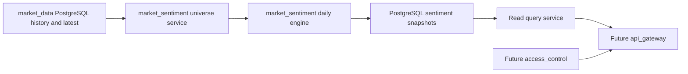

# Market Sentiment Backend Design

## Status And Ownership

`market_sentiment` is a planned `manniu_backend` Django app. It calculates, stores, replays, and serves end-of-day sentiment indicators for the overall Chinese A-share market and individual stocks. It is not registered or implemented yet.

The app consumes only validated PostgreSQL records owned by `market_data`. It does not call Tushare, own market-data synchronization, provide intraday estimates, or create automated trading instructions.

## Module Boundary



`market_data` owns `Security`, daily adjusted trading history, daily basic fundamentals, latest snapshots, and ingestion watermarks. `market_sentiment` reads those tables after their daily watermarks have completed successfully. It owns sentiment universe selection, factor calculation, engine versioning, snapshot persistence, replay, and read-model queries.

## Indicator Scope

| Scope | Identifier | Purpose |
| --- | --- | --- |
| Market | `MARKET/ALL_A` | One daily measure of broad A-share momentum, activity, and fear. |
| Stock | `STOCK/<ts_code>` | A stock's daily sentiment relative to its own recent behavior and, where sufficient data exists, its peer cross section. |

The initial release is daily EOD only. A result uses only source rows dated on or before its `trade_date`; no later trading, fundamental, corporate-action, or membership data may influence a historical result.

## Data Dependencies And Eligibility

The default market universe contains securities with `Security.asset_type='STOCK'`, an active listing status, and a valid daily trading record. A stock requires `close > 0` and `pre_close > 0`; index records, delisted securities, and records without a completed `market_data` daily watermark are excluded. ST, Beijing Exchange, STAR Market, and ChiNext inclusion rules remain versioned configuration to be confirmed before implementation.

The daily engine reads these `market_data` sources using strict `(security_id, trade_date)` joins:

| Source | Required fields | Use |
| --- | --- | --- |
| `MarketBarDailyHistory` | `open`, `high`, `low`, `close`, `pre_close`, `pct_change`, `volume`, `amount` | returns, amplitude, shadows, volume, and amount activity |
| `StockDailyFundamentalHistory` | `turnover_rate_f`, `turnover_rate`, `volume_ratio`, `circ_mv` | turnover/activity, volume confirmation, and liquidity-quality filtering |
| `Security` | code, listing status, area, industry | universe and peer grouping |

The calculation must not use fundamental `close` to replace the trading-bar close, forward/backward-fill a missing same-day fundamental row, or use a future revision without an explicit as-of revision policy.

## Calculation Design

### Stock Factors

For stock $s$ and trade date $t$, the engine calculates daily and rolling inputs using only $t$ and prior completed market dates:

$$
r_{1,t} = \frac{P_t}{P_{t-1}} - 1,\qquad
r_{5,t} = \frac{P_t}{P_{t-5}} - 1,\qquad
r_{20,t} = \frac{P_t}{P_{t-20}} - 1
$$

$$
amplitude_t = \frac{H_t - L_t}{P_{t-1}},\qquad
lowerShadow_t = \frac{\min(O_t, P_t) - L_t}{\max(H_t - L_t, \epsilon)}
$$

Volume, amount, turnover, and volume ratio use a preceding 20-trading-day baseline. Current-day values are excluded from their own normalization window:

$$
z(X_t) = clip\left(\frac{X_t - mean(X_{t-20}, \ldots, X_{t-1})}{std(X_{t-20}, \ldots, X_{t-1})}, -3, 3\right)
$$

The three stock dimensions are:

$$
M_t = 0.40z(r_1) + 0.30z(r_5) + 0.20z(r_{20}) + 0.10z(streakUp)
$$

$$
A_t = 0.25z(volume) + 0.20z(amount) + 0.40z(turnover) + 0.15z(volumeRatio)
$$

$$
F_t = 0.30z(volatility_{10}) + 0.25z(amplitude) + 0.15z(lowerShadow) + 0.20z(downVolume) + 0.10z(downReturn)
$$

`turnover_rate_f` is preferred; `turnover_rate` is used only when free-float turnover is unavailable. Component weights are renormalized only across valid inputs. If available weight is below 70 percent, the affected dimension is null and records an availability reason.

### Market And Stock Scores

The market dimensions are the median of each valid stock dimension within the eligible universe. The market raw score is:

$$
rawMarket_t = 0.35M_t + 0.35A_t - 0.30F_t
$$

It is normalized against the preceding 252 market raw scores and converted through a sigmoid to a 0-100 score. Until 252 valid market observations exist, the snapshot is `WARMING_UP` and does not publish a formal 0-100 market score.

For stock scope, the primary score is a same-day peer percentile. The peer hierarchy is: compatible versioned industry classification with at least 10 valid peers, then Tushare industry with at least 20, then all eligible A-shares with at least 500. The stock provisional score is:

$$
stockScore_t = 0.35 percentile(M_t) + 0.35 percentile(A_t) + 0.30(100 - percentile(F_t))
$$

Each stock snapshot records its normalization mode, peer type/code/name, valid peer count, stock-history count, and calculation-engine version. A stock with fewer than 20 valid trading days is `INSUFFICIENT_DATA`; it does not receive a fabricated neutral score.

## PostgreSQL Persistence Design

All sentiment results persist in PostgreSQL. Redis, if added later, only caches latest read responses and is not a source of record.

`MarketSentimentSnapshot` stores market scope results. Its unique key is `(market, scope_type, scope_code, trade_date, engine_version)`, where the initial market row is `CN`, `MARKET`, `ALL_A`.

`StockSentimentSnapshot` stores one stock result per security/date/engine version. Its unique key is `(security_id, trade_date, engine_version)`.

Both snapshot models require: score, level, status, raw score, standardized score when available, momentum/activity/fear dimensions, universe/peer sample count, coverage, engine version, calculation timestamp, source trade date, and JSON metadata. Stock metadata additionally stores the peer and normalization fields above. Scores are nullable only for `WARMING_UP` or `INSUFFICIENT_DATA` states.

`MarketSentimentFactor` and `StockSentimentFactor` are optional detail tables, each keyed by snapshot plus factor code. They store raw value, normalized value, effective weight, contribution, availability, reason, and JSON payload. The app does not store full all-stock factor matrices as an online table; offline audit extracts remain local artifacts until a separately approved archive model is needed.

Required read indexes:

- Market snapshots: `(market, scope_type, scope_code, engine_version, trade_date DESC)`.
- Stock snapshots: `(security_id, engine_version, trade_date DESC)` and `(trade_date, engine_version, score DESC)` for dated ranking views.
- Factor details: `(snapshot_id, factor_code)` unique.

## Job Design

The planned operator command is `refresh_market_sentiment`.

```text
python manage.py refresh_market_sentiment \
  --scope MARKET|STOCK \
  --trade-date YYYYMMDD | --latest | --start-date YYYYMMDD --end-date YYYYMMDD \
  [--ts-codes CODE[,CODE...]] [--engine-version VERSION] [--dry-run]
```

Before processing a date, the command verifies successful `market_data` watermarks for daily stock bars and fundamentals. It then computes market scope from the eligible stock universe and stock scope from the same source set. It uses idempotent PostgreSQL upserts under the snapshot unique keys, preserving prior engine versions rather than silently overwriting results from another algorithm version.

Daily ordering is:

1. `market_data` completes stock bars, stock fundamentals, and stock cost updates for the completed trading date.
2. Any pending adjustment-history rebuild for affected stocks completes successfully.
3. `refresh_market_sentiment --latest --scope MARKET` runs.
4. `refresh_market_sentiment --latest --scope STOCK` runs for the eligible stock universe or requested codes.

A missing source watermark, insufficient core-field coverage, or failed dependent adjustment rebuild returns nonzero and records `FAILED` or `INSUFFICIENT_DATA`; it must not publish a normal score from partial data.

## API And Authorization Boundary

No endpoint is implemented by this design. Future `api_gateway` handlers may expose latest and date-bounded history only after request/response fields and `access_control` permissions are separately confirmed.

Initial constraints are database-backed EOD reads only, fixed pagination/range limits, no request-time Tushare fallback, and no automatic trade execution. Operational runs, factor details, and failure metadata are operator-only.

## Test Case Definition

### Core Flow

- Given complete same-day `market_data` rows, the engine writes idempotent market and stock snapshots under the documented unique keys.
- Market factors use strict same-day trading/fundamental joins and never replace a trading close with a fundamental close.
- Stock peer selection follows the industry, Tushare-industry, and all-A fallback order with recorded normalization metadata.
- A rerun with the same trade date and engine version updates the same snapshot; a different engine version retains a separate snapshot.

### Boundary Scenarios

- A market history shorter than 252 valid dates remains `WARMING_UP` with no formal score.
- A stock with 20 or more valid dates but insufficient peer coverage records its configured fallback peer group.
- A stock with fewer than 20 valid dates is `INSUFFICIENT_DATA`.
- Missing turnover-rate-f falls back to turnover-rate and records the selected source.
- A missing same-day fundamental row remains missing; it is not forward/backward-filled.

### Failure Scenarios

- Source rows dated after the requested trade date cause the calculation to fail its no-lookahead validation.
- A missing or failed market-data watermark prevents normal score publication.
- Core source-field coverage below the configured release threshold prevents normal score publication.
- A request for an unbounded stock history/ranking range is rejected by the future API layer.
- No calculation path emits a trading command, broker credential, or automatic execution request.

## Implementation Sequence

1. Confirm PostgreSQL table/field types, engine version naming, market-universe rules, peer taxonomy, coverage threshold, and future API request/response contracts.
2. Create and register the `market_sentiment` Django app; implement PostgreSQL models and migrations with the documented unique keys and indexes.
3. Implement strict `market_data` read repositories and data-coverage checks with unit tests.
4. Implement the daily factor engine, no-lookahead safeguards, market/stock snapshots, and deterministic replay tests.
5. Implement the operator command, daily dependency gating, and local reconciliation artifacts.
6. Confirm API and authorization contracts, then implement authorized read endpoints through `api_gateway` and `access_control`.