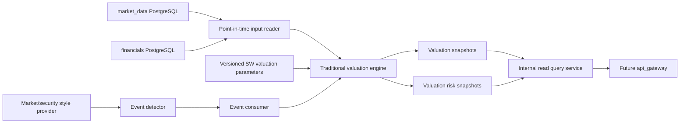

# Traditional Valuation Backend Design

## Status And Scope

This document defines the planned `manniu_backend.traditional_valuation` Django
application. It ports the SW-industry-based traditional valuation flow described
in the five SmartInvestor valuation documents into the Maniu PostgreSQL backend.

The module calculates and persists PE, PB, PS, PEG, FCFF DCF, DDM, EV/EBITDA,
SW-history, and scarcity-overlay results when their required inputs are
available. It also persists the valuation risk result without replacing the raw
valuation output. Refresh is event-driven: a new financial disclosure, a market
style change, or an individual-security style change creates an idempotent
refresh event.

This is a design and contract document. Models, migrations, services, commands,
and external read APIs remain unimplemented until the database and interface
contracts in the implementation gates are confirmed.

## Goals And Non-Goals

### Goals

- Use SW L3/L2/L1 industry parameters as the primary traditional valuation
  assumption source.
- Keep formal financial-report valuation and disclosure-window blended valuation
  distinguishable and auditable.
- Preserve point-in-time safety: no financial or market row published after the
  valuation anchor may affect the result.
- Support deterministic replay, historical backfill, event retries, and
  idempotent current-read updates.
- Persist raw method results, optimized summary values, risk adjustment values,
  source dates, parameter versions, and provenance.
- Allow market-style and security-style changes to refresh the affected scope
  without waiting for a financial disclosure.

### Non-goals

- This module does not own securities, trading bars, daily fundamentals,
  financial statements, disclosure records, Tushare adapters, or market-style
  classification.
- It does not call Tushare or perform an unpersisted upstream join in an HTTP
  request.
- It does not place orders, generate broker instructions, or automate trading.
- It does not silently substitute another report period, SW level, valuation
  variant, or profit bucket when the requested input is unavailable.

## Ownership And Data Flow



`market_data.Security` remains the source of security identity, SW mapping if
  already synchronized there, EOD prices, daily fundamentals, and market-style
  inputs. `financials` remains the source of typed `FinancialIncomeRecord`,
`FinancialBalanceSheetRecord`, `FinancialCashFlowRecord`,
`FinancialIndicatorRecord`, `FinancialExpressRecord`, and
`FinancialDisclosureRecord` records. The traditional module owns only
valuation configuration versions, calculation outputs, risk outputs, event
state, and run control data.

## Industry Valuation Template

The industry template is a first-class input to traditional valuation. It is
not a hard-coded dictionary inside the calculation service and it is not
recomputed in the request path. The Maniu module should copy the existing
SmartInvestor `static/valuation_config` valuation files and their loader/service
behavior as-is first; later changes require a versioned migration and a
comparison artifact.

### Static Configuration Files

The initial Maniu layout is:

```text
manniu_backend/static/valuation_config/
  valuation_defaults_CN.json
  sw_industry_mapping_CN.json
  valuation_defaults_CN_sw.json
  valuation_defaults_CN_sw_ref_5_10_20.json
  valuation_method_weights_CN.json
  scarcity_auto_profile_CN.json
  business_keyword_rules_CN.json
  citic_name_suggestions_CN.json
  update_schedule_CN.json
  update_schedule_state_CN.json
```

The files have different ownership and lifecycle and must not be collapsed into
one JSON document:

| File | Role | Update mode |
| --- | --- | --- |
| `valuation_defaults_CN.json` | Global defaults and legacy industry buckets | Versioned baseline, manually reviewed |
| `sw_industry_mapping_CN.json` | SW2021 L1/L2/L3 hierarchy, parent links, membership, stock-to-industry mapping | `syncswvaluation --mapping-only` |
| `valuation_defaults_CN_sw.json` | Active SW valuation parameters by L1/L2/L3 | `syncswvaluation --params-only` |
| `valuation_defaults_CN_sw_ref_5_10_20.json` | Reference/fallback parameter profile using alternate history windows | Scheduled reference refresh |
| `valuation_method_weights_CN.json` | Composite-method weights by global, SW level, or industry bucket | Explicit configuration update |
| `scarcity_auto_profile_CN.json` | Risk-state thresholds, hysteresis, confirmation, cooldown, and circuit breaker | Explicit configuration update |
| `business_keyword_rules_CN.json` / `citic_name_suggestions_CN.json` | Optional business-text and CITIC matching inputs for comparison variants | Keyword refresh task |
| `update_schedule_CN.json` | Cadence and command arguments | Operator-reviewed schedule |
| `update_schedule_state_CN.json` | Runtime last-success state and task history | Scheduler-owned state; never used as valuation input |

All paths resolve from `settings.BASE_DIR`, with no current-working-directory
dependency. Static inputs are read-only during valuation. A generated file is
published atomically only after validation; a failed refresh must leave the
previous active file usable.

### File Schema And Provenance

`valuation_defaults_CN.json` contains `version`, `market`, `changelog`,
`global_defaults`, and legacy `industries`. Each parameter set uses the direct
`test_valuation` argument names:

- relative targets: `pe_target`, `ps_target`, `pb_target`, `peg_target`,
  `ev_ebitda_target`;
- absolute-method arguments: `dcf_kwargs`, `ddm_kwargs`, `scenario_model`;
- sensitivity inputs: `sensitivity_grid`;
- optional history input: `sw_history_kwargs`.

`sw_industry_mapping_CN.json` contains:

- `version`, `market`, `src`, and `updated_at`;
- `levels.L1/L2/L3`, keyed by SW index code;
- parent and grandparent links;
- `hierarchy.L1_to_L2` and `hierarchy.L2_to_L3`;
- `level_members` for each SW level;
- `ts_code_to_levels`, including the current L1/L2/L3 code and name.

`valuation_defaults_CN_sw.json` contains `version`, `market`, `src`,
`updated_at`, `trade_date`, `sample_size`, `global_defaults`, and
`levels.L1/L2/L3`. Each level entry contains industry identity, `base_bucket`,
`member_count`, `params`, and `metrics`. `metrics` is audit context and must
not be treated as a substitute for `params` during serving. The generated
parameter payload also records `history_quantiles`, `history_anchors`, and
`target_source` when history data is available.

Every active template identity must be represented by:

```text
(market, sw_level, sw_code, template_version, source_trade_date, source_hash)
```

The `source_hash` is calculated over canonical JSON content. It is used to
detect material changes, create a new parameter version, and decide whether a
market-wide valuation refresh is required.

### Template Resolution In `ValuationConfig`

The loader behavior is part of the compatibility contract. It must:

1. Load `sw_industry_mapping_<market>.json` and
  `valuation_defaults_<market>_sw.json` from the same `valuation_config`
  directory.
2. Resolve a stock by `ts_code` through `ts_code_to_levels`.
3. Try parameter levels in order `L3 -> L2 -> L1`.
4. Return the first matching level's normalized `params`; use
  `global_defaults` only when no level has parameters.
5. Preserve the selected level, SW code/name, complete hierarchy, metrics,
  template version, and fallback reason in provenance.
6. For a forced industry request, match code or name at the requested level,
  then use the same hierarchy fallback order.
7. Recursively remove null and empty nested values, but never rename parameter
  keys or silently derive missing values.

The normalized parameter object is passed directly to the valuation engine. A
loader error for a missing mapping or missing active SW template is a typed
configuration failure, not permission to use an unrelated industry bucket.

### Template Generation Algorithm

The equivalent of `syncswvaluation` owns template generation and has two
independent phases:

#### Phase A: SW Mapping

`index_classify(src="SW2021", level=L1/L2/L3)` builds the three-level taxonomy.
`index_member_all` is read with bounded pagination and produces the current
stock membership mapping. Parent links are resolved from `parent_code`; stocks
with a non-empty `out_date` are excluded from active membership. The result is
written to `sw_industry_mapping_CN.json` only after all three levels and member
coverage validate.

#### Phase B: Parameter Generation

For each L3 node, the generator:

1. Selects the current `daily_basic` cross section for the configured
  `trade_date`, including `pe_ttm`, `ps_ttm`, `pb`, `total_mv`, and `dv_ttm`.
2. Selects a bounded sample of representative members and reads financial
  indicators for growth and ROE context.
3. Calculates positive-value medians for PE, PS, PB, dividend yield, and market
  cap, plus median growth and ROE.
4. Loads the matching legacy/global base bucket from
  `valuation_defaults_CN.json`.
5. Bounds cross-sectional targets against base targets. The default target
  bounds are PE `0.6..1.8`, PS `0.6..2.0`, and PB `0.6..2.0` times the base.
6. When enabled, queries persisted/approved `sw_daily` history through the
  history-quantile service for 3Y/5Y/10Y windows, requiring at least 120
  samples per window by default.
7. Blends PE/PB cross-sectional targets with history anchors and the global
  baseline, retaining the bounds and recording `target_source`.
8. Adjusts DCF/DDM discount and growth assumptions using bounded growth and ROE
  quality signals, then creates a sensitivity grid.

L2 and L1 nodes are weighted aggregations of child nodes, using child member
count as the default weight. If a child is absent, the aggregate is built from
available children and records coverage. It must not invent a new direct
cross-section when the design calls for hierarchical aggregation.

The generated payload is an immutable candidate until validation completes.
Validation must check all level counts, parent links, parameter key shape,
numeric bounds, history metadata, and JSON serialization before publication.

### Parameter Version Activation

The generated JSON is copied into a database-backed
`TraditionalValuationParameterVersion` record or a content-addressed local
artifact reference before it becomes active. The active pointer records the
template version, source hash, generation trade date, history settings, and
generator version. A new file must not overwrite the active parameter version
in place.

The calculation snapshot always records the exact active template version and
source hash. This permits replaying an old valuation even after a new SW
template is published.

## Core Valuation Entry And Template Refresh

### Single-Security Calculation Path

The compatible core entry is the following sequence, based on the existing
`prefillvaluationsnapshot` implementation:

```text
resolve active template
  -> get_stock_valuation_snapshot(...)
  -> test_valuation_light(..., snapshot=..., **template_params)
  -> extract method rows and valuation variants
  -> build raw/optimized summary
  -> build valuation-risk payload
  -> persist snapshot/current/risk transactionally
```

`get_stock_valuation_snapshot` is responsible for assembling the point-in-time
stock snapshot from market and financial sources. It receives the valuation
trade date, strict express controls, optional forced report end date, and the
profit-bucket mode. `test_valuation_light` is the method execution entry and
receives the already resolved snapshot plus the normalized template parameters;
it must not independently select a different SW template.

For the default SW baseline, the context is resolved by `get_sw_params_by_tscode`
and is labeled `sw_l3_baseline` even when L2/L1 parameter fallback was needed.
Optional business-match contexts call `get_sw_params_by_industry` for the
matched SW industries and produce separate variants such as
`business_match|L2|<sw_code>|<name>`. Variant identity is explicit and has
precedence over inferred fields in the valuation result row. A missing or NaN
variant normalizes to `default`; it must never be persisted as the literal
string `nan`.

The method extraction layer supports aliases for `pe`, `pb`, `ps`, `sw_history`,
`peg`, `fcff_dcf`, `ddm`, `ev_ebitda`, and `market_cap`. It retains the method's
implied price, equity value, industry context, comparison group, match score,
and variant. A method with no valid positive result is omitted with a reason.

### Market-Style Adjustment Boundary

The existing market-overall adjustment is applied to method output before
summary aggregation only when the selected style profile enables it. It reads
the configured index set and historical `pe_ttm`, `pb`, and turnover percentile
state, then maps the state to an explicit multiplier:

- overvalued: default `0.95`;
- neutral: `1.00`;
- undervalued: default `1.05`.

The result records `asof_date`, state, score, multiplier, source, index count,
and fallback reason. A missing remote/source row produces a neutral fallback
diagnostic; it must not make the calculation appear to have used a valid market
style observation. Method-level and summary-level adjustments remain separate
from the raw valuation rows.

### Prefill And Event Refresh Modes

The copied prefill behavior supports these independent dimensions:

| Dimension | Values | Rule |
| --- | --- | --- |
| Methods | `sw_history,pe,pb,ps,peg,fcff_dcf,ddm,scarcity_overlay` | Explicit allow-list; unsupported names fail validation |
| Profit bucket | `formal`, `blended`, `both` | `both` attempts both buckets and deduplicates batch conflict keys |
| Express | strict by default, `express_max_age_days=180` | Same eligibility rules as single-stock calculation |
| Refresh policy | `missing`, `all`, `disclosure` | Disclosure mode recalculates only rows with a newer disclosure signal |
| Price anchor | `disclosure_aligned`, `market_now`, `auto` | Forced report period uses disclosure alignment; ordinary style refresh uses market now |

The traditional event consumer uses the same calculation path as prefill, but
restricts the scope to the event's affected security/report/variant. It must not
create a second calculation implementation for event refresh.

### Template Update Commands

The Maniu operator interface should preserve the source command semantics:

```text
python manage.py syncswvaluation \
  [--mapping-only|--params-only] [--trade-date YYYYMMDD] \
  [--sample-size N] [--request-interval SECONDS] [--max-industries N] \
  [--history-years 3,5,10] [--history-quantile 0.5] \
  [--history-min-samples 120] [--params-output-suffix NAME] [--dry-run]
```

`--mapping-only` updates only SW hierarchy/membership. `--params-only` reads
the existing mapping and updates only parameter templates. The two flags are
mutually exclusive. History anchors are enabled by default and can be disabled
only for an explicit comparison run. `--params-output-suffix` writes a separate
reference artifact and must not move the active pointer.

Snapshot warming remains a separate command:

```text
python manage.py prefillvaluationsnapshot \
  --scope 60|68|00|30|8 \
  --methods sw_history,pe,pb,ps,peg,fcff_dcf,ddm,scarcity_overlay \
  --profit-buckets both --express-max-age-days 180 \
  [--refresh-policy missing|all|disclosure] [--price-anchor-mode auto|disclosure_aligned|market_now]
```

The command must report the active template version/hash, trade date, selected
profit buckets, refreshed/skipped counts, disclosure reasons, method coverage,
and failures. A run with all requested items failing returns nonzero even if the
process itself did not raise an exception.

### Schedule And Dependency Rules

The copied `update_schedule_CN.json` should initially preserve these tasks:

| Task | Default cadence | Dependency and result |
| --- | ---: | --- |
| `sw_mapping_sync` | 14 days | Refreshes hierarchy/membership before parameter generation |
| `sw_params_refresh` | 30 days | Generates active 3/5/10-year history-anchor parameters |
| `sw_params_refresh_reference` | 30 days | Generates 5/10/20-year comparison artifact |
| `valuation_snapshot_prefill` | 30 days | Prefix-batched valuation snapshot warming, formal + blended |
| `keyword_rules_refresh` | 90 days | Refreshes optional business/CITIC matching inputs |

The daily due runner executes due tasks from the state file and persists task
state only after a successful command. The ordering is mapping, active
parameters, reference parameters, then snapshot prefill. A parameter refresh
that changes the source hash must enqueue a market-scope valuation refresh; a
reference-only artifact must not change the active valuation output.

Financial disclosure events and style events are not replaced by this cadence:

- disclosure events use `refresh-policy=disclosure` and affected-code scope;
- market-style changes fan out to affected market scope with
  `price-anchor-mode=market_now`;
- security-style changes recalculate only the affected security and active
  report periods/variants.

This keeps slow template maintenance separate from event-driven valuation
refresh while using one shared calculation and persistence path.

The engine is a local adapter around the established SmartInvestor valuation
semantics. It must not import Django models from `smartinvestor_be`; the Maniu
implementation reads approved shared projections and uses an explicit adapter
for the valuation formulas and SW parameter shape.

## Valuation Contract

### Input Resolution

Every calculation receives an explicit:

- canonical `ts_code`;
- `asof_date` and resolved `source_trade_date` (latest completed trading day
  on or before `asof_date`);
- requested report type: `Q1`, `H1`, `Q3`, or `FY`;
- financial end date preference, if supplied;
- profit bucket: `formal`, `blended`, or the configured single-bucket mode;
- SW industry level/code and parameter version;
- valuation variant and style profile;
- valuation engine version.

Financial inputs are selected using the newest eligible report under the
requested report type whose effective announcement date is on or before
`asof_date`. A future or unavailable requested end date resolves to the latest
available eligible period of that report type; if no period exists, the event
fails with a typed coverage error. This follows the live-feature contract's
as-of semantics and prevents future-period anchoring.

Express data uses the same three strict gates documented for SmartInvestor:

1. `ann_date <= asof_date`;
2. `express_end_date >= base_end_date`;
3. `asof_date - ann_date <= express_max_age_days`.

`formal` never applies express adjustment. `blended` may apply it only when
all gates pass; otherwise the result records the block reason and the exact
effective source. A blended request must not silently be reported as an
express-backed result when it fell back to formal data.

### SW Parameter Resolution

Parameter lookup proceeds from the canonical security SW L3 mapping, then the
approved L2/L1 fallback rules. The selected row records:

- `sw_level`, `sw_code`, and `sw_name`;
- `parameter_version` and source effective date;
- target PE/PB/PS/PEG values and DCF/DDM inputs;
- history-anchor configuration and scarcity configuration;
- fallback reason, if any.

SW history anchors use the configured 3Y/5Y/10Y window and quantile. They are
combined with industry cross-sectional parameters and global defaults using the
same bounded rules as the source design. Scarcity overlay remains a separate
method row and must expose its profile, confidence, beta, cap, and risk-state
reason.

### Method And Summary Outputs

The engine returns one row per available method. Missing prerequisites skip only
that method and record a machine-readable reason; they do not fabricate a price.
The raw method values are never smoothed or overwritten.

The summary contains at least:

- `composite_valuation_price_raw` and `composite_valuation_price_optimized`;
- `conservative_valuation_price_raw` and
  `conservative_valuation_price_optimized`;
- current-price gaps for raw and optimized values;
- method count, core method list, dispersion, reliability weight, and
  `composite_mode`;
- optimization version and input statistics.

Optimization is summary-only. It may use method coverage, method dispersion,
risk, and the documented market-cap factor, but it must not alter PE/PB/PS/PEG,
FCFF DCF, DDM, or other single-method rows.

### Extended Valuation Methods

The following methods belong to `traditional_valuation`, not to
`market_data`. They consume point-in-time inputs from `market_data` and
`financials`, while their formulas, eligibility rules, fallback behavior, and
audit payloads are owned by the valuation engine.

#### `ev_ebitda`

Inputs:

| Input | Source | Rule |
| --- | --- | --- |
| `ebitda` | `FinancialIncomeRecord` or an approved EBITDA projection | Preserve the provider monetary unit |
| `target_ev_ebitda` | SW/legacy valuation template | Must be positive |
| `cash` | `FinancialBalanceSheetRecord.money_cap` or an explicitly approved cash field | Same unit as EBITDA and debt |
| `debt` | `FinancialBalanceSheetRecord.st_borr + lt_borr` or an approved debt projection | Same unit as EBITDA and cash |
| `total_share` | `StockDailyFundamentalHistory.total_share` or latest snapshot | Preserve the Tushare raw unit unless a normalized field is explicit |
| `close` / `source_trade_date` | `MarketBarDailyHistory` | Latest completed row on or before `asof_date` |

The calculation is:

$$
EV = EBITDA \times target\_ev\_ebitda
$$

$$
EquityValue = EV - Debt + Cash,\qquad Price = EquityValue / TotalShare
$$

Missing EBITDA, multiple, shares, or required balance-sheet values skips only
this method and records a reason code. The summary may use other valid methods,
but must not label that fallback as `ev_ebitda`. Banks and other sectors where
EBITDA is not meaningful require an explicit SW-level exclusion or fallback
rule.

#### `sw_history`

`sw_history` uses SW industry history as a valuation anchor. Inputs are the
canonical SW `index_code`, historical positive PE/PB/PS series, configured
windows, quantile, and minimum sample count. The default configuration is:

- windows: 3, 5, and 10 years;
- quantile: `0.5` (median);
- minimum samples: `120` observations per window;
- valid-window weights: `3Y:0.2`, `5Y:0.5`, `10Y:0.3`.

For each valid window the engine calculates PE/PB/PS quantile anchors, excludes
windows below the sample threshold, then combines the remaining anchors. The
combined anchor is mapped to stock PE/PB/PS valuation outputs. Every result
retains `index_code`, window coverage, quantiles, weights, and `target_source`.

All historical reads are bounded by `asof_date`; a current latest SW row cannot
be used for an older valuation replay. If no window is valid, the engine either
skips the method or uses the explicitly configured cross-sectional/global
template anchor and records that fallback in provenance.

#### `scarcity_overlay`

`scarcity_overlay` is a controlled premium over a valid base valuation, not an
independent fundamental method. Inputs are `base_price`, `beta`, `score`,
`confidence`, `cap_pct`, and the enabled/profile state from
`scarcity_auto_profile_CN.json`. This `beta` is the scarcity elasticity
coefficient, not CAPM beta. `score` is normalized to `[0,1]` and confidence
must satisfy the configured floor.

$$
premium\_pct = clamp(beta \times score \times confidence \times 100, 0, cap\_pct)
$$

$$
overlay\_price = base\_price \times (1 + premium\_pct / 100)
$$

An unavailable score, below-floor confidence, disabled profile, or missing
base price produces an explicit skip/fallback result. The method records its
profile, inputs, confidence, cap, premium, and reason. It must never overwrite
the raw PE/PB/PS/PEG/DCF/DDM results or conceal the base valuation.

## PostgreSQL Persistence

All tables use the existing PostgreSQL database. Monetary values and ratios use
`NUMERIC`; large explanations and source payloads use `JSONField`/PostgreSQL
JSONB. Database table names and exact foreign-key targets must be confirmed
against the current `market_data` and `financials` migrations before coding.

### `TraditionalValuationParameterVersion`

Stores an immutable normalized parameter set imported from the approved SW
configuration source.

| Field | Type | Purpose |
| --- | --- | --- |
| `parameter_version` | `VARCHAR(64)` | Immutable configuration identity |
| `market` | `VARCHAR(8)` | Initially `CN` |
| `sw_level/code/name` | constrained text | Industry dimension |
| `effective_from/effective_to` | date, nullable | Parameter validity |
| `parameters` | JSONB | Full normalized method parameters |
| `source_hash` | `VARCHAR(128)` | Source-content audit |
| `engine_compatibility` | `VARCHAR(32)` | Supported engine range |
| `created_at` | timestamp | Audit |

Unique key: `(market, sw_level, sw_code, parameter_version)`.
The row is immutable after activation; a changed parameter set receives a new
version.

### `TraditionalValuationSnapshot`

Append-only evidence for one calculation.

Recommended identity fields:

`security`, `asof_date`, `source_trade_date`, `report_type`,
`financial_end_date`, `profit_bucket`, `valuation_variant`,
`parameter_version`, and `valuation_engine_version`.

The row stores:

- raw method rows and method-level missing reasons;
- raw and optimized summaries;
- current price and price-anchor mode;
- financial announcement/end dates and effective profit source;
- SW parameter metadata and style profile;
- input source dates, coverage state, and calculation timestamp;
- trigger type/event ID;
- provenance, diagnostics, and sanitized error metadata.

The idempotency key is the complete identity above. A changed engine,
parameter, style profile, or input bucket creates a new auditable snapshot; it
does not overwrite historical evidence.

### `TraditionalValuationSnapshotLatest`

Read model upserted only when a successful snapshot is newer for the same
`(security_id, report_type, profit_bucket, valuation_variant, style_profile)`.
It stores the snapshot reference, as-of dates, selected summary, risk reference,
parameter/engine versions, and freshness metadata. A failed event never replaces
a successful current row.

### `TraditionalValuationRiskSnapshot`

Stores the `valuation_risk` V1.5+ result independently from valuation methods.
It records the snapshot reference, active variant, risk score/level/confidence,
all factor scores and trigger details, adjustment values, and risk engine
version. The adjustment output is advisory:

$$
discount = clamp(risk\_score / 250, 0.03, 0.35)
$$

The adjusted composite and conservative prices are persisted beside, not in
place of, the original summary values. Financial ratios such as debt-to-assets
are normalized to the documented percentage scale before threshold evaluation.

### `TraditionalValuationEventState`

Idempotency, debounce, and retry state for one event.

| Field | Purpose |
| --- | --- |
| `event_type` | `FINANCIAL_DISCLOSED`, `MARKET_STYLE_CHANGED`, `SECURITY_STYLE_CHANGED` |
| `event_key` | Stable hash of source identity and effective version |
| `scope_key` | Market, security, or security/report-period scope |
| `status` | `PENDING`, `CLAIMED`, `SUCCEEDED`, `FAILED`, `DEAD_LETTER` |
| `source_version` | Upstream watermark/style version |
| `first_seen_at/claimed_at/completed_at` | Lifecycle audit |
| `attempt_count/next_retry_at` | Bounded retry |
| `last_error_code/last_error_message` | Sanitized failure |
| `coalesced_event_count` | Debounce observability |

Unique key: `(event_type, event_key)`. The event is not marked successful until
the affected snapshot/current/risk transaction commits.

### `TraditionalValuationRun`

Records `validate`, `backfill`, `detect-events`, `consume-events`, and `refresh`
runs, including scope, date/report filters, parameter and engine versions,
planned/completed/failed counts, retry summary, and sanitized errors. It is not
a substitute for event state or a historical completion watermark.

Required indexes include `security_id` plus as-of date, report/bucket/variant
plus as-of date descending, latest identity, pending event status plus retry
time, and parameter lookup by SW level/code/version.

### Cross-Module Model Naming And Foreign Keys

The model names and associations must follow the existing `market_data` and
`financials` design documents:

| Traditional model | Shared association | Rule |
| --- | --- | --- |
| `TraditionalValuationSnapshot` | `security_id -> market_data.Security` | Required for stock valuation; do not duplicate a security table or store an unrelated text-only identity |
| `TraditionalValuationSnapshotLatest` | `security_id -> market_data.Security` and `snapshot_id -> TraditionalValuationSnapshot` | One latest row per documented report/bucket/variant/style identity |
| `TraditionalValuationRiskSnapshot` | `snapshot_id -> TraditionalValuationSnapshot` | Risk is attached to a valuation snapshot, not directly to an unversioned stock row |
| `TraditionalValuationEventState` | `security_id -> market_data.Security`, nullable for market-scope events | Financial events also retain the source financial record identity and report-period key |
| `TraditionalValuationRun` | control-plane record | It does not replace `FinancialIngestionRun`, `FinancialIngestionWatermark`, `IngestionRun`, or `IngestionWatermark` |

Financial source provenance must use the existing `financials` model classes and
their primary keys where available:

- `FinancialIncomeRecord` and `FinancialIndicatorRecord` for formal earnings and
  growth/profitability inputs;
- `FinancialBalanceSheetRecord` and `FinancialCashFlowRecord` for PB, leverage,
  liquidity, FCFF, and DDM support;
- `FinancialExpressRecord` for the optional blended profit source;
- `FinancialDisclosureRecord` for publication-time event detection and
  effective public-date resolution.

The traditional module may retain source IDs and a JSON provenance payload, but
must not create duplicate financial tables or rename these upstream classes in
its own schema. `ts_code` may be retained as a denormalized audit field, but
`security_id` is the canonical relational key, matching the financials and
market-data designs.

## Event-Driven Refresh

### Event Types

| Event | Detection source | Scope | Recalculation |
| --- | --- | --- | --- |
| `FINANCIAL_DISCLOSED` | New/revised eligible financial or disclosure row | One security and report period | Rebuild formal and configured blended buckets for the affected period |
| `MARKET_STYLE_CHANGED` | Persisted market-style version differs from the last consumed state | Market or configured universe | Fan out to eligible securities in bounded chunks and run the market-style full refresh |
| `SECURITY_STYLE_CHANGED` | Persisted individual-style version differs from the last consumed state and passes confirmation | One security | Recalculate only that security's eligible report periods and configured variants |

### Regime State And Full-Refresh Rules

The market-style detector and the valuation event consumer must implement the
following state contract. The only valid market styles are `BULL`, `BEAR`, and
`BALANCE`.

- A detected style is normalized and validated before it can affect state.
- An empty or invalid detection result never overwrites the previous valid
  state file or persisted state.
- The first valid run initializes the baseline and does not trigger a refresh.
- A market refresh is triggered only when both the current and previous states
  are valid and different.
- The refresh reason is persisted as `MARKET_REGIME_SWITCH`; the required
  downstream command contract remains:

```text
refresh_signal_snapshot --scope 60,00,30,68 --full-refresh --report-types LATEST,FUSION
```

The batch wrapper must not use percent-variable expansion inside a parenthesized
block for the detected style. It must use delayed expansion or an equivalent
safe assignment strategy so the value written to state cannot become `ECHO is
off.`. State-file writes are atomic: write a temporary file, validate the
content, then replace the prior file. A failed refresh must not advance the
previous-state marker.

Individual security style is classified by the canonical `market_data` regime
service and persisted in its `SecurityRegimeSnapshot` / `SecurityRegimeState`
models. Its valid states are `GROWTH`, `BALANCE`, `DEFENSIVE`, and `RISK_OFF`,
derived from MA20, MA60, 20-day volatility, and 60-day drawdown. A new state
must be observed for two consecutive days before a `SECURITY_STYLE_CHANGED`
event is created. The first observation establishes a baseline only. Once
confirmed, downstream orchestration may write a bounded stock-code file and
refresh only that stock's `LATEST,FUSION` snapshots; it must not trigger a
market-wide refresh.

Traditional valuation consumes these market-data regime events and must not
duplicate the classifier. The predictive domain may retain a compatible
`earnings_stock_regime_state` consumption/audit projection, but it is not a
second source of truth for classification. Event payloads store the market-data
source state, source version, confirmation dates, metrics, and refresh reason.
`MARKET_STYLE_CHANGED` and `SECURITY_STYLE_CHANGED` are downstream consumption
events after the market-data detector confirms the transition.

Every refreshed snapshot must preserve the trigger reason. Supported reasons
include `MARKET_REGIME_SWITCH`, `STOCK_REGIME_SWITCH`, `FINANCIAL_DISCLOSURE`,
`MONTHLY_FULL_REFRESH`, and `MANUAL_REFRESH`. A dashboard or query consumer
must read persisted snapshots only; loading a card must never invoke a live
valuation calculation.

The financial event must be gated by the available financial row and its
effective announcement date. It must not calculate against a stale or future
report period. A style event does not change the financial report selection; it
changes only the style profile and the resulting parameter/summary context.

Market-style fan-out is deterministic: the detector records the source style
version and affected universe, then creates one child event per security or a
bounded fan-out batch with a stable child key. One long transaction must not
hold the entire market universe.

Debounce rules coalesce repeated style revisions within the configured window.
A newer source version supersedes an unclaimed older event for the same scope,
but an already committed snapshot remains immutable.

### Event Processing Transaction

For each claimed event:

1. Resolve all inputs from persisted PostgreSQL rows at the event as-of boundary.
2. Resolve the SW parameter version and style profile.
3. Calculate method rows, summaries, and risk factors.
4. Insert the append-only valuation snapshot and risk snapshot.
5. Upsert the current read model only if the result is newer and successful.
6. Mark the event `SUCCEEDED` in the same transaction.

On failure, roll back domain writes, retain the event as retryable, increment
the attempt count, and store a sanitized error code. Exceeded retry limits move
the event to `DEAD_LETTER` and return a nonzero command status.

## Services And Command Layout

```text
traditional_valuation/
  models.py
  services/
    input_resolver.py
    sw_parameter_service.py
    valuation_engine.py
    summary_service.py
    risk_service.py
    event_service.py
    query_service.py
  management/commands/
    traditional_valuation.py
  migrations/
```

`input_resolver` performs point-in-time reads only. `sw_parameter_service`
resolves immutable parameter versions. `valuation_engine` owns method execution
and method-level provenance. `summary_service` owns optimized summaries.
`risk_service` wraps the valuation-risk rules without changing raw values.
`event_service` owns detection, claims, debounce, fan-out, and retries.
`query_service` exposes bounded internal reads to a future gateway and never
calculates or writes on a cache miss.

### Operator CLI

```text
python manage.py traditional_valuation \
  validate|backfill|detect-events|consume-events|refresh|status \
  [--scope all|ts-code] [--ts-codes CODE[,CODE...]] \
  [--start-date YYYYMMDD|--history-years N] [--end-date YYYYMMDD] \
  [--report-types Q1,H1,Q3,FY] [--profit-buckets formal,blended] \
  [--variants default,sw_l3_baseline] [--event-types ...] \
  [--limit N] [--run-key KEY] [--retry-failed] [--dry-run]
```

`validate` performs no writes. `backfill` requires an explicit bounded range or
the configured default history window. `detect-events` creates only pending
idempotent events. `consume-events` processes bounded claimed work.
`refresh` runs detection then consumption and does not backfill history.
`status` reports coverage, stale current rows, pending/failed events, and the
active parameter/engine versions.

The command returns nonzero for invalid contracts, missing source coverage,
failed chunks, unresolved event failures, or reconciliation mismatches. Dry-run
writes no domain rows, run rows, event state, or watermarks.

## Scheduling And Dependency Order

The scheduler must execute the following order:

1. Complete `market_data` EOD ingestion and successful watermarks.
2. Complete `financials` ingestion/disclosure synchronization.
3. Rebuild or validate the active SW parameter version when its cadence is due.
4. Detect financial, market-style, and security-style events.
5. Consume events with bounded retries and per-scope locks.
6. Publish only committed current rows for downstream reads.

Normal missing-coverage prefill is distinct from event refresh. A full refresh is
required after a material valuation-engine, SW-template, express-rule, or method
set change. Routine price movement alone does not require rebuilding an
announcement-anchored target; it may update a display return only in a separate
read policy approved by the API contract.

Proposed Windows entry points are:

- `traditional_valuation.bat refresh` for event detection and consumption;
- `traditional_valuation.bat backfill` for explicit historical initialization;
- a daily due-runner after upstream market and financial jobs complete.

Each script resolves the project root from its own location, uses the approved
Python runtime, writes sanitized timestamped logs, and stops on the first
nonzero command. No secret or connection string is logged.

## Read Boundary

This module exposes no public HTTP endpoint in the first implementation.
`api_gateway` may later call `query_service` after authorization and a separate
request/response contract approval. A read response must identify at least:

- `ts_code`, `asof_date`, and `source_trade_date`;
- `report_type`, `financial_end_date`, `profit_bucket`;
- `valuation_variant`, `style_profile`;
- parameter version and valuation engine version;
- raw/optimized summary values and method rows;
- risk score/level/confidence and adjustment values;
- `source_data_status`, freshness, and degraded reasons.

The query layer must support bounded security/date/report/variant filters and
pagination. It must never invoke Tushare, insert a snapshot, or silently fall
back across report periods or variants.

## Test And Reconciliation Contract

### Core Tests

- A repeated calculation with the same identity converges without duplicate
  snapshots.
- A changed parameter, style, bucket, or engine version preserves a separate
  auditable snapshot.
- A report-period request uses the newest eligible period on or before the
  as-of date and rejects an unavailable period when no fallback period exists.
- Express data is applied only when all three strict gates pass; formal output
  remains express-free.
- Summary optimization changes only summary fields, not single-method values.
- Risk calculation persists both raw and adjusted values with the same snapshot
  reference.
- A successful event commits snapshot, current, risk, and event state together.
- A failed event rolls back output rows and remains retryable.
- A market-style event fans out deterministically and does not duplicate work.

### Boundary And Failure Tests

- A non-trading `asof_date` resolves to the latest completed trading date.
- A future requested financial end date resolves to the latest available period
  of the selected report type rather than using future data.
- Missing PE/PB/PS inputs skip only the affected method and preserve a reason.
- Ratio-scale and percentage-scale debt-to-assets inputs produce the same risk
  threshold result after normalization.
- A stale express row is visible in diagnostics but cannot affect the result.
- Missing SW mapping or parameter version fails the affected scope rather than
  silently selecting an unrelated industry.
- A stale event cannot overwrite a newer current row.
- Dry-run and failed chunks create no partial valuation/current/risk state.

Reconciliation reports must include requested versus eligible securities,
report-period coverage, formal/blended counts, method coverage, event counts by
type/status, current-row freshness, risk coverage, and failure reasons.

## Implementation Gates

1. Confirm exact PostgreSQL table and field names for `market_data` securities,
   EOD bars/fundamentals, SW mapping/style inputs, and all required `financials`
   records.
2. Confirm the six proposed traditional tables, foreign keys, natural keys,
   precision, JSON payload limits, and indexes.
3. Confirm the source of truth and schema for `MARKET_STYLE_CHANGED` and
   `SECURITY_STYLE_CHANGED`, including style version and affected scope.
4. Confirm the internal read request/response fields with the downstream
   `api_gateway` owner before implementing an interface.
5. Implement `validate` and write side-by-side local reconciliation artifacts
   before any broad historical backfill.
6. Run a single-security dry-run for each report type and both profit buckets,
   compare method lineage with the SmartInvestor reference output, then enable
   bounded backfill.
7. Enable event detection and consumption only after snapshot uniqueness,
   transaction rollback, retry, and stale-current protections pass.
