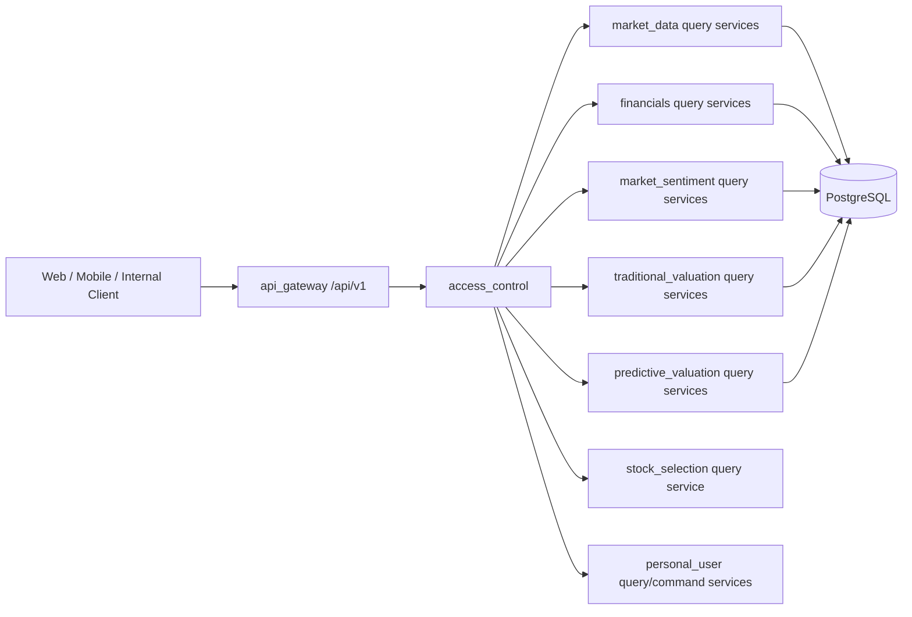

# Market Analysis API Gateway Design

## 1 文档定位

本文档为 `manniu_backend` 的市场分析 API Gateway 总体设计，覆盖以下领域：

- `financials`：财务报表、财务指标、业绩预告/快报、披露日期
- `market_data`：证券主数据、EOD 行情、日线基本面、市场/个股风格状态
- `market_sentiment`：市场和个股 EOD 情绪快照
- `traditional_valuation`：传统估值快照、方法明细、风险和多变体比较
- `predictive_valuation`：预测估值当前结果、历史结果、季度路由和融合结果
- `stock_selection`：基于财务条件的候选筛选及传统/模型估值分融合
- `personal_user`：个人资料、自选股、观察股、持仓股和持仓组合

本文档只定义外部 HTTP 边界和 Gateway 的编排责任，不替代各领域的计算、模型、数据表和任务设计。领域详细设计仍以本目录下对应模块文档为准。

当前状态：**首期实现进行中**。`api_gateway` 已提供 Market Data 首批只读路由，以及登录授权的 Public API 目录接口；其他领域接口和完整公共 API 契约仍按本文档实施闸门推进。

## 2 设计原则

1. **Gateway 只做边界职责**：版本化路由、认证上下文、授权、参数校验、序列化、统一错误、分页、限流、审计、跨领域只读聚合，以及个人用户命令/查询路由的边界编排。
2. **领域服务拥有业务语义**：Gateway 不复制估值公式、情绪因子、市场风格分类、预测推理或财务 as-of 选择逻辑。
3. **查询路径只读**：公开查询不得写入快照、推进 watermark 或修改模型文件。除专门冻结的 `CYQ_CHIPS` 上游转发接口外，公开查询不得触发 Tushare 请求；该例外必须经过独立权限、范围、超时和限流控制。
4. **PostgreSQL 是唯一事实来源**：Gateway 不引入 SQLite；Redis 如启用只做可失效缓存，不作为数据源。
5. **点时一致性优先**：所有历史/回测相关查询必须明确 `asof_date` 或使用领域服务规定的当前快照语义，并返回来源日期。
6. **不提供交易能力**：不暴露下单、撤单、券商凭证、自动交易指令或“买卖执行”接口。
7. **失败必须可解释**：不能用一个含义模糊的 `degraded=true` 掩盖模型缺失、数据过期、报告期不可用或部分融合失败。

## 3 总体架构



### 3.1 组件职责

| 组件 | 责任 | 明确不负责 |
| --- | --- | --- |
| `api_gateway` | URL、版本、请求校验、权限调用、序列化、分页、错误、限流、审计上下文、跨领域只读聚合、个人用户路由编排 | 业务计算、直接写领域数据库、回源 Tushare、模型推理、任务调度 |
| `access_control` | Token 校验、用户/服务身份、权限和 scope、审计主体 | 领域数据查询和业务授权规则的重复实现 |
| `market_data` | 证券、EOD 行情、基本面、市场/个股 regime 的内部查询 | 外部 HTTP 序列化和公共权限 |
| `financials` | 财务 raw records 与 as-of 查询 | 公共 HTTP、市场行情、估值结果 |
| `market_sentiment` | 情绪计算结果和快照查询 | Tushare、行情同步、交易执行 |
| `traditional_valuation` | 传统估值和风险快照查询 | 证券主数据、行情、财务 raw 表所有权 |
| `predictive_valuation` | 预测快照、融合、历史和状态查询 | 公共路由、模型训练、请求时写入预测 |
| `stock_selection` | 选股条件编排、财务筛选、估值分融合和结果分页 | 财务/估值公式、直接 ORM、回源、请求时推理或写快照 |

### 3.2 推荐 Django 结构

```text
manniu_backend/
  api_gateway/
    apps.py
    urls.py
    views.py
    serializers.py
    pagination.py
    errors.py
    permissions.py
    request_context.py
    services/
      market_analysis_read_service.py
      dashboard_aggregation_service.py
  access_control/                 # 后续独立实现
```

Gateway view 只依赖各应用公开的内部 `query_service`。禁止从 Gateway 直接拼接跨应用 ORM 查询，禁止导入 Tushare adapter、management command 或预测 engine。

## 4 外部 API 基础契约

### 4.1 基础路径和媒体类型

- 基础路径：市场分析接口为 `/api/v1/market-analysis`；个人用户接口为 `/api/v1/me`
- 版本通过 URL 表达；响应同时返回 `api_version: "v1"`。
- JSON：`Content-Type: application/json`。
- 请求需携带 `Authorization: Bearer <token>`；服务间调用使用独立 service token。
- 支持 `X-Request-ID`；缺失时 Gateway 生成 UUID，并在响应、日志和下游上下文中保持一致。
- 日期格式统一为 `YYYY-MM-DD`；交易代码使用带交易所后缀的规范格式，例如 `000001.SZ`、`000001.SH`。

### 4.2 成功响应封套

```json
{
  "success": true,
  "api_version": "v1",
  "request_id": "7d7c3c5e-...",
  "data": {},
  "meta": {
    "asof_date": "2026-09-09",
    "source_trade_date": "2026-09-09",
    "data_status": "COMPLETE",
    "warnings": []
  }
}
```

`meta` 的日期字段按接口适用性返回。估值和预测结果至少必须返回文档规定的来源日期；预测结果还必须返回 `financial_end_date` 和 `model_version`。

### 4.3 列表响应

```json
{
  "success": true,
  "api_version": "v1",
  "request_id": "...",
  "data": [],
  "meta": {
    "page": 1,
    "page_size": 50,
    "total": 123,
    "has_next": true,
    "next_cursor": null,
    "asof_date": "2026-09-09"
  }
}
```

默认 `page_size=50`，最大 `page_size=200`。历史接口必须限制日期范围：默认最多 366 个自然日，单次最多 2,000 条记录；超限返回 `RANGE_TOO_LARGE`。排名接口必须限制 universe 和返回条数，禁止无界全市场导出。

### 4.4 错误响应

```json
{
  "success": false,
  "api_version": "v1",
  "request_id": "...",
  "error": {
    "code": "DATA_NOT_READY",
    "message": "请求日期的数据尚未完成",
    "details": {
      "domain": "market_sentiment",
      "requested_date": "2026-09-09"
    },
    "retryable": true
  }
}
```

错误码与 HTTP 状态映射：

| HTTP | 错误码 | 场景 |
| --- | --- | --- |
| 400 | `INVALID_REQUEST` / `INVALID_DATE` / `INVALID_SYMBOL` / `RANGE_TOO_LARGE` | 参数格式、范围、代码不合法 |
| 401 | `AUTHENTICATION_REQUIRED` / `TOKEN_INVALID` | 未认证或凭证无效 |
| 403 | `FORBIDDEN` / `SCOPE_REQUIRED` | 无领域或操作权限 |
| 404 | `SECURITY_NOT_FOUND` / `RESULT_NOT_FOUND` | 证券或指定结果不存在 |
| 409 | `ASOF_CONFLICT` / `VERSION_CONFLICT` | 请求的报告期/版本不可用且不能静默回退 |
| 422 | `UNSUPPORTED_REPORT_TYPE` / `UNSUPPORTED_VARIANT` / `UNSUPPORTED_PRESET` | 语义合法但领域或选股方案不支持 |
| 429 | `RATE_LIMITED` | 超出客户端或服务级限流 |
| 500 | `INTERNAL_ERROR` | 未分类服务错误，详情不得泄露堆栈或连接串 |
| 503 | `DATA_NOT_READY` / `UPSTREAM_DEPENDENCY_UNAVAILABLE` | 依赖数据或领域服务暂不可用 |

领域服务返回的 `INSUFFICIENT_DATA`、`WARMING_UP`、`STALE`、`PARTIAL_SUCCESS` 属于有业务意义的结果状态，优先作为成功响应中的 `data_status` 返回；仅在无法形成合法响应时映射为错误。

## 5 Endpoint 目录

以下为首期只读接口。路径中的 `:ts_code` 必须是规范化代码；Gateway 可接受无后缀输入，但应在校验阶段解析为唯一规范代码，无法唯一解析时拒绝请求。

### 5.1 Market Data

| 方法 | 路径 | 说明 | 主要查询参数 |
| --- | --- | --- | --- |
| GET | `/securities` | 证券主数据列表 | `asset_type`, `market`, `industry`, `list_status`, `q`, `page`, `page_size` |
| GET | `/securities/research-list` | 当前用户研究股票池及研究动作列表 | `pool`, `market`, `industry`, `q`, `asof_date`, `page`, `page_size` |
| GET | `/securities/:ts_code` | 证券详情和分类身份 | 无 |
| GET | `/securities/:ts_code/bars` | EOD 行情历史 | `start_date`, `end_date`, `adjust`, `page`, `page_size` |
| GET | `/securities/:ts_code/technical-trend` | 技术指标、趋势摘要和技术信号 | `start_date`, `end_date`, `adjust`, `frequency`, `period` |
| GET | `/securities/:ts_code/fundamentals` | 日基本面历史 | `start_date`, `end_date`, `page`, `page_size` |
| GET | `/securities/:ts_code/chips` | 技术趋势页筹码分布上游转发 | `start_date`, `end_date` |
| GET | `/indices/:index_key/bars` | 指数 EOD 日线行情历史 | `start_date`, `end_date`, `adjust`, `page`, `page_size` |
| GET | `/indices/:index_key/fundamentals` | 指数日基本面历史 | `start_date`, `end_date`, `page`, `page_size` |
| GET | `/market/regime` | 市场风格状态 | `asof_date`, `benchmark_ts_code` |
| GET | `/securities/:ts_code/regime` | 个股风格状态 | `asof_date` |

`/securities` 的 `q` 支持按证券中文名、交易代码、中文名完整拼音或拼音首字母进行不区分大小写的模糊匹配。例如，`万科`、`wanke` 和 `wk` 均可匹配名称为“万科”的证券。

#### 研究股票池列表

`GET /api/v1/market-analysis/securities/research-list` 为研究首页左侧股票池提供唯一数据源。该接口只返回 PostgreSQL 中已存在的证券、行情和研究结果，不允许在 Gateway 或前端回退到静态/mock 股票数据。

- `pool`：`market`、`holding`、`watchlist`、`observe`；默认 `market`。后三者需要登录用户上下文。
- `market`：`all`、`sh-main`、`sz-main`、`cyb`、`star`；默认 `all`。
- `industry`、`q`：可选行业和证券搜索过滤。
- `asof_date`：可选的查询截止日期，不得晚于当前日期。
- `page`、`page_size`：分页参数，默认 `page=1`、`page_size=20`，最大 `200`。

成功响应的 `data` 为股票项数组，`meta` 返回分页、`data_status` 和 `warnings`：

```json
{
  "ts_code": "002236.SZ",
  "name": "大华股份",
  "sw_industry": {
    "level": "L2",
    "code": "850911",
    "name": "计算机设备"
  },
  "market": {
    "trade_date": "2026-09-15",
    "pct_change": 1.84,
    "unit": "percent"
  },
  "traditional_valuation": {
    "status": "OK",
    "action": "BUY",
    "undervalue_score": 0.82
  },
  "predictive_valuation": {
    "status": "OK",
    "action": "HOLD",
    "undervalue_score": 0.54
  }
}
```

前端必须直接展示 `name`、`ts_code`、`sw_industry.name`、`market.pct_change`、`traditional_valuation.action` 和 `predictive_valuation.action`；缺失值显示明确的不可用状态，不得使用 0、静态样例或前端推导结果替代。`action` 的合法值为 `BUY`、`HOLD`、`SELL` 或 `null`，Gateway 不因缺少估值结果而伪造动作。

Gateway 只转发 `market_data` 的 bounded query service。不得在 cache miss 时调用 Tushare。regime 响应至少包括 `regime`、`source`、`asof_trade_date`、分类版本、指标和数据行数。

指数日线行情和基本面接口使用 `indices` 业务键而不是直接暴露 `ts_code`。Gateway 校验
`index_key`、日期范围和分页后调用 `indices` 的只读 typed query service；领域服务负责
解析需求代码与实际 `source_ts_code` 的显式别名。行情返回交易日、频率、raw/qfq/hfq
价格字段、成交量/成交额和来源时间；基本面返回交易日、PE/PETTM/PB、换手率、总市值/
流通市值、单位说明和来源时间。两类接口均限制最多 366 个自然日、2,000 条记录，
不得在 cache miss 时回源或写入任何表。

### 5.2 Financials

| 方法 | 路径 | 说明 | 主要查询参数 |
| --- | --- | --- | --- |
| GET | `/securities/:ts_code/financials` | 财务报表/指标统一只读视图 | `dataset`, `end_date`, `asof_date`, `start_date`, `page`, `page_size` |
| GET | `/securities/:ts_code/disclosures` | 披露日历和有效披露边界 | `start_date`, `end_date`, `asof_date`, `page`, `page_size` |
| GET | `/securities/:ts_code/financials/overview` | 研究首页财务基本面融合摘要 | `asof_date`, `report_type` |

`dataset` 允许白名单值：`income`、`balance_sheet`、`cashflow`、`indicator`、`forecast`、`express`、`dividend`、`audit`、`main_business`。raw payload、导入运行明细和错误明细不属于普通用户 API；需要 `financials:operator_read` scope。

返回的历史财务记录必须带 `ann_date`、`actual_date`（如有）、`effective_date`、`end_date`、`source_revision` 或等价 provenance 字段。`asof_date` 下不得返回之后才公开的数据。

`/securities/:ts_code/financials/overview` 由 `financials` 领域服务融合最新公开
income、cashflow、indicator 记录，Gateway 只负责认证、证券代码规范化、未来日期校验、
统一响应和错误映射。每个指标必须保留绝对值、同比、rolling12、报告期、来源数据集和
可用状态；金额单位为 CNY，比例单位为 percentage points，同比金额为 ratio，同比比例
为 percentage-point difference。接口不得在 Gateway 或前端补零、推导估值结论或回源 Tushare。

该接口的 `data` 保留既有 `metrics` 基本面证据对象，并增加只读的
`evaluation` 对象，用于基本面与财务档案 tab：

```json
{
  "evaluation_version": "fundamental-lite-v1",
  "overall": {
    "score": 76,
    "status": "HEALTHY",
    "available_weight": 100,
    "missing_dimensions": []
  },
  "dimensions": {
    "growth": {"score": 82, "status": "STRONG", "available": true},
    "profitability": {"score": 74, "status": "HEALTHY", "available": true},
    "cash_flow_quality": {"score": 81, "status": "STRONG", "available": true},
    "solvency": {"score": 61, "status": "NEUTRAL", "available": true}
  },
  "trend": [],
  "reports": [],
  "signals": [],
  "warnings": []
}
```

`evaluation` 由 `financials.query_financial_overview()` 内部调用
`fundamental-lite-v1` 规则服务生成，Gateway 不复制阈值、权重或评分公式。评分只描述
增长、盈利能力、现金流质量和偿债能力，不代表估值、买卖建议或交易动作。评分使用
`0-100`，默认权重为 `30/30/25/15`；缺少维度时按可用权重归一化，并返回
`available_weight`、`missing_dimensions` 和警告。可用权重低于 60% 时，`overall.status`
必须为 `NOT_AVAILABLE`。

`trend` 最多返回五个最新报告期，`reports` 返回报告期、报告类型、公告/有效日期、
修订来源和数据状态，`signals` 只允许返回带来源期和指标证据的确定性规则信号。
缺失值必须保持 `null`，不得补零；所有评价结果必须遵循请求的 `asof_date`，不得使用
未来披露记录。该接口仍只读 PostgreSQL，不调用 Tushare、不推进 watermark、不重建估值
快照，也不允许产生任何交易行为。

### 5.3 Market Sentiment

| 方法 | 路径 | 说明 | 主要查询参数 |
| --- | --- | --- | --- |
| GET | `/sentiment/market` | 市场情绪当前/历史 | `trade_date` 或 `start_date,end_date`, `engine_version`, `page`, `page_size` |
| GET | `/securities/:ts_code/sentiment` | 个股情绪当前/历史 | `trade_date` 或 `start_date,end_date`, `engine_version`, `page`, `page_size` |
| GET | `/sentiment/ranking` | 指定交易日的情绪排名 | `trade_date`, `direction`, `limit`, `industry`, `engine_version` |

响应必须保留 `status`、`score`（可空）、`engine_version`、`source_trade_date`、`coverage`、`peer`/`normalization` 信息。`WARMING_UP` 和 `INSUFFICIENT_DATA` 不得被 Gateway 改写成 0 分或中性分。

### 5.4 Traditional Valuation

| 方法 | 路径 | 说明 | 主要查询参数 |
| --- | --- | --- | --- |
| GET | `/securities/:ts_code/valuations/traditional` | 传统估值当前快照 | `asof_date`, `report_type`, `profit_bucket`, `variant`, `style_profile` |
| GET | `/securities/:ts_code/valuations/traditional/history` | 传统估值历史 | `start_date`, `end_date`, `report_type`, `variant`, `page`, `page_size` |
| GET | `/securities/:ts_code/valuations/traditional/compare` | 多变体/行业匹配比较 | `asof_date`, `variant`, `limit` |

返回至少包括 `ts_code`、`asof_date`、`source_trade_date`、`report_type`、`financial_end_date`、`profit_bucket`、`valuation_variant`、`style_profile`、参数/引擎版本、raw/optimized summary、方法行、风险结果、`source_data_status`、freshness、degraded reasons、`active_variant` 和分层模板。Gateway 不允许在找不到请求的报告期或 variant 时静默换期/换变体。

### 5.5 Predictive Valuation

| 方法 | 路径 | 说明 | 主要查询参数 |
| --- | --- | --- | --- |
| GET | `/securities/:ts_code/valuations/predictive` | 预测估值当前结果 | `asof_date`, `report_type`, `anchor_mode`, `model_version`, `serving_slot` |
| GET | `/securities/:ts_code/valuations/predictive/history` | 预测历史快照 | `start_date`, `end_date`, `report_type`, `page`, `page_size` |
| GET | `/securities/:ts_code/valuations/predictive/fusion` | Q1/H1/Q3/FY 融合结果 | `asof_date`, `anchor_mode`, `model_version` |
| GET | `/valuations/predictive/status` | 预测服务和数据可用性 | `report_type`, `model_version` |

`report_type` 白名单为 `Q1`、`H1`、`Q3`、`FY`、`FUSION`、`LATEST`。预测响应至少包括 `asof_date`、`source_market_date`、`financial_end_date`、`model_version`、`report_type`、特征来源/anchor、score/action/risk、raw 和 adjusted return/price/market-cap ranges、市场调整、质量风险、融合组件和失败原因。Gateway 不执行 inference，也不在读请求中创建 snapshot。

`FUSION` 是多个季度预测的组合，不是第五个模型 artifact。部分成功必须保留组件状态并返回 `PARTIAL_SUCCESS`；全部失败返回明确错误或失败快照语义，不能返回空的“正常预测”。

### 5.6 Personal User

个人用户资源由 Gateway 注册在 `/api/v1/me` 下。该组接口消费已认证的
Django 用户上下文，负责个人资料、自选股、观察股、持仓组合和持仓快照；
Gateway 不自行解析 Bearer Token，也不直接拼接跨模块 ORM 查询或写入个人用户表。

#### 5.6.1 Gateway 集成边界

| 集成点 | 定义 |
| --- | --- |
| 路由注册 | `api_gateway.personal_urls` |
| 个人用户路由 | `personal_user.api.urls` 和 `personal_user.api.views` |
| 认证 facade | `api_gateway.permissions.authenticate_request` |
| 认证后的身份来源 | `request.auth_access.session.user` |
| 资源前缀 | `/api/v1/me` |
| 访问要求 | 所有资源要求有效 `Authorization: Bearer <access_token>`；不要求 `market_analysis:read` |
| 响应封套 | 与 Gateway 相同的 `success`、`api_version`、`request_id`、`data` 或 `error` |

API Gateway 必须调用 `personal_user` 暴露的 query/command service，不得在 Gateway
view 中直接执行个人用户关系、组合或持仓的 ORM 写操作。所有写操作必须保留当前
用户、资源类型、资源 ID、动作和 request ID 的审计上下文；日志不得记录密码、Token
或原始 `Authorization` header。

#### 5.6.2 Endpoint 目录

| 方法 | 路径 | 说明 |
| --- | --- | --- |
| GET/PATCH | `/api/v1/me/profile` | 读取或更新当前用户个人资料 |
| GET/POST | `/api/v1/me/watchlist` | 列出或添加自选股 |
| PATCH/DELETE | `/api/v1/me/watchlist/{item_id}` | 更新或删除一条自选股关系 |
| POST | `/api/v1/me/watchlist/reorder` | 原子重排自选股 |
| GET/POST | `/api/v1/me/observations` | 列出或添加观察股 |
| PATCH/DELETE | `/api/v1/me/observations/{item_id}` | 更新或删除一条观察股关系 |
| POST | `/api/v1/me/observations/reorder` | 原子重排观察股 |
| GET/POST | `/api/v1/me/portfolios` | 列出或创建持仓组合 |
| GET/PATCH/DELETE | `/api/v1/me/portfolios/{portfolio_id}` | 读取、编辑或归档持仓组合 |
| POST | `/api/v1/me/portfolios/reorder` | 原子重排持仓组合 |
| GET/POST | `/api/v1/me/portfolios/{portfolio_id}/positions` | 列出或新增/替换指定组合中的持仓 |
| PATCH/DELETE | `/api/v1/me/portfolios/{portfolio_id}/positions/{position_id}` | 更新或删除一条持仓 |

#### 5.6.3 请求和资源字段

个人用户 API 使用规范化证券代码（例如 `000001.SZ`、`000001.SH`）或已确认的
`security_id`。Gateway/领域服务必须验证证券主数据归属，不得从任意文本代码创建
孤立关系。列表默认按 `sort_order ASC, id ASC` 排序，分页必须有界，默认 `limit=50`，
最大 `limit=100`，并拒绝任意 ORM filter 或客户端排序表达式。

| 资源 | 请求字段 | 响应必须保留的字段 |
| --- | --- | --- |
| `profile` | `display_name`、`email`、`mobile`、`timezone`、`avatar_url` | 用户标识、资料字段、验证时间、`created_at`、`updated_at`；不得返回凭证或 Token |
| `watchlist` / `observations` | `security_id` 或 `ts_code`、`sort_order`、`note` | 关系 ID、`list_type`、规范证券信息、`sort_order`、`note`、关系时间 |
| `portfolio` | `name`、`description`、`is_default`、`sort_order` | 组合 ID、名称、默认标记、顺序、归档时间和时间字段 |
| `position` | `security_id` 或 `ts_code`、`quantity`、`available_quantity`、`average_cost`、`cost_currency`、`note`、`as_of_date` | 持仓 ID、组合 ID、规范证券信息、数量、成本、币种、备注和快照日期 |

持仓写入必须验证组合和证券属于当前请求上下文，数量、可用数量、平均成本和日期
均在持久化前校验；`quantity`、`available_quantity`、`average_cost` 不得为负，且
`available_quantity <= quantity`。同一组合中的同一证券只能有一条持仓。自选股、观察股
和持仓是相互独立的关系，Gateway 不得自动同步它们。

#### 5.6.4 成功、错误和一致性规则

成功写入返回持久化后的规范资源和 request ID。错误沿用统一 Gateway 封套，至少支持：
`AUTH_REQUIRED`、`FORBIDDEN`、`VALIDATION_ERROR`、`SECURITY_NOT_FOUND`、
`PORTFOLIO_NOT_FOUND`、`ITEM_NOT_FOUND`、`DUPLICATE_RELATION` 和
`CONFLICTING_VERSION`。

重复添加列表项应幂等；列表重排必须在事务中校验所有 ID 均属于当前用户，发现重复、
缺失或外部 ID 时整体失败且不得部分更新。组合及持仓关系变更使用数据库事务；重复
客户端写入应支持幂等键，重排和持仓替换应使用 `updated_at` 或等价版本前置条件，
避免静默覆盖较新的用户修改。所有 `/me` 查询和写入只能访问当前用户的数据，不能
通过修改路径 ID 访问其他用户资源。

个人用户接口可以包含 POST/PATCH/DELETE，因为这些是用户私有关系和快照管理能力，
不是交易、下单、撤单、券商连接或自动交易能力。Gateway 仍不得暴露任何交易执行接口。

### 5.7 Public API 浏览测试页面

提供一个登录后访问的最小 Public API 浏览测试页面，用于查看和试调用已经明确对外开放的只读接口。这里的“Public”表示接口面向外部客户端开放，不表示匿名访问。该页面是 API 目录和调试入口，不提供接口配置、权限配置、数据写入或任务执行能力。

#### 5.6.1 页面边界

- 页面地址建议为 `/public/api`，页面本身必须登录后访问，并使用现有登录态获得的 Bearer Token；未登录访问时跳转登录或返回统一 `401`。
- 页面只展示 API 目录中 `visibility=public` 且 `access_mode=authenticated` 的接口；未明确标记为 public 的接口不得因为出现在某个领域章节中而自动公开。
- 页面调用必须沿用当前登录用户的 Token 和 scope，不提供页面内 Token 明文输入、生成、保存或猜测功能。
- 页面只允许调用 GET/HEAD 等幂等只读接口；不展示或执行 POST、PUT、PATCH、DELETE、导出、回源、训练、发布、运维和交易接口。
- “管理页面”仅指接口目录管理和试调用体验，不意味着登录用户拥有 Gateway、scope 或领域数据的管理权限；接口权限仍由 `access_control` 在每次请求时校验。

#### 5.6.2 页面布局和交互

页面采用“接口列表 + 接口说明/请求面板”的两栏布局；移动端顺序调整为先列表、后详情。

| 区域 | 需求 |
| --- | --- |
| 顶部 | 显示页面名称、当前 API 版本、目录更新时间、当前登录用户/权限状态和页面级错误状态；提供退出登录入口。 |
| 接口列表 | 按领域分组展示接口；每项显示 HTTP 方法、路径、名称、简要说明、是否需要参数、数据状态提示和 `public` 标签。支持按关键字搜索路径/名称/说明，并按领域、HTTP 方法筛选。 |
| 接口说明 | 单击列表项后显示完整说明、用途、数据范围、来源日期语义、分页/日期限制、响应状态和访问限制。默认选中第一项时不得自动发起请求。 |
| 请求参数 | 根据接口目录动态生成参数表单，显示参数名、位置（path/query/header）、类型、是否必填、默认值、允许值、格式、示例和说明。必填参数缺失或格式错误时在前端阻止请求，并标出具体字段。 |
| 请求操作 | 提供“发送请求”和“重置参数”操作；发送前展示最终 URL 和 query 参数预览，禁止编辑受控 header（尤其是 Authorization）。请求按钮在请求期间禁用并显示进行中状态。 |
| 响应区域 | 显示 HTTP 状态码、请求耗时、`X-Request-ID`、响应头中的安全允许字段，以及格式化 JSON 响应；长响应支持折叠/展开和复制 JSON，不提供无界下载。 |
| 空态/错误 | 未登录、Token 过期、无 scope、目录加载失败、接口超时、429、参数错误和 5xx 均使用可理解的错误提示；不得把错误响应改写成“无数据”，不得显示堆栈、Token、数据库连接串或内部路径。 |

#### 5.6.3 Public API 目录契约

页面不得从前端源码硬编码完整接口列表，建议由 Gateway 提供需要登录授权的只读目录接口：

```text
GET /api/v1/public-api/catalog
```

目录接口自身要求 `market_analysis:read` scope，只返回已审核公开的接口元数据，不返回内部 scope、数据库字段、管理接口或敏感诊断信息。目录返回的 endpoint 仍可能需要额外 scope；页面必须保留并展示调用返回的 `403/SCOPE_REQUIRED`，不能为了展示而扩大用户权限。建议响应如下：

```json
{
  "success": true,
  "api_version": "v1",
  "request_id": "7d7c3c5e-...",
  "data": {
    "catalog_version": "2026-09-10",
    "groups": [
      {
        "key": "market_data",
        "name": "Market Data",
        "endpoints": [
          {
            "id": "market_data.securities.list",
            "method": "GET",
            "path": "/api/v1/market-analysis/securities",
            "name": "证券主数据列表",
            "description": "按条件查询已持久化的证券主数据",
            "visibility": "public",
            "access_mode": "authenticated",
            "parameters": [
              {
                "name": "q",
                "in": "query",
                "type": "string",
                "required": false,
                "example": "平安"
              }
            ],
            "limits": {
              "page_size_default": 50,
              "page_size_max": 200
            },
            "response_example": {}
          }
        ]
      }
    ]
  },
  "meta": {"warnings": []}
}
```

目录元数据最少必须包含：唯一 `id`、HTTP 方法、完整路径、名称、说明、所属领域、`visibility`、`access_mode`、参数定义、调用限制、响应示例和页面展示用的业务状态说明。参数定义必须来自已冻结的公共契约，不能把 Django model 字段或任意 URL 参数直接暴露给前端。

#### 5.6.4 请求和安全规则

1. 页面只向当前页面显示的 `path` 发起请求；前端不得允许用户输入任意 URL，避免把页面变成开放代理。
2. 页面请求必须携带当前登录用户的 `Authorization: Bearer <token>` 和 `X-Request-ID`，沿用 Gateway 的统一成功/错误封套；同时按用户、IP、endpoint 和全局配额限流。
3. Gateway 对 public endpoint 仍执行认证、scope、路径、方法、参数、日期范围、分页、超时和响应大小校验；“对外开放”不等于绕过业务数据边界。
4. public endpoint 不得触发模型推理、写库、缓存污染或任何副作用；除专门冻结的 `CYQ_CHIPS` 上游转发 endpoint 外，不得触发 Tushare 回源。缓存 key 必须区分认证用户可见性和 scope。
5. 公开响应只能包含已批准的业务字段和 provenance 字段。Token、内部 scope、SQL、异常堆栈、连接串、文件路径和 operator 诊断永不进入目录或响应。
6. 若某接口后来不再对外开放，目录应下线或标记为不可调用，并由 Gateway 同步拒绝请求，不能仅隐藏前端列表。

#### 5.6.6 CYQ_CHIPS 筹码分布上游转发

该接口是技术趋势页的唯一筹码分布入口。Gateway 不暴露旧的
`/tushare/:ts_code/CYQ_CHIPS/` 路径，不接受任意 `data_type`，也不允许前端直接
访问上游服务或携带 Tushare 凭证。

```text
GET /api/v1/market-analysis/securities/:ts_code/chips
  ?start_date=YYYY-MM-DD
  &end_date=YYYY-MM-DD
```

Gateway 处理规则：

- 要求登录和 `market_analysis:read`、`market_analysis:history` scope；认证、scope、证券代码和日期范围校验必须在调用下游前完成。
- `ts_code` 使用规范股票代码；`start_date`、`end_date` 为必填 `YYYY-MM-DD`，范围最多 366 个自然日，禁止未来日期和 `start_date > end_date`。
- Gateway 调用 `market_data.get_cyq_chips(...)` 类型化服务；不得导入旧 `api.views.get_tushare_data`、Tushare SDK、同步命令或直接拼接 ORM。
- Gateway 透传业务状态和 provenance，但只输出白名单字段：`ts_code`、`trade_date`、`price`、`percent`。
- 统一成功封套中的 `meta` 至少保留 `data_type=CYQ_CHIPS`、日期范围、`returned_days`、`data_status`、`source` 和 `warnings`；不返回上游原始响应、token、SQL、堆栈或内部路径。
- 上游无数据时返回 `200` 加 `data_status=NO_DATA` 或统一约定的 `404 NO_DATA`，两者必须在 contract test 中冻结；不得回退到前一工作日或填充 0。
- Tushare 超时、限流或不可用映射为 `503` 的 `UPSTREAM_TIMEOUT`、`UPSTREAM_RATE_LIMITED` 或 `UPSTREAM_DEPENDENCY_UNAVAILABLE`，并返回 `retryable`；请求取消必须取消下游调用。
- 该接口可以使用带规范化代码、日期范围和数据版本的短 TTL 缓存及请求合并；缓存只读，不写 market-data 事实表，不推进 watermark。

实现落点：Gateway view 只调用 `market_data.get_cyq_chips` 或等价的公开 query
service，不直接导入 Tushare。路由级 contract test 必须冻结以下行为：未认证/缺少
scope 在下游调用前返回 `401/403`；非法代码、日期和超过 366 天返回 `400`；上游
timeout、限流和不可用分别保留稳定错误码及 `retryable` 语义；不注册旧的通用
`/tushare/:ts_code/CYQ_CHIPS/` 路径，也不接受任意 `data_type`。

成功响应的 `data` 为按交易日、价格排序的记录数组：

```json
{
  "success": true,
  "api_version": "v1",
  "request_id": "uuid",
  "data": [
    {
      "ts_code": "002236.SZ",
      "trade_date": "2026-09-17",
      "price": 24.68,
      "percent": 3.42
    }
  ],
  "meta": {
    "data_type": "CYQ_CHIPS",
    "start_date": "2026-09-01",
    "end_date": "2026-09-17",
    "returned_days": 13,
    "data_status": "COMPLETE",
    "source": "tushare_cyq_chips",
    "warnings": []
  }
}
```

该接口只为图表读取筹码分布，不提供筹码计算、交易建议、写入、回填或任意
Tushare dataset 代理能力。

前台技术趋势页消费约定：

- 前端只调用本 Gateway 路径，不得直连 Tushare、旧的通用上游代理或拼接 `data_type`。
- 请求范围使用当前技术趋势图表的 `start_date`、`end_date`；周期切换或股票切换时取消旧请求，禁止旧响应覆盖当前股票。
- `data` 按 `trade_date` 分组；默认展示返回的最近交易日。前端只允许做数值校验、同一交易日同价位合并、价格排序和图表比例缩放，不得用行情成交量或静态样例推导筹码分布。
- 筹码区必须独立处理 `COMPLETE`、`PARTIAL`、`NO_DATA`、请求失败和重试状态；筹码接口失败不得清空 K 线、成交量、情绪指数或股票身份。
- 图表展示当前交易日、当前价格、价格档位和 `percent` 原始比例；不得把缺失的获胜率、集中率或其他统计填充为 `0`。同价位合并后的 padding 不计入任何统计值。
- 前端请求必须携带登录态 Bearer Token，并保留 Gateway 的 `data_status`、日期范围、`source` 和 `warnings` 供状态和可追溯性展示使用。

#### 5.6.7 市场证据接口

市场证据接口为研究前台提供股票与所属 SW 行业的已持久化日线数据及摘要：

```text
GET /api/v1/market-analysis/securities/:ts_code/market-evidence
  ?days=60
```

`ts_code` 为必填股票代码，`days` 可选，默认 `60`，允许范围为 `1-200`。接口只读取
`MarketBarDailyHistory` 和 `SWIndustryDailyHistory`，需要
`market_analysis:read`、`market_analysis:history` scope，不触发 Tushare 或写入数据库。

成功响应的 `data.industry` 必须包含所属 SW 行业名称字段 `name`，该名称由当前有效
SW membership 对应的行业指数证券解析得到；优先使用 SW 映射 artifact 的行业名称，
缺失时使用行业指数证券主数据名称。前端图例必须直接绑定该字段，不得从股票的通用
`industry` 字段或静态文案推导：

```json
{
  "security": {"ts_code": "002236.SZ", "name": "大华股份"},
  "industry": {
    "index_code": "801081.SI",
    "industry_code": "850111",
    "name": "计算机设备"
  },
  "history": [
    {
      "trade_date": "2026-09-10",
      "open": 18.2,
      "high": 18.8,
      "low": 18.0,
      "close": 18.6,
      "industry_close": 1245.3
    }
  ],
  "summary": {},
  "requested_days": 60,
  "returned_days": 60,
  "warnings": []
}
```

行业名称不可解析时 `industry.name` 返回 `null`，同时在统一响应的
`meta.warnings` 中返回 `SW_INDUSTRY_MAPPING_UNAVAILABLE` 或
`SW_INDUSTRY_DATA_UNAVAILABLE`；不得伪造行业名称。

#### 5.6.8 技术趋势接口

技术趋势接口由 `market_data` 提供只读 query service，Gateway 只负责边界编排：

```text
GET /api/v1/market-analysis/securities/:ts_code/technical-trend
  ?start_date=YYYY-MM-DD&end_date=YYYY-MM-DD
  &adjust=qfq&frequency=D&period=120
```

接口要求登录以及 `market_analysis:read`、`market_analysis:history` scope；日期范围
最多 366 个自然日，`period` 仅支持 `60`、`120`、`250`，`adjust` 仅支持 `raw`、
`qfq`、`hfq`，`frequency` 首期仅支持 `D`。查询只读取 PostgreSQL 已落库行情和行业
日线，不触发 Tushare、指标快照写入或 watermark 推进。

`data` 至少包含：

- `security`：规范 `ts_code` 和名称；
- `series`：交易日升序的 OHLCV、MA6/10/25/43/60/120/200；
- `momentum`：RSI14、MACD DIF/DEA/histogram、ATR14、KDJ 的最新值和历史序列；
- `summary`：`trend`、`trend_score`、`trend_level`、`volatility_status`、均线关系和数据状态；
- `relative_strength`：SW 行业名称、指数代码、行业序列、相对强度和方向；
- `market_sentiment`：情绪状态和来源日期。情绪快照不可用时返回 `NOT_AVAILABLE` 和空值，禁止伪造分数；
- `signals`：日期、类型、方向、证据和 `CONFIRMED`/`PENDING`/`EXPIRED` 状态；
- `warnings`、`rule_version`、`adjust`、`frequency`。

技术指标、趋势评分和信号由领域服务计算，前端不得根据 raw bars 重新推导结论。响应
`meta` 必须保留 `asof_date`、`requested_period`、`returned_days`、`source`、
`data_status` 和 `warnings`。历史不足返回 `INSUFFICIENT_DATA`；行业或情绪部分不可用
时返回 `PARTIAL`，但不得清空已成功的行情和动量指标。

#### 5.6.5 首期页面范围和验收标准

首期只实现既有登录态下的接口目录、搜索/筛选、参数表单、单接口 GET 试调用、统一响应展示和基础限流提示；不在本页面实现用户登录、Token 管理、收藏、批量调用、历史记录、在线编辑接口定义和数据导出。

- 未登录打开 `/public/api` 会被引导登录或收到统一 `401`；登录且拥有 `market_analysis:read` 时可以加载 public catalog，目录中不存在内部参数。
- 单击接口只打开说明和参数面板，不自动请求；填写合法参数后使用当前登录态发送一次 GET 请求，并看到真实 HTTP 状态、`X-Request-ID` 和 JSON 响应。
- 必填参数、日期、证券代码、枚举值、分页大小和日期范围在前后端均被校验；前端校验不能替代 Gateway 校验。
- public endpoint 返回统一成功/错误封套；Token 过期、scope 不足、`429`、`503` 等状态在页面上可区分，并保留错误码和 `retryable` 语义。
- public endpoint 不会因为页面调用而写入 PostgreSQL、触发外部数据请求、执行模型推理或改变领域快照。
- 目录和请求失败时页面仍保持可操作，且所有用户可见错误均经过 secret-safe sanitization；页面不会在浏览器日志、URL 或响应展示区泄露 Token。

### 5.8 Stock Selection

选股接口由 `stock_selection` 领域服务负责条件筛选和结果编排，Gateway 不复制财务评分、传统估值或预测估值公式。接口只读取 PostgreSQL 中已提交的证券、财务和估值 current 结果，不在请求中回源、推理或写入快照。

```text
GET /api/v1/market-analysis/stock-selection/results
  ?preset=quality-growth
  &pool=market
  &market=all
  &industry=<sw_code>
  &report_type=26H1
  &asof_date=YYYY-MM-DD
  &revenue_yoy_min=10
  &profit_yoy_min=10
  &ebit_yoy_min=10
  &roe_min=10
  &gross_margin_improved=true
  &operating_cash_flow_positive=true
  &liquidity_ratio_min=1.5
  &net_cash=true
  &sort=score
  &direction=desc
  &page=1
  &page_size=20
```

请求要求有效登录态和 `market_analysis:read` scope。Gateway 必须校验预存方案、报告期、日期、阈值、排序字段和分页边界，并保留规范化后的请求 ID。`report_type` 使用 `YYQ1`、`YYH1`、`YYQ3`、`YYFY` 格式，例如 `26H1`；Gateway 必须将其作为候选财务池边界传入领域服务。所有启用条件由领域服务按 AND 关系判定；百分比阈值和流动比率的单位必须按 `stock-selection-backend-design.md` 冻结的契约处理。

成功响应沿用统一封套，`data` 至少包含 `preset_key`、`preset_version`、`filters`、`summary`、`items` 和 `valuation_status`。每个 `items` 行至少返回证券身份、SW 行业、`financial_score`、`value_valuation_score`、`model_valuation_score`、营收/净利润/EBIT 增长、ROE、毛利率变化、经营现金流、流动比率、`data_status` 和 warnings。传统估值分直接来自传统估值服务，模型估值分直接来自预测估值服务；缺失保持 `null`，不得填充 0 或静默换期。

默认排序为 `financial_score desc, ts_code asc`；允许排序字段必须是服务白名单，缺失值排在最后。响应 `meta` 必须返回分页信息、`asof_date`、财务报告期/来源日期、估值来源日期、数据状态、版本和 warnings。财务数据命中但单个估值域不可用时，接口仍可返回记录并使用 `PARTIAL_SUCCESS` 与稳定原因码表达局部缺失。

Gateway 内部只调用 `stock_selection.screen()`，禁止直接拼接跨应用 ORM 查询。首期不提供保存/修改/删除筛选器的写接口；前台预存筛选器为服务端白名单配置。

## 6 跨领域聚合接口

为减少客户端多次请求，可提供一个只读聚合接口：

```text
GET /api/v1/market-analysis/securities/:ts_code/overview
  ?asof_date=YYYY-MM-DD
  &include=security,market,financial,sentiment,traditional,predictive
```

聚合服务只并行调用各领域的已持久化 read service，并把每个区块的状态独立返回：

```json
{
  "security": {"status": "OK", "data": {}},
  "market": {"status": "OK", "data": {}},
  "financial": {"status": "NOT_AVAILABLE", "error_code": "RESULT_NOT_FOUND"},
  "sentiment": {"status": "WARMING_UP", "data": {}},
  "traditional": {"status": "OK", "data": {}},
  "predictive": {"status": "PARTIAL_SUCCESS", "data": {}}
}
```

聚合接口不得把某一领域的缺失转换成整个请求的 500；只有 Gateway 或数据库不可用时才整体失败。各模块数据的日期、版本和新鲜度必须保留，避免客户端把不同 as-of 的结果误拼成同一时点。

### 6.1 股票研究列表融合接口

为研究首页股票列表提供一个跨领域、只读的融合接口。该接口只负责编排
`market_data`、`traditional_valuation` 和 `predictive_valuation` 的已持久化查询结果，
不在 Gateway 中计算估值、买卖建议或低估分。

```text
GET /api/v1/market-analysis/securities/research-list
  ?pool=holding|watchlist|observe|market
  &market=all|sh-main|sz-main|cyb|star
  &industry=<sw_code>
  &q=<name_or_ts_code_or_pinyin>
  &asof_date=YYYY-MM-DD
  &page=1
  &page_size=20
```

请求规则：

- `pool` 和 `market` 是两个独立、可组合的白名单筛选项。`pool` 支持 `holding`（持仓）、`watchlist`（自选）、`observe`（观察）和 `market`（全市场）；`market` 支持 `all`（全市场）、`sh-main`（沪主板）、`sz-main`（深主板）、`cyb`（创业板）和 `star`（科创板）。
- `pool` 缺省为 `market`，`market` 缺省为 `all`；因此默认返回全市场股票。传入 `pool=holding&market=sh-main` 时，返回“持仓且沪主板”的交集结果。
- `industry` 必须是规范 SW 行业代码；不接受 Gateway 自行解析的展示名称。
- `q` 沿用证券列表的名称、代码、完整拼音或拼音首字母匹配规则。
- `asof_date` 缺省时使用最新完成交易日；显式日期不得使用该日期之后的行情或估值结果。
- `page` 从 `1` 开始；`page_size` 缺省为 `20`，允许范围为 `1-200`，超出范围返回 `400`；列表必须有界，不支持无界导出。
- `pool` 的持仓、自选和观察归属由授权后的股票池 query service 提供，Gateway 不直接查询用户关联表。

响应必须包含分页元数据，且所有统计值都针对当前筛选条件：

```json
{
  "data": [],
  "meta": {
    "page": 1,
    "page_size": 20,
    "total": 138,
    "total_pages": 7,
    "has_next": true,
    "has_previous": false,
    "data_status": "OK"
  }
}
```

`total` 是应用全部筛选条件后的结果总数，不是当前页数量；无结果时返回空 `data`、`total=0` 和 `total_pages=0`。
默认排序必须稳定，跨页不能因估值状态变化造成同一请求内重复或漏项；排序字段和方向需在接口实现中固定并写入
contract test，不能由前端传入任意 SQL 排序表达式。

单条 `data` 记录的冻结字段如下：

```json
{
  "ts_code": "002236.SZ",
  "name": "大华股份",
  "sw_industry": {
    "level": "L3",
    "code": "850111.SI",
    "name": "计算机设备"
  },
  "market": {
    "trade_date": "2026-09-09",
    "pct_change": 1.84,
    "unit": "percent"
  },
  "traditional_valuation": {
    "status": "OK",
    "action": "BUY",
    "undervalue_score": 72,
    "asof_date": "2026-09-09",
    "source_trade_date": "2026-09-09",
    "valuation_variant": "sw_l3_baseline",
    "reason_code": null
  },
  "predictive_valuation": {
    "status": "OK",
    "action": "BUY",
    "undervalue_score": 68,
    "asof_date": "2026-09-09",
    "source_market_date": "2026-09-09",
    "report_type": "LATEST",
    "model_version": "2026.09.1",
    "reason_code": null
  }
}
```

字段和状态约束：

- `action` 只能返回领域已定义的枚举，例如 `BUY`、`HOLD`、`SELL`；标签文案由前端本地化，不能根据价格涨跌推导。
- `undervalue_score` 为领域持久化的低估分，范围和空值语义必须由对应领域合同冻结；研究列表的预测估值 `undervalue_score` 直接映射预测 current row 的 `signal_score`，保持原值和单位，不在 Gateway 重新缩放或计算；缺失时返回 `null`。
- 传统估值的 `action`、`undervalue_score`、`valuation_variant` 来自传统估值当前 variant summary；预测估值对应字段来自预测当前结果或领域规定的融合结果。Gateway 不重新计算或混合两个分数。
- `status` 至少支持 `OK`、`NOT_AVAILABLE`、`STALE`、`PARTIAL_SUCCESS`、`FAILED`；非 `OK` 时 `action` 和 `undervalue_score` 通常为 `null`，并返回稳定的 `reason_code`。
- 行情、传统估值和预测估值分别返回来源日期。不同来源日期允许存在，但必须原样暴露，不能伪装为同一时点。
- 列表整体成功但部分股票或领域不可用时，响应 `meta.data_status=PARTIAL_SUCCESS`，不得因单只股票缺少预测结果而丢弃整只股票。

该接口要求 `market_analysis:read`；`pool` 为用户私有股票池时还必须通过股票池授权检查。响应不包含
`raw_result`、模型诊断、SQL、内部路径或任何写操作能力。接口只能读取 PostgreSQL 已提交的证券、行情、
传统估值 current summary 和预测估值 current rows，不得触发 Tushare、模型推理、快照写入或事件推进。

该接口必须在用户登录并携带有效 `Authorization: Bearer <access_token>` 后才能访问。未携带凭证时，
Gateway 在调用任何证券池、行情或估值 query service 前返回 `401 AUTHENTICATION_REQUIRED`；凭证无效时
返回 `401 TOKEN_INVALID`；已登录但缺少 `market_analysis:read` scope 时返回 `403 SCOPE_REQUIRED`。
前端不得通过隐藏入口或默认参数实现匿名访问控制，权限校验必须由 Gateway 每次请求执行。

Gateway 内部应调用有界 typed services，建议签名为：

```python
get_research_universe(*, principal, pool, market, industry, q, page, page_size)
get_market_quote_batch(*, securities, asof_date)
get_traditional_list_summary(*, securities, asof_date)
get_predictive_list_summary(*, securities, asof_date, report_type="LATEST")
```

最终分页、过滤、排序和 join 语义必须在接口确认闸门中冻结。默认排序应由股票池/市场数据服务明确规定，
Gateway 不按低估分、买卖建议或前端展示顺序重新排序。

该接口的错误语义沿用本章统一封套：证券池或参数错误返回 `400`，未授权返回 `401/403`，领域依赖不可用返回
`503`；单个估值域缺失属于记录级状态，不应升级为整个列表的 `500`。

## 7 认证、授权和数据分级

### 7.1 Scope

| Scope | 权限 |
| --- | --- |
| `market_analysis:read` | 证券、行情、市场状态、公开财务、情绪、估值只读 |
| `market_analysis:history` | 有日期范围和 as-of 的历史查询 |
| `market_analysis:ranking` | 情绪/估值排名查询 |
| `financials:operator_read` | 财务 raw、导入覆盖和 sanitized run 状态 |
| `valuation:diagnostics_read` | 估值方法明细、风险诊断和失败 provenance |
| `predictive:status_read` | 预测模型/数据可用性状态 |
| `market_analysis:admin` | 仅预留给配置和运维管理；首期不开放写操作 |

默认客户端仅授予 `market_analysis:read`；历史、排名、诊断和运维数据单独授权。Public API 页面、目录接口和 public endpoint 均要求登录认证；具体历史、排名、诊断和运维接口仍按额外 scope 授权。

### 7.2 安全边界

- Token、Tushare 密钥、数据库密码、模型文件路径和连接字符串永不进入响应。
- 所有错误详情进行 secret-safe sanitization；生产环境不返回堆栈。
- 诊断字段按 scope 裁剪，普通用户只能看到稳定的 `reason_code`，不能看到内部 SQL 或原始异常。
- 按主体、IP、endpoint 和服务 token 分级限流；查询超时必须取消下游调用。
- 每次请求记录 `request_id`、主体、scope、endpoint、规范化参数、状态、耗时和下游域，不记录 Authorization 原文。

## 8 缓存、并发和一致性

1. 仅缓存只读、版本明确的响应；缓存 key 必须包含 API 版本、规范化参数、as-of、领域引擎/模型版本和权限可见性。
2. 当前快照可使用短 TTL；历史和版本化结果可使用较长 TTL。数据刷新/模型版本激活后，通过版本 key 失效旧缓存。
3. 不缓存带 operator 诊断信息的响应到普通用户命名空间。
4. overview 聚合可并行调用，但设置整体 deadline 和每个领域的独立 timeout；超时领域返回 `DEPENDENCY_TIMEOUT`，不能阻塞其他已完成区块。
5. Gateway 不自行重试非幂等操作；首期没有公开写接口。只读下游重试最多一次，并仅对明确的连接暂时失败执行。
6. 领域查询必须使用索引支持的 bounded query。Gateway 对 `start_date/end_date`、`limit`、分页和 include 做硬校验。

## 9 内部 Query Service 合约

各领域提供内部只读服务，返回类型化结果而不是 Django `QuerySet` 或 HTTP `Response`。建议最小接口如下：

```python
market_data.get_security(*, ts_code: str)
market_data.get_bars(*, ts_code: str, start_date, end_date, adjust: str)
market_data.get_fundamentals(*, ts_code: str, start_date, end_date)
market_data.get_technical_trend(*, ts_code: str, start_date, end_date, adjust: str, frequency: str, period: int)
market_data.get_cyq_chips(*, ts_code: str, start_date, end_date)
market_data.get_market_regime(*, asof_date, benchmark_ts_code)
market_data.get_security_regime(*, security, asof_date)

financials.query_records(*, ts_code, dataset, asof_date, end_date, date_range, page)
financials.query_disclosures(*, ts_code, asof_date, date_range, page)
financials.query_financial_overview(*, ts_code, asof_date, report_type="LATEST")
financials.query_screening_fundamentals(*, securities, asof_date, report_type)

market_sentiment.get_market_snapshot(*, trade_date, engine_version)
market_sentiment.get_stock_snapshots(*, ts_code, date_range, engine_version, page)
market_sentiment.rank(*, trade_date, filters, limit, engine_version)

traditional_valuation.get_current(*, ts_code, asof_date, report_type, variant, style_profile)
traditional_valuation.get_history(*, ts_code, date_range, filters, page)
traditional_valuation.compare_variants(*, ts_code, asof_date, filters)

predictive_valuation.get_current(*, ts_code, asof_date, report_type, anchor_mode, model_version)
predictive_valuation.get_history(*, ts_code, date_range, report_type, page)
predictive_valuation.get_fusion(*, ts_code, asof_date, anchor_mode, model_version)
predictive_valuation.get_status(*, report_type, model_version)

stock_selection.screen(
  *, universe, filters, report_type, asof_date,
  page, page_size, sort_key, sort_direction,
)
```

这些名称是边界示意，不授权在确认前直接实现。服务必须返回明确的 `found/status/source/provenance` 信息，不能把空 QuerySet 和数据未就绪混为一谈。`query_financial_overview` 返回既有 `metrics` 以及版本化的 `evaluation`，评分规则由 `financials` 所有，Gateway 只负责认证、参数校验和统一响应封套。

## 10 可观测性和运维

每个请求采用结构化日志字段：`request_id`、`trace_id`、主体 ID、scope、endpoint、规范化代码、asof、下游服务、响应状态、业务状态、耗时和缓存命中。禁止记录 token、密码、原始 Authorization、完整连接串和模型私密路径。

建议指标：

- `api_gateway_requests_total{endpoint,status_code}`
- `api_gateway_request_duration_seconds{endpoint}`
- `api_gateway_dependency_duration_seconds{domain}`
- `api_gateway_cache_hit_total{endpoint}`
- `api_gateway_business_status_total{domain,status}`
- `api_gateway_rate_limited_total{scope}`
- `api_gateway_asof_rejection_total{domain,reason}`

健康检查拆分为：

- `/health/live`：进程存活，不访问数据库。
- `/health/ready`：数据库和必需内部服务可用，不调用 Tushare，不触发计算。
- `/health/dependencies`：仅 operator scope，返回各领域的 sanitized 可用性状态。

## 11 测试和验收标准

### 11.1 合约测试

- 所有接口都返回统一成功/错误封套和 `request_id`。
- 日期、代码、报告期、variant、model version 和分页边界被正确拒绝或规范化。
- 所有受保护 endpoint 在领域服务调用前完成认证和授权。
- 领域返回的日期、版本、状态和 provenance 在序列化后不丢失。

### 11.2 数据安全测试

- `asof_date` 查询不会返回 effective/public date 晚于 as-of 的财务数据。
- 历史估值和预测不会静默跨报告期、variant 或 model version 回退。
- 情绪 `WARMING_UP`/`INSUFFICIENT_DATA`、预测 `PARTIAL_SUCCESS` 等状态保持原语义。
- 缺失 Tushare/数据库/模型信息不会触发请求时回源或写库。

### 11.3 聚合和故障测试

- 单个领域超时只影响对应 overview 区块，且返回明确状态。
- 全部下游不可用时返回 503 和可重试标识。
- 缓存 key 区分 as-of、权限、引擎版本和模型版本。
- 敏感信息不会出现在响应、日志、错误详情或指标标签中。
- 完整请求链路能够用 `X-Request-ID` 关联 Gateway 和领域日志。

## 12 实施闸门和顺序

1. **接口确认闸门**：逐项确认 PostgreSQL 字段、内部 query service 返回类型，以及本文档的公共请求/响应字段；确认后再开发。
2. **基础骨架**：创建 `api_gateway`、`access_control` 边界、版本 URL、错误封套、request context 和合约测试。
3. **只读低风险接口**：先接入 security、bars、regime 和 bounded financial read；禁止直接跨应用 ORM。
4. **分析结果接口**：接入 sentiment、traditional valuation、predictive valuation current/history 和 stock selection，先返回已持久化结果。
5. **聚合和运维**：最后实现 overview、依赖状态、缓存、指标和 timeout/degraded 区块策略。
6. **发布闸门**：完成 PostgreSQL 集成测试、as-of/no-lookahead 测试、权限测试、secret redaction、性能和故障注入后，才开放外部客户端。

对于 `market-analysis` 公共领域接口，首期明确不实施任何 POST/PUT/PATCH/DELETE
写接口；同时不实施 Tushare 代理、模型训练/发布接口、批量导出、订单执行和自动交易。
`personal_user` 的 POST/PATCH/DELETE 仅限当前用户的资料、列表、组合和持仓关系，
按 5.6 的私有资源契约执行，不属于公共市场分析写接口或交易能力。

## 13 待确认事项

- 认证方式是 JWT、现有 Django session 还是独立 service token；token issuer、过期和轮换策略。
- 普通用户、研究用户、运维用户的 scope 划分和数据脱敏规则。
- 各领域最终 PostgreSQL 表名、字段单位和 query service 类型；尤其是财务 raw 字段、情绪快照和预测/传统估值快照。
- `market_data` 证券代码规范化规则及无后缀代码的歧义处理。
- 当前快照 TTL、历史查询最大范围、排名 universe 上限和服务级 QPS 配额。
- 传统估值 `variant/style_profile` 和预测估值 `anchor_mode/model_version` 的可见性及允许值。
- overview 是否作为首期产品接口，以及各区块的独立 timeout 和业务降级策略。
- 是否需要异步导出；如需要，应另行设计 operator-only job API，不得把无界导出塞入同步查询。

## 14 TODO

- [ ] 完成上述接口确认并冻结 v1 schema。
- [ ] 建立 `api_gateway` 和 `access_control` 应用及 Django URL 挂载。
- [ ] 为五个领域实现类型化内部 read service 和 contract tests。
- [ ] 实现 v1 只读 endpoints、统一错误、分页、限流和 request context。
- [ ] 接入 financial overview 的 `data.evaluation`：保留 `metrics` 兼容性，冻结 `fundamental-lite-v1` 的 overall、dimensions、trend、reports、signals 和部分数据状态。
- [x] 接入传统估值三个只读 endpoints：当前快照、历史和多变体比较；调用 `traditional_valuation` typed query service，不直接拼接 ORM 查询。
- [x] 为传统估值实现 `market_analysis:read`、`market_analysis:history` 和 `valuation:diagnostics_read` 的 scope/字段级授权校验。
- [x] 在 Public API catalog 登记传统估值路由、参数枚举、分页/日期限制、认证模式和响应示例。
- [x] 为传统估值补齐点时参数、report/variant 不静默替换、统一错误、脱敏和只读性 contract tests。
- [x] 实现登录授权的 `/public/api` 浏览测试页面及 `GET /api/v1/public-api/catalog` 目录接口。
- [x] 将页面请求绑定到当前 Bearer Token，并验证 `401`、`403/SCOPE_REQUIRED`、`429`、`503` 等状态展示和敏感信息脱敏。
- [ ] 冻结并实现股票研究列表融合接口 `GET /api/v1/market-analysis/securities/research-list`，确认股票池、市场、SW 行业、关键词、as-of 和分页参数。
- [ ] 冻结并实现选股接口 `GET /api/v1/market-analysis/stock-selection/results`：确认预存方案、财务阈值单位、报告期、as-of、分页、排序和估值分来源。
- [ ] 为选股接口注册 Public API catalog 元数据，确认 `market_analysis:read`、只读性、限流、响应大小和部分估值不可用语义。
- [ ] 为选股服务补充 contract tests：财务点时边界、条件 AND 判定、单位转换、传统/模型估值分原值映射、缺失值、部分成功、稳定排序和无副作用。
- [ ] 注册研究列表接口的 Public API catalog 元数据，确认 `market_analysis:read`、用户股票池授权和单项估值状态展示规则。
- [ ] 为研究列表融合接口补充跨领域 contract tests：行情日期一致性、传统/预测字段来源、部分成功、空分数、权限、只读性和错误封套。
- [ ] 完成研究首页对股票名称、规范代码、SW 行业、涨跌幅、传统估值标签和预测估值标签的真实接口验收。
- [ ] 完成 PostgreSQL、as-of、权限、故障隔离和敏感信息脱敏验收。
