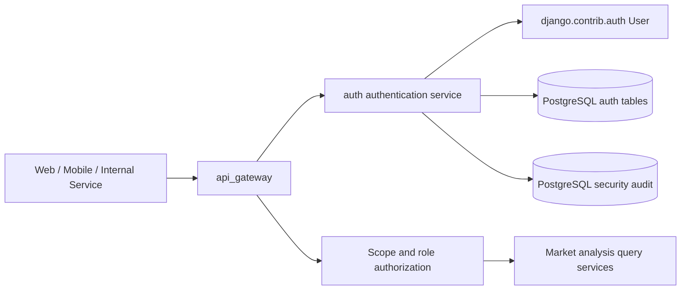
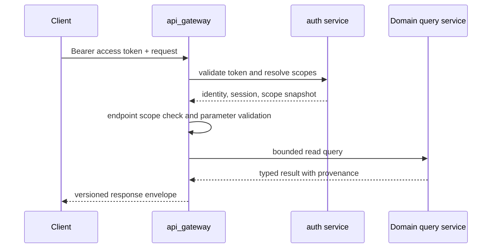

# Manniu Backend 基础 Auth 模块设计

## 1 文档定位

本文档为 `manniu_backend` 增加基础认证与授权模块的设计，服务于后续 `api_gateway` 和市场分析只读 API。

当前状态：**设计阶段，尚未实现**。

当前项目已经启用：

- `django.contrib.auth`
- `django.contrib.sessions`
- `AuthenticationMiddleware`
- Django 默认密码校验器
- PostgreSQL 数据库强制配置

当前项目尚未实现：

- 独立 `auth` Django app
- 公共登录/登出 API
- Bearer Token 或 API Token 校验
- 角色、Scope 和服务账号模型
- 登录失败、Token 撤销和安全审计

本模块只负责身份认证、会话生命周期、权限 Scope 和安全审计，不负责市场分析业务，也不提供交易执行能力。

## 2 目标和非目标

### 2.1 目标

1. 为 Web、移动端和内部服务提供统一登录凭证。
2. 为 `api_gateway` 提供可撤销、可过期的 Bearer access token。
3. 支持用户、服务账号、角色和细粒度 Scope。
4. 支持 refresh token 轮换、单设备/单会话撤销和全局登出。
5. 记录不含密码和原始 Token 的安全审计事件。
6. 全部认证状态持久化到 PostgreSQL，并支持多进程/多实例部署。
7. 为后续接入外部 OIDC/OAuth2 身份提供迁移边界。

### 2.2 非目标

- 首期不实现完整 OAuth2 Authorization Server。
- 首期不支持第三方社交登录、短信登录和邮箱找回流程。
- 不在 Auth 模块保存 Tushare token、数据库密码或券商凭证。
- 不在认证请求中调用 Tushare、模型推理或市场数据服务。
- 不暴露下单、撤单、自动交易或投资执行接口。
- 不用 SQLite、进程内字典或本地文件保存会话和 Token。

## 3 总体架构



### 3.1 模块职责

| 模块 | 负责 | 不负责 |
| --- | --- | --- |
| `auth` | 登录、凭证校验、Token 签发/轮换/撤销、角色和 Scope、认证审计 | 市场数据查询、估值计算、任务调度 |
| `api_gateway` | HTTP 路由、请求校验、调用 auth、权限检查、领域服务编排和响应封套 | 密码校验实现、Token 数据库读写细节 |
| `access_control` | 可作为 Gateway 内部的授权 facade，统一调用 auth 的身份和 Scope 服务 | 创建独立的第二套用户和权限表 |
| Django `User` | 用户名、密码哈希、激活状态、staff/superuser 基础属性 | API Token、设备会话、领域 Scope |
| PostgreSQL | 用户关联资料、Token hash、撤销状态、Scope、审计事件 | 明文密码和明文 Token |

`access_control` 在第一阶段可以作为 `api_gateway.authz` 的内部边界实现，待权限复杂度增加后再拆成独立应用；不能同时维护两套用户身份源。

## 4 Django 应用结构

```text
manniu_backend/
  auth/
    __init__.py
    apps.py
    admin.py
    models.py
    migrations/
    services/
      authentication.py
      token_service.py
      authorization.py
      audit.py
    api/
      serializers.py
      views.py
      urls.py
    permissions.py
    tests/
      test_authentication.py
      test_tokens.py
      test_authorization.py
      test_security.py
```

建议应用名为 `auth` 或 `manniu_auth`。如果采用 `auth`，应在 Python import 和 Django app label 中明确避免与 `django.contrib.auth` 的模块名混淆；推荐实际 Python 包名使用 `manniu_auth`，显示名称为 `Manniu Auth`。

## 5 身份和数据模型

### 5.1 用户身份

第一阶段继续使用 Django 内置 `django.contrib.auth.models.User`，不替换 `AUTH_USER_MODEL`，原因是当前项目已经使用默认用户模型且尚未形成业务用户表。所有新建表通过外键关联 `auth.User`。

用户登录标识首期为 `username`，大小写和空白由服务层规范化；邮箱可以保存和验证，但在未完成唯一性、验证流程和迁移前不作为登录主键。

生产部署前必须将 `SECRET_KEY` 从代码移出到环境变量，并关闭 DEBUG。该项属于认证上线前阻断项。

### 5.2 `AuthProfile`

| 字段 | 类型 | 约束/说明 |
| --- | --- | --- |
| `id` | bigint | 主键 |
| `user_id` | FK `auth.User` | unique，级联删除 |
| `display_name` | varchar(128) | 可空 |
| `timezone` | varchar(64) | 默认 `UTC` |
| `status` | enum | `ACTIVE`、`LOCKED`、`DISABLED` |
| `failed_login_count` | integer | 默认 0，非负 |
| `locked_until` | timestamptz | 可空 |
| `last_login_at` | timestamptz | 可空 |
| `last_password_changed_at` | timestamptz | 可空 |
| `created_at` / `updated_at` | timestamptz | 自动维护 |

密码仍由 Django `User.password` 使用 PBKDF2 等 Django 配置的 password hasher 保存，绝不新增明文密码字段。

### 5.3 `AuthSession`

一条记录代表一个登录设备/客户端会话。

| 字段 | 类型 | 说明 |
| --- | --- | --- |
| `id` | UUID | 对外安全的 session ID |
| `user_id` | FK | 所属用户 |
| `client_type` | varchar(32) | `WEB`、`MOBILE`、`SERVICE` |
| `device_name` | varchar(128) | 可空，不保存过度详细指纹 |
| `created_at` / `last_seen_at` | timestamptz | 会话生命周期 |
| `expires_at` | timestamptz | refresh 会话过期时间 |
| `revoked_at` | timestamptz | 可空 |
| `revoke_reason` | varchar(64) | 可空 |
| `ip_hash` | char(64) | 对 IP 做 keyed hash，不保存原始 IP |
| `user_agent_hash` | char(64) | 可选，避免持久化完整 UA |

索引：`(user_id, revoked_at, expires_at)`、`(expires_at)`。

### 5.4 `AuthRefreshToken`

refresh token 只在创建响应中返回一次；数据库只保存 hash。

| 字段 | 类型 | 说明 |
| --- | --- | --- |
| `id` | UUID | Token family/记录 ID |
| `session_id` | FK | 所属会话 |
| `token_hash` | char(64) | unique，使用 HMAC-SHA-256 或同等级 keyed hash |
| `issued_at` / `expires_at` | timestamptz | 过期时间 |
| `used_at` | timestamptz | 轮换后标记使用 |
| `revoked_at` | timestamptz | 可空 |
| `replaced_by_id` | FK | 轮换链，防止重复使用 |

refresh token 重放时，应撤销整个 session/token family，而不是继续接受旧 Token。

### 5.5 `AuthAccessToken`

首期使用 opaque access token，以降低依赖和撤销复杂度。

| 字段 | 类型 | 说明 |
| --- | --- | --- |
| `id` | UUID | 内部记录 ID |
| `session_id` | FK | 所属会话 |
| `token_hash` | char(64) | unique，只保存 hash |
| `scope_snapshot` | JSONB | 签发时的 Scope 快照 |
| `issued_at` / `expires_at` | timestamptz | 建议 15 分钟过期 |
| `revoked_at` | timestamptz | 可空 |
| `last_used_at` | timestamptz | 可选，低频更新或异步记录 |

Access token 每次请求按 hash 查 PostgreSQL 或缓存。缓存只能加速校验，撤销状态以 PostgreSQL 为准；缓存必须设置不超过 access token 剩余寿命的 TTL。

### 5.6 `AuthRole`、`AuthScope`、关联表

角色和 Scope 建议使用显式模型，避免把权限规则硬编码到视图：

- `AuthRole(code, name, description, is_system, created_at)`
- `AuthScope(code, name, description, is_system, created_at)`
- `UserRole(user_id, role_id)`
- `RoleScope(role_id, scope_id)`
- `ServiceAccount(user_id, service_name, owner, status)`

首期 Scope 白名单：

| Scope | 用途 |
| --- | --- |
| `market_analysis:read` | 市场分析当前只读结果 |
| `market_analysis:history` | 有日期范围的历史查询 |
| `market_analysis:ranking` | 情绪/估值排名 |
| `valuation:diagnostics_read` | 估值方法、风险和 provenance 诊断 |
| `predictive:status_read` | 预测模型和数据状态 |
| `financials:operator_read` | 财务 raw 和导入状态，运维专用 |
| `auth:session_read` | 查看自身会话 |
| `auth:session_revoke` | 撤销自身会话 |

Scope 应采用最小权限。`is_staff` 或 `is_superuser` 不能直接替代 API Scope 检查；管理后台权限和公共 API 权限分开判断。

### 5.7 `SecurityAuditEvent`

安全审计记录必须可追踪但不含秘密：

| 字段 | 类型 | 说明 |
| --- | --- | --- |
| `id` | bigint/UUID | 主键 |
| `event_type` | varchar(64) | 登录成功/失败、登出、刷新、撤销、密码修改、权限拒绝 |
| `user_id` | FK，可空 | 未识别用户允许为空 |
| `session_id` | UUID，可空 | 关联会话 |
| `request_id` | varchar(64) | 与 Gateway 请求关联 |
| `ip_hash` | char(64) | keyed hash |
| `metadata` | JSONB | 只允许白名单字段 |
| `created_at` | timestamptz | 事件时间 |

禁止写入密码、Authorization 原文、access/refresh token、Tushare token、数据库连接串和完整异常堆栈。

## 6 Token 方案

### 6.1 选择

基础版本选择 **opaque access token + rotating refresh token**：

- access token：短生命周期，建议 15 分钟。
- refresh token：建议 30 天，按设备会话管理并轮换。
- 数据库只保存 Token hash，响应中只返回原始 Token 一次。
- access token 可立即撤销，适合 API Gateway 的权限变更和登出场景。
- 后续如接入外部 OIDC，可增加 JWT/JWKS 验证适配器，公共权限接口保持不变。

### 6.2 Token 处理规则

1. 使用密码学安全随机源生成至少 32 字节随机 Token。
2. 数据库保存 `HMAC(server_secret, raw_token)` 或等价 keyed hash，不保存普通 SHA-256 裸 hash。
3. 比较 hash 使用 constant-time compare。
4. access token 不放入 URL、日志、审计 metadata 或异常信息。
5. Web 客户端优先使用 `HttpOnly`、`Secure`、适当 `SameSite` 的 cookie；纯 API 客户端使用 Bearer header。
6. refresh token 只能在 `/auth/token/refresh` 使用，刷新成功后旧 token 立即标记 `used_at`，并签发新 refresh token。
7. 修改密码、锁定用户、全局登出和检测到 refresh replay 时，撤销该用户或会话的所有相关 Token。

## 7 公共 API 设计

基础路径：`/api/v1/auth`。

### 7.1 登录

```text
POST /api/v1/auth/login
```

请求：

```json
{
  "username": "analyst",
  "password": "<password>",
  "client_type": "WEB",
  "device_name": "browser"
}
```

成功响应：

```json
{
  "success": true,
  "api_version": "v1",
  "request_id": "...",
  "data": {
    "access_token": "<opaque-access-token>",
    "token_type": "Bearer",
    "expires_in": 900,
    "refresh_token": "<opaque-refresh-token>",
    "refresh_expires_in": 2592000,
    "session_id": "uuid",
    "user": {
      "id": 12,
      "username": "analyst",
      "display_name": "Analyst",
      "scopes": ["market_analysis:read"]
    }
  }
}
```

用户名不存在、密码错误、用户锁定和用户禁用对外统一为 `401 AUTHENTICATION_FAILED`，避免暴露账号是否存在。内部审计记录具体原因。

### 7.2 刷新 Token

```text
POST /api/v1/auth/token/refresh
```

请求只包含 refresh token。成功后返回新的 access token 和新的 refresh token；旧 refresh token 不再可用。并发刷新同一个 refresh token 时，只允许一个请求成功，其他请求返回 `401 REFRESH_TOKEN_REUSED` 并触发会话撤销。

### 7.3 当前用户

```text
GET /api/v1/auth/me
```

需要有效 access token，只返回当前用户的非敏感资料、账户状态、Scope 和当前 session 信息，不返回密码 hash、Token 或内部安全字段。

### 7.4 当前用户会话

```text
GET    /api/v1/auth/sessions
DELETE /api/v1/auth/sessions/:session_id
```

需要 `auth:session_read` 或 `auth:session_revoke`。用户只能查看和撤销自己的会话；运维撤销其他用户会话需要单独的管理 Scope，且首期不开放公共 API。

### 7.5 登出

```text
POST /api/v1/auth/logout
```

撤销当前 access token 所属 session 的 refresh token，并撤销当前 access token。登出接口应幂等，Token 已撤销时仍返回成功或明确的已登出状态，不泄露会话存在性。

### 7.6 修改密码

```text
POST /api/v1/auth/password/change
```

需要当前 access token，提交 `current_password` 和 `new_password`。新密码必须通过 Django 所有 `AUTH_PASSWORD_VALIDATORS`。成功后撤销该用户的其他 access/refresh token，并写入安全审计事件。

首期不提供公开“忘记密码”接口；找回流程需要先确认邮箱/管理员审批和一次性链接模型，避免形成账号枚举和邮件滥用风险。

## 8 Gateway 认证和授权流程



处理顺序：

1. 生成或接收 `X-Request-ID`。
2. 解析 Authorization header；缺失或格式错误立即返回 401。
3. 通过 auth service 校验 Token、session、用户状态和过期时间。
4. 将 `user_id`、`session_id`、Scope、request ID 注入 request context。
5. 执行 endpoint 所需 Scope 检查。
6. 校验日期、证券代码、分页、report type、variant 和 model version。
7. 调用领域 bounded read service。
8. 用统一响应封套序列化；记录最小化审计和指标。

Gateway 不允许仅凭 URL 参数中的 `user_id`、`role` 或 `scope` 做授权；所有身份信息来自已验证的 auth context。

## 9 认证失败和安全策略

### 9.1 登录保护

- 同一账号连续失败达到阈值后临时锁定，例如 5 次/15 分钟。
- 同一 IP、账号和 endpoint 分别限流，避免只依赖单一维度。
- 登录失败响应不区分“用户不存在”和“密码错误”。
- 登录成功后重置失败计数并记录时间。
- 锁定和解锁事件必须进入审计记录。

### 9.2 CSRF、CORS 和 Cookie

- Cookie 模式必须启用 CSRF 校验；Bearer header 模式不应通过 URL 传递 Token。
- `CORS_ALLOWED_ORIGINS` 只能使用显式白名单，禁止生产环境通配符。
- 生产环境必须使用 HTTPS，并设置 Secure cookie、HSTS 和安全响应头。
- 登录、刷新、改密和登出请求禁止跨站宽松配置。

### 9.3 Token 撤销

以下事件必须支持立即撤销：

- 用户主动登出
- 密码修改
- 管理员禁用/锁定用户
- refresh token 重放
- session 删除
- Scope 或角色发生高风险变更

删除用户、撤销会话和清理历史 Token 使用事务；定时任务只清理已过期且满足保留策略的记录，不得删除仍需审计的安全事件。

## 10 统一错误契约

Auth 错误沿用 API Gateway 错误封套：

```json
{
  "success": false,
  "api_version": "v1",
  "request_id": "...",
  "error": {
    "code": "AUTHENTICATION_FAILED",
    "message": "用户名或密码错误",
    "details": {},
    "retryable": false
  }
}
```

建议错误码：

| HTTP | 错误码 | 场景 |
| --- | --- | --- |
| 400 | `INVALID_REQUEST` | 字段缺失或格式不正确 |
| 401 | `AUTHENTICATION_REQUIRED` | 缺少 Bearer token |
| 401 | `AUTHENTICATION_FAILED` | 登录失败，不区分具体原因 |
| 401 | `TOKEN_INVALID` | Token 不存在、格式错误或已撤销 |
| 401 | `TOKEN_EXPIRED` | access token 过期 |
| 401 | `REFRESH_TOKEN_REUSED` | 检测到 refresh token 重放 |
| 403 | `ACCOUNT_DISABLED` | 账户已禁用或锁定 |
| 403 | `SCOPE_REQUIRED` | 缺少 endpoint 所需 Scope |
| 429 | `AUTH_RATE_LIMITED` | 认证请求频率过高 |
| 500 | `AUTH_INTERNAL_ERROR` | 内部错误，不返回堆栈 |

## 11 配置建议

所有生产敏感值通过环境变量提供：

| 配置 | 建议默认值 | 说明 |
| --- | --- | --- |
| `AUTH_ACCESS_TOKEN_TTL_SECONDS` | `900` | access token 15 分钟 |
| `AUTH_REFRESH_TOKEN_TTL_SECONDS` | `2592000` | refresh token 30 天 |
| `AUTH_LOGIN_MAX_FAILURES` | `5` | 锁定阈值 |
| `AUTH_LOGIN_LOCK_SECONDS` | `900` | 临时锁定时长 |
| `AUTH_TOKEN_HASH_SECRET` | 无默认值 | 必须由环境变量提供，禁止硬编码 |
| `AUTH_ALLOWED_CORS_ORIGINS` | 无默认值 | 生产必须显式配置 |
| `AUTH_COOKIE_SECURE` | `true` | HTTPS 部署时启用 |
| `AUTH_AUDIT_RETENTION_DAYS` | `365` | 依合规要求调整 |

缺少 `AUTH_TOKEN_HASH_SECRET` 时，生产环境应拒绝启动；开发环境也不得使用固定公开示例值。

## 12 测试和验收标准

### 12.1 核心流程

- 正确用户名和密码可以创建 session、access token 和 refresh token。
- access token 可以通过 Gateway 认证并注入正确的用户和 Scope。
- refresh token 轮换后旧 token 不能再次使用。
- 登出后当前 access token 和 refresh token 均失效。
- 修改密码后旧会话按策略撤销。
- PostgreSQL 重启或多进程部署不丢失认证状态。

### 12.2 边界和失败场景

- 用户不存在、密码错误、用户锁定对外返回一致的登录失败语义。
- 过期、撤销、格式错误的 Token 均不能访问受保护领域 API。
- 缺少 Scope 在领域服务调用前返回 403。
- refresh token 并发重放会撤销 session/token family。
- access token、refresh token、密码和密钥不出现在日志、审计 metadata、异常和 URL。
- 所有认证 endpoint 都受独立限流保护。
- cookie 模式验证 CSRF，Bearer 模式验证 header，不接受 query string token。

### 12.3 兼容性测试

- Django Admin 登录仍使用 Django session，不与 API Bearer Token 混用。
- 现有 `auth.User` 数据可以直接被 auth profile 关联。
- Gateway 的 `market_analysis:read` Scope 能访问已确认的市场分析只读接口。
- `is_staff`、`is_superuser` 不会绕过明确的 API Scope 约束，除非在授权策略中显式配置。

## 13 实施顺序和闸门

1. 确认使用 `manniu_auth` 包名、默认 `auth.User`、Token TTL、Scope 清单和密码策略。
2. 创建 auth app、Profile/Session/Token/Role/Scope/Audit 模型及 PostgreSQL migrations。
3. 实现 token service、登录失败锁定、刷新轮换和撤销服务。
4. 实现 `/api/v1/auth` API、统一错误封套和 request context。
5. 在 API Gateway 中接入认证 middleware/facade 和 Scope permission。
6. 完成安全测试、并发 refresh 测试、迁移测试和 secret redaction 测试。
7. 先开放 `market_analysis:read` 只读 Scope，再按确认结果开放 history、ranking 和 diagnostics Scope。
8. 后续如需要第三方登录，再增加 OIDC adapter，不直接替换现有公共 auth API 契约。

## 14 待确认事项

- 首期是否继续使用 `auth.User`，还是在任何业务用户数据落库前切换到自定义 `AUTH_USER_MODEL`。
- 前端使用 HttpOnly cookie、Bearer header，还是两者按客户端类型并存。
- 是否需要邮箱验证、多因素认证、管理员邀请和密码找回。
- 用户单设备最大 session 数、refresh token 生命周期和审计保留期限。
- 角色到 Scope 的最终映射，以及运维 Scope 是否只允许内网/服务账号。
- 是否需要 Redis 做 token cache；即使启用，PostgreSQL 仍是撤销状态事实来源。
- 生产 HTTPS、CORS、CSRF、反向代理和密钥轮换方案。

## 15 TODO

- [x] 确认身份模型和公共 auth API 契约：采用 `manniu_auth`、默认 `auth.User`、Bearer header 和 opaque access token + rotating refresh token。
- [x] 创建 `manniu_auth` Django app、认证模型及 PostgreSQL migration 文件。
- [x] 实现 Token 生命周期、登录失败锁定、Scope 解析、会话撤销和安全审计。
- [x] 实现 `/api/v1/auth` 基础 API、统一响应封套和 Bearer Token 校验。
- [x] 在目标 PostgreSQL 环境执行认证 migration，并完成迁移验证。
- [x] 接入 `api_gateway` 的认证 facade 和 Scope permission；领域 API 合约测试仍待各领域接口契约确认。
- [ ] 补齐并发 refresh、迁移、secret redaction、限流和 CSRF/CORS 安全测试。
- [x] 提供并执行幂等初始化命令，开放 `market_analysis:read` 默认只读 Scope；其他业务 Scope 仍按确认结果开放。
- [x] 增加生产配置 system check，阻止缺失 `SECRET_KEY`/`AUTH_TOKEN_HASH_SECRET`、不安全 Cookie 和通配 CORS。
- [ ] 完成生产部署安全检查，包括 HTTPS、CORS、CSRF、Cookie、密钥轮换和限流策略的运行环境验证。
