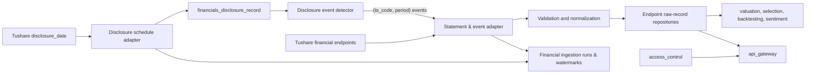
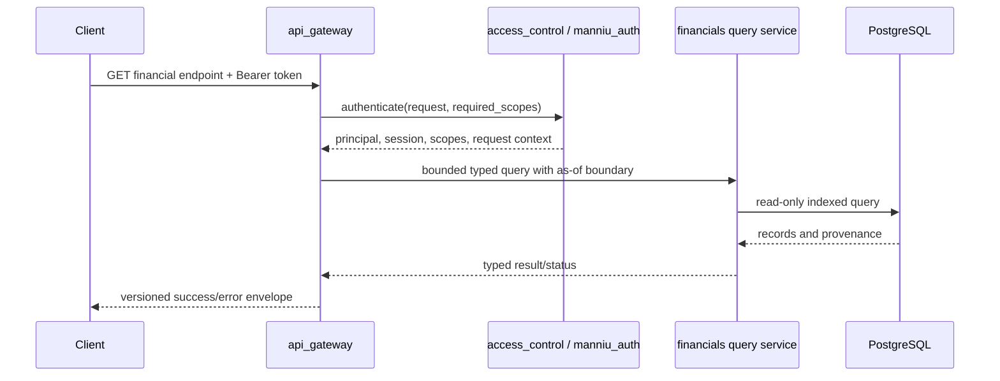

# Financials Backend Design

## 1 Status And Ownership

`financials` is an already registered `manniu_backend` Django app. It owns the ingestion, PostgreSQL persistence, auditability, period/as-of selection, and read-optimized snapshots of Tushare corporate financial data. Its read-only financial and disclosure routes are exposed through `api_gateway`; ingestion and other data-write operations remain internal.

`financials` consumes `market_data.Security` for stock identity and listing lifecycle. `market_data` remains the owner of trading bars, market master data, and Tushare market-data ingestion. `financials` supports research, valuation, selection, backtesting, and decision support only; it must never create or execute trading orders.

## 2 Source Coverage

| Domain dataset | Tushare endpoint | Primary use |
| --- | --- | --- |
| Income statement | `income_vip` | Revenue, profit, EPS, historical statements |
| Balance sheet | `balancesheet_vip` | Assets, liabilities, equity, debt and liquidity |
| Cash flow | `cashflow_vip` | Operating, investing, and financing cash flow |
| Performance forecast | `forecast_vip` | Forecast range and expected profit change |
| Performance express | `express_vip` | Earnings flash updates |
| Dividend/corporate action | `dividend` | Cash/share dividends and ex-date data |
| Financial indicators | `fina_indicator_vip` | ROE, ROA, margins, growth, solvency, turnover |
| Audit opinion | `fina_audit` | Audit result and fees |
| Main business composition | `fina_mainbz_vip` | Segment/product/region sales and profit |
| Disclosure schedule | `disclosure_date` | Announcement, planned, actual, and modified dates |

All source records retain the provider response identity and dates. The data model does not collapse revisions into a single untraceable row.

## 3 Architecture



Financial data updates are event-driven: the upstream `disclosure_date` endpoint serves as the primary event definition source. When new announcements, confirmed actual disclosure dates (`actual_date`), or modified schedules are detected from `disclosure_date`, the system identifies the affected securities and reporting periods `(security_id, period)`. The statement and event adapters (`income_vip`, `balancesheet_vip`, `cashflow_vip`, `fina_indicator_vip`, `fina_audit`, `fina_mainbz_vip`, `forecast_vip`, `express_vip`, `dividend`) then execute targeted queries for only the affected symbols rather than scanning the entire market. Downstream consumers own any model-specific projection rebuild after raw records commit.

The adapter owns explicit endpoint projections, Tushare paging, transient-error handling, and secret-safe errors. Normalization owns `NaN` conversion, scalar conversion, endpoint date selection, and deterministic row signatures. Repositories own PostgreSQL writes. Query services select only data that was public at an explicit `as_of_date`; public API handlers must delegate to those services after `access_control` authorization.

## 4 PostgreSQL Persistence Design

### 4.1 Raw Endpoint Records

Each Tushare endpoint uses a dedicated raw-record table instead of a single sparse mega-table. Every table has a `security_id` foreign key to `market_data.Security`, original `ts_code`, provider dates, `row_signature`, `source_revision_at` when available, `source`, `imported_at`, and raw endpoint fields.

The common natural key is `(security_id, ann_date, end_date, period, row_signature)`. `row_signature` is a SHA-1 or equivalent deterministic hash of normalized provider fields that distinguish repeated rows, such as business-composition item or dividend proposal. It permits different valid disclosures for the same report date while making identical repeats idempotent.

| Planned table | Endpoint | Core fields | Required indexes |
| --- | --- | --- | --- |
| `financials_income_record` | `income_vip` | revenue, total revenue, operating/total/net profit, attributable profit, EPS | unique natural key; `(security_id, end_date DESC)`; `(ann_date)` |
| `financials_balance_sheet_record` | `balancesheet_vip` | total assets/liabilities/equity, cash, receivables, inventory, short/long borrowings | same |
| `financials_cashflow_record` | `cashflow_vip` | operating, investing, financing, net cash change | same |
| `financials_forecast_record` | `forecast_vip` | forecast type, change range, profit range | same |
| `financials_express_record` | `express_vip` | revenue, net profit, assets, EPS | same |
| `financials_dividend_record` | `dividend` | cash/share distribution, record date, ex-date | natural key; `(security_id, ex_date DESC)`; `(ann_date)` |
| `financials_indicator_record` | `fina_indicator_vip` | profitability, growth, margin, solvency, turnover, cash-flow ratios | same |
| `financials_audit_record` | `fina_audit` | audit result, audit fee | same |
| `financials_main_business_record` | `fina_mainbz_vip` | item/category, sales, profit | same |
| `financials_disclosure_record` | `disclosure_date` | announcement, planned, actual, modified disclosure dates | natural key; `(ann_date, security_id)`; `(security_id, end_date DESC)` |

Date fields are PostgreSQL `DATE` when supplied in valid `YYYYMMDD` format. Provider values that have no date meaning remain text. Financial amounts and ratios use documented `NUMERIC` precision, not floats: monetary quantities and shares use `NUMERIC(24, 4)`, per-share values use `NUMERIC(18, 6)`, and percentages/ratios use signed `NUMERIC(18, 6)`. The implementation must document the provider unit for each endpoint field and never silently convert units.

### 4.2 Consumer Projections

Raw endpoint records optimize audit and replay. `financials` does not own generic
feature-panel or latest-feature tables. Each downstream domain owns its own projection
schema and rebuild policy so persisted fields match its feature contract.
`predictive_valuation`, for example, owns its point-in-time financial panel/latest
projections and constructs them from these raw records before inference.

## 5 As-Of And Revision Rules

Financial data is publication-time sensitive. A feature used on trade date $t$ may only use a raw record with an effective public date no later than $t$:

$$
effectiveDate = actualDate \;\text{when present, otherwise}\; annDate
$$

Rows without both dates are retained for audit but excluded from consumer time-sensitive
projections until a valid date is available. A `disclosure_date` revision causes the
relevant consumer's versioned, idempotent projection rebuild. An amendment creates a
new raw signature or source revision and does not erase the previous evidence.

Forecasts, express reports, dividends, and audits may have multiple events per period.
They remain endpoint records and are selected by explicit consumer policy; they are not
silently merged into a statement value. Backtests must request an explicit `as_of_date`;
each consumer enforces its own point-in-time projection boundary.

## 6 Ingestion Control And Reliability

`FinancialIngestionRun` stores endpoint list, requested scope/date coverage, start/finish time, status, source/accepted/upserted/rejected counts, pagination/retry counts, and sanitized error summary. `FinancialIngestionWatermark` is unique by `(endpoint, scope_key)` and records the last complete announcement-date or endpoint-specific source cursor.

Endpoint writes occur in transactions per bounded page/chunk. A successful chunk writes raw records and its counters together. A watermark advances only after every requested page and coverage check succeeds. Logs, database records, and errors must never contain `TUSHARE_TOKEN`, database passwords, or raw connection strings.

## 7 API Gateway And Auth Integration Requirements

This section defines the financials integration contract with `api_gateway` and
`manniu_auth`/`access_control`. It is a requirements boundary, not an
implementation of HTTP views, auth models, or financial query services.

### 7.1 Integration ownership

The request path must be:



Responsibilities are split as follows:

| Component | Financial integration responsibility | Explicit non-responsibility |
| --- | --- | --- |
| `api_gateway` | Route/version, request parsing, symbol/date/dataset allowlists, pagination limits, auth context, response envelope, error mapping, rate limiting, audit context | Financial calculations, as-of row selection, Tushare calls, raw ORM queries, writes |
| `manniu_auth` / `access_control` | Bearer token validation, session/user status, required Scope checks, principal context, authorization-denied audit event | Financial data visibility rules, report-period selection, query construction |
| `financials` | Typed read services, effective-public-date filtering, revision/provenance selection, domain statuses | Public HTTP routes, token validation, role management, cross-domain response envelopes |

Gateway views must call public `financials` query services and must not import
financial models, Tushare adapters, management commands, or Django `QuerySet`
objects directly. The query service must return a typed result containing at
least `found`, `status`, `records`, `provenance`, and `warnings`; it must not
return a DRF `Response`.

### 7.2 External routes

All routes use the existing Gateway base path and response contract:

```text
GET /api/v1/market-analysis/securities/:ts_code/financials
GET /api/v1/market-analysis/securities/:ts_code/disclosures
```

`ts_code` is normalized to an exchange-suffixed code before the domain call.
The Gateway must reject an ambiguous or unknown symbol and must never pass an
unresolved user string to the financial query service.

`/financials` accepts:

| Parameter | Required | Contract |
| --- | --- | --- |
| `dataset` | yes | `income`, `balance_sheet`, `cashflow`, `indicator`, `forecast`, `express`, `dividend`, `audit`, or `main_business` |
| `asof_date` | conditional | Required for historical/as-of access; `YYYY-MM-DD`; cannot be future-dated |
| `end_date` | no | Report period, `YYYY-MM-DD`; must be a valid provider period boundary |
| `start_date` | no | Publication/report date lower bound; requires `end_date` and the bounded range rules |
| `page` | no | Positive integer, default `1` |
| `page_size` | no | Default `50`, maximum `200` |

`/disclosures` accepts `start_date`, `end_date`, `asof_date`, `page`, and
`page_size`. It returns disclosure schedule records and effective-public-date
provenance, not raw provider payloads.

The Gateway must enforce the global history limits from the API Gateway design:
default maximum 366 calendar days and maximum 2,000 records per request. A
request outside those limits returns `RANGE_TOO_LARGE`; it must not silently
truncate or fall back to the latest snapshot.

### 7.3 Scope and data classification

Financial routes require authentication even when listed as public API catalog
entries. Scope checks are additive:

| Request/data class | Required Scope | Notes |
| --- | --- | --- |
| Current public financial record query without a date range | `market_analysis:read` | Still applies effective-date and dataset allowlists |
| Historical query with `asof_date`, `start_date/end_date`, or report history | `market_analysis:read` + `market_analysis:history` | The additional Scope prevents broad historical access by default |
| Disclosure calendar query | `market_analysis:read`; add `market_analysis:history` for bounded historical ranges | Current schedule is not anonymous access |
| Raw endpoint payload, import run status, rejected rows, sanitized operator diagnostics | `financials:operator_read` | Never included in ordinary financial responses |
| Service-to-service ingestion or rebuild trigger | No public Gateway route | Use an independently issued service identity and an internal command boundary |

`is_staff` and `is_superuser` do not replace these API Scope checks. Auth must
evaluate active user/session/token state and the token's current revocation
status before the Gateway invokes a query service. Scope failures return
`403 SCOPE_REQUIRED`; authentication failures return `401` using the shared
Gateway error envelope.

### 7.4 Request and response contract

Successful responses use the shared `success`, `api_version`, `request_id`,
`data`, and `meta` envelope. Every financial record returned to a consumer
must include, where available:

- `ts_code`, `dataset`, `end_date` and the provider report period;
- `ann_date`, `actual_date`, and computed `effective_date`;
- `source`, `source_revision` or equivalent revision identity;
- `data_status` and warnings when records are incomplete or stale.

The domain query service must apply this predicate before pagination:

```text
effective_date IS NOT NULL AND effective_date <= requested_asof_date
```

where `effective_date = actual_date` when valid, otherwise `ann_date`. The
Gateway may validate the requested date and range, but must not implement this
selection rule itself. Pagination metadata must describe the filtered result,
not the raw table count.

The following semantics are required:

| Condition | HTTP/result behavior |
| --- | --- |
| Valid query with no matching record | `200` with `data_status=NOT_AVAILABLE`, or `404 RESULT_NOT_FOUND` only when the route contract requires one specific result |
| Requested record exists only after `asof_date` | `200` with no future row, or `409 ASOF_CONFLICT` when an exact requested period/version was required; never leak the future row |
| Valid data with missing optional fields | `200`, preserve nulls and return a warning; do not synthesize zero |
| Domain dependency unavailable | `503 UPSTREAM_DEPENDENCY_UNAVAILABLE` with `retryable=true` |
| Invalid dataset, symbol, date, or range | `400` with `INVALID_REQUEST`, `INVALID_SYMBOL`, `INVALID_DATE`, or `RANGE_TOO_LARGE` |
| Operator-only data without operator Scope | `403 SCOPE_REQUIRED` |

Raw provider columns not approved by the public contract must remain in the
raw persistence layer and must not be exposed through these routes. Diagnostic
details are Scope-sensitive: ordinary users receive stable reason codes only;
SQL, stack traces, connection strings, file paths, tokens, and provider
credentials are never returned.

### 7.5 Authentication, audit, and cache requirements

- The Gateway reads `Authorization: Bearer <access_token>` and delegates token
    validation to `access_control`; it never reads token tables directly.
- Every request receives or propagates `X-Request-ID`. The same ID is passed to
    Auth, the financial query service, structured logs, and security/domain audit
    records.
- Authorization audit records contain principal, required Scope, endpoint,
    normalized symbol, result, and request ID, but never the raw Authorization
    header or token.
- Financial reads are strictly side-effect free: no Tushare fallback, import,
    watermark advancement, snapshot rebuild, or cache mutation that changes
    financial truth may occur in a public request.
- If response caching is added, the key must include API version, normalized
    parameters, `asof_date`, dataset, and authorization visibility. Operator
    diagnostics must not share a cache namespace with ordinary users.
- Gateway and Auth rate limits apply before the domain query. Query timeouts
    cancel the downstream call and return a bounded dependency error.

### 7.6 Internal query service contract

The first implementation must expose the following internal read boundaries (the
names are contract proposals and require confirmation before coding):

```python
financials.query_records(
        *, ts_code, dataset, asof_date, end_date=None,
        date_range=None, page=1, page_size=50,
)
financials.query_disclosures(
        *, ts_code, asof_date, date_range=None, page=1, page_size=50,
)
```

Both methods must use bounded, indexed PostgreSQL queries, return typed results,
and expose provenance without returning a Django `QuerySet`. They must not
accept an authorization token or make authorization decisions; the Gateway
passes the authenticated principal only when needed for audit or field-level
visibility.

### 7.7 Integration acceptance criteria

- Unauthenticated, expired, revoked, and disabled-user requests are rejected by
    the shared Auth boundary before any financial query executes.
- A user with only `market_analysis:read` can read current public financial data
    but receives `403 SCOPE_REQUIRED` for bounded historical/as-of access.
- A user with `market_analysis:read` plus `market_analysis:history` receives
    only records public on or before `asof_date`, including after a disclosure
    amendment and repeated ingestion.
- `financials:operator_read` is required for raw payload and run-status routes;
    no such route is added to the ordinary public API catalog.
- Gateway tests prove symbol/date/dataset/range validation and shared error
    envelopes; financials tests prove effective-date filtering and revision
    provenance independently of HTTP.
- An integration test proves the chain
    `Bearer token -> access_control -> financial query service -> PostgreSQL`
    and verifies that the query path performs no Tushare call or database write.
- Audit/log assertions prove that request IDs and authorization outcomes are
    retained while tokens, passwords, connection strings, and stack traces are
    absent.

## 8 Test Case Definition

### 8.1 Core Flow

- Every endpoint maps to its dedicated raw model, deterministic natural key, and documented projection fields.
- `disclosure_date` detects new/amended disclosure events and accurately drives targeted statement and event ingestion for affected securities without all-market scanning.
- A repeated normalized provider row upserts idempotently, while a material revision remains auditable.
- An eligible statement/indicator set is available for an authorized downstream consumer projection rebuild.
- A consumer historical as-of projection uses only disclosure records public on or before the requested date.

### 8.2 Boundary Scenarios

- Multiple dividend or main-business rows for one security/report period remain distinct through row signatures.
- Missing/invalid optional publication dates are retained as raw data but excluded from time-sensitive projections.
- Consumers that require latest projections maintain their own one-row snapshots rather than scanning raw history.
- A provider field not in a typed projection remains in the endpoint raw payload under the endpoint schema policy.

### 8.3 Failure Scenarios

- A malformed required endpoint payload, exhausted page limit, or failed chunk leaves the endpoint watermark unchanged.
- A projection cannot use a statement whose effective date is after the requested as-of date.
- Tokens, passwords, and connection strings are absent from command output and persisted error summaries.
- No financial calculation or API path creates an automatic trading action.

## 9 Implementation Sequence

1. Confirm concrete table names, core typed field list/units for every endpoint, row-signature policy, and effective-date precedence.
2. Implement raw endpoint models, run/watermark models, PostgreSQL migrations, indexes, and model-contract tests.
3. Implement adapter, normalization, pagination, and endpoint repository upserts with mocked Tushare tests.
4. Implement disclosure-date ingestion and event detection; downstream domains rebuild their own as-of projections with no-lookahead tests.
5. Implement the operator CLI, backfill/quarterly scheduling, reconciliation artifacts, and failure exit behavior.
6. Confirm API and authorization contracts before implementing read endpoints.

## 10 TODO List

- [ ] 需求确认：确认 10 个 Tushare endpoint 的 typed fields、provider units、日期字段、表名、索引和 row signature 规则。
- [ ] 需求确认：确认 `effective_date = actual_date` 优先、否则使用 `ann_date` 的 as-of 规则，以及无有效公开日期记录的消费边界。
- [ ] 需求确认：确认 `api_gateway` 路由、统一响应封套、错误码、分页和日期范围限制。
- [ ] 需求确认：确认 `market_analysis:read`、`market_analysis:history`、`financials:operator_read` 的授权范围和默认角色绑定。
- [ ] 数据模型：实现 10 个 endpoint 对应的 raw record 模型、公共 provenance 字段、自然键和 PostgreSQL 索引。
- [ ] 数据模型：实现 `FinancialIngestionRun`、`FinancialIngestionWatermark` 及其状态、计数器、唯一约束和索引。
- [ ] 数据库：生成并应用 PostgreSQL migrations，确认不使用 SQLite，校验金额、比例、日期和文本字段精度/长度。
- [ ] 规范化：实现 provider 空值、日期、数值、单位和 deterministic row signature 的规范化逻辑。
- [ ] 采集：实现 Tushare adapter、分页、重试、限流、secret-safe error，以及按 disclosure event 定向拉取数据。
- [ ] 持久化：实现按 bounded page/chunk 的事务写入、幂等 upsert、修订保留和 watermark 仅成功推进规则。
- [x] 查询服务：实现 `financials.query_records()` 和 `financials.query_disclosures()` 的 typed read service、bounded query 和 provenance 返回。
- [ ] 查询服务：实现 effective-date/as-of 过滤、报告期选择、多事件选择策略和 `NOT_AVAILABLE`、`STALE`、`PARTIAL_SUCCESS` 等状态。
- [x] Auth 接入：通过 `access_control` 校验 Bearer token、用户/会话状态、token 撤销状态和所需 Scope，不在 financials 内维护第二套权限。
- [x] Gateway 接入：实现 financials/disclosures 只读路由、参数白名单、证券代码规范化、分页/日期范围校验和统一错误映射。
- [ ] Gateway 接入：接入 `X-Request-ID`、结构化审计、限流、超时和响应字段裁剪，确保普通用户无法读取 raw/operator 数据。
- [x] API 目录：将已审核的 financials 只读 endpoint 加入 Public API catalog；不公开导入运行、raw payload 和运维接口。
- [ ] 测试：补充模型契约、自然键、索引、迁移和字段精度测试。
- [ ] 测试：补充 adapter mock、分页/重试、空值规范化、幂等 upsert、修订审计和 watermark 失败回滚测试。
- [ ] 测试：补充 disclosure event 定向同步测试，证明不会触发全市场扫描。
- [ ] 测试：补充 as-of/no-lookahead、无效日期、未来披露、重复披露和多 dividend/main-business 行测试。
- [ ] 测试：补充 Gateway/Auth 集成测试，覆盖未登录、过期/撤销 token、disabled 用户、缺少 Scope 和 operator Scope。
- [ ] 测试：验证 API 请求只读，不调用 Tushare、不写 financials 表、不推进 watermark、不触发快照重建。
- [ ] 安全验收：检查日志、审计、响应和错误中不包含 Token、密码、Tushare token、数据库连接串、堆栈和内部路径。
- [ ] 运维：实现 operator CLI、backfill/quarterly 调度、reconciliation artifact、失败退出码和恢复/重跑说明。
- [ ] 验证：运行 Django checks、迁移检查、financials 单元测试、Gateway/Auth 集成测试和最小 PostgreSQL smoke test。
- [ ] 文档：补充部署配置、Scope 初始化、API catalog、查询服务调用示例和回滚/重跑操作说明。
