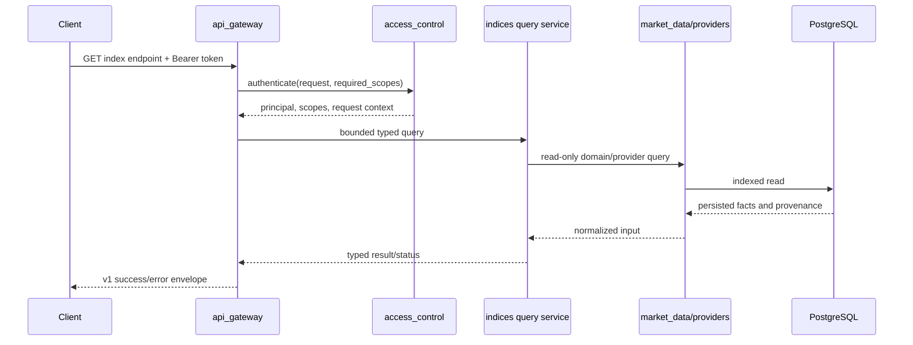

# indices 后端模块设计文档

## 1 文档信息

- 模块：`manniu_backend/indices`
- 所属服务：UAT `manniu_backend`
- 文档状态：设计基线
- 关联需求：
  - `REQUIREMENT_MARKET_INDEX_SIMPLE_VALUATION_20260630.md`
  - `REQUIREMENT_HEADER_MARKET_QUANTILE_7_INDEX_3_STYLE_20260613.md`
  - `REQUIREMENT_INDEX_TRADING_HISTORY_BACKFILL_TUSHARE_20260630.md`

## 2 设计定位

`indices` 是指数与市场分析领域计算模块，负责从 `market_data` 及明确声明的分析事实源读取已经落库的数据，并生成指数分位、7 指数组合风格指标、简化传统估值、市场健康度、估值温度计、股债性价比和历史体检结果。

模块不负责外部数据采集、不负责上游表写入、不负责 HTTP API、不负责前端界面，也不负责交易执行。

核心原则：

1. `market_data` 是指数身份、行情和估值基本面的唯一事实源。
2. `indices` 只读消费上游数据，不复制原始行情或估值表。
3. 计算层与 Django 查询层分离，计算逻辑应可脱离数据库进行单元测试。
4. 正常缺数通过结果状态表达，不能使用默认值伪造指数点位或估值。
5. API 适配层负责请求参数、鉴权和响应格式，前端负责展示和交互；本模块提前定义稳定的内部领域结果，保证 mobile app 和 web 使用同一计算口径。

## 3 功能边界

### 3.1 本模块负责

- 指数池、业务键、风格和权重配置。
- 指数身份、行情和估值历史的只读查询。
- 日频序列清洗、去重、日期对齐和有效值过滤。
- PE、PE_TTM、PB 的历史分位和 P10/P50/P90 计算。
- 7 指数 `overall`、`defensive`、`balanced`、`aggressive` 四套风格组合计算。
- 单指数 PE、PE_TTM、PB 简化估值。
- 组合估值、保守估值和估值状态汇总。
- 数据覆盖率、实际数据日期、缺失指数和样本质量信息。
- 指数目录和关注指数所需的稳定标识、名称、支持指标及数据更新时间。
- 市场健康度四项指标的计算结果：估值、流动性、情绪、风险。
- A 股估值温度计、状态标签、配置提示和健康度解释因子。
- 股票股息率与 10Y 国债收益率的利差、历史序列和资产倾向。
- 历史健康度序列、关键时刻和估值/风险事件回放。

### 3.2 本模块明确不负责

- 不新增或修改 HTTP API、URL、序列化器、鉴权和请求校验。
- 不包含 Header、弹窗、图表、文案、风格切换控件或响应式界面。
- 不直接调用 Tushare 或其他外部行情供应商。
- 不负责 `market_data` 的证券主数据、行情、估值基本面同步和回填。
- 不新增 `indices` 专属数据库表和迁移。
- 不把用户关注列表、推送开关、Pro 权限和设备信息持久化在 `indices`。
- 不改变股票估值、预测估值、市场情绪或回测模块的业务口径。
- 不生成买卖指令、不执行交易。

上层 API 如需对外提供指数结果，应调用 `indices` 的内部服务并自行完成参数转换、错误映射和响应序列化。

## 4 上游数据契约

| 数据用途 | 上游模型 | 关键字段 |
| --- | --- | --- |
| 指数身份 | `market_data.Security` | `ts_code`, `asset_type`, `name` |
| 指数日行情历史 | `MarketBarDailyHistory` | `security`, `trade_date`, `close` |
| 指数最新行情 | `MarketBarLatest` | `security`, `frequency`, `trade_date`, `close` |
| 指数估值历史 | `IndexDailyFundamentalHistory` | `security`, `trade_date`, `pe`, `pe_ttm`, `pb` |
| 指数最新估值 | `IndexDailyFundamentalLatest` | `security`, `trade_date`, `pe`, `pe_ttm`, `pb` |
| 同步状态 | `IngestionRun` / `IngestionWatermark` | `dataset`, `scope_key`, `status`, 日期 |

市场健康度扩展数据由其他领域模块提供，`indices` 通过只读 provider 或服务接口消费，不负责采集：

| 分析因子 | 事实源 | 用途 |
| --- | --- | --- |
| 市场情绪 | `market_sentiment` 快照服务 | 健康度情绪分项 |
| 流动性/成交活跃度 | `market_data` 行情统计或专用分析服务 | 健康度流动性分项 |
| 风险状态 | `market_data` 风险/制度状态或风险服务 | 健康度风险分项 |
| 国债收益率 | 固定的债券市场数据 provider | 股债利差基准 |

国债收益率不是 `market_data` 当前指数事实源的一部分。没有可靠债券数据时，股债性价比结果必须为 `UNAVAILABLE`，不能用固定的 1.9% 等界面示例值填充。

`IndexDailyFundamentalHistory` 是估值分位的历史事实源，`MarketBarDailyHistory` 是指数点位历史事实源。`Latest` 只用于快速读取当前值，不能替代历史表计算分位。

数据前置条件：

- `Security.asset_type` 必须为 `INDEX`。
- 同一指数、同一交易日的历史记录应唯一；读取层仍需防御重复记录。
- `close` 必须为正数；缺失或非正数不能生成当前点位。
- PE、PE_TTM、PB 必须为有限数值；缺失只影响对应指标。
- PE、PE_TTM、PB 小于等于 0 时，不进入对应分位样本，也不计算隐含点位。
- 所有日期以 `trade_date` 为准，不使用服务器时间冒充数据日期。
- 上游同步失败、未完成或数据日期落后时，必须在结果中标记质量状态。

## 5 指数池和代码规则

7 指数业务键固定如下：

| 业务键 | 需求代码 | 名称 |
| --- | --- | --- |
| `sh` | `000001.SH` | 上证综指 |
| `sz` | `399001.SZ` | 深证成指 |
| `hs300` | `399300.SZ` | 沪深300 |
| `sse50` | `000016.SH` | 上证50 |
| `csi500` | `000905.SH` | 中证500 |
| `sme` | `399005.SZ` | 中小板指 |
| `cyb` | `399006.SZ` | 创业板指 |

业务键与源代码分离。若上游实际使用 `000300.SH` 等代码，必须通过显式别名配置映射，并在结果中记录实际命中的 `source_ts_code`。未经配置确认时，`399300.SZ` 与 `000300.SH` 不得静默互换。

## 6 建议模块结构

```text
indices/
  apps.py
  constants.py          # 指数池、风格、权重、时间窗口
  repositories.py       # 只读查询 market_data
  normalization.py      # 清洗、日期对齐、代码解析
  quantile.py           # 分位、样本质量、覆盖率
  valuation.py          # PE/PETTM/PB 简化估值
  catalog.py            # 指数目录、能力和数据新鲜度
  health.py             # 市场健康度与估值温度计
  equity_bond.py        # 股息率、国债收益率和利差
  history.py            # 历史体检序列和关键事件
  providers.py          # 注入式外部分析因子读取协议
  services.py           # 用例编排，不处理 HTTP
  result_types.py       # 内部结果对象和状态
  tests.py
```

`repositories.py` 可以依赖 `market_data.models`，但计算层不应依赖网络同步实现、API 或前端。模块当前不需要 `models.py`，除非后续明确批准持久化设计。

`health.py`、`equity_bond.py` 和 `history.py` 只接受 provider 返回的标准化数据，不直接跨模块查询任意 Django 表。这样可以让 API 层为 mobile/web 复用同一领域服务，也可以在没有完整上游数据时明确返回部分可用状态。

## 7 指数目录与跨端领域契约

### 7.1 指数目录

指数目录是 mobile 和 web 共享的业务标识层，不等同于前端下拉选项。每个目录项至少包含：

- `index_key`：稳定业务键，例如 `hs300`。
- `ts_code`、`source_ts_code`：需求代码和实际数据代码。
- `name`、`short_name`。
- `supported_metrics`：`PE`、`PETTM`、`PB` 中实际可用指标。
- `supported_windows`：可计算的历史窗口。
- `latest_trade_date`、`latest_fundamental_date`。
- `data_status`、`warnings`。

目录结果应能说明“该指数能否计算”，而不是让前端根据空字段自行猜测。用户关注指数的保存、排序和权限属于用户/配置模块；该模块只接受一组 `index_key` 进行批量分析。

### 7.2 统一结果元数据

所有可供 API 适配层消费的领域结果必须带有：

- `asof_trade_date`：结果实际截止交易日。
- `generated_at`：计算时间，仅用于新鲜度说明，不参与业务计算。
- `calculation_version`：计算口径版本。
- `status`：`VALID`、`PARTIAL`、`NO_DATA`、`INSUFFICIENT_DATA`、`UNAVAILABLE`。
- `warnings`：缺失指数、指标或上游数据的可解释说明。
- `coverage`：样本数、日期范围、参与指数和数据源代码。

API 层可以将该结构转换为 JSON，但不得删掉日期、新鲜度和状态字段后让前端自行推断。

## 8 7 指数组合与风格

### 8.1 权重

| 指数 | overall | defensive | balanced | aggressive |
| --- | ---: | ---: | ---: | ---: |
| `sh` | 0.18 | 0.24 | 0.18 | 0.10 |
| `sz` | 0.16 | 0.12 | 0.16 | 0.18 |
| `hs300` | 0.20 | 0.26 | 0.20 | 0.14 |
| `sse50` | 0.14 | 0.20 | 0.16 | 0.08 |
| `csi500` | 0.14 | 0.10 | 0.15 | 0.18 |
| `sme` | 0.08 | 0.03 | 0.06 | 0.12 |
| `cyb` | 0.10 | 0.05 | 0.09 | 0.20 |
| **合计** | **1.00** | **1.00** | **1.00** | **1.00** |

权重必须集中配置，并在加载时校验总和为 1。未知风格、重复指数和权重不完整均应拒绝。

### 8.2 综合指标

PE、PE_TTM、PB 必须分别计算，不得混合指标：

```text
composite_s(t) = sum(value_i(t) * weight_s_i)
```

默认使用 7 指数共同交易日交集：

1. 按指数和交易日去重。
2. 仅保留 7 个指数均具有当前指标有效值的日期。
3. 缺失指数不能按 0 参与计算。
4. 默认不对剩余指数重新归一化权重，避免组合含义漂移。
5. 结果记录实际参与指数、缺失指数和有效日期数。

如未来支持非交集策略，必须作为显式策略配置并重新定义权重归一化规则。

### 8.3 时间窗口与分位

支持窗口：`30D`、`60D`、`90D`、`1Y`、`3Y`、`5Y`、`10Y`、`ALL`。

- `30D`、`60D`、`90D`：最近 N 个有效交易日。
- 年度窗口：按当前有效交易日向前截取自然日期范围。
- `ALL`：指定历史起始日期之后的全部有效历史。

分位采用统一、确定性的线性插值规则，输出当前值、percentile、P10、P50、P90、样本数、窗口范围和实际最新日期。建议最少 20 个有效样本；不足时返回 `INSUFFICIENT_DATA`，不输出伪精确结论。

## 9 单指数简化传统估值

### 9.1 输入

领域服务接收已解析的 `index_code`、日频 `D`、历史起始日期和 `band_pct`，并读取：

- 最新有效 `close`。
- 最新有效 `pe`、`pe_ttm`、`pb`。
- 各指标历史 P50。

### 9.2 估值公式

```text
fair_by_pe     = current_close * pe_p50     / current_pe
fair_by_pe_ttm = current_close * pe_ttm_p50 / current_pe_ttm
fair_by_pb     = current_close * pb_p50     / current_pb
```

当前点位和分母必须有效且为正，否则对应方法为 `UNAVAILABLE`，不能除零或使用默认价格。

每种方法至少返回内部字段：`current`、`p50`、`implied`、`status`、`gap`、`sample_count`、`asof_trade_date`。

偏离度统一为：

```text
gap = (current_close - implied_price) / implied_price
```

状态规则：

- `UNDERVALUED`：`gap <= -band_pct`
- `FAIR`：`-band_pct < gap < band_pct`
- `OVERVALUED`：`gap >= band_pct`
- `UNAVAILABLE`：输入缺失、分母非正或历史样本不足

### 9.3 组合与保守估值

将有效方法组装为 `method_map`，复用现有 `summarize_buy_candidate` 汇总规则，得到组合估值和保守估值。`indices` 只负责准备统一输入、过滤无效方法和保留来源，不复制另一套股票估值算法。

只有一个有效方法时允许返回结果，但必须记录 `valid_method_count=1`。没有有效方法时返回 `NO_DATA` 或 `UNAVAILABLE`，由 API 层决定 HTTP 表达方式。

## 10 市场健康度与 A 股温度计

### 10.1 产品对应能力

原型首页的“今日市场健康度”“一眼体检”“A 股温度计”需要一个可复用的健康度领域结果。它不是单一指数估值的别名，而是对多个标准化因子的版本化聚合。

健康度结果至少包含：

- `health_score`：0-100 的综合分。
- `status_label`：如“良好”“偏热”“偏冷”，由阈值配置产生。
- `holding_guidance`：仓位建议区间只作为规则输出，不构成交易指令。
- `valuation_score`、`liquidity_score`、`sentiment_score`、`risk_score`。
- 四个分项的 `status`、`raw_value`、`normalized_value`、`source_trade_date`。
- `temperature`：0-100 的估值温度，或明确的 `UNAVAILABLE`。
- `temperature_label`、`temperature_guidance`。
- `explanation_factors`：影响本次分数的前几项因子及方向，供“为什么是 X 分？”展示。

### 10.2 计算边界

1. `indices` 负责指数估值、分位及聚合规则；情绪、流动性和风险原始值由 provider 提供。
2. 每个分项先标准化到 0-100，再按版本化权重合成健康度；不得把不同量纲直接相加。
3. 缺少一个分项时返回 `PARTIAL`，同时记录缺失项；不得静默按 0 分处理。
4. 健康度阈值、温度区间、解释文案键和仓位区间必须是配置/版本的一部分，不能硬编码在 API 或前端。
5. 结果默认使用最近一个共同有效交易日，不能把不同日期的分项拼成“今日”结果。

建议默认只定义计算结果和文案键，例如 `GOOD`、`SLIGHTLY_HOT`、`COLD`，具体中文文案由 API/客户端本地化层决定。

### 10.3 健康度历史

健康度历史应复用相同的 `calculation_version` 和因子口径，输出日期序列：

```text
[{trade_date, health_score, valuation_score, liquidity_score,
  sentiment_score, risk_score, temperature, status}]
```

不得使用当前规则回算并冒充历史已发布结果；如果历史因子不完整，返回覆盖率和空缺日期。

## 11 股债性价比

### 11.1 计算内容

支撑原型“股票还是债券”“股债天平”“收益率对比”和“定投雷达”的基础数据：

- 股票端：默认使用沪深300股息率，记录指数代码和股息率字段来源。
- 债券端：10Y 国债收益率，由注入式债券 provider 提供。
- `spread = equity_yield - bond_yield`。
- 利差历史分位、近 5 年/10 年序列和当前资产倾向。
- `equity_attractive`、`bond_attractive`、`BALANCED` 等状态键。

### 11.2 约束

- 股息率和债券收益率必须使用同一交易日或可审计的最近共同日期。
- 收益率单位统一为百分比数值，例如 `3.6` 表示 3.6%，不得混用 `0.036`。
- 任一端缺失时，利差和定投建议为 `UNAVAILABLE`。
- “加倍定投”等动作只能作为规则/配置输出，不能转化为自动交易行为，也不能保存用户实际订单。

## 12 历史体检与关键事件

### 12.1 历史回放

支撑原型“历史体检”“完整历史复盘”的领域能力：

- 按 `5Y`、`10Y`、`ALL` 或明确日期范围返回健康度时间序列。
- 支持按指定历史交易日读取当日估值、温度、健康度和后续收益窗口。
- 后续收益只能在数据已经可用时计算，末端未完成窗口返回 `PENDING/UNAVAILABLE`。
- 历史结果必须携带当时的 `calculation_version`，避免规则升级后历史曲线漂移而不知情。

### 12.2 关键事件

事件由确定性规则从历史序列识别，至少支持：

- 估值分位进入低于 15% 的机会事件。
- 估值分位进入高于 85% 的风险事件。
- 健康度跌破/升过配置阈值。
- 事件日期、事件类型、健康度、估值分位、风险/机会等级、后续收益窗口状态。

事件结果只描述市场状态，不生成个股买卖建议。事件通知、推送开关和用户订阅属于外部通知模块。

## 13 结果、缺失和错误处理

内部结果建议统一包含：

- `status`
- `warnings`
- `source_trade_date`
- `asof_trade_date`
- `source_tables`
- `source_ts_code`
- `coverage`（样本数、缺失字段、缺失指数、窗口范围）

无数据、单指标缺失、样本不足、日期错位属于可预期领域结果，不应通过异常表达。数据库连接错误、模型字段变更等系统故障才抛出异常并由上层记录。

禁止：

- 用 100、1 或最近值填充缺失估值。
- 把缺失指数作为 0 参与组合。
- 用服务器日期冒充数据日期。
- 将 `relative_base_100` 等回退值标记为真实指数点位。

## 14 持久化与性能

本期不新增 `indices` 数据表。查询应利用 `market_data` 现有 `(security, trade_date)` 等索引。当前值可优先读取 `Latest`，但必须和历史最新日期交叉校验。

同一调用链内可以做内存级数据复用，但不引入无失效策略的全局缓存。未来如需预计算或缓存，另行定义缓存键、版本、失效时间和回填策略。

## 15 职责矩阵

| 能力 | 负责模块 | `indices` 行为 |
| --- | --- | --- |
| 指数主数据同步 | `market_data` | 只读消费 |
| 指数行情同步/回填 | `market_data` 或管理命令 | 只读消费 |
| 指数估值基本面同步 | `market_data` | 只读消费 |
| 分位和风格组合 | `indices` | 负责 |
| PE/PETTM/PB 简化估值 | `indices` | 负责 |
| 指数目录和能力发现 | `indices` | 负责 |
| 市场健康度和估值温度 | `indices` + 注入式因子 provider | 负责聚合，不负责采集 |
| 股债利差和资产倾向 | `indices` + 债券 provider | 负责计算，不负责采集 |
| 历史体检和关键事件 | `indices` | 负责计算，不负责推送 |
| 用户关注指数和提醒设置 | 用户/配置/通知模块 | 不负责 |
| HTTP 参数和响应 | API 所属模块 | 不负责 |
| Header 图表和风格控件 | `smartinvestor_fe` | 不负责 |
| 股票估值通用汇总规则 | 现有估值服务 | 复用，不复制 |
| 交易执行 | 无 | 不负责 |

## 16 面向 API 的领域接口要求

本节不是 API 路由设计，而是下游 API 必须能够调用的领域用例边界。建议暴露以下内部服务方法：

| 内部用例 | 主要入参 | 主要结果 |
| --- | --- | --- |
| `get_index_catalog` | 可选 `index_keys` | 目录、能力、数据新鲜度 |
| `get_index_valuation` | `index_key`, `metric`, `window`, 日期范围 | 当前估值、分位、P10/P50/P90、状态 |
| `get_market_health` | `asof_date`, `style`, 规则版本 | 健康度四分项、温度、解释因子 |
| `get_equity_bond_spread` | `index_key`, `window`, 日期范围 | 股息率、国债收益率、利差、历史分位 |
| `get_health_history` | 时间窗口、规则版本 | 健康度历史序列、覆盖率 |
| `get_health_events` | 日期范围、事件类型 | 关键事件和后续收益状态 |

这些用例必须：

- 返回统一结果元数据和数据质量状态。
- 不返回 HTML、UI 文案拼接结果或图表 SVG。
- 不依赖 mobile/web 的字段命名偏好；API 层可提供版本化 DTO。
- 对相同输入、相同上游快照和相同计算版本保持确定性。
- 支持 API 层批量查询，避免首页逐个指数请求造成 N+1 查询。

## 17 API Gateway 接入需求

本节定义 `indices` 接入 `api_gateway` 的 v1 公共只读契约，作为
[API Gateway Design](api-gateway-design.md) 中指数领域的落地需求。
本节只冻结外部 HTTP 边界和领域服务调用约束，不提前实现 Django URL、serializer、
权限代码或新的数据库表。

### 17.1 接入边界

- 所有接口使用 `/api/v1/market-analysis` 基础路径，不创建指数专用版本前缀。
- 首期只开放 GET；不开放同步、回填、重算、缓存刷新、配置写入、通知、交易或任何
  POST/PUT/PATCH/DELETE 接口。
- Gateway 负责路由、Bearer 认证、scope 授权、参数白名单、日期和业务键校验、分页、
  限流、审计上下文、统一响应和错误映射。
- `indices` 领域服务负责指数代码别名解析、数据读取、日期对齐、分位/估值/健康度/
  股债利差计算和领域状态；Gateway 不复制公式，不直接拼接 `market_data` ORM 查询。
- 查询只能读取 PostgreSQL 已落库数据。cache miss 不得调用 Tushare、运行同步命令、
  写入 `market_data` 或 `indices` 表、推进 watermark，或触发模型推理。
- API 适配层不得返回 HTML、SVG 或前端文案拼接结果；状态、警告、来源日期和质量覆盖率
  必须原样保留在响应中。

请求链路应保持为：



### 17.2 外部路由

首期路由如下。路径中的 `index_key` 必须是配置中的业务键；不接受将
`ts_code` 直接当作业务键使用。需要批量分析时使用逗号分隔的 `index_keys`，由 Gateway
校验数量和重复项后一次调用领域服务，避免首页逐指数 N+1 请求。

| 方法 | 路径 | 说明 | 主要查询参数 |
| --- | --- | --- | --- |
| GET | `/indices/catalog` | 指数目录、能力和数据新鲜度 | `index_keys` |
| GET | `/indices/:index_key/valuation` | 单指数当前估值和历史分位 | `metric`、`window`、`start_date`、`end_date`、`band_pct` |
| GET | `/indices/health` | 当前市场健康度和 A 股温度计 | `asof_date`、`style`、`calculation_version` |
| GET | `/indices/equity-bond` | 股债收益率、利差和资产倾向 | `index_key`、`window`、`start_date`、`end_date` |
| GET | `/indices/health/history` | 历史健康度序列 | `window`、`start_date`、`end_date`、`calculation_version`、`page`、`page_size` |
| GET | `/indices/health/events` | 历史估值/健康度关键事件 | `start_date`、`end_date`、`event_type`、`page`、`page_size` |

Gateway 必须拒绝未知路径参数、未知指标、未知窗口、未知风格、重复指数和不合法日期，
不得静默回退到默认值。首期白名单为：

- `metric`: `PE`、`PETTM`、`PB`；默认值由接口版本明确规定，建议调用方显式传入。
- `window`: `30D`、`60D`、`90D`、`1Y`、`3Y`、`5Y`、`10Y`、`ALL`。
- `style`: `overall`、`defensive`、`balanced`、`aggressive`。
- `event_type`: `valuation_opportunity`、`valuation_risk`、`health_below_threshold`、
  `health_above_threshold`。
- `index_key`: `sh`、`sz`、`hs300`、`sse50`、`csi500`、`sme`、`cyb`，除非后续版本
  显式扩展配置。

日期使用 `YYYY-MM-DD`，不得请求未来日期。历史接口遵守 Gateway 全局限制：默认最多
366 个自然日、单次最多 2,000 条记录，超限返回 `RANGE_TOO_LARGE`。`page_size` 默认
50、最大 200。`window` 与明确日期范围同时提供时，Gateway 返回
`INVALID_REQUEST`，避免两套窗口语义竞争。

### 17.3 认证、scope 和只读授权

建议 scope 如下，具体 scope 名称须与 `access_control` 的最终注册表保持一致：

| scope | 允许范围 |
| --- | --- |
| `indices:read` | 指数目录、单指数估值、健康度、股债利差和历史只读查询 |
| `indices:history_read` | 健康度历史和关键事件历史查询；可作为 `indices:read` 的附加 scope |
| `indices:operator_read` | 仅在未来需要返回数据覆盖诊断时使用，不开放同步写入能力 |
| `indices:internal_read` | 服务间调用；必须使用独立 service token，不等同于用户 scope |

普通用户接口至少要求 `indices:read`；`/health/history` 和 `/health/events` 还要求
`indices:history_read`，或由授权策略明确声明该 scope 被 `indices:read` 包含。未认证、
token 无效、scope 不足分别映射为 `AUTHENTICATION_REQUIRED`、`TOKEN_INVALID`、
`SCOPE_REQUIRED`。Gateway 必须把认证主体和规范化后的 `index_key`、`source_ts_code`
（如已解析）写入审计上下文，但不得记录 token、数据库连接串或 provider 凭证。

### 17.4 统一响应和领域 DTO

所有接口复用 Gateway 的 v1 成功封套：

```json
{
  "success": true,
  "api_version": "v1",
  "request_id": "uuid",
  "data": {},
  "meta": {
    "asof_date": "2026-09-09",
    "source_trade_date": "2026-09-09",
    "data_status": "COMPLETE",
    "warnings": [],
    "calculation_version": "indices-v1"
  }
}
```

`meta` 至少保留 `asof_date`（适用时）、`source_trade_date`、`data_status`、
`warnings`、`calculation_version` 和 `coverage`；`generated_at`、`source_tables`、
`source_ts_code` 可放在 `data` 的结果级元数据中，但不得在 Gateway 序列化时丢失。
指数目录至少返回 `index_key`、需求 `ts_code`、实际 `source_ts_code`、名称、支持指标、
支持窗口、最新行情/估值日期、`data_status` 和 `warnings`。

领域状态映射保持语义，不把缺失结果改成 0、空价格或“正常”：

| 领域状态 | Gateway 表达 |
| --- | --- |
| `VALID` | 成功响应，`data_status=COMPLETE` |
| `PARTIAL` | 成功响应，`data_status=PARTIAL`，保留缺失项和 warnings |
| `NO_DATA` | 成功响应，`data_status=NO_DATA`；无法形成合法资源时可映射 `RESULT_NOT_FOUND` |
| `INSUFFICIENT_DATA` | 成功响应，`data_status=INSUFFICIENT_DATA`，不得输出伪精确分位/估值 |
| `UNAVAILABLE` | 成功响应，`data_status=UNAVAILABLE`；依赖服务不可用时映射 503 `UPSTREAM_DEPENDENCY_UNAVAILABLE` |

### 17.5 各路由返回要求

- `/indices/catalog` 返回目录数组和整体覆盖率，不返回未配置的任意指数；`index_keys` 省略
  时返回固定 7 指数目录。
- `/indices/:index_key/valuation` 返回选定 `metric` 的当前值、percentile、P10/P50/P90、
  样本数、窗口范围、实际最新日期、方法状态和来源信息。不得把 PE、PETTM、PB 混算；
  `band_pct` 必须为有限且非负的百分比配置值。
- `/indices/health` 返回四项分数、温度、状态标签键、规则版本、共同有效交易日、
  `explanation_factors` 和缺失因子。`style` 只能选择已配置风格，不得由 Gateway 自行
  修改权重。
- `/indices/equity-bond` 返回股票股息率、10Y 国债收益率、共同交易日、spread、历史分位、
  资产倾向和来源。任一端缺失时不得返回定投动作或示例收益率。
- 历史和事件接口返回分页信息、覆盖率和每条记录的 `trade_date`、状态及
  `calculation_version`；后续收益窗口未完成时返回 `PENDING/UNAVAILABLE`，不能填充收益。

### 17.6 错误映射和调用约束

除 Gateway 总体设计中的通用错误外，指数接口至少使用：

| HTTP | 错误码 | 场景 |
| --- | --- | --- |
| 400 | `INVALID_INDEX_KEY` | 业务键未知、重复或格式非法 |
| 400 | `INVALID_METRIC` / `INVALID_WINDOW` / `INVALID_STYLE` | 参数不在白名单 |
| 400 | `INVALID_DATE` / `RANGE_TOO_LARGE` | 日期非法、未来日期或历史范围超限 |
| 403 | `SCOPE_REQUIRED` | 缺少指数读权限或历史读权限 |
| 404 | `RESULT_NOT_FOUND` | 指定业务键或合法查询没有可返回结果 |
| 409 | `VERSION_CONFLICT` | 指定计算版本不可用，不得静默换版本 |
| 503 | `UPSTREAM_DEPENDENCY_UNAVAILABLE` | 情绪、流动性、风险或债券 provider 不可用 |

Gateway 调用 `indices` 时必须传递结构化、已校验的 typed request，包括规范化业务键、
日期边界、指标/窗口/风格、分页和 `request_id`。领域服务返回 typed result，不得返回
DRF `Response`。Gateway 不得捕获所有异常并伪装成 `NO_DATA`；数据库连接、模型字段变更
和程序错误应进入统一 `INTERNAL_ERROR` 处理并记录脱敏日志。

### 17.7 接入验收闸门

1. 未认证、无 scope、非法业务键和非法参数均按统一错误封套返回，且不会访问领域查询服务。
2. 7 个固定指数目录可通过一次请求返回，目录保留需求代码与实际源代码的区别。
3. 单指数估值的 `metric` 切换只影响选定指标；缺数据时保留 `INSUFFICIENT_DATA` 或
   `UNAVAILABLE`，不输出默认点位、估值或收益率。
4. 健康度、股债性价比和历史接口能原样传递 provider 缺失、共同日期、覆盖率、规则版本
   和 warnings；不得把部分结果伪装成 COMPLETE。
5. 历史接口执行日期范围、记录数和分页限制，不能通过查询参数触发无界导出。
6. Gateway 查询链路只读，不调用外部网络、同步 CLI、交易能力或写入任何领域表。
7. 相同请求、相同上游快照和相同计算版本返回确定性结果，并在响应和日志中保留同一
   `request_id`。

## 18 测试与验收

### 18.1 单元测试

- 4 套权重总和为 1，未知风格、重复指数和不完整权重被拒绝。
- 7 指数完整数据可以生成组合序列；缺失一个指数时共同日期被排除。
- PE、PE_TTM、PB 不发生字段串用。
- 分位窗口、空序列、样本不足和重复日期结果确定。
- 隐含估值公式、零/负分母、带宽边界和单方法汇总正确。
- 代码别名只能通过显式映射命中，并保留实际源代码。

### 18.2 集成验收

1. `000001.SH` 有本地行情和估值历史时，能得到当前点位、至少一个有效方法及 P50。
2. 7 指数分别计算四种风格，并输出曲线统计和覆盖率。
3. PE、PE_TTM、PB 切换时，结果仅依赖选定指标。
4. 上游缺数、同步未完成、日期错位时，结果状态可解释且不生成伪造估值。
5. `indices` 不产生迁移、不调用外部网络、不写入 `market_data` 表。
6. 健康度缺失情绪、流动性、风险或债券数据时，返回 `PARTIAL/UNAVAILABLE` 和明确 warnings，不使用界面示例值。
7. 股债利差两端使用共同交易日和统一百分比单位。
8. 历史事件携带计算版本，未完成后续收益窗口时不输出伪造收益。
9. `get_index_catalog`、`get_index_valuation`、`get_market_health` 等内部用例可被 API 层批量调用，且不返回 HTML。

## 19 扩展约束

- 新增指数、风格或指标必须扩展配置、结果契约和覆盖率测试。
- 支持周频/月频前需重新定义窗口、最新值和日期对齐规则。
- 动态带宽、非 P50 基准或分层市场权重必须版本化，保证历史结果可解释。
- API 和前端变化不能直接改变领域口径，应先确认 `indices` 内部数据与计算契约，再由适配层承接。

## 20 TODO List

- [x] 完成 `indices` 到 `api_gateway` 的 v1 核心只读接入：指数目录、单指数估值、路由注册、参数校验、统一响应、错误映射和 Gateway 测试。
- [ ] 在 `indices` 完成市场健康度、股债性价比、健康度历史和关键事件的领域 provider/计算服务后，接通对应 Gateway 路由并完成集成验收；当前接口对这些能力返回明确的 `UPSTREAM_DEPENDENCY_UNAVAILABLE`，不返回占位数据。
