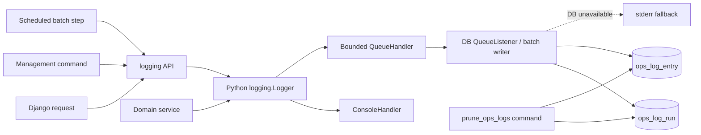

# Lightweight Database Logging Design

## 1 Status And Ownership

本设计面向 `manniu/manniu_backend`，规划新增独立 Django app `ops_logging`，统一保存 Web 请求、management command、定时批任务和后台计算中的结构化运营日志。日志唯一持久化存储为项目现有 PostgreSQL；控制台输出只用于实时观察和数据库不可用时的降级，不作为历史记录来源。

本文仅定义方案，不新增模型、迁移、接口或运行配置。实施前必须确认文末列出的数据库字段与未来 API 请求/响应字段。

## 2 Goals And Non-Goals

目标：

- 基于 Python 标准 `logging`，业务模块无需依赖复杂日志框架。
- 统一关联一次请求、命令或批任务及其步骤，便于定位首个失败点。
- 使用异步队列和批量写入，避免每条日志同步执行一次 SQL。
- 数据库异常时不阻塞、不递归记录、不改变业务原有退出语义。
- 支持按时间、级别、模块、事件码、运行批次和关联 ID 检索。
- 提供脱敏、容量上限、保留和清理规则。

非目标：

- 不替代审计日志；权限、资金、配置等敏感变更应使用独立不可变审计模型。
- 不保存全量 SQL、请求体、响应体、模型特征矩阵或第三方原始报文。
- 不在首期引入 Elasticsearch、Kafka、Redis、Celery或日志代理。
- 不提供自动交易、告警处置或日志驱动的业务操作。
- 不承诺日志与业务事务原子提交；运营日志失败不能导致业务事务回滚。

## 3 Architecture



`ops_logging` 只拥有日志采集、运行上下文、PostgreSQL 持久化、检索服务和清理命令。各业务 app 继续通过 `logging.getLogger(__name__)` 记录日志；需要稳定检索的关键节点额外提供 `event_code` 和结构化 `context`。

首期不记录所有 HTTP 访问。可选 middleware 仅记录服务端异常和超过阈值的慢请求，避免健康检查、静态资源和正常高频请求淹没有效事件。

## 4 Event Model

日志分为两层：

1. `LogRun` 表示一次有开始和结束的工作，例如 HTTP 请求、`sync_market_data` 命令、`daily.bat` 总批次或其中一个数据集同步步骤。
2. `LogEntry` 表示运行内或独立发生的具体事件，例如开始、完成、覆盖率不足、第三方超时或未处理异常。

推荐事件码采用稳定的点分命名，不把动态值拼入事件码：

```text
market_data.sync.started
market_data.sync.completed
market_data.sync.failed
http.request.slow
system.unhandled_exception
```

动态内容放在 `context`，例如 `dataset=stock-bars`、`trade_date=2026-09-08`、`row_count=5231`。面向人的 `message` 可以调整，监控和查询应依赖 `event_code`。

## 5 PostgreSQL Persistence Design

### 5.1 LogRun

建议数据库表名为 `ops_log_run`。

| 字段 | 建议类型 | 约束与用途 |
| --- | --- | --- |
| `id` | UUID | 主键，由应用生成，可跨进程传递。 |
| `parent_run_id` | UUID nullable | 自关联；例如日批为父运行，单个同步命令为子运行。 |
| `run_type` | varchar(24) | `HTTP`、`COMMAND`、`BATCH`、`TASK`。 |
| `name` | varchar(96) | 稳定名称，如 `sync_market_data` 或路由名。 |
| `status` | varchar(16) | `RUNNING`、`SUCCEEDED`、`FAILED`、`CANCELLED`、`ABANDONED`。 |
| `trigger` | varchar(24) | `SCHEDULE`、`MANUAL`、`HTTP`、`SYSTEM`。 |
| `correlation_id` | varchar(64) nullable | 贯穿上游到下游的关联 ID。 |
| `started_at` | timestamptz | 使用 UTC，必填。 |
| `finished_at` | timestamptz nullable | 运行结束时间。 |
| `heartbeat_at` | timestamptz nullable | 长任务活跃时间，用于识别僵死运行。 |
| `duration_ms` | bigint nullable | 完成时计算，避免查询时重复计算。 |
| `host_name` | varchar(128) | 执行节点。 |
| `process_id` | integer nullable | 排障辅助，不作为身份。 |
| `exit_code` | integer nullable | 命令或批任务退出码。 |
| `summary` | text | 简短结果或首个失败摘要。 |
| `counters` | jsonb | `processed/succeeded/failed/skipped` 等计数。 |
| `parameters` | jsonb | 已脱敏的运行参数。 |
| `metadata` | jsonb | 低频扩展信息和版本信息。 |

建议索引：`(name, started_at DESC)`、`(status, started_at DESC)`、`(parent_run_id, started_at)`、`correlation_id`。`id` 已提供唯一性，不再增加高基数字段的冗余索引。

### 5.2 LogEntry

建议数据库表名为 `ops_log_entry`。

| 字段 | 建议类型 | 约束与用途 |
| --- | --- | --- |
| `id` | bigint identity | 单调主键。 |
| `event_id` | UUID | 应用生成并唯一，防止队列重试重复写入。 |
| `run_id` | UUID nullable | 关联 `LogRun`；独立系统事件允许为空。 |
| `occurred_at` | timestamptz | 事件实际发生时间，UTC。 |
| `ingested_at` | timestamptz | 数据库写入时间。 |
| `level_no` | smallint | Python 标准级别数值。 |
| `level_name` | varchar(10) | `DEBUG`、`INFO`、`WARNING`、`ERROR`、`CRITICAL`。 |
| `logger_name` | varchar(160) | 通常为 Python 模块路径。 |
| `event_code` | varchar(96) nullable | 稳定机器可读事件码。 |
| `message` | text | 格式化后的简洁消息，设置长度上限。 |
| `context` | jsonb | 经过白名单与脱敏的结构化上下文。 |
| `exception_type` | varchar(160) nullable | 异常类型。 |
| `exception_message` | text nullable | 脱敏并截断后的异常消息。 |
| `exception_stack` | text nullable | ERROR 以上按策略保存并限制长度。 |
| `fingerprint` | char(64) nullable | 由事件码、异常类型和规范化栈顶生成的 SHA-256。 |
| `source_module` | varchar(160) nullable | Python 模块。 |
| `source_function` | varchar(160) nullable | 函数名。 |
| `source_line` | integer nullable | 源码行号。 |
| `correlation_id` | varchar(64) nullable | 无运行记录时也可跨服务关联。 |
| `request_id` | varchar(64) nullable | HTTP 请求关联。 |
| `host_name` | varchar(128) | 执行节点。 |
| `process_id` | integer nullable | 进程号。 |

建议索引：`(occurred_at DESC)`、`(run_id, occurred_at)`、`(level_no, occurred_at DESC)`、`(event_code, occurred_at DESC)`、`(fingerprint, occurred_at DESC)`。首期不为 JSONB 建 GIN 索引；只有在真实查询证明需要时再增加。

外键建议 `LogEntry.run_id -> LogRun.id ON DELETE CASCADE`，使到期运行及其明细可按批删除。独立事件按 `occurred_at` 清理。模型中的自定义索引名必须控制在 30 个字符以内。

首期使用普通表，不做 PostgreSQL 分区。只有当明细稳定超过约 100 万条/月或清理明显影响线上写入时，才评估按月范围分区。

## 6 Write Path And Failure Isolation

标准 logger 同时绑定控制台 handler 和数据库队列 handler：

- 控制台默认 `INFO+`，开发环境可设为 `DEBUG`。
- 数据库默认 `INFO+`；高频循环中的成功明细使用 `DEBUG`，不进入数据库。
- 数据库 handler 只把已标准化的轻量字典放入有界队列，不在调用线程执行 ORM 写入。
- 单进程 `QueueListener` 按“最多 100 条或最多等待 1 秒”批量 `bulk_create(ignore_conflicts=True)`。
- 队列满时优先丢弃 `DEBUG/INFO`；`WARNING+` 尝试短暂等待后写 `stderr`。不能无限阻塞业务线程。
- management command 正常结束时显式 `flush(timeout)`；异常退出和进程信号处理中做有时间上限的 best-effort flush。
- writer 使用专用内部错误回退到 `stderr`，禁止通过自身 logger 再次进入数据库 handler，以避免递归。
- 数据库断开、迁移未执行或表不存在时，记录一次限频降级提示，随后进入短暂熔断；业务请求和命令保持原有行为。

多进程 Web 部署时，每个 worker 拥有自己的小队列和 writer，不共享进程内队列。数据库唯一 `event_id` 负责重试去重。首期不追求进程崩溃前尚未 flush 的 INFO 日志绝对不丢；关键业务结果应由领域表或审计表保证，而不是依赖运营日志。

## 7 Python Usage Contract

普通代码保持标准用法：

```python
logger = logging.getLogger(__name__)
logger.info(
    "Stock bar synchronization completed",
    extra={
        "event_code": "market_data.sync.completed",
        "context": {"dataset": "stock-bars", "row_count": 5231},
    },
)
```

`ops_logging` 提供轻量上下文管理器，负责创建运行、绑定上下文并在退出时更新状态：

```python
with log_run(
    run_type="COMMAND",
    name="sync_market_data",
    parameters={"dataset": dataset, "mode": mode},
) as run:
    run.set_counters(processed=processed, succeeded=succeeded, failed=failed)
```

上下文通过 `contextvars` 传播 `run_id/correlation_id/request_id`，logging filter 将其补入 `LogRecord`。业务模块不直接创建 `LogEntry` ORM 对象，也不直接控制 writer。

## 8 Batch And Command Integration

现有 `schedule/daily.bat` 依次运行多个 `sync_market_data` 命令，并以非零退出码中止。建议后续提供一个轻量包装命令或环境参数：父批次先创建 `BATCH` 类型 `LogRun`，把 `run_id` 通过 `MANNIU_PARENT_RUN_ID` 传给各子命令；每个 management command 创建自己的 `COMMAND` 子运行。

批任务状态规则：

- 所有步骤返回 0：父运行 `SUCCEEDED`。
- 任一步骤非 0：对应子运行和父运行均为 `FAILED`，保存首个失败步骤和退出码。
- 进程无正常收尾且 `heartbeat_at` 超过阈值：维护命令将 `RUNNING` 标为 `ABANDONED`。
- 日志写入失败不得把原本成功的同步改成失败；日志 flush 超时只输出降级警告。

批处理脚本仍保留当前控制台输出，便于任务计划程序查看即时结果。数据库记录用于跨批次检索、统计和问题归因。

## 9 Configuration

建议通过环境变量提供小范围配置，并在 Django settings 中解析：

| 变量 | 默认值 | 说明 |
| --- | --- | --- |
| `OPS_DB_LOG_ENABLED` | `true` | 数据库日志总开关。 |
| `OPS_DB_LOG_LEVEL` | `INFO` | 最低持久化级别。 |
| `OPS_DB_LOG_QUEUE_SIZE` | `2000` | 单进程有界队列容量。 |
| `OPS_DB_LOG_BATCH_SIZE` | `100` | 单批最大条数。 |
| `OPS_DB_LOG_FLUSH_SECONDS` | `1.0` | 最大批量等待时间。 |
| `OPS_DB_LOG_MESSAGE_MAX` | `4000` | 消息截断长度。 |
| `OPS_DB_LOG_STACK_MAX` | `16000` | 异常栈截断长度。 |
| `OPS_DB_LOG_RETENTION_DAYS` | `30` | INFO/WARNING 明细默认保留天数。 |
| `OPS_DB_ERROR_RETENTION_DAYS` | `90` | ERROR/CRITICAL 明细默认保留天数。 |
| `OPS_LOG_SLOW_REQUEST_MS` | `2000` | 慢请求阈值。 |

配置解析失败应在启动时明确报错；不允许静默采用危险的无限队列、无限文本或无限保留期。

## 10 Data Safety And Redaction

禁止写入：数据库密码、Tushare token、Cookie、Authorization、session、CSRF token、私钥、完整请求体、完整响应体、个人身份信息以及未经筛选的环境变量。

统一 sanitizer 在入队前执行：

- 对键名匹配 `password/token/secret/authorization/cookie/session/key` 的值替换为 `[REDACTED]`。
- `parameters` 和 `context` 仅接受 JSON 基础类型；未知对象转为受长度限制的安全字符串。
- 请求日志只保存 method、路由名、状态码、耗时和 request ID；查询参数默认不保存。
- 异常消息和栈执行二次脱敏并截断。
- SQL 参数、Django connection 对象和完整模型实例不得进入 context。

## 11 Retention And Maintenance

提供 `prune_ops_logs` management command，每日低峰运行：

```text
python manage.py prune_ops_logs [--dry-run] [--before YYYY-MM-DD] [--batch-size 5000]
```

默认规则：INFO/WARNING 明细保留 30 天，ERROR/CRITICAL 保留 90 天；无明细且已结束的运行保留 90 天。清理按小批次提交，避免长事务和大范围锁。每次清理创建自身 `LogRun`，但不得为每个删除批次写大量 INFO 明细。

容量观察至少包含：每日新增条数、每日存储字节估算、各级别数量、队列丢弃数、数据库写入失败数和最老记录时间。达到容量阈值时先调整噪声 logger 级别或事件采样，再考虑分区和外部日志平台。

## 12 Query And API Boundary

首期仅实现 Django admin 或 management command 的受控查询，不暴露公网接口。推荐查询条件为：时间范围、级别、app/logger、事件码、运行名称、运行状态、`run_id`、`correlation_id` 和 `fingerprint`；默认最近 24 小时，强制分页并限制最大时间跨度。

未来如需 API，建议只提供只读端点：

```text
GET /api/ops/log-runs
GET /api/ops/log-runs/{run_id}
GET /api/ops/log-entries
```

接口必须经过独立管理员权限校验，响应再次脱敏，不提供任意 JSONPath/正则查询，不提供通过 API 删除日志。具体请求字段、响应字段、分页上限和权限模型须由用户确认后才能实现。

## 13 Observability Of The Logger

日志系统自身不得只依赖数据库日志证明其健康。每个进程维护以下内存计数，并定期以单行方式输出到控制台：

- `enqueued_total`
- `persisted_total`
- `dropped_low_level_total`
- `fallback_stderr_total`
- `batch_write_failures_total`
- `queue_depth`

可选 `check_ops_logging` 命令执行无敏感内容的探针写入、读取和删除，用于部署验证。该命令失败返回非零，但正常应用流量不会因 logger 不可用而失败。

## 14 Validation Definition

### 14.1 Core Flow

- 标准 logger 的 INFO 事件最终进入 PostgreSQL，字段、UTC 时间和结构化 context 正确。
- 同一运行内的事件共享 `run_id`，父日批与子命令通过 `parent_run_id` 关联。
- 同一 `event_id` 重试不会生成重复记录。
- management command 成功、失败和未正常收尾分别得到正确状态与退出码。
- 批量 writer 在阈值或等待时间到达时提交，命令退出前执行限时 flush。

### 14.2 Failure And Load Scenarios

- PostgreSQL 不可用、表未迁移和连接中断时，业务请求/命令不被日志写入阻塞，错误限频输出到 `stderr`。
- 队列满时低级别日志按策略丢弃，WARNING 以上降级输出，丢弃计数可见。
- writer 内部异常不会递归进入自身 handler。
- 高频循环不会逐行执行 SQL；数据库写入次数符合批量策略。
- 进程突然终止最多丢失队列中尚未提交的运营日志，不损坏领域数据。
- 超长消息、异常栈和 context 被截断或拒绝，不产生无限行宽。

### 14.3 Security And Retention Scenarios

- token、密码、Authorization、Cookie 和嵌套敏感键均被脱敏。
- 非 JSON 对象不能绕过 sanitizer 或导致 writer 崩溃。
- 普通用户无法访问未来运营日志接口。
- `prune_ops_logs --dry-run` 只报告数量；正式清理遵守级别保留期并分批提交。

## 15 Implementation Sequence

1. 与用户确认 `LogRun`、`LogEntry` 的 PostgreSQL 表字段、保留期、日志级别和是否需要未来 API。
2. 新建并注册 `ops_logging` app，增加模型、短索引名和迁移；先在 UAT PostgreSQL 验证迁移计划。
3. 实现 sanitizer、LogRecord filter、有界队列 handler、批量 writer 和 `stderr` 熔断降级。
4. 实现 `log_run` 上下文及 management command 集成，先接入一个低风险同步命令验证。
5. 接入 `daily.bat` 父子运行关联，并验证成功、单步失败和强制终止场景。
6. 实现清理命令、admin 只读视图和容量统计；根据真实数据调整阈值。
7. 如确认需要 API，再单独确认权限及请求/响应契约后实施。

## 16 Decisions Required Before Coding

- 表名和上述字段类型、长度、外键删除行为是否接受。
- INFO/WARNING 30 天、ERROR/CRITICAL 90 天的保留期是否满足管理要求。
- 是否将 HTTP 慢请求/异常纳入首期，还是首期只覆盖命令和批任务。
- `daily.bat` 是否需要一个父 `LogRun`，以及任务计划程序能否传递父运行 ID。
- 是否需要 Django admin 只读页面；首期不建议开放 API。
- ERROR 异常栈是否允许入库，以及脱敏后的最大长度。
