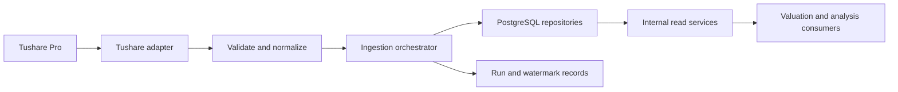

# Market Data Backend Design

## 1 Status And Ownership

This document is the implementation design for the registered `manniu_backend.market_data` Django application. The first schema layer is implemented and migrated to PostgreSQL: its Django models cover securities, geography/industry dimensions, company profiles, daily trading history/latest snapshots, stock fundamental history/latest snapshots, stock cost history/latest snapshots, index fundamental history/latest snapshots, and ingestion run/watermark control. An initial `sync_market_data` CLI is implemented for master/company/daily datasets; paging/retry/resume, complete adjustment processing, PostgreSQL partition DDL, weekly/monthly derivation, and production ingestion runs remain pending.

`market_data` owns end-of-day market-data ingestion, PostgreSQL persistence, reconciliation, and read-optimized query services for stocks and indices. The `indices` application consumes index data for index-domain analysis and does not own index synchronization or tables.

The module supports analysis and decision support only. It must never place or automate trading orders.

## 2 Scope

| Dataset | Asset scope | Tushare source | Frequency |
| --- | --- | --- | --- |
| Security master | Stocks and indices | `stock_basic`, `index_basic` | On demand and daily delta |
| Company profile | Stocks | `stock_company` | On demand and daily delta |
| Trading bars and adjusted prices | Stocks | `stk_factor` | Daily, derived weekly/monthly |
| Daily fundamentals | Stocks | `daily_basic` | Daily, derived weekly/monthly |
| Cost distribution | Stocks | `cyq_perf` | Daily, derived weekly/monthly |
| Trading bars | Indices | `index_daily` | Daily, derived weekly/monthly |
| Daily fundamentals | Indices | `index_dailybasic` | Daily |

The design deliberately excludes intraday data, request-time calls to Tushare, automated trading, and public transport-layer concerns. Downstream valuation modules consume the internal read services defined here.

## 3 Architecture



### 3.1 Layer Responsibilities

- **Tushare adapter**: owns SDK access, explicit field selection, paging, timeouts, rate-limit backoff, and conversion of provider exceptions into typed ingestion failures. Credentials remain server-side and are never returned through APIs or CLI logs.
- **Validation and normalization**: validates required columns before any write; converts dates, decimals, units, nulls, and codes; deduplicates natural keys; rejects invalid rows with a reason.
- **Ingestion orchestrator**: chooses `backfill` or `daily` coverage, divides work into bounded chunks, coordinates transactions, writes run state, and advances a watermark only after a complete successful chunk.
- **Repositories**: use PostgreSQL bulk upserts and read query methods. They are the only component allowed to write market-data tables.
- **Read query services**: provide bounded, index-backed EOD reads to internal valuation and analysis consumers. They never invoke Tushare as a cache miss fallback.
- **CLI boundary**: synchronization and calculation commands are operator-only maintenance tools. Internal consumers call bounded query services and never write market-data state through a read path.

### 3.2 Environment Configuration

`manniu_backend/.env` is the local runtime configuration file and is excluded from version control. It uses `DB_ENGINE`, `DB_NAME`, `DB_USER`, `DB_PASSWORD`, `DB_HOST`, `DB_PORT`, and `TUSHARE_TOKEN`, aligned with the UAT earnings-service environment contract. `DB_ENGINE` must be `django.db.backends.postgresql`; missing database variables or any other engine stops Django during settings loading. The Tushare token is available only to future server-side adapters and must never be returned in an API response, written to a report, or emitted in CLI logs.

## 4 PostgreSQL Data Model

All identifiers, timestamps, and lifecycle fields use Django conventions when implemented. All monetary and price fields use `NUMERIC`, not binary floating point. Provider text values are trimmed, but source values are retained where they are business-significant.

### 4.1 Security Master

`Security`

| Field | Type and constraint | Notes |
| --- | --- | --- |
| `id` | Primary key | Internal stable identifier |
| `ts_code` | `VARCHAR(16)`, unique | Canonical Tushare code for both stocks and indices |
| `asset_type` | constrained text | `STOCK` or `INDEX` |
| `symbol`, `name`, `full_name` | nullable text | Provider master fields |
| `market`, `exchange`, `list_status` | nullable indexed text | Provider classification and lifecycle state |
| `list_date`, `delist_date` | nullable date | Source dates |
| `is_hs` | nullable text | Stock Connect marker for stocks |
| `source_updated_at`, `synced_at` | timestamp with time zone | Provider/source audit and local audit |

Unique key: `ts_code`. Check constraint: `asset_type IN ('STOCK', 'INDEX')`.

## 5 Market And Security Regime Data

`market_data` owns the canonical end-of-day regime inputs and read services
used by both `traditional_valuation` and `predictive_valuation`. The valuation
modules must not copy these classifiers or infer a regime independently. They
call the read service with an explicit as-of date and persist the returned
regime metadata in their own snapshots.

The regime layer is an analysis read model, not a trading signal or order
instruction. It uses only completed rows already persisted by `market_data`.
No request-time Tushare fallback is allowed. If upstream ingestion is stale or
incomplete, the service returns a deterministic degraded result with source and
coverage metadata.

### 5.1 Market Regime (`BULL`, `BEAR`, `BALANCE`)

The market regime follows the `earnings_forecast` pipeline rule currently used
by prediction serving. The default benchmark is `000001.SH`; the benchmark is
resolved through `Security` with `asset_type='INDEX'`, and its close history is
read from `MarketBarDailyHistory`.

For an `asof_date`, select rows with `trade_date <= asof_date`, sorted by date.
The minimum usable history is 80 completed rows. Calculate:

$$
MA20 = mean(Close_{t-19}, \ldots, Close_t),\qquad
MA60 = mean(Close_{t-59}, \ldots, Close_t)
$$

$$
ma\_ratio = Close_t / MA60
$$

`volatility20` is the standard deviation of the last 20 daily percentage
changes, and `drawdown60` is `Close_t / max(Close_{t-59..t}) - 1`.

Default classification thresholds are:

| Condition | Regime |
| --- | --- |
| `MA20 > MA60`, `ma_ratio >= 1.03`, and `drawdown60 > -0.12` | `BULL` |
| `MA20 < MA60` and (`ma_ratio <= 0.97` or `drawdown60 <= -0.12`) | `BEAR` |
| All other valid observations | `BALANCE` |

When a provisional `BULL` result has `volatility20 >= 0.028`, downgrade it to
`BALANCE` to avoid aggressive valuation or prediction expansion during a high
volatility advance. Thresholds and benchmark code are versioned configuration,
not values duplicated in downstream apps.

The returned `MarketRegimeResult` must contain:

```text
regime: BULL | BEAR | BALANCE
source: rule_v1:local_mirror | insufficient_history | stale_or_incomplete
benchmark_ts_code
asof_trade_date
ma20, ma60, ma_ratio, drawdown60, volatility20
row_count, classifier_version
```

An empty or invalid result is never persisted as a new state and never replaces
the last valid state. The first valid state establishes a baseline. A
`MARKET_STYLE_CHANGED` event is created only when the current and previous
states are both valid and different.

### 5.2 Security Regime (`GROWTH`, `BALANCE`, `DEFENSIVE`, `RISK_OFF`)

The individual-security classifier follows the approved `stock_regime.py`
implementation. It reads at least 60 positive completed close values from
`MarketBarDailyHistory` for one stock and an explicit as-of date. It calculates:

```text
ma20 = mean(last 20 closes)
ma60 = mean(last 60 closes)
volatility_20d = std(last 20 daily percentage changes)
peak60 = max(last 60 closes)
drawdown_60d = close / peak60 - 1
ma_ratio = close / ma60
```

The classification order is significant:

1. `RISK_OFF` when `ma20 < ma60` and (`ma_ratio <= 0.94` or
   `drawdown_60d <= -0.18`).
2. `DEFENSIVE` when `ma20 < ma60`, or `ma_ratio < 0.98`, or
   `drawdown_60d <= -0.10`, or `volatility_20d >= 0.035`.
3. `GROWTH` when `ma20 > ma60`, `ma_ratio >= 1.02`, `drawdown_60d > -0.08`,
   and `volatility_20d < 0.03`.
4. Otherwise `BALANCE`.

The returned `SecurityRegimeResult` contains the four-state regime, all five
metrics, source trade date, row count, and classifier version. With fewer than
60 valid closes, it returns `INSUFFICIENT_DATA` without creating a regime
change event.

State confirmation uses the shared transition contract:

```text
next_regime_state(current, pending, pending_days, detected, confirm_days)
```

The default `confirm_days` is 2. A first valid observation initializes the
baseline and does not trigger. If the detected state equals the confirmed
state, pending state and count reset. If it differs, the pending state must be
observed on consecutive runs until the confirmation count is reached. Only
then is `SECURITY_STYLE_CHANGED` emitted. A confirmed change refreshes only the
affected security's downstream `LATEST,FUSION` or equivalent current outputs;
it never fans out to the whole market.

### 5.3 PostgreSQL Regime Read Models

The following models belong to `market_data` because it owns both the source
bars and the canonical classification state:

| Model | Natural key | Purpose |
| --- | --- | --- |
| `MarketRegimeSnapshot` | `(benchmark_security, asof_trade_date, classifier_version)` | Immutable market classification result and metrics |
| `SecurityRegimeSnapshot` | `(security, asof_trade_date, classifier_version)` | Immutable per-stock classification result and metrics |
| `MarketRegimeState` | `(scope_key='MARKET/ALL_A')` | Last valid confirmed market state and previous state used for change detection |
| `SecurityRegimeState` | `(security, classifier_version)` | Confirmed state, pending state, pending count, last valid date, and last event version |

Each snapshot stores `source_trade_date`, `asof_trade_date`, `source`,
`classifier_version`, `row_count`, metrics JSON, and a quality/status field.
State rows must retain `current_regime`, `previous_regime`, `pending_regime`,
`pending_days`, and `last_event_at`. Invalid, empty, or insufficient results do
not overwrite valid state rows. These models are separate from predictive
signal tables such as `earnings_stock_regime_state`; the predictive domain may
consume the market-data service but must not maintain a second classifier.

### 5.4 Downstream Read-Service Contract

The only supported downstream boundary is a read-only, database-backed service
owned by `market_data`:

```python
get_market_regime(
  *, asof_date: date | None = None,
  benchmark_ts_code: str = '000001.SH',
) -> MarketRegimeResult

get_security_regime(
  *, security: Security | int | str,
  asof_date: date | None = None,
) -> SecurityRegimeResult

get_regime_state(*, scope: str, security: Security | int | str | None = None)
  -> RegimeStateResult
```

The service resolves the latest completed source date on or before the request
date, never uses future rows, and returns a typed degraded result rather than
raising for ordinary data insufficiency. It must not write snapshots or state
as a side effect of a downstream valuation read. A scheduled detector invokes
the write-side transition service after ingestion completes:

```python
detect_regime_events(*, asof_date: date, scope: str = 'all') -> RegimeEventSummary
```

This detector persists immutable snapshots, updates confirmed state only for
valid results, and creates idempotent `MARKET_STYLE_CHANGED` or
`SECURITY_STYLE_CHANGED` events with the source version and metrics payload.

`traditional_valuation` consumes `get_market_regime` for market-style
parameters and `get_security_regime` for security-style variants. It records
`market_regime`, `security_regime`, source dates, classifier versions, and
metrics in `TraditionalValuationSnapshot.provenance`. `predictive_valuation`
uses the same methods to populate `market_regime`/`security_regime` in
prediction inputs and to create its event refresh scope. Neither consumer may
call Tushare, read another service's private state, or reimplement the
thresholds.

## 6 Unified Industry-Regime And SW Mapping Service

`market_data` also owns the canonical SW taxonomy snapshot, code
normalization, and industry-regime resolution used by both valuation modules.
This is distinct from market and security price regimes: an industry regime
describes the structural industry profile, while `BULL`/`BEAR`/`BALANCE` and
`GROWTH`/`DEFENSIVE` describe completed EOD price behavior. Downstream modules
must not keep their own SW prefix tables or classify an industry from a display
name alone.

The service resolves only the common classification contract:

```text
high_growth | balanced | stable_value | cyclical_resource
```

Traditional valuation owns the regime-specific method weights, tier gaps,
range multipliers, and position guidance. Predictive valuation owns its model
range mapping and predictive tier multipliers. Neither module may change a
resolved industry regime or mapping version.

### 6.1 Versioned SW Mapping Artifact

The active SW2021 mapping is an immutable, validated artifact published under
`market_data/static/industry_config/`. Its canonical source is the existing
SW hierarchy/membership data generated from `index_classify` and
`index_member_all`. Downstream modules consume it only through the versioned
read service or immutable artifact reference; no module-local copy may act as a
second active mapping source.

```text
market_data/static/industry_config/
  sw_industry_mapping_CN.json
  industry_regime_rules_CN.json
```

`sw_industry_mapping_CN.json` retains `version`, `source_hash`, `updated_at`,
SW L1/L2/L3 `index_code`, `industry_code`, name, parent/grandparent links, and
stock-to-level membership. `industry_regime_rules_CN.json` contains its own
`mapping_version`, `rules_version`, exact code/index assignments, approved
name-keyword fallback rules, and the mandatory default
`fallback_regime=balanced`. Both artifacts are validated as a pair before an
atomic publish; an invalid candidate leaves the previous active pair intact.

Every resolution returns the artifact identities. A mapping refresh that only
changes membership is still a new `mapping_version`; a rule-only change is a
new `rules_version` with the mapping version retained. Historical valuation and
prediction replay load the recorded versions, never the currently active files.

### 6.2 Industry-Regime Resolution And Read Contract

The read-only service normalizes an `industry_code` or `index_code` by removing
suffixes such as `.SI`, retaining the numeric root, and resolving canonical SW
L3/L2/L1 identity. It then applies this deterministic order:

1. exact code/index assignment in the active versioned rules;
2. parent-level assignment from L3 through L2 to L1;
3. approved industry-name keyword assignment;
4. `balanced` fallback with an explicit reason.

The downstream boundary is database/artifact-backed and has no Tushare or
write-side behavior:

```python
resolve_industry_regime(
  *,
  security: Security | int | str | None = None,
  industry_code: str | None = None,
  index_code: str | None = None,
  industry_name: str | None = None,
  mapping_version: str | None = None,
  rules_version: str | None = None,
) -> IndustryRegimeResult
```

An `IndustryRegimeResult` contains:

```text
selected_regime: high_growth | balanced | stable_value | cyclical_resource
regime_confidence: 0..1
regime_source: exact | parent | keyword | fallback
industry_code, index_code, sw_level, sw_name
mapping_version, rules_version, source_hash
regime_reasons, fallback_reason, status
```

`security` resolution uses the mapping membership recorded for the requested
version. When explicit identifiers and a security disagree, explicit inputs
are rejected as a typed conflict rather than silently overriding the security
mapping. Unknown or historical `85xxxx` codes may resolve through compatible
aliases or parent links; otherwise the result is a valid explainable
`balanced` fallback, never `none`. Configuration absence/corruption returns a
typed `CONFIGURATION_UNAVAILABLE` degraded result and does not fabricate a
mapping version.

### 6.3 Persistence, Publication, And Consumers

`SWIndustryMappingVersion` records the immutable artifact identity, market,
taxonomy version, content hash, source trade date, source metadata, validation
summary, publication time, and activation status. `IndustryRegimeRuleVersion`
records the linked mapping version, rules hash/version, fallback policy, and
activation status. Version rows are append-only; exactly one validated active
pair exists per `(market, taxonomy='SW2021')`.

The mapping generator validates L1/L2/L3 parent links, unique canonical codes,
membership references to stock `Security` records, code aliases, JSON schema,
and complete resolution coverage. For every supplied SW code, the service must
return either an exact/parent/keyword result or an explicit fallback reason.
The coverage report includes `mapped_count`, `fallback_count`, `invalid_count`,
and `mapped_ratio`; valid coded input requires `mapped_ratio=100%` when
fallback is counted as an explainable mapped result.

`traditional_valuation` and `predictive_valuation` call
`resolve_industry_regime` during their persisted calculation paths and retain
the complete result in snapshot provenance and tier templates. They do not call
it from dashboard reads, mutate the active version, or reproduce the rule
order. A mapping/rules activation emits a versioned `INDUSTRY_MAPPING_CHANGED`
event. The event consumer determines the bounded affected-security refresh
scope; it does not overwrite historical valuation/prediction snapshots.

### 6.4 Implementation And Acceptance Gates

1. Confirm the existing SW mapping generator's artifact schema, canonical
   `Security` membership source, and all supported `801xxx`/historical
   `85xxxx` aliases.
2. Implement immutable version records, validated atomic artifact publication,
   and the read-only resolver before either valuation module consumes it.
3. Validate at least ten samples each for high-growth, cyclical-resource,
   stable-value, balanced, parent-fallback, and historical-code paths.
4. Verify the same industry identifier resolves to the same
   `selected_regime`, mapping version, and rules version from traditional and
   predictive persisted calculation paths.
5. Verify missing/corrupt configuration and conflicting inputs return typed,
   explainable failures without a Tushare call, data write, or silent fallback
   to a different industry.

### 6.5 Event And Refresh Contract

After successful market-data ingestion, the detector runs in this order:

1. Calculate the market result for the latest completed benchmark date.
2. Compare it with `MarketRegimeState.current_regime`.
3. On the first valid result, persist baseline only.
4. On a valid state change, create one idempotent `MARKET_STYLE_CHANGED` event
   for the affected market scope.
5. Calculate security results for eligible stocks in bounded chunks.
6. Apply the two-observation confirmation state machine.
7. Create one idempotent `SECURITY_STYLE_CHANGED` event per confirmed stock.

The market event fan-out is consumed by downstream modules in bounded batches.
The required prediction refresh command for a confirmed market switch remains:

```text
refresh_signal_snapshot --scope 60,00,30,68 --full-refresh --report-types LATEST,FUSION
```

Traditional valuation uses the same event reason, `MARKET_REGIME_SWITCH`, for
market-style valuation refresh and `STOCK_REGIME_SWITCH` for a confirmed
security-style refresh. Event payloads must include old/new regime, source
trade date, classifier version, metrics, and detection time. Invalid or empty
classification results do not advance state and do not trigger a refresh.

### 6.6 Company, Geography, And Industry

`CompanyProfile` has one optional row per stock `Security`; index securities do not receive a company profile. It stores company fields from `stock_company`, including chairman, manager, secretary, registered capital, establishment date, website, contact data, employees, main business, business scope, and source update timestamps.

The geographic and industry design separates raw provider input from canonical dimensions:

| Entity | Key fields | Rules |
| --- | --- | --- |
| `Province` | `name` unique, `source_name` | Stores normalized provider province/area names. |
| `City` | unique `(province_id, name)` | City names are not globally unique. |
| `Industry` | `name` unique, `source_system`, `source_version` | `stock_basic.industry` is a Tushare industry taxonomy, not interchangeable with future SW taxonomies. |
| `Region` | `code` unique, `name` | The seven codes are `NORTH`, `NORTHEAST`, `EAST`, `CENTRAL`, `SOUTH`, `SOUTHWEST`, and `NORTHWEST`. |
| `ProvinceRegionMapping` | unique `(province_id, mapping_version, effective_from)` | Links a province to a region, with effective dates and mapping version. |

`Security` stores nullable references to its Tushare `area` province and industry. `CompanyProfile` stores nullable registered `province` and `city` references. The raw `province_name`, `city_name`, and `industry_name` received from Tushare are retained for traceability.

`stock_company.province` maps to registered province and `stock_company.city` maps to registered city. `stock_basic.area` maps to security area, while `stock_basic.industry` maps to security industry. The two province sources can differ and must not silently overwrite each other. A missing source value remains null with an ingestion-quality record; it must never be invented as Shanghai. Region is derived through the active versioned province mapping, not written as an untraceable text value.

### 6.7 CITIC Stock/Industry Mapping And Persistence

The existing `Industry` model is reserved for the provider's broad
`stock_basic.industry` taxonomy and must not be reused for CITIC classifications.
The `ci_index_member` result is a separate, versioned classification source and
must be persisted in PostgreSQL before it is used as a business-matching prior.
The JSON cache used by SmartInvestor's `syncvaluationremotecache` is a legacy
compatibility artifact, not the Maniu source of truth.

#### 6.7.1 Source Contract

The market-data adapter calls Tushare `ci_index_member` with `is_new="Y"` and
the explicit fields:

```text
ts_code, l1_code, l1_name, l2_code, l2_name, l3_code, l3_name,
is_new, in_date, out_date
```

Each row maps one canonical stock `Security` to its active or historical CITIC
L1/L2/L3 classification. Codes are normalized without changing their source
meaning; names are trimmed but retained verbatim for audit. `is_new=Y` is an
active-source marker, not permission to delete historical memberships. A
provider omission or temporary empty response must not deactivate all existing
rows.

#### 6.7.2 Proposed PostgreSQL Models

`CITICIndustryDimension` stores the hierarchy independently from SW and broad
Tushare industry dimensions:

| Field | Contract |
| --- | --- |
| `market` | Initially `CN`, indexed |
| `level` | `L1`, `L2`, or `L3` |
| `code` | Canonical CITIC code, unique within market/level/version |
| `name` | Provider industry name |
| `parent_code` | Nullable parent CITIC code for L2/L3 |
| `mapping_version` | Immutable source/version identity |
| `source_trade_date` | Effective synchronization date |
| `source_hash` | Content/version audit hash |
| `is_active` | Publication status |

`CITICSecurityIndustryMembership` stores the stock-to-industry relationship:

| Field | Contract |
| --- | --- |
| `security_id` | Foreign key to stock `Security`; indexes are rejected |
| `industry_id` | Foreign key to `CITICIndustryDimension` |
| `level` | Denormalized level for bounded reads, must equal dimension level |
| `is_current` | Current active membership projection |
| `in_date/out_date` | Provider effective interval, nullable as supplied |
| `source_trade_date` | Synchronization effective date |
| `mapping_version` | Links the source publication |
| `source_updated_at/synced_at` | Provider/local audit timestamps |

The historical natural key is `(security_id, industry_id, mapping_version,
in_date)`. The current projection must enforce at most one current membership
per `(security_id, level, mapping_version)` unless the provider explicitly
returns multiple valid memberships. A mapping refresh creates a new immutable
version; it does not rewrite old valuation provenance. Referential integrity
requires every membership's `Security.asset_type='STOCK'` and every industry
dimension's parent to exist in the same compatible version.

`CITICIndustryMappingRun` records source trade date, requested scope, row
counts, active/inactive counts, rejected rows, source hash, mapping version,
status, and sanitized failure details. It is separate from the generic
`IngestionRun` when the mapping publication needs an atomic active-version
pointer, but both records must be cross-referenced.

#### 6.7.3 Atomic Sync And Read Contract

The sync flow is:

1. Fetch `ci_index_member` with bounded retry/rate limiting.
2. Validate codes, levels, parent consistency, dates, and required stock
  references before any publication.
3. Build a candidate CITIC hierarchy and stock-membership set, calculate a
  canonical source hash, and validate duplicate/conflicting rows.
4. Persist candidate dimensions and memberships in one PostgreSQL transaction.
5. Activate the new `mapping_version` only after coverage and integrity checks
  pass; preserve the previous active version on failure or empty provider
  payload.
6. Update current projections and emit `CITIC_MAPPING_CHANGED` with the old
  and new version plus affected-security counts.

The read service is database-backed and has no Tushare fallback:

```python
get_citic_industry_memberships(
  *, security: Security | int | str,
  asof_date: date | None = None,
  level: str | None = None,
  mapping_version: str | None = None,
) -> CITICMembershipResult
```

The result includes all selected L1/L2/L3 codes and names, effective dates,
`mapping_version`, source date, and status. `business_industry_matches` uses
this result to construct CITIC priors and records the exact membership version
in its match snapshot. The result is empty with an explicit
`NO_CITIC_MEMBERSHIP` status when unavailable; it must not infer CITIC identity
from `Security.industry`, SW membership, or company name.

#### 6.7.4 CITIC-to-SW Matching Prior

The persisted CITIC stock/industry mapping is an input prior, not the final
traditional-valuation industry. The matching service applies the versioned
mapping from CITIC name to SW target in this order:

1. explicit approved `citic_name_targets`;
2. exact normalized keyword-rule target;
3. fuzzy SW industry-name similarity above the configured cutoff.

For each target it records `citic_level`, `citic_name`, `target_level`,
`target_code`, `target_name`, `match_type`, `similarity`, and `boost`. The
candidate score adds the configured level prior (`L1/L2/L3`) multiplied by
similarity, and non-target candidates may receive the configured penalty. The
rule/config version and all CITIC evidence are persisted in the match snapshot
so a future rule refresh cannot silently change an old valuation replay.

### 6.8 Business-Text Industry Matching For Downstream Valuation

`market_data` owns the canonical business-text industry matching result used by
traditional valuation. This is separate from `Security.industry`, which is the
provider's broad `stock_basic.industry` classification, and separate from the
SW membership mapping. The matching input is the persisted company profile for
the same security:

- `CompanyProfile.main_business` as the primary business description;
- `CompanyProfile.business_scope` as the supplementary scope description;
- `CompanyProfile.source_updated_at` and profile version as the input
  freshness boundary;
- persisted CITIC stock/industry membership and approved industry keyword
  rules, both resolved at explicit versions.

The matcher must not call Tushare in a downstream valuation request. Company
profile ingestion refreshes the source text first; a scheduled or explicitly
requested market-data matching job then creates a versioned result. A missing
or stale profile produces `NO_PROFILE`/`STALE_PROFILE` diagnostics and does
not invent an industry match.

#### 6.8.1 Matching And Ranking Contract

The compatibility behavior is the one consumed by the SmartInvestor
`estmktv --match-business-industries` flow:

1. Resolve the security's canonical identity and read its latest eligible
   `main_business` and `business_scope` values as one normalized text input.
2. Apply the approved business keyword/rule matcher and the persisted CITIC
  membership prior to generate SW industry candidates at the requested level. The default
   downstream level is `L2`; the service may support `L1`/`L3` only when the
   request explicitly selects them.
3. Calculate a deterministic `match_score` for every candidate, retain matched
   keywords/evidence, and sort candidates by descending score.
4. Apply deterministic tie-breakers: canonical industry level, industry code,
   then normalized industry name. The same profile text, rules version, and
   mapping version must produce the same order.
5. Return the requested TopN candidates after ranking. `top_n=0` means no
   business candidates, not “return all”. The response must state requested
   versus returned counts and whether a fallback was applied.

The exact scoring formula belongs to the versioned matcher implementation, not
to downstream valuation code. A result is valid only when it includes the
formula/rules version and evidence used to calculate the score. Low-confidence
results may be marked for `business_fallback` according to the versioned
fallback profile, but fallback selection is still returned by market data as an
explicit result and must not be silently performed by traditional valuation.

#### 6.8.2 Read-Service Contract

The internal read boundary is database-backed and side-effect free:

```python
get_business_industry_matches(
  *,
  security: Security | int | str,
  asof_date: date | None = None,
  level: str = 'L2',
  top_n: int = 3,
  mapping_version: str | None = None,
  rules_version: str | None = None,
) -> BusinessIndustryMatchResult
```

The result contains:

```text
security_id, ts_code, asof_date
profile_source, profile_source_updated_at, profile_hash
input_fields = [main_business, business_scope]
level, requested_top_n, returned_count
matches[
  rank, score, industry_level, industry_code, industry_name,
  matched_keywords, evidence, mapping_version, rules_version
]
fallback = {
  applied, reason, profile_name, selected_match
}
status, degraded_reason, generated_at
```

`rank` is one-based and must be consecutive after filtering invalid candidates.
`matches[0]` is the highest-ranked candidate; consumers must use `rank` and
`score`, never database row order. `selected_match` is present only when the
fallback policy explicitly chooses one. The service returns no candidates for
an empty profile or `top_n=0`, with a typed status rather than a fabricated
global industry.

#### 6.8.3 Persistence And Versioning

The recommended market-data read model is
`BusinessIndustryMatchSnapshot`, keyed by
`(security_id, asof_date, level, top_n, mapping_version, rules_version,
profile_hash)`. It stores the complete ordered candidate array, normalized
profile input metadata, score/evidence payload, fallback decision, and
generation status. A separate latest projection may be keyed by
`(security_id, level, top_n)` for current reads, but it must retain the source
snapshot/version references.

Profile text changes, keyword-rule changes, CITIC context changes, or SW
mapping changes create a new snapshot version. Historical valuation replay
must request the matching snapshot by its recorded profile/mapping/rules
versions and must never use today's TopN ranking for an older as-of date.
Ranking output is analysis metadata only; it does not alter `Security.industry`
or SW membership tables.

#### 6.8.4 Downstream Consumer Contract

`traditional_valuation` consumes this result to construct its baseline plus
business-match valuation contexts. For each returned match it resolves the
corresponding SW valuation parameters, then persists the returned `rank`,
`score`, industry identity, evidence reference, and source versions in the
valuation variant provenance. It must not import `BusinessIndustryMatcher`,
read `CompanyProfile` directly for matching, call Tushare, rerank candidates,
or generate a different TopN list.

`predictive_valuation` may consume the same ranked candidates for feature or
context selection, but it also must treat market data as the source of truth.
Both consumers may choose how to weight valid variants; neither may change the
upstream candidate order or reinterpret a missing match as a successful one.

### 6.9 Trading History And Latest Snapshots

Daily trading history is the source of record and is stored separately from current snapshots. This avoids using `MAX(trade_date)`, unbounded ordering, or window functions over tens of millions of rows for a bounded latest-price read.

`MarketBarDailyHistory` stores stock and index EOD bars. It is a PostgreSQL range-partitioned table on `trade_date`, with one monthly partition per calendar month. The parent table has no default partition: a missing future partition fails the ingestion run before data is misplaced. An operator maintenance task creates partitions for the next three months and monitors partition size and index bloat.

| Field group | Fields |
| --- | --- |
| Identity | `security_id`, `trade_date`, `frequency` (`D`, `W`, `M`) |
| Raw provider values | `open`, `high`, `low`, `close`, `pre_close`, `change`, `pct_change`, `volume`, `amount` |
| Adjustment | `adj_factor`, `open_qfq`, `high_qfq`, `low_qfq`, `close_qfq`, `pre_close_qfq`, `change_qfq`, `pct_change_qfq`, `open_hfq`, `high_hfq`, `low_hfq`, `close_hfq`, `pre_close_hfq`, `change_hfq`, `pct_change_hfq` |
| Audit | `source_updated_at`, `calculated_at`, `synced_at` |

The daily-history unique key is `(security_id, trade_date)`. `volume >= 0` and `amount >= 0` when present. Prices and adjustment factor use `NUMERIC(20, 6)` or an approved equivalent; `pct_change` uses `NUMERIC(12, 6)` and represents percentage points.

For stocks, `stk_factor` is the authoritative Tushare interface for raw daily bars and adjusted prices. It must provide raw OHLC/pre-close values, `adj_factor`, and the corresponding qfq/hfq values; the adapter maps those directly to the raw and adjustment columns in `MarketBarDailyHistory`. `daily` and `adj_factor` are not a substitute for this first implementation, because an ordinary daily refresh can otherwise leave the qfq/hfq columns null. The adapter validates the required `stk_factor` columns before each write and records a quality failure rather than silently publishing incomplete adjusted data.

For indices, `index_daily` values are raw provider values. Adjustment fields remain null unless a separately approved index factor source is added; raw index prices must not be copied into qfq/hfq fields and labeled as adjusted.

`MarketBarWeeklyHistory` and `MarketBarMonthlyHistory` are independent physical tables, not `frequency` rows mixed into the daily partitioned table. They have the same business columns and unique key `(security_id, trade_date)`, where `trade_date` is the completed period end date. This keeps daily indexes compact and makes 1Y/3Y lower-frequency chart queries predictable.

## 7 A-Share Historical Extremes Analysis

`market_data` owns the calculation and persisted read model for historical
extreme-return statistics. The feature is derived only from persisted EOD
market history; it does not calculate in an external request path and does not
call Tushare as a cache miss fallback. `traditional_valuation` and
`predictive_valuation` may consume the result as descriptive market context,
but neither module owns or reimplements the calculation.

### 7.1 Input And Price Policy

The calculation requires a canonical `Security`, a completed `trade_date`, and
a positive close price. The preferred price field is adjusted close:

| Frequency | Preferred source field | Fallback policy |
| --- | --- | --- |
| Daily | `MarketBarDailyHistory.close_qfq` | Use raw `close` only when the request explicitly selects `price_type=raw` |
| Weekly | `MarketBarWeeklyHistory.close_qfq` | Same explicit raw-price policy |
| Monthly | `MarketBarMonthlyHistory.close_qfq` | Same explicit raw-price policy |

The default `price_type` is `qfq` (前复权). A result records `price_type`,
`source_start_date`, `source_end_date`, source row counts, and the calculation
version. Missing adjusted prices are not silently mixed with raw prices within
one calculation. A run either uses the requested field consistently or records
an insufficient-data/degraded status.

Optional latest fundamental context may be joined from
`StockDailyFundamentalLatest` or the latest eligible
`StockDailyFundamentalHistory` row as of `source_end_date`:

- `pe_ttm` exposed as `PE`;
- `pb` exposed as `PB`;
- `ps_ttm` exposed as `PS`.

Fundamentals are descriptive fields only and are not required for extreme-return
calculation. They must be selected with the same as-of boundary and must not be
looked up from a newer latest row when replaying an older extreme snapshot.

### 7.2 Calculation Contract

The calculation pipeline is deterministic:

1. Load bounded history for one frequency and price type.
2. Parse dates and numeric prices; reject missing/non-positive prices.
3. Sort by `(security, trade_date)` ascending and deduplicate the natural key.
4. Calculate per-period returns:

$$
return_t = Close_t / Close_{t-1} - 1
$$

The first observation for each security has no return and is excluded from
period-extreme candidates. Missing or suspended observations remain absent;
the calculation must not forward-fill a price across an unknown trading gap.

For each security and frequency, calculate:

- `max_return`: maximum valid period return;
- `min_return`: minimum valid period return.

The supported frequencies are `D`, `W`, and `M`, mapped to output fields:

| Frequency | Output fields |
| --- | --- |
| Daily | `daily_max_return`, `daily_min_return` |
| Weekly | `weekly_max_return`, `weekly_min_return` |
| Monthly | `monthly_max_return`, `monthly_min_return` |

For the full available retained interval, calculate:

$$
drawdown_t = Close_t / cummax(Close) - 1
$$

`max_drawdown = min(drawdown_t)`.

`max_runup` is the maximum subsequent rise from a historical low to a later
high. The implementation must enforce chronological order: a high before the
low cannot form a run-up pair. Both interval metrics are ratios, not percentage
points. Presentation formatting is outside the `market_data` module.

One final summary row is produced per stock, price type, source end date, and
calculation version. A stock with no valid return or interval pair receives an
explicit `INSUFFICIENT_DATA` result rather than fabricated zero extremes.

### 7.3 Persistence Design

The proposed read model is `StockHistoricalExtremeSnapshot`:

| Field | Type | Purpose |
| --- | --- | --- |
| `security` | FK to `market_data.Security` | Canonical stock identity |
| `price_type` | constrained text | `qfq` or `raw` |
| `source_start_date/source_end_date` | date | Exact calculation interval |
| `calculation_version` | text | Formula and implementation version |
| `daily_max_return/daily_min_return` | numeric | Daily period extremes |
| `weekly_max_return/weekly_min_return` | numeric | Weekly period extremes |
| `monthly_max_return/monthly_min_return` | numeric | Monthly period extremes |
| `max_runup/max_drawdown` | numeric | Full-interval extremes |
| `pe/pb/ps` | numeric, nullable | Latest eligible optional valuation context |
| `status` | constrained text | `VALID`, `INSUFFICIENT_DATA`, `DEGRADED`, `FAILED` |
| `source_row_counts` | JSONB | Coverage by frequency |
| `quality` | JSONB | Missing/gap/duplicate and fallback details |
| `created_at/updated_at` | timestamps | Audit |

Natural key: `(security, price_type, source_end_date, calculation_version)`.
The model must preserve prior calculation versions and source end dates rather
than overwrite historical evidence. A separate latest read index may select the
newest valid row for `(security, price_type)`; it is not a replacement for the
versioned snapshot.

Required indexes:

- `(security, price_type, source_end_date DESC)`;
- `(status, source_end_date DESC)`;
- `(max_drawdown)` and `(max_runup)` for bounded extreme-stock screens;
- `(daily_max_return)` / `(monthly_max_return)` when cross-sectional ranking is
  enabled.

### 7.4 Calculation Service And CLI

The service boundary is internal and database-backed:

```python
load_market_data(
    *, security, frequency, start_date=None, end_date=None,
    price_type='qfq',
) -> list[MarketBar]

compute_period_extremes(rows) -> dict
compute_max_drawdown(rows) -> dict
compute_max_runup(rows) -> dict
compute_stock_extremes(
    *, security, source_end_date=None, price_type='qfq',
    calculation_version='extremes_v1',
) -> StockHistoricalExtremeSnapshot
```

The operator command is:

```text
python manage.py calculate_stock_extremes \
  --scope all|ts-code --ts-codes CODE[,CODE...] \
  --price-type qfq|raw --start-date YYYYMMDD --end-date YYYYMMDD \
  [--calculation-version VERSION] [--dry-run] [--limit N]
```

The command processes securities in bounded chunks, writes each snapshot
transactionally, and reports eligible rows, source coverage, valid/insufficient
counts, duplicates, gaps, and failures. It must return nonzero when a requested
chunk fails or when reconciliation cannot distinguish complete coverage from
partial coverage. Re-running the same scope and version is idempotent.

### 7.5 Data Quality And Scheduling

Quality checks must report:

- missing required price columns/fields;
- invalid or non-positive prices;
- duplicate `(security, trade_date)` observations;
- source row counts and first/last source dates by frequency;
- insufficient history and missing first-period returns;
- raw/qfq mixing attempts;
- optional fundamental rows newer than `source_end_date`.

The normal order is:

1. Complete market-data bar ingestion and watermark updates.
2. Complete weekly/monthly derivation from persisted daily bars.
3. Run `calculate_stock_extremes` for the configured interval and price type.
4. Reconcile snapshot coverage and publish the read model.

Historical extremes are not recalculated by a downstream read. A full retained
history rebuild is required after adjusted-price history changes or a formula
version change. A routine daily run may update the current source-end-date
snapshot, while prior calculation versions remain available for replay.

### 7.6 Test Contract

- The first observation per security/frequency has no period return.
- Daily, weekly, and monthly output fields are computed independently from the
  corresponding frequency, not from calendar resampling in the request path.
- A descending price sequence produces a negative maximum drawdown and no
  invalid positive run-up.
- A low-then-high sequence produces the expected chronological max run-up.
- Missing adjusted prices do not silently mix with raw prices.
- Repeating the same calculation version converges to one snapshot.
- A historical as-of read never uses a newer price or fundamental row.
- Pagination and sorting reject unallow-listed fields and unbounded limits.
- A failed chunk does not publish a partial success status.

`MarketBarLatest` has at most one row per `(security_id, frequency)`, where frequency is `D`, `W`, or `M`. It stores the latest completed bar's trade date, selected OHLCV/raw and adjusted values, source revision timestamp, and local sync timestamp. It is a denormalized read model, not a replacement for historical data.

### 7.7 Corporate Actions And Adjustment Rebuilds

Stock qfq/hfq history is mutable when a new ex-dividend or ex-rights event becomes effective. A routine daily `stk_factor` refresh only obtains current-period records; it must not be assumed to rewrite previously stored adjusted prices. The planned `dividend` event handler addresses this explicitly:

1. After the stock daily-data run, request Tushare `dividend` for a bounded lookback window with `ts_code`, announcement, record, ex-date, payout, and share-change fields.
2. Normalize each provider event into a future `CorporateActionEvent` table using a unique provider event identity or a deterministic natural key comprising security, ex-date, and action attributes.
3. Detect a new event or a material revision whose ex-date is within the synchronized history of the affected stock.
4. Enqueue one idempotent `rebuild-adjusted-history` job for that security. The job re-requests the complete retained history window from `stk_factor`, upserts every daily historical row's raw and qfq/hfq fields, then recalculates the daily latest snapshot.
5. Commit the stock-specific rebuild atomically, invalidate only that security's EOD chart/fundamental cache keys, and record the source event and rebuilt coverage in `IngestionRun`/`IngestionWatermark`.

The event handler must not rewrite other securities, invoke real-time trading behavior, or advance a normal stock-bars watermark until the rebuild succeeds. A failed rebuild preserves its event as pending/retryable and keeps existing history visible with a data-quality warning.

### 7.8 Fundamentals And Cost Distribution

`StockDailyFundamentalHistory` stores `daily_basic` with unique key `(security_id, trade_date)`. Its `StockDailyFundamentalLatest` counterpart has unique `security_id`. Both use the identical business field set below, plus `trade_date`, `source_updated_at`, and `synced_at`.

| Field group | Fields and storage contract |
| --- | --- |
| Price | `close NUMERIC(18,4)`, Tushare unit: yuan per share |
| Rates | `turnover_rate`, `turnover_rate_f`, `dv_ratio`, `dv_ttm` as `NUMERIC(12,4)`, Tushare unit: percentage points; `volume_ratio NUMERIC(14,6)`, dimensionless |
| Valuation | `pe`, `pe_ttm`, `pb`, `ps`, `ps_ttm` as signed `NUMERIC(18,6)`, unit: ratio/multiple |
| Share counts | `total_share`, `float_share`, `free_share` as `NUMERIC(22,4)`, Tushare raw unit: ten thousand shares |
| Market capitalization | `total_mv`, `circ_mv` as `NUMERIC(24,4)`, Tushare raw unit: ten thousand yuan |

The first implementation preserves these Tushare raw units. It does not silently convert share counts to shares or market capitalization to yuan; any future normalized columns must have explicit unit-bearing names and a separate approved migration.

`StockCostDistributionHistory` stores `cyq_perf` with unique key `(security_id, trade_date)`. Its `StockCostDistributionLatest` counterpart has unique `security_id`. Both store `his_low`, `his_high`, `cost_5pct`, `cost_15pct`, `cost_50pct`, `cost_85pct`, `cost_95pct`, and `weight_avg` as `NUMERIC(18,4)` in yuan per share, plus `winner_rate NUMERIC(12,4)` in percentage points and standard source/local audit fields.

`IndexDailyFundamentalHistory` has unique key `(security_id, trade_date)` and an `IndexDailyFundamentalLatest` counterpart with unique `security_id`. Both store these seven `index_dailybasic` values: `pe`, `pe_ttm`, `pb` as signed `NUMERIC(18,6)`; `turnover_rate`, `turnover_rate_f` as `NUMERIC(12,4)` percentage points; and `total_mv`, `float_mv` as `NUMERIC(24,4)` in Tushare raw ten thousand yuan. They are valid only for `Security.asset_type = 'INDEX'`.

All three latest tables are updated only when an incoming record is newer than the stored snapshot date, or has the same date with a newer source revision. Historical backfills for older dates must not overwrite latest snapshots.

### 7.9 Ingestion Control Plane

`IngestionRun` records each operator request: `id`, dataset, mode, frequency, requested scope/date range, started/finished timestamps, status, source row count, accepted/upserted/rejected row counts, retry count, and sanitized error summary.

`IngestionWatermark` has unique key `(dataset, scope_key, frequency)`. It records the last complete source date, last complete run, current status, overlap configuration, retry metadata, and updated timestamp. `scope_key` is `ALL`, a canonical `ts_code`, or a named index universe. A failed, truncated, or partially committed chunk does not advance the corresponding watermark.

## 8 Physical Design And Read Performance

Daily trading, fundamental, and cost history are expected to exceed ten million rows. Daily history tables therefore use monthly PostgreSQL range partitions by `trade_date` from their first production release; this allows partition pruning for all date-bounded reads and keeps index maintenance localized. Weekly and monthly histories remain independent non-partitioned tables until their measured volume requires partitioning.

| Table | Required indexes | Query served |
| --- | --- | --- |
| `MarketBarDailyHistory` partition | unique `(security_id, trade_date)`; `(security_id, trade_date DESC)` | bounded daily K-lines and point-in-time latest lookup |
| `MarketBarWeeklyHistory` / `MarketBarMonthlyHistory` | unique `(security_id, trade_date)`; `(security_id, trade_date DESC)` | long-horizon W/M K-lines |
| `MarketBarLatest` | unique `(security_id, frequency)`; `(frequency, trade_date DESC)` | latest quote cards and list pages |
| `StockDailyFundamentalHistory` partition | unique `(security_id, trade_date)`; `(security_id, trade_date DESC)`; `(trade_date, security_id)` | valuation history and daily cross-section filters |
| `StockDailyFundamentalLatest` | unique `security_id`; `(trade_date DESC)` | latest stock screening and quote fundamentals |
| `StockCostDistributionHistory` partition | unique `(security_id, trade_date)`; `(security_id, trade_date DESC)`; `(trade_date, security_id)` | cost history and daily scans |
| `StockCostDistributionLatest` | unique `security_id` | latest cost distribution panel |
| `IndexDailyFundamentalHistory` partition | unique `(security_id, trade_date)`; `(security_id, trade_date DESC)`; `(trade_date, security_id)` | index valuation history and cross-index scans |
| `IndexDailyFundamentalLatest` | unique `security_id`; `(trade_date DESC)` | index latest valuation panels |
| `Security` | unique `ts_code`; `(asset_type, list_status)`; `(area_id, industry_id, list_status)` | code resolution and filter panels |
| `CompanyProfile` | unique `security_id`; `(province_id, city_id)` | company profile and geographic filtering |
| `IngestionWatermark` | unique dataset/scope/frequency; `(status, updated_at)` | restart and operations monitoring |

## 9 Ingestion Design

### 9.1 Source Validation And Normalization

Every adapter response is checked for required columns before transformation:

- `stk_factor`: `ts_code`, `trade_date`, raw OHLC/pre-close/change/percentage/volume/amount fields, and qfq/hfq OHLC/pre-close fields.
- `index_daily`: `ts_code`, `trade_date`, `open`, `high`, `low`, `close`.
- `daily_basic`, `cyq_perf`, and `index_dailybasic`: `ts_code`, `trade_date` plus the requested metric fields.
- `stock_basic` and `index_basic`: `ts_code`, name, market/exchange, and lifecycle fields where available.
- `stock_company`: `ts_code`, `province`, and `city` are nullable but must be distinguishable from malformed payloads.

Codes are trimmed and validated against the `VARCHAR(16)` limit. Trade dates must parse to a calendar date. Numeric values use explicit decimal conversion; invalid, infinite, or out-of-range values are rejected per row. Duplicate source rows collapse by the target natural key, retaining the last provider row while recording the duplicate count.

### 9.2 Backfill And Daily Refresh

Backfill and daily refresh use the same orchestrator and repository methods.

| Mode | Coverage selection | Write behavior |
| --- | --- | --- |
| `backfill` | Explicit date interval, split into bounded symbol/date chunks | Upsert each validated natural key and persist a watermark after the chunk commits. |
| `daily` | Last completed trading date plus a configurable overlap window | Upsert overlap records to absorb upstream corrections. |
| `resample` | Daily data newer than the derived-frequency watermark | Upsert weekly/monthly derived records after source coverage is complete. |

Daily all-market requests are preferred where Tushare supports a single trade-date query. Historical loads use bounded per-security or paginated intervals. A scheduler invokes the CLI after the market close and after the source availability window; the CLI itself remains deterministic and does not assume terminal working-directory state.

The completed trading day comes from an approved trading-calendar source. It must not be inferred by skipping weekends alone. If calendar availability is unavailable, the run fails safely rather than advancing a watermark on an assumed holiday.

### 9.3 Weekly And Monthly Derivation

Derived records are created only from persisted daily rows, not separate provider calls. For each complete period:

- Bars: open/pre-close use first daily value; high uses maximum; low uses minimum; close and adjustment factor use last; volume and amount sum; change sums; percentage changes are recalculated from period close and pre-close.
- Stock fundamentals: end-of-period values are used for price, valuation, shares, and market-capitalization fields. Rate aggregation must be explicit by field; no rate is summed by default.
- Cost distribution: use the final daily observation in the period.
- Indicator calculation, if added, uses a bounded prior-history warmup window and is separated from raw and adjusted input columns.

Incomplete current weeks and months are not marked complete. The resample watermark advances only after all required daily source dates for that period are present.

### 9.4 CLI Contract

The detailed command contract, source projections, dataset ordering, and recovery behavior are maintained in [Market Data Sync CLI Design](market-data-sync-cli-design.md). The following is the root command summary:

```text
python manage.py sync_market_data \
  --dataset security-master|company-profile|citic-industry-membership|business-industry-matches|stock-bars|stock-fundamentals|stock-cost|index-bars|index-fundamentals|resample \
  --mode backfill|daily \
  --frequency D|W|M \
  --scope all|ts-code|index-universe \
  [--ts-codes CODE[,CODE...]] [--start-date YYYYMMDD|--history-years N] [--end-date YYYYMMDD] \
  [--resume-run RUN_ID] [--overlap-days N] [--dry-run]
```

Rules:

- `security-master`, `company-profile`, `citic-industry-membership`, and
  `business-industry-matches` ignore `frequency`.
- `citic-industry-membership` is an upstream Tushare dataset and publishes an
  immutable CITIC mapping version; `business-industry-matches` is a derived
  PostgreSQL dataset and reads persisted profile/CITIC/SW inputs only.
- `stock-bars` accepts daily provider data only; `W` and `M` are generated through `resample`.
- `stock-fundamentals`, `stock-cost`, and `index-fundamentals` are daily provider datasets; weekly/monthly values are only created when a documented derived table exists.
- `index-bars` supports daily provider data and derived weekly/monthly records.
- `--mode daily` requires no historical date range and defaults to the last completed trading date plus overlap.
- A first `--mode backfill` defaults to `--history-years 5` when neither a start date nor resumable watermark is available; this bounds source calls and disk use. An explicit start date is required for an exceptional range outside the configured five-year window and cannot be combined with `--history-years`.
- `--resume-run` resumes unfinished chunks from the persisted run record; it is not a positional-code shortcut.
- `--dry-run` validates source data, reports planned chunks, and writes no domain or control-plane rows.

The command reports structured counts and failed scopes. Any failed scope, page-limit truncation, malformed required payload, or unresolved complete-coverage gap produces nonzero exit status. It must not log provider credentials or raw secret-bearing configuration.

### 9.5 Rate Limiting, Pagination, And Idempotency

The adapter uses explicit per-endpoint request budgets, bounded exponential backoff with jitter for retryable provider throttling, request timeouts, and a maximum page count. Hitting the page limit is a failure, not a warning followed by a partial watermark advance.

Repository writes use PostgreSQL `INSERT ... ON CONFLICT ... DO UPDATE` or Django bulk upsert with an explicit unique constraint. `ignore_conflicts=True` alone is not acceptable for daily overlap jobs because it cannot accept provider corrections. Each chunk is transactional: it writes historical rows, applies eligible latest-snapshot updates, records chunk statistics, and then commits. A run watermark advances only after every chunk covering its declared interval commits. Retrying a chunk produces the same target state from the latest provider payload.

## 10 Data Quality, Observability, And Reconciliation

Each run records expected scope, requested coverage, source/accepted/upserted/rejected counts, duplicate count, null required-field count, first/last successfully written date, pagination count, retry count, failure reason, and status.

Validation failures are stored with dataset, scope, natural key when available, reason code, and a sanitized field summary. Operator reports include:

- Security master count by asset type and list status.
- Per-dataset date coverage and missing trading dates.
- Source-to-target row counts for each completed chunk.
- Missing stock adjustment-factor count and adjusted-price null count.
- Region mapping coverage, unmapped province count, and mapping version used.
- Index daily fundamental coverage for each configured index universe.

Reconciliation compares persisted coverage with the approved trading calendar and source response coverage before a run is marked successful. Database writes and watermarks are auditable through `IngestionRun` and `IngestionWatermark` rather than terminal output alone.

## 11 Test Case Definition

### 11.1 Core Flow

- A valid `stk_factor` stock row persists raw and provider qfq/hfq values under its `(security, trade_date, D)` key.
- A newly detected or revised `dividend` event queues one idempotent full retained-history `stk_factor` rebuild for the affected stock and updates historical adjusted prices.
- An index daily bar persists raw values while adjusted fields remain null without an approved index factor source.
- An `index_dailybasic` record persists all seven confirmed metrics under `(security, trade_date)`.
- A daily overlap run upserts a revised provider record and advances the watermark only after its chunk commits.
- Weekly/monthly derivation produces correct OHLCV and period-end fundamental/cost records from daily rows.
- A completed ingestion transaction updates the relevant latest snapshot and invalidates only that security's affected EOD cache keys.
- A valid `ci_index_member` response persists a new CITIC mapping version,
  hierarchy dimensions, and stock memberships in PostgreSQL without changing
  the broad `Industry` or SW mapping tables.
- Repeating the same CITIC source payload produces the same source hash and
  converges without duplicate memberships.
- A successful CITIC version activation emits one idempotent
  `CITIC_MAPPING_CHANGED` event with affected-security counts.
- A company profile containing `main_business` and/or `business_scope` produces a
  versioned ordered industry-match snapshot with consecutive ranks and source
  profile hash.
- Repeating a match request with the same profile, mapping, rules, as-of date,
  level, and TopN converges to the same ordered candidates and scores.
- A profile/rules/mapping change creates a new match snapshot and does not
  overwrite the historical result used by an older valuation replay.
- A TopN read returns candidates in explicit rank order, with requested versus
  returned counts and evidence/source versions.

### 11.2 Boundary Scenarios

- A code of length 16 is accepted; longer codes are rejected before a database write.
- Null province, city, or industry values remain unknown and do not create an artificial Shanghai mapping.
- A city with the same name in two provinces resolves through `(province, city)` rather than a global city-name lookup.
- An unmapped province remains without a region and appears in the mapping-quality report.
- A non-trading day does not advance a daily watermark without trading-calendar confirmation.
- A duplicate dividend event does not queue a second concurrent rebuild; a revised event queues exactly one replacement rebuild.
- A resample task does not publish an incomplete current week or month.
- An empty, malformed, or partial CITIC response does not deactivate the last
  active mapping version or publish a partially validated hierarchy.
- A stock membership cannot reference an index security, an unknown parent, or
  an incompatible mapping version.
- A business match with a persisted CITIC membership applies the documented
  explicit-target, keyword-rule, or fuzzy prior and records similarity/boost
  evidence; without membership it returns an explicit degraded status.
- Empty or stale profile text returns a typed no-match status and never a
  fabricated global industry.
- `top_n=0` returns no business candidates and does not mean unlimited results.
- Equal-score candidates resolve in the documented deterministic tie-break
  order, independent of database insertion order.

### 11.3 Failure Scenarios

- Missing required Tushare columns, invalid dates, numeric conversion errors, or page-limit truncation fail the affected run and prevent watermark advance.
- A rate-limited source retries within its budget, then records failure and returns nonzero when exhausted.
- A failed chunk rolls back its domain rows and does not mark partial coverage as complete.
- A failed transaction leaves the historical row, latest snapshot, cache-invalidation marker, and watermark at their pre-run state.
- A failed dividend-triggered rebuild leaves its event pending, does not advance the related adjusted-history watermark, and does not affect unrelated securities.
- A malformed matcher candidate, invalid industry code, or score conversion
  failure is rejected with a row-level reason and cannot change the rank of
  valid candidates silently.

## 12 Implementation Sequence

1. Completed: implement Django models and migrations for security, dimensions, company profiles, daily raw trading records, latest snapshots, and ingestion control plane.
2. Create PostgreSQL monthly partition parent tables and forward partitions; run migration and database-index verification on the target PostgreSQL instance.
3. Completed: implement and migrate `StockDailyFundamentalHistory/Latest`, `StockCostDistributionHistory/Latest`, and `IndexDailyFundamentalHistory/Latest` using the field, raw-unit, precision, history/latest, and monthly partition contracts in this document.
4. Replace the initial stock-bar `daily` adapter with the validated `stk_factor` adapter and tests for direct qfq/hfq persistence.
5. Implement `dividend` event persistence, event-change detection, stock-specific full adjusted-history rebuild, retries, and regression tests.
6. Implement backfill dry-run, persisted watermarks, daily overlap refresh, reconciliation reports, and failure exit behavior.
7. Implement the versioned company-profile business matcher, ordered TopN
  snapshot/latest read model, deterministic tie-breaks, and downstream read
  service before enabling multi-industry valuation.
8. Implement weekly/monthly derivation and its source-coverage checks.

## 13 TODO List

- [ ] 按本文档完成市场数据后端剩余实现、PostgreSQL 验证和单元测试，并在测试通过后更新本条状态。
