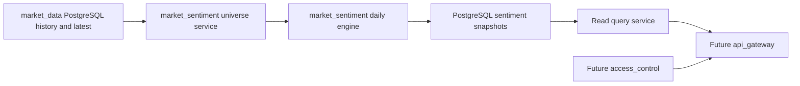
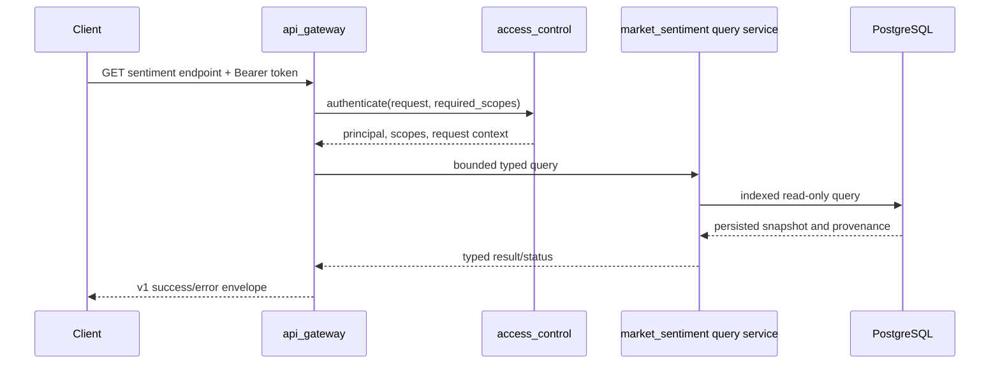

# Market Sentiment Backend Design

## 1 Status And Ownership

`market_sentiment` is a planned `manniu_backend` Django app. It calculates, stores, replays, and serves end-of-day sentiment indicators for the overall Chinese A-share market and individual stocks. It is not registered or implemented yet.

The app consumes only validated PostgreSQL records owned by `market_data`. It does not call Tushare, own market-data synchronization, provide intraday estimates, or create automated trading instructions.

## 2 Module Boundary



`market_data` owns `Security`, daily adjusted trading history, daily basic fundamentals, latest snapshots, and ingestion watermarks. `market_sentiment` reads those tables after their daily watermarks have completed successfully. It owns sentiment universe selection, factor calculation, engine versioning, snapshot persistence, replay, and read-model queries.

## 3 Indicator Scope

| Scope | Identifier | Purpose |
| --- | --- | --- |
| Market | `MARKET/ALL_A` | One daily measure of broad A-share momentum, activity, and fear. |
| Stock | `STOCK/<ts_code>` | A stock's daily sentiment relative to its own recent behavior and, where sufficient data exists, its peer cross section. |

The initial release is daily EOD only. A result uses only source rows dated on or before its `trade_date`; no later trading, fundamental, corporate-action, or membership data may influence a historical result.

## 4 Data Dependencies And Eligibility

The default market universe contains securities with `Security.asset_type='STOCK'`, an active listing status, and a valid daily trading record. A stock requires `close > 0` and `pre_close > 0`; index records, delisted securities, and records without a completed `market_data` daily watermark are excluded. ST, Beijing Exchange, STAR Market, and ChiNext inclusion rules remain versioned configuration to be confirmed before implementation.

The daily engine reads these `market_data` sources using strict `(security_id, trade_date)` joins:

| Source | Required fields | Use |
| --- | --- | --- |
| `MarketBarDailyHistory` | `open`, `high`, `low`, `close`, `pre_close`, `pct_change`, `volume`, `amount` | returns, amplitude, shadows, volume, and amount activity |
| `StockDailyFundamentalHistory` | `turnover_rate_f`, `turnover_rate`, `volume_ratio`, `circ_mv` | turnover/activity, volume confirmation, and liquidity-quality filtering |
| `Security` | code, listing status, area, industry | universe and peer grouping |

The calculation must not use fundamental `close` to replace the trading-bar close, forward/backward-fill a missing same-day fundamental row, or use a future revision without an explicit as-of revision policy.

## 5 Calculation Design

### 5.1 Stock Factors

For stock $s$ and trade date $t$, the engine calculates daily and rolling inputs using only $t$ and prior completed market dates:

$$
r_{1,t} = \frac{P_t}{P_{t-1}} - 1,\qquad
r_{5,t} = \frac{P_t}{P_{t-5}} - 1,\qquad
r_{20,t} = \frac{P_t}{P_{t-20}} - 1
$$

$$
amplitude_t = \frac{H_t - L_t}{P_{t-1}},\qquad
lowerShadow_t = \frac{\min(O_t, P_t) - L_t}{\max(H_t - L_t, \epsilon)}
$$

Parity target: `smartinvestor_be/market_sentiment/services/daily_engine.py` `stock_daily_v2_20260830`. The implementation uses sample standard deviation (`n - 1`), clips valid z-scores to `[-3, 3]`, and requires at least 20 prior valid observations for a component. Missing observations are skipped when building each component's history; the current observation is excluded from its baseline. A zero-variance baseline makes that component unavailable rather than assigning zero. These details are part of the parity contract and must not be replaced by population standard deviation or a different missing-value policy.

Volume, amount, turnover, and volume ratio use the preceding 20 valid observations. Current-day values are excluded from their own normalization window:

$$
z(X_t) = clip\left(\frac{X_t - mean(X_{t-20}, \ldots, X_{t-1})}{std(X_{t-20}, \ldots, X_{t-1})}, -3, 3\right)
$$

The three stock dimensions are:

$$
M_t = 0.40z(r_1) + 0.30z(r_5) + 0.20z(r_{20}) + 0.10z(streakUp)
$$

$$
A_t = 0.25z(volume) + 0.20z(amount) + 0.40z(turnover) + 0.15z(volumeRatio)
$$

$$
F_t = 0.30z(volatility_{10}) + 0.25z(amplitude) + 0.15z(lowerShadow) + 0.20z(downVolume) + 0.10z(downReturn)
$$

`turnover_rate_f` is preferred; `turnover_rate` is used only when free-float turnover is unavailable. `streakUp` is the consecutive positive-return streak and resets on a non-positive or unavailable return. `volatility_10` is calculated from the preceding 10 valid daily returns. On a down day, `downVolume` uses the volume z-score; otherwise that component is unavailable. Component weights are renormalized only across valid inputs. If available weight is below 70 percent, the affected dimension is null and records an availability reason. The parity implementation must also match the reference return source (`close / pre_close - 1` for daily return), handling of missing values, and per-component availability.

### 5.2 Market And Stock Scores

The market dimensions are the median of each valid stock dimension within the eligible universe. The market raw score is:

$$
rawMarket_t = 0.35M_t + 0.35A_t - 0.30F_t
$$

It is normalized against the preceding 252 valid market raw scores using sample standard deviation, clipped to `[-3, 3]`, and converted through a sigmoid to a 0-100 score. The current raw score is excluded from the normalization history. Until 252 prior valid observations exist, the snapshot is `WARMING_UP` and does not publish a formal 0-100 market score.

For stock scope, the primary score after 252 prior valid stock raw scores exist is the stock's own rolling-history score. Calculate `rawStock_t = 0.35M_t + 0.35A_t - 0.30F_t`, standardize against the preceding 252 valid raw scores using sample standard deviation, clip to `[-3, 3]`, then apply the sigmoid. Record this mode as `ROLLING_Z_SCORE`; peer membership does not enter this primary score.

Before the rolling score is available, use a same-day cross-sectional provisional score only when the stock has at least 20 history days and the selected peer group meets its minimum valid size. The peer hierarchy must match smartinvestor_be: SW L3 with at least 10 eligible listed stocks, then the internal industry classification with at least 20, then all eligible A-shares with at least 500. Percentile ranking uses the reference midpoint-tie rule. The provisional score is:

$$
stockScore_t = 0.35 percentile(M_t) + 0.35 percentile(A_t) + 0.30(100 - percentile(F_t))
$$

If neither rolling normalization nor the minimum peer fallback is available, return `WARMING_UP` with a null score. A stock with fewer than 20 valid trading days is `INSUFFICIENT_DATA`; it does not receive a fabricated neutral score. Each snapshot records the normalization mode, selected peer type/code/name, eligible and valid peer counts, stock history count, turnover source counts, windows, and engine version. In `ROLLING_Z_SCORE` mode, retain the selected peer as provenance metadata but do not imply that it affected the score.

### 5.3 SmartInvestor BE Parity Rules

The parity reference is the deployed smartinvestor_be stock engine and its exact engine version, not a re-interpretation of this design's earlier formulas. Before implementation, freeze the reference source revision, engine version, taxonomy snapshot, and comparison date range. Any intentional deviation becomes a separately named engine version and is reported as a parity exception.

The implementation must match the reference for factor formulas and weights, sample standard deviation, z-score clipping, minimum valid-history rules, component availability and weight renormalization, percentile tie handling, score rounding, sigmoid conversion, status and normalization-mode selection, and peer fallback thresholds. Market and stock scores must be checked separately; a stock's SW L3 peer metadata is not evidence that its long-history rolling score is peer-normalized.

The stock CLI separates the requested output codes from the calculation universe. `--ts-codes` limits which snapshots are emitted, but must not shrink the population used to select peers or calculate cross-sectional fallback scores. Date-range replay computes all required pre-roll history but persists only the requested output dates. Each target date is calculated using source rows dated on or before that date. Load enough prior trading rows to build 252 prior valid raw scores and the factor lookback needed to calculate them (at least 272 prior trading observations before the first target date, with additional allowance for missing rows); do not start calculation at the first requested output date.

Historical peer membership must be point-in-time safe. The reference currently reads the corporation's stored industry fields; before historical parity replay, confirm whether those fields are point-in-time snapshots. If not, either provide dated membership history or explicitly limit parity claims to a frozen taxonomy snapshot and record that limitation in output metadata. Do not silently use future membership to claim historical point-in-time correctness.

## 6 PostgreSQL Persistence Design

All sentiment results persist in PostgreSQL. Redis, if added later, only caches latest read responses and is not a source of record.

`MarketSentimentSnapshot` stores market scope results. Its unique key is `(market, scope_type, scope_code, trade_date, engine_version)`, where the initial market row is `CN`, `MARKET`, `ALL_A`.

`StockSentimentSnapshot` stores one stock result per security/date/engine version. Its unique key is `(security_id, trade_date, engine_version)`.

Both snapshot models require: score, level, status, raw score, standardized score when available, momentum/activity/fear dimensions, universe/peer sample count, coverage, engine version, calculation timestamp, source trade date, and JSON metadata. Stock metadata additionally stores the peer and normalization fields above. Scores are nullable only for `WARMING_UP` or `INSUFFICIENT_DATA` states.

`MarketSentimentFactor` and `StockSentimentFactor` are optional detail tables, each keyed by snapshot plus factor code. They store raw value, normalized value, effective weight, contribution, availability, reason, and JSON payload. The app does not store full all-stock factor matrices as an online table; offline audit extracts remain local artifacts until a separately approved archive model is needed.

Required read indexes:

- Market snapshots: `(market, scope_type, scope_code, engine_version, trade_date DESC)`.
- Stock snapshots: `(security_id, engine_version, trade_date DESC)` and `(trade_date, engine_version, score DESC)` for dated ranking views.
- Factor details: `(snapshot_id, factor_code)` unique.

## 7 Job Design

The planned operator command is `refresh_market_sentiment`.

```text
python manage.py refresh_market_sentiment \
  --scope MARKET|STOCK \
  --trade-date YYYYMMDD | --latest | --start-date YYYYMMDD --end-date YYYYMMDD \
  [--ts-codes CODE[,CODE...]] [--engine-version VERSION] [--dry-run]
```

Before processing a date, the command verifies successful `market_data` watermarks for daily stock bars and fundamentals. It then computes market scope from the eligible stock universe and stock scope from the same source set. It uses idempotent PostgreSQL upserts under the snapshot unique keys, preserving prior engine versions rather than silently overwriting results from another algorithm version.

Daily ordering is:

1. `market_data` completes stock bars, stock fundamentals, and stock cost updates for the completed trading date.
2. Any pending adjustment-history rebuild for affected stocks completes successfully.
3. `refresh_market_sentiment --latest --scope MARKET` runs.
4. `refresh_market_sentiment --latest --scope STOCK` runs for the eligible stock universe or requested codes.

A missing source watermark, insufficient core-field coverage, or failed dependent adjustment rebuild returns nonzero and records `FAILED` or `INSUFFICIENT_DATA`; it must not publish a normal score from partial data.

## 7.1 Technical Trend Integration Boundary

技术趋势接口的 owner 是 `market_data`，不是 `market_sentiment`。`market_data` 负责
基于已落库 EOD bars 计算 RSI14、MACD、ATR14、KDJ、均线关系、趋势评分和技术信号；
`market_sentiment` 只负责市场/个股情绪快照及其版本化计算。

当 `market_sentiment` 完成快照查询服务后，技术趋势服务可以通过以下内部只读边界
读取与当前交易日对齐的个股情绪：

```python
get_stock_snapshot(*, ts_code, asof_date, engine_version=None)
```

返回的 `status`、`score`、`level`、`source_trade_date`、`engine_version` 和
覆盖率字段必须原样嵌入 technical-trend 的 `market_sentiment` 区块。情绪快照缺失、
处于 `WARMING_UP`、`INSUFFICIENT_DATA` 或 `STALE` 时，technical-trend 返回明确的
情绪状态和空值，不转换为 0 分或“中性”。

该集成必须满足：

- 不在 technical-trend 请求中触发情绪计算、回填、写入或 Tushare 调用；
- 使用相同 `asof_date` 和实际 `source_trade_date`，禁止把不同日期伪装成同一结果；
- 情绪依赖失败只将 technical-trend 标记为 `PARTIAL`，不影响行情、动量指标和筹码区；
- 技术趋势评分、趋势状态和技术信号不由情绪模块定义，避免两个领域产生第二套技术分类口径；
- `market_sentiment` 仍可独立通过自身 `/sentiment/stocks/:ts_code` 接口提供完整快照。

## 8 API Gateway Integration Contract

本节冻结 `market_sentiment` 接入 `api_gateway` 的首期外部只读契约。它定义 HTTP 边界和
领域服务调用约束，不提前实现 URL、serializer、权限代码或新的数据库表；具体实现必须
在请求/响应字段、数据库字段和 `access_control` scope 注册表确认后开始。

### 8.1 Integration boundary

- 所有接口使用 `/api/v1/market-analysis` 基础路径；不创建情绪模块专用版本前缀。
- 首期只开放 `GET`。不开放刷新、回填、重算、缓存刷新、配置写入、通知、交易或任何
  `POST`/`PUT`/`PATCH`/`DELETE` 接口。
- `api_gateway` 负责版本路由、Bearer 认证委托、scope 授权、参数白名单、日期和代码
  校验、分页、限流、审计上下文、统一响应和错误映射。
- `market_sentiment` 公开 `query_service`，负责快照读取、状态语义、历史点时约束、
  数据质量和领域 DTO。Gateway 不复制情绪公式，不直接拼接 `market_data` ORM 查询，
  不导入同步命令或计算 engine。
- 查询只能读取 PostgreSQL 已落库快照。请求不得回源 Tushare、触发计算、推进
  watermark、修改任何情绪/行情表或改变数据事实；Redis（若启用）只能缓存已生成的
  只读响应。
- 普通用户不返回 factor 明细、失败诊断、覆盖率原始明细或运行记录；这些数据仅供
  `market_sentiment:operator_read` 使用，且不得包含 SQL、堆栈、连接串或凭证。

请求链路：



### 8.2 External routes

| 方法 | 路径 | 说明 | 主要查询参数 |
| --- | --- | --- | --- |
| GET | `/sentiment/market` | 指定日期的市场情绪快照 | `asof_date`, `engine_version` |
| GET | `/sentiment/market/history` | 市场情绪历史序列 | `start_date`, `end_date`, `engine_version`, `page`, `page_size` |
| GET | `/sentiment/stocks/:ts_code` | 指定股票的情绪快照 | `asof_date`, `engine_version` |
| GET | `/sentiment/stocks/:ts_code/history` | 指定股票的情绪历史序列 | `start_date`, `end_date`, `engine_version`, `page`, `page_size` |
| GET | `/sentiment/stocks/ranking` | 指定日期的个股情绪排名 | `asof_date`, `engine_version`, `status`, `page`, `page_size` |

路由中的 `:ts_code` 必须解析为带交易所后缀的规范代码，例如 `000001.SZ`。Gateway
可以接受唯一可解析的无后缀代码，但必须在审计上下文和下游调用中使用规范代码；无法
唯一解析时返回 `INVALID_SYMBOL`。`/sentiment/stocks/ranking` 必须在动态
`:ts_code` 路由之前注册或由路由器明确区分。

日期统一为 `YYYY-MM-DD`，不得请求未来日期。`asof_date` 缺省时使用领域服务定义的
最近完成交易日，不得由 Gateway 自行猜测；响应必须返回实际 `source_trade_date`。
历史接口默认最多 366 个自然日、单次最多 2,000 条记录；`page_size` 默认 50、最大
200，超限返回 `RANGE_TOO_LARGE`。排名接口必须分页，禁止无界全市场导出。

`start_date`/`end_date` 必须成对出现且 `start_date <= end_date`；历史接口不接受
`asof_date` 与日期范围同时出现。`engine_version` 缺省时使用当前公开版本，但响应
必须返回实际版本；请求指定不存在的版本时返回 `VERSION_CONFLICT`，不得静默回退。

### 8.3 Authorization and operational visibility

scope 名称须在实现前与 `access_control` 最终注册表确认，建议如下：

| scope | 允许范围 |
| --- | --- |
| `market_sentiment:read` | 市场/个股当前快照和有限排名查询 |
| `market_sentiment:history_read` | 市场或个股历史查询；可明确配置为包含于 `read` |
| `market_sentiment:operator_read` | 因子明细、覆盖率、失败原因和运行诊断，只读 |
| `market_sentiment:internal_read` | 服务间调用，必须使用独立 service token |

当前快照和排名至少要求 `market_sentiment:read`；所有 history 路由要求
`market_sentiment:read` 加 `market_sentiment:history_read`，除非授权策略明确声明
前者包含后者。未认证、token 无效、scope 不足分别映射为
`AUTHENTICATION_REQUIRED`、`TOKEN_INVALID`、`SCOPE_REQUIRED`。

认证主体、规范化 `ts_code`、请求参数摘要、endpoint、结果状态和 `X-Request-ID` 写入
审计上下文；不得记录 Authorization header、token、数据库连接串或 provider 凭证。
认证和领域查询均受 Gateway 限流与超时约束，超时返回可重试的依赖错误。

### 8.4 Request and response contract

所有成功响应复用 Gateway v1 封套：

```json
{
  "success": true,
  "api_version": "v1",
  "request_id": "7d7c3c5e-...",
  "data": {},
  "meta": {
    "asof_date": "2026-09-09",
    "source_trade_date": "2026-09-09",
    "engine_version": "v1",
    "data_status": "COMPLETE",
    "warnings": []
  }
}
```

快照 `data` 至少包含：`scope`、`scope_code`、`trade_date`、`score`、`level`、`status`、
`raw_score`、`standardized_score`、`momentum`、`activity`、`fear`、`coverage`、
`sample_count`、`engine_version`、`calculated_at` 和 `metadata`。市场结果的
`scope` 为 `MARKET`、`scope_code` 为 `ALL_A`；个股结果还必须包含 `ts_code`、
`normalization_mode`、`peer_type`、`peer_code`、`peer_name`、`valid_peer_count` 和
`stock_history_count`。不存在的数值保持 `null`，不得用 0 或中性分数填充。

`status`/`meta.data_status` 使用领域状态原值，包括 `COMPLETE`、`WARMING_UP`、
`INSUFFICIENT_DATA`、`STALE`、`PARTIAL_SUCCESS` 和 `FAILED`。其中
`WARMING_UP`、`INSUFFICIENT_DATA` 是合法的 200 响应业务状态，不应被 Gateway 改写成
普通服务器错误；无法形成合法响应时才使用错误封套。历史和排名响应还必须提供
`page`、`page_size`、`total`、`has_next`、`next_cursor`（如适用）。

错误复用 Gateway 错误封套：参数、日期、代码和范围错误使用 `INVALID_REQUEST`、
`INVALID_DATE`、`INVALID_SYMBOL`、`RANGE_TOO_LARGE`；指定快照不存在使用
`RESULT_NOT_FOUND`；依赖 watermark 未完成或数据不可用使用 `DATA_NOT_READY`（503，
`retryable=true`）；领域服务不可用使用 `UPSTREAM_DEPENDENCY_UNAVAILABLE`；未授权
访问遵循 8.3 的认证和 scope 错误映射。

### 8.5 Internal query-service boundary

Gateway 仅调用以下类型化只读边界（名称为实现建议，编码前须确认）：

```python
get_market_snapshot(*, asof_date, engine_version=None)
get_market_history(*, start_date, end_date, page, page_size, engine_version=None)
get_stock_snapshot(*, ts_code, asof_date, engine_version=None)
get_stock_history(*, ts_code, start_date, end_date, page, page_size, engine_version=None)
get_stock_ranking(*, asof_date, page, page_size, engine_version=None, status=None)
```

这些方法必须返回已序列化前的领域 DTO 和质量状态，不接受 Django `HttpRequest`、
token 或原始 query string，不执行写操作，不在 cache miss 时补算。历史服务必须在
分页前应用 `trade_date <= end_date` 的无未来数据约束；Gateway 只负责传递已经校验的
边界参数。

### 8.6 API integration acceptance criteria

- 相同快照、engine version 和请求参数的重复读取返回确定性结果，且不会产生数据库写入。
- 指定 `asof_date` 时不会读取更晚交易日；返回的 `source_trade_date` 与实际快照一致。
- `WARMING_UP`、`INSUFFICIENT_DATA`、`STALE` 等状态和 warnings 不被丢失或改写。
- 非法代码、未来日期、越界范围、未知 engine version、无 scope 请求均被 Gateway 在
  领域查询前拒绝，并返回统一错误结构。
- 普通用户无法读取 factor、运行、失败和覆盖率诊断；operator scope 也只能只读。
- API 测试覆盖认证、授权、参数校验、分页、点时约束、业务状态、错误映射和无副作用。

## 9 Test Case Definition

### 9.1 Core Flow

- Given complete same-day `market_data` rows, the engine writes idempotent market and stock snapshots under the documented unique keys.
- Market factors use strict same-day trading/fundamental joins and never replace a trading close with a fundamental close.
- Stock peer selection follows the industry, Tushare-industry, and all-A fallback order with recorded normalization metadata.
- A rerun with the same trade date and engine version updates the same snapshot; a different engine version retains a separate snapshot.

### 9.2 Boundary Scenarios

- A market history shorter than 252 valid dates remains `WARMING_UP` with no formal score.
- A stock with 20 or more valid dates but insufficient peer coverage records its configured fallback peer group.
- A stock with fewer than 20 valid dates is `INSUFFICIENT_DATA`.
- Missing turnover-rate-f falls back to turnover-rate and records the selected source.
- A missing same-day fundamental row remains missing; it is not forward/backward-filled.

### 9.3 Failure Scenarios

- Source rows dated after the requested trade date cause the calculation to fail its no-lookahead validation.
- A missing or failed market-data watermark prevents normal score publication.
- Core source-field coverage below the configured release threshold prevents normal score publication.
- A request for an unbounded stock history/ranking range is rejected by the future API layer.
- No calculation path emits a trading command, broker credential, or automatic execution request.

### 9.4 SmartInvestor BE Parity Acceptance

- The reference source revision, `engine_version`, input date range, data fields, and taxonomy snapshot are recorded with each parity run.
- For each sample stock, compare input row counts, date coverage, and canonical per-field fingerprints through the target date. Any mismatch in `amount`, units, missing rows, or same-day fundamentals is resolved or documented as a blocking parity exception before score comparison.
- Compare each date in dependency order: source inputs; per-component z-scores and availability; momentum/activity/fear; raw score; 252-observation standardized score; final score, level, status, normalization mode, and peer metadata.
- Include 688583.SH and 000001.SZ for 2026-09-07 through 2026-09-11, with the required pre-roll history. Also cover a stock with fewer than 252 valid raw-score observations to verify the cross-sectional fallback and a stock below minimum history to verify null-score status.
- For identical input rows, taxonomy, reference version, and eligible universe, all parity fields match the reference within documented Decimal/rounding tolerance. Any intentional difference requires a separate engine version and an explicit exception; do not weaken tolerance to hide an unexplained mismatch.
- A parity replay writes only to a new engine version or a local comparison artifact. It does not overwrite existing snapshots, historical baselines, or the currently published engine version.
- Promotion is blocked until the calculation and persistence checks pass, the CLI's target-output filter does not affect its peer universe, and reruns are deterministic and idempotent.

## 10 Implementation Sequence

1. Freeze the smartinvestor_be parity reference: source revision, stock engine version, market engine version, comparison dates, and taxonomy/membership snapshot policy. Confirm whether market scoring is also in scope for this parity release.
2. Confirm the PostgreSQL source and target table/field types, including `amount` units and lineage; engine-version naming; stock universe; SW L3 mapping source; coverage thresholds; and required snapshot/provenance fields. Review all proposed database fields and API request/response fields with the user before implementing changes that affect either contract.
3. Build read-only baseline artifacts for 688583.SH and 000001.SZ, including target dates plus pre-roll history. Compare source row counts, coverage, and per-field values/fingerprints. Resolve the observed historical `amount` mismatch before treating a score difference as an algorithm defect.
4. Implement the strict `market_data` read repository, watermark/coverage checks, point-in-time-safe membership policy, and separate target-output codes from the full calculation/peer universe.
5. Implement the parity algorithm under a new engine version; preserve existing versions. Add deterministic tests for factors, rolling normalization, peer fallback, score/status metadata, no-lookahead behavior, and persistence idempotency.
6. Run read-only/reference comparisons in dependency order (inputs, factor components, dimensions, raw score, standardized score, final output). Write only to the new engine version or local artifacts; do not replace snapshots or historical baselines during investigation.
7. Promote the new version only after Section 9.4 acceptance passes. Record known exceptions and rollback by selecting the previous engine version; do not delete or rewrite historical versioned rows.
8. Implement the operator command and daily dependency gating, then confirm API and authorization contracts before implementing authorized read endpoints through `api_gateway` and `access_control`.

## 11 TODO List

- [ ] Freeze smartinvestor_be source/engine reference and confirm whether parity scope includes both market and stock scores.
- [ ] Compare 688583.SH and 000001.SZ source history field-by-field; resolve historical `amount` lineage/units mismatch before parity sign-off.
- [ ] Confirm SW L3 mapping source, point-in-time membership policy, and whether manniu needs a new mapping table/model field; confirm proposed database fields before coding.
- [ ] Define new parity engine-version name and retain the current engine version for side-by-side replay and rollback.
- [ ] Complete Section 9.4 parity acceptance before publishing the aligned engine.
- [ ] 确认 PostgreSQL 实际表名、字段类型、`engine_version` 命名规则、市场 universe、
  peer taxonomy、coverage threshold，以及 8.4 中的 DTO 字段是否与实现一致。
- [ ] 与 `access_control` 确认并注册 `market_sentiment:read`、`history_read`、
  `operator_read`、`internal_read` 的最终 scope 和包含关系。
- [x] 按第 8 节实现 `market_sentiment` 只读 query service，并注册 API Gateway v1 路由、
  响应 DTO、参数校验、分页、错误映射、限流和审计上下文。
- [ ] 创建并注册 `market_sentiment` Django app，完成 PostgreSQL 模型、迁移、唯一键和
  索引；不得使用 SQLite 作为事实来源。
- [ ] 实现严格的 `market_data` 只读 repository、watermark/覆盖率校验和 no-lookahead 检查。
- [ ] 实现每日因子计算、市场/个股快照、engine version 隔离、幂等 upsert 和 replay。
- [ ] 实现 `refresh_market_sentiment` 管理命令及依赖失败时的非零退出和诊断记录。
- [x] 为 query service 和 API Gateway 接入补充确定性接口测试，覆盖认证、路由、DTO、
  分页、排名、点时读取、范围校验和业务状态；计算与持久化测试仍待实现。
- [ ] 测试通过后，将本 TODO 列表和文档状态更新为已完成，并记录验证命令和结果。
