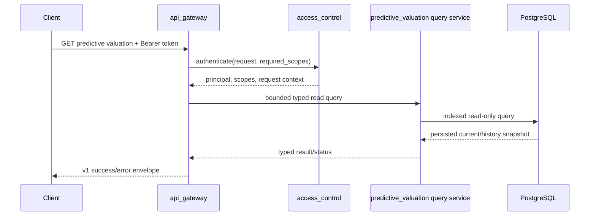

# Predictive Valuation Backend Design

## 1 Status And Scope

This document defines the target predictive valuation design for `manniu_backend` and
uses the current `tushare_earnings_service` implementation as its compatibility
baseline. The baseline is defined by
`EarningsForecastPipeline.predict`, `EarningsForecastPipeline.predict_fusion`, and the
`refresh_signal_snapshot` command. Maniu may replace storage and data-access adapters,
but it must preserve their observable calculation, routing, traceability, persistence,
and failure semantics before adding product-level enhancements.

The model-compatible financial feature tables, prediction/event/run control tables,
feature builder, and operator CLI skeleton are present in Maniu and use PostgreSQL.
Maniu's current inference and persistence path is still a basic implementation and is
not yet considered compatible with the reference baseline. Event consumption,
historical initialization, scheduling, gateway integration, and the three-tier display
template remain staged enhancements until baseline parity is demonstrated.

The module ports the serving approach of
`tushare_earnings_service/earnings_forecast/services/pipeline.py` while using the
existing `market_data` and `financials` applications in the same PostgreSQL database.
It must first reproduce the reference service's probability- and earnings-weighted
signal, quality-risk correction, bounded return range, target price and market-cap
ranges, market-regime and overall-market adjustments, quarterly/fusion routing, and
traceability metadata.

## 2 Reference Baseline And Gap Analysis

### 2.1 Reference Execution Contract

The reference implementation has three distinct responsibilities:

1. `predict` selects a report-type model and feature anchor, performs inference and
  hierarchical imputation, maps the result to action/risk/quantitative targets, and
  returns a complete trace payload.
2. `predict_fusion` invokes `predict` independently for `Q1`, `H1`, `Q3`, and `FY`,
  tolerates individual component failures, and combines successful components using
  report-type, freshness, and confidence weights.
3. `refresh_signal_snapshot` resolves the symbol/as-of/report-type work set, invokes
  inference, enriches missing target market-cap values from the market anchor, and
  persists latest and/or history projections.

The command defaults to latest alignment: no explicit as-of range means
`anchor_mode=live_latest` and one current run. Supplying any explicit as-of argument
automatically disables latest alignment and enables point-in-time replay. Supported
requested report types are `Q1`, `H1`, `Q3`, `FY`, `FUSION`, and `LATEST`; the default
work set is the four standalone quarter types.

### 2.1.1 Anchor Mode Contract

`anchor_mode` identifies the point-in-time alignment used to select the financial and
market feature rows for a prediction. It is a feature-selection and reproducibility
contract, not a model version, serving slot, report type, or request-time inference
switch. The selected mode must be persisted in the prediction snapshot and returned by
the read API so that clients can distinguish an announcement-aligned result from a
latest-data result.

The only supported values are:

| Value | Meaning | Feature selection semantics | Intended use |
| --- | --- | --- | --- |
| `ann` | Announcement-aligned | Select the latest eligible financial disclosure and its point-in-time feature panel. Anchor the market feature row to the disclosure announcement date, choosing the closest eligible row and preferring an on/after row on a tie. | Point-in-time replay, historical backfill, parity evaluation, and leakage-safe analysis. |
| `live_latest` | Latest alignment | Select the latest eligible live financial projection and the latest available market feature row. The result represents the current serving view rather than a historical announcement-time view. | Current production serving and incremental refresh without an explicit historical as-of point. |

When `anchor_mode` is omitted, the command and current-serving path default to
`live_latest` unless an explicit historical/as-of request selects point-in-time replay.
An explicit `asof_date` or historical range must not use data published after that date;
the resolved financial disclosure date, market source date, and feature freshness must
be recorded in the result. `ann` does not mean “use the newest announcement regardless
of the requested date”.

`anchor_mode` applies independently to each `Q1`, `H1`, `Q3`, and `FY` prediction. For
`FUSION`, each quarterly component is selected and inferred under the requested anchor
mode first; only successful components are then combined. Fusion does not introduce a
third anchor mode or a fifth model artifact. Under strict-live policy, a component that
cannot satisfy the requested live alignment makes the fusion ineligible rather than
silently substituting an announcement-aligned or dataset-fallback result.

The gateway accepts only `ann` and `live_latest`; any other value returns
`INVALID_REQUEST`. If the requested security, report type, as-of date, model version,
and anchor mode have no persisted result, the read API returns `RESULT_NOT_FOUND` rather
than running inference or silently falling back to another anchor mode. A successful
response must include `anchor_mode`, `asof_date`, `source_market_date`,
`financial_end_date`, and the applicable financial announcement/source date.

#### Anchor Mode Example

以 `000001.SZ` 为例，假设其 2026 年中报的报告期为 `2026-06-30`，公告日为
`2026-08-30`，公告后的第一个可用交易日为 `2026-08-31`，而当前最新交易日为
`2026-09-12`。同一份中报在不同锚点模式下可能产生不同的预测输入：

| Request | Financial data | Market feature date | Interpretation |
| --- | --- | --- | --- |
| `...?anchor_mode=ann&asof_date=2026-09-01` | `2026-06-30` 中报，且公告可见日期不晚于 `2026-08-30` | `2026-08-31` 或公告日期附近的最近合格交易日 | 复现中报公告后、当时可获得信息下的点时预测。 |
| `...?anchor_mode=live_latest` | 当前最新可用财务特征，可能仍为 `2026-06-30` 中报 | `2026-09-12` 或当前最新合格交易日 | 反映当前生产服务视角下的最新预测。 |

例如，若 `2026-08-31` 的收盘价为 `10.20`，而市场在 `2026-09-05` 后发生下跌，
使 `2026-09-12` 的收盘价变为 `9.40`，`ann` 结果反映公告附近的价格、波动率和市场
状态，`live_latest` 结果则反映 `2026-09-12` 的最新市场输入。因此两者的目标价格、
目标收益区间、风险等级或市场调整结果可以不同；这不是模型版本变化，而是预测时点
和输入信息集不同。

上述参数只筛选已持久化的预测快照，不会在 API 请求时重新执行推理。例如，如果数据库
中只有以下记录：

```text
security=000001.SZ
report_type=H1
anchor_mode=live_latest
```

则请求 `...?anchor_mode=ann` 不应静默改用 `live_latest`，而应返回
`RESULT_NOT_FOUND`。同理，Fusion 请求会先要求各个 `Q1`、`H1`、`Q3`、`FY` 组件在
指定锚点模式下分别可用，再按 Fusion 规则合并成功组件。

### 2.2 Required Parity And Intentional Enhancements

| Area | Reference behavior | Maniu target |
| --- | --- | --- |
| Model routing | Production/candidate serving slot or explicit model version; quarter-specific bundle; no cross-quarter silent fallback | Required baseline parity |
| Feature selection | Prefer live DB features; optional versioned-dataset fallback; `ann` or `live_latest` anchor | Required baseline parity, with strict-live enabled by deployment policy |
| Imputation | Ordered `feature_cols`; stock recent median, industry median, then global median | Required baseline parity |
| Signal | Classifier up-probability plus regressor earnings growth; configurable weights and score bands | Required baseline parity |
| Risk | Score-derived level followed by configurable financial quality penalties and risk upgrades | Required baseline parity |
| Quantitative target | Score, probability, earnings, industry rank, risk, volatility, market regime, and overall-market valuation adjustment | Required baseline parity |
| Output ranges | Adjusted and raw return, price, and market-cap center/low/high values | Required baseline parity |
| Fusion | Partial-success weighted fusion with component/failure audit details | Required baseline parity |
| Persistence | Latest/history/both modes, idempotent history replay, full `raw_result`, failure snapshots, all-failed non-zero exit | Required baseline parity |
| Incremental refresh | Financial endpoint `imported_at` watermark with overlap window | Required baseline parity or a documented equivalent event watermark |
| Shared regime service | Reference computes/falls back inside its pipeline | Maniu enhancement: consume canonical `market_data` regime state without changing mapping semantics |
| Three-tier template | Not produced by the reference service | Maniu additive enhancement after baseline parity |
| Event state/run audit | Reference command is batch-oriented | Maniu operational enhancement after baseline parity |

The largest current design gap is therefore not model loading alone. A basic Maniu
implementation that persists only one score and one target omits the reference service's
quarter identity, source and anchor metadata, raw/adjusted ranges, quality guard,
market-wide adjustment, fusion audit, fallback state, failure state, and replay
idempotency. Those omissions prevent reliable comparison and must be closed before the
three-tier or event-driven layers are treated as production-ready.

## 3 Ownership Boundaries

`predictive_valuation` owns:

- Loading approved static model bundles and model-serving metadata.
- Constructing online feature rows from shared projections.
- Inference, imputation, regime-aware target mapping, and explanation payloads.
- Prediction snapshots, event-consumption state, run audit records, and error state.
- CLI orchestration for historical initialization and incremental refresh.

`market_data` remains the owner of securities, prices, valuation fundamentals, market
regime inputs, and per-security regime inputs. `financials` remains the owner of raw
financial endpoints and disclosure data. `predictive_valuation` owns the financial
feature projections required by its active model feature contract.

The module must not duplicate trading, fundamental, raw financial, or disclosure tables.
It stores only model-specific financial feature projections plus predictive inference
data. All reads and writes use the existing PostgreSQL connection; SQLite is not
supported.

## 4 Configuration And Static Artifacts

### 4.1 Environment Variables

Add the following documented variables to the project's `.env` example. Existing
database configuration is reused and must not be duplicated under a second URL.

| Variable | Default | Purpose |
| --- | --- | --- |
| `PREDICTIVE_VALUATION_ENABLED` | `false` | Enables CLI/scheduled inference. |
| `PREDICTIVE_VALUATION_CONFIG` | `predictive_valuation/configs/default.yaml` | Active YAML profile, resolved from `BASE_DIR`. |
| `PREDICTIVE_VALUATION_MODEL_ROOT` | `predictive_valuation/outputs` | Read-only root for model bundles and serving pointer. |
| `PREDICTIVE_VALUATION_RISK_DATA_ROOT` | `predictive_valuation/outputs_risk` | Read-only risk-dataset root. |
| `PREDICTIVE_VALUATION_LOOKBACK_YEARS` | `5` | Default history range for initialization. |
| `PREDICTIVE_VALUATION_EVENT_DEBOUNCE_SECONDS` | `900` | Per-security event coalescing window. |
| `PREDICTIVE_VALUATION_MAX_FEATURE_GAP_DAYS` | `5` | Maximum market-feature staleness in live mode. |
| `PREDICTIVE_VALUATION_STRICT_LIVE_FEATURES` | `true` | Rejects stale/missing live feature rows instead of dataset fallback. |
| `PREDICTIVE_VALUATION_SERVING_SLOT` | `production` | Selects `production` or `candidate` when no explicit model version is supplied. |
| `PREDICTIVE_VALUATION_ALLOW_DATASET_FALLBACK` | `false` | Allows versioned-dataset fallback only for explicitly approved offline runs. |

All paths must be resolved relative to `settings.BASE_DIR` unless explicitly absolute.
The process must validate that configured artifacts remain within their configured roots,
that the serving pointer exists, and that the selected bundle contains `feature_cols`.

### 4.2 `configs/` Layout

Proposed files:

```text
predictive_valuation/
  configs/
    default.yaml
    production.yaml
    schema.yaml
  outputs/
    serving.yaml
    model_versions/<model-version>/models_Q1.joblib
    model_versions/<model-version>/models_H1.joblib
    model_versions/<model-version>/models_Q3.joblib
    model_versions/<model-version>/models_FY.joblib
  outputs_risk/
    <risk-dataset-version>/...
```

`default.yaml` contains no secrets. It names the model version, artifact paths,
feature-contract version, target-return caps, classifier/regressor settings, imputation
settings, risk thresholds, and market-regime profiles. `production.yaml` may override
only deploy-time values. `schema.yaml` records the versioned feature contract and
expected numeric-unit conventions.

`outputs/` and `outputs_risk/` are immutable inputs to serving. Training/publishing is
outside this module's scheduled inference jobs. A serving pointer promotion is an
explicit deployment operation with its own audit record; a batch job must never
overwrite model artifacts.

### 4.3 Quarterly Production Model Routing

Production inference is report-type-specific. `serving.yaml` contains `production` and
optional `candidate` slots. Each slot identifies a versioned dataset and a required
model mapping for `Q1`, `H1`, `Q3`, and `FY`.
Each mapping entry names its corresponding `models_Q1.joblib`, `models_H1.joblib`,
`models_Q3.joblib`, or `models_FY.joblib` artifact and matching metrics file.

An explicit `model_version` overrides the serving slot. Otherwise, the inference
service resolves the bundle from the selected slot and requested or latest eligible
feature-panel report type:

| Feature panel report type | Required production artifact |
| --- | --- |
| `Q1` | `production.models.Q1` / `models_Q1.joblib` |
| `H1` | `production.models.H1` / `models_H1.joblib` |
| `Q3` | `production.models.Q3` / `models_Q3.joblib` |
| `FY` | `production.models.FY` / `models_FY.joblib` |

`FUSION` is not a fifth model artifact. It is a weighted composition of successful
quarter-specific predictions and persists with report type and model version `FUSION`/
`fusion` for serving identity. `LATEST` selects the latest available report type and
routes to that quarter's model.

The artifact registry fails when the report type is unsupported or its configured bundle
is missing or outside the configured model root. A declared sklearn version different
from the running version emits an explicit compatibility warning and is recorded in run
output; it does not block prediction. The registry must never silently fall back to a
different quarter's model. The operator `validate` command checks all configured
report-type mappings before a batch or event consumer runs.

## 5 Shared Feature Contract

The reference pipeline loads its ordered feature names from the selected model bundle and
uses `reindex(columns=feature_cols)`, followed by hierarchical imputation. The Maniu
implementation must preserve that behavior: model bundle order is authoritative, and
missing columns become null before imputation rather than raising a dataframe error.

The online feature builder combines these sources:

| Source | Required contribution |
| --- | --- |
| `market_data` | security identity/industry, latest eligible close, market cap, valuation ratios, liquidity/return/volatility windows, benchmark and security regime inputs |
| `predictive_valuation.PredictiveFinancialFeaturePanel` | module-owned point-in-time financial feature row selected by `source_as_of_date <= as-of date` and requested report period |
| `predictive_valuation.PredictiveFinancialFeatureLatest` | module-owned current live financial feature projection |
| `financials.FinancialDisclosureRecord` | report/disclosure change detection and the financial-data availability boundary |

The predictive pipeline must rebuild affected module-owned financial feature rows before
prediction. In `ann` mode it selects the latest eligible disclosure and anchors to the
market feature row closest to announcement date, preferring an on/after row on a tie. In
`live_latest` mode it selects the latest market feature row. An explicit as-of replay may
use only market and financial information available on or before that date. Historical
initialization must never use a newer latest row to predict an older trading date.

Live DB features are preferred. Versioned-dataset fallback, when explicitly enabled for
offline compatibility, must set `feature_data_source=dataset_fallback` and
`live_feature_compliant=false`. Strict live mode raises a typed
`LIVE_FEATURE_UNAVAILABLE` failure containing requested as-of date, source trade date,
data source, and feature gap days; it must not silently fabricate a current result.

### 5.1 Module-Owned Financial Feature Schema

The former `financials_feature_panel` and `financials_feature_latest` tables have been
removed. `PredictiveFinancialFeaturePanel` and `PredictiveFinancialFeatureLatest` replace
them with the model-compatible names required by the reference pipeline: income
(`n_income`, `n_income_attr_p`, `basic_eps`, `diluted_eps`), indicators (`roe_dt`,
`q_dt_roe`, `tr_yoy`, liquidity ratios, `assets_turn`, `ocf_to_or`), balance-sheet, and
cash-flow fields are persisted without lossy field renaming.

`PredictiveFinancialFeatureBuilder` reads only typed `financials` raw income,
balance-sheet, cash-flow, indicator, and disclosure records. It resolves each report's
effective disclosure date, upserts point-in-time panel rows, and updates the latest row
from the newest eligible panel before inference begins. Predictive serving must never
build an unpersisted raw-table join.

Every persisted predictive financial feature must be a direct field mapping from an
approved financial raw-record column. The builder must not derive, synthesize, or use a
different-field substitute for a model feature. In particular, `cash_ratio` and
`ocf_to_or` must come from `FinancialIndicatorRecord.cash_ratio` and
`FinancialIndicatorRecord.ocf_to_or`; they must not be recomputed from balance-sheet or
income/cash-flow values. `q_dt_roe`, `st_borr`, `lt_borr`, and
`n_incr_cash_cash_equ` likewise require their corresponding typed raw fields. A missing
raw source remains null for model imputation and is recorded in feature provenance.

The financial ingestion schema and repository must persist all fields in the active
model contract before a predictive panel rebuild. Existing raw payloads may be used for
a one-time, auditable typed-field backfill only when the value is copied directly from
the provider field of the same name. This preserves compatibility with the legacy
`earnings_financial_feature_panel` feature distribution.

Feature values must be normalized according to `schema.yaml`. In particular,
ratio-scale upstream values must not be mixed with percentage-scale model features.

## 6 Authoritative Predictive Three-Tier Template

This section is a Maniu enhancement and is not part of the reference service parity
baseline. It may be enabled only after the underlying persisted prediction matches the
reference fields and calculations described below.

Predictive valuation then produces an additive three-tier display template from a
persisted inference result. The tiers are `conservative`, `balanced`, and
`aggressive`; each contains a target price/range, expected return/range, risk
level, and position guidance. They are derived after model inference and
regime-aware target mapping. They are not model features, separate model
artifacts, or an instruction to trade.

### 6.1 Shared Industry-Regime Contract

After baseline parity, predictive valuation calls the same backend `industry_regime_service` and
versioned SW mapping used by `traditional_valuation`. It supplies the canonical
security/industry identity available from `market_data`, plus the selected
financial-panel and inference quality metadata. The returned contract is:

```text
selected_regime: high_growth | balanced | stable_value | cyclical_resource
regime_confidence: 0..1
regime_source: exact | parent | keyword | fallback
regime_reasons, industry_code, mapping_version, fallback_reason
```

Code normalization and lookup follow exact industry/index mapping, SW parent
walk, keyword rule, then an explainable `balanced` fallback. A code with no
explicit rule therefore never yields an unexplained `none` regime. The frontend
may retain a compatibility fallback only when this backend metadata is absent;
it must not maintain an independent authoritative prefix mapping.

The predictive path deliberately does not consume `business_match` variants or
calculate `variant_weights`/`blend`: its approved input contract has one
security, one feature panel, and one inference result per report type/as-of
identity. Adding industry-variant model inference is a separate model-contract
change and is out of scope for three-tier serving.

### 6.2 Tier Construction And Degradation

The active model's capped target return/price output is the balanced anchor.
The selected industry regime chooses a versioned template pack with lower/upper
range multipliers, minimum tier gaps, and position-guidance caps. Confirmed
`market_data` market/security regimes and inference risk/quality may narrow
or widen that pack but cannot alter the canonical industry-regime result.
After applying those controls, the mapper enforces:

$$
conservative \le balanced \le aggressive
$$

and the recorded minimum down/up gaps. It records values before and after the
spacing correction. Low `regime_confidence`, degraded/stale live features,
high inference uncertainty, or a `BEAR`/`RISK_OFF` market-data state invokes
the configured conservative fallback: widen downside protection and cap the
aggressive position. Strict live-feature mode remains authoritative; an
ineligible prediction returns its existing typed failure rather than a
fabricated tier template.

### 6.3 Persistence And Read Contract

`PredictiveValuationSnapshot` stores the immutable
`predictive_tiered_template` and the source prediction/range values used to
derive it. `PredictiveValuationCurrent` stores the corresponding latest template only
when the most recent projection succeeds. A later failed refresh replaces the current
baseline fields with an explicit failure state and clears the template rather than
retaining a stale template as current. At minimum a successful template contains:

- `conservative`, `balanced`, `aggressive`, each with price/return range and
  position guidance;
- `selected_regime`, `regime_confidence`, `regime_source`, `regime_reasons`,
  `industry_code`, and `mapping_version`;
- `tier_spacing` with configured rule and before/after targets;
- model/risk/market/security regime inputs, range multiplier, and
  `downgrade_applied`/`downgrade_reason`.

The template is additive to existing target-range fields. Future gateway
responses expose it from persisted snapshot/current rows only, alongside
`asof_date`, `source_market_date`, `financial_end_date`, `model_version`, and
the mapping/template versions. Request-time inference, industry lookup writes,
or frontend recalculation are prohibited.

## 7 Predictive Domain Persistence

The predictive tables and their identities are:

| Model | Key | Purpose |
| --- | --- | --- |
| `PredictiveValuationSnapshot` | `security`, `report_type`, `asof_date` | Idempotent history/replay result and full raw/explain payload. Duplicate legacy rows for the same key are collapsed to the newest row. |
| `PredictiveValuationCurrent` | `security`, `report_type` | Latest serving projection, replaced by each attempted refresh for that report identity. |
| `PredictiveValuationEventState` | `security`, `event_type`, `event_key` | Idempotent event consumption, debounce, and retry state. |
| `PredictiveValuationRun` | `run_key` | Batch/manual run lifecycle and aggregate counts. |

`report_type` is one of `Q1`, `H1`, `Q3`, `FY`, or `FUSION`. Model version and feature
contract are trace fields, not part of the current-row identity; otherwise a model
promotion would leave multiple competing current rows. Current and history writes are
independently selectable through `latest`, `history`, or `both` store modes.

Each current/history row stores the reference summary columns:

- `signal_score`, `target_return_pct`, `target_price`, `target_market_cap`, `action`,
  `risk_level`, `model_version`, `asof_date`, and `feature_data_source`;
- `batch_key`, `refresh_reason`, `refresh_detail`, `market_regime`, `stock_regime`,
  `triggered_at`, and `last_error`;
- compact `explain` fields for stance, confidence, probability component, and earnings
  component;
- full immutable `raw_result`, including raw and adjusted low/center/high targets,
  model/report routing, financial metadata, quality guard, market adjustment, and fusion
  component audit.

History additionally stores `snapshot_source`, `anchor_mode`, financial report/end/
announcement/fiscal-year metadata, `run_key`, `is_backfill`, and `backfill_run_id`.
Backfill retention, when enabled, keeps the configured number of most recent distinct
financial quarter end dates per security.

A failed prediction writes a typed neutral snapshot for the attempted report identity:
null score and targets, `HOLD`, `MEDIUM`, empty raw result, and populated `last_error`.
This intentionally makes the latest failure visible instead of serving an apparently
fresh stale success. The run exits non-zero when every attempted prediction fails;
partial success completes with failure counts and per-component/per-report diagnostics.

A successful snapshot may additionally record the immutable
`predictive_tiered_template`, including its industry-regime mapping and spacing/downgrade
audit payload. That additive field never replaces `raw_result` or the baseline target
ranges.

No event is marked consumed until its prediction transaction has committed. Failed
events retain their error and retry count; a later event with the same idempotency key
does not create duplicate snapshots.

## 8 Inference Service

Proposed package shape:

```text
predictive_valuation/
  services/
    artifact_registry.py
    financial_feature_builder.py
    feature_builder.py
    regime_service.py
    inference_service.py
    event_service.py
  management/commands/
    predictive_valuation.py
```

`artifact_registry` validates and resolves the production bundle matching each panel's
financial report type. `financial_feature_builder`
rebuilds the predictive module's panel/latest rows from financial raw records before
every inference. `feature_builder` then performs point-in-time market and financial
joins and emits a named feature row plus provenance. `inference_service` loads the
report-type-specific classifier/regressor bundle, applies ordered feature reindexing and hierarchical
imputation (security recent history, industry median, bundle global median), then maps
the score through capped, risk- and regime-aware target ranges. `event_service` detects,
coalesces, claims, and completes events transactionally.

### 8.1 Signal And Action Mapping

The classifier returns `valuation_up_prob` in $[0,1]$. The optional regressor returns
predicted earnings growth. Earnings growth is clipped to configured bounds and normalized
to $[0,1]$; missing growth contributes the neutral value $0.5$. With normalized weights:

$$
signal\_score = 100 \times (w_p \times valuation\_up\_prob + w_e \times earnings\_norm)
$$

The default weights are $w_p=0.7$ and $w_e=0.3$. Configured score bands map the score to
`STRONG_BUY`, `BUY`, `HOLD`, `REDUCE`, or `SELL`; backend actions map these to `BUY`,
`BUY`, `HOLD`, `SELL_PART`, and `SELL`. Base risk is `LOW` at score $\ge 65$, `MEDIUM`
at score $\ge 50$, and otherwise `HIGH`.

The optional quality-risk guard then evaluates directly sourced financial values,
including operating cash-flow quality, profit/cash-flow mismatch, receivables/revenue,
and inventory/revenue. It subtracts a capped score penalty and can only increase risk.
The final score is passed through the score bands again. The output records every fired
rule, metric value, threshold, score penalty, and risk upgrade.

### 8.2 Quantitative Valuation Mapping

The bounded center return is the sum of four configured components before risk scaling:

$$
r = risk\_scale \times (r_{score} + r_{probability} + r_{earnings} + r_{industry})
$$

where the score is centered at 50, probability at 0.5, earnings growth is clipped, and
industry percentile is inverted so a lower within-industry valuation percentile permits
more upside. The result is clipped by a market-regime-specific absolute return cap. An
optional high-confidence growth tail may raise that cap only when score, probability,
earnings growth, risk, and allowed market regime all pass configured gates.

The return band combines a base band, realized-volatility multiplier, and risk padding,
then is clipped to configured limits. These pre-market values are persisted as `*_raw`.
The service next computes an overall-market valuation percentile from configured index
weights and PE/PB/turnover metric weights. It applies the configured overvalued, neutral,
or undervalued multiplier to $(1+r)$ and clips again. Adjusted return, price, and market
capitalization center/low/high fields are persisted alongside their raw counterparts.
When target market capitalization is absent at command level but price and current market
capitalization exist, it is deterministically derived as:

$$
target\_market\_cap = current\_market\_cap \times
\frac{target\_price}{current\_price}
$$

### 8.3 Target-Mapping Configuration Contract

The target mapping above is not a fixed score-to-price lookup. It is a versioned,
configuration-driven compatibility contract with the reference earnings service. The
active profile must expose these groups under `valuation_mapping`; hard-coded defaults
must not silently replace a missing production configuration:

| Configuration group | Required behavior |
| --- | --- |
| `weight_prob`, `weight_earnings`, `earnings_growth_min`, `earnings_growth_max` | Normalize and combine up probability and predicted earnings growth into the signal score. Weights are normalized to sum to one; missing earnings growth contributes neutral `0.5`. |
| `quant_target_max_abs_return`, `quant_target_prob_coef`, `quant_target_earnings_coef`, `quant_target_industry_coef`, `quant_target_earnings_clip` | Configure the bounded return components. Earnings growth is clipped before its contribution is calculated. |
| `quant_target_risk_scales` | Scale the combined target by `LOW`, `MEDIUM`, or `HIGH` risk. The resulting center and band remain bounded by the active absolute-return cap. |
| `quant_target_base_band`, `quant_target_volatility_mult` | Build the low/high target band from a base width, realized volatility, and risk padding. |
| `market_regime.profiles` | Apply regime-specific `return_scale`, `band_scale`, and optional risk-scale overrides for `BULL`, `BALANCE`, and `BEAR`. |
| `market_overall_adjustment` | Classify the overall market valuation state from configured index and metric weights, then apply the configured overvalued/neutral/undervalued multiplier to `1 + raw_return`. |
| `bull_tail` | Optionally expand the absolute-return cap only for explicitly allowed regimes and jointly satisfied score, probability, earnings-growth, and risk gates. |
| `quality_risk_guard` | Penalize score and upgrade risk only when configured financial-quality rules fire. It can never improve a score or lower risk. |

The required execution order is:

1. Calculate the probability/earnings signal and derive the score-based base risk.
2. Apply `quality_risk_guard` to direct financial features. Cap the accumulated score
	penalty at `max_score_penalty`, cap risk upgrades at `max_risk_upgrade`, and
	recalculate action/confidence bands from the corrected score and risk.
3. Resolve the security's market regime and select its profile. Apply the profile's
	return and band scales before quantitative target calculation.
4. Calculate the raw target from score, probability, earnings growth, and the inverted
	within-industry valuation percentile. A lower percentile represents relatively
	cheaper valuation and therefore permits a larger positive contribution.
5. Evaluate `bull_tail`. The cap may be expanded only when `enabled` is true, the
	regime is in `allowed_regimes`, `score >= min_score`, probability is at least
	`min_prob`, earnings growth is at least `min_earnings_growth`, and risk is in
	`max_risk_levels`.
6. Calculate raw low/center/high returns and prices, then apply the overall-market
	multiplier to `1 + return`; clip the adjusted values again to the active cap.

The default reference profile uses the following calibration unless a versioned
production profile explicitly changes it: probability/earnings score weights `0.7/0.3`,
score target cap `0.35`, target coefficients `0.10/0.10/0.05` for probability/earnings/
industry, earnings clip `0.40`, base band `0.04`, volatility multiplier `1.50`, and
risk scales `LOW=1.15`, `MEDIUM=1.05`, `HIGH=0.90`. The reference bull-tail profile
allows `BULL` and `BALANCE`, requires score `>=93`, probability `>=0.88`, earnings
growth `>=0.60`, permits `LOW` or `MEDIUM` risk, and raises the cap to `1.20`.
These values are calibration defaults, not a license to bypass profile versioning.

The quality guard must support at least these direct-feature rules: low
`ocf_to_or`, positive profit with non-positive operating cash flow, excessive
`accounts_receiv / revenue`, and excessive `inventories / revenue`. Each rule records
its metric value, threshold, score penalty, and risk upgrade. Ratios are evaluated only
after the schema's ratio/percentage unit normalization, and the revenue-base threshold
prevents ratio rules from firing on immaterial revenue values.

Every prediction must persist both raw and adjusted target values plus a calculation
trace containing `rules_version`, component returns, risk scale, regime profile,
industry percentile contribution, volatility/band inputs, bull-tail eligibility and
reason, quality-guard reasons, and market-overall adjustment state/multiplier. This
trace is required for parity comparisons and must not be reconstructed by the
frontend. A missing industry percentile or market-overall input uses the documented
neutral contribution/multiplier and records the degraded input state; it must not
silently substitute a different valuation metric.

### 8.4 Fusion Mapping

Fusion calls each requested quarter model independently. For each successful component:

$$
w_q = base\_weight_q \times e^{-age\_days/half\_life\_days}
    imes confidence\_weight
$$

Weights are normalized across successful components. Probability, earnings growth, and
all available target fields are weighted independently; missing low/high fields receive
a configured fallback band. The payload records normalized weights, their base/freshness/
confidence factors, source dates, model versions, live-feature compliance, and failed
components. Fusion fails only when no component succeeds, except strict-live mode where
any non-live component makes the fusion ineligible.

The Maniu serving path defaults to strict live features. Dataset fallback is permitted
only for offline historical initialization when the active profile explicitly enables
it; its use must be persisted in the snapshot. This is intentionally stricter than the
reference command's compatibility default and must be covered by parity tests.

## 9 CLI And Batch Jobs

The proposed single entry point is:

```text
python manage.py predictive_valuation <subcommand> [options]
```

| Subcommand | Default behavior |
| --- | --- |
| `validate` | Validates environment, serving pointer, feature contract, database access, and required shared-data coverage. Performs no writes. |
| `backfill` | Initializes idempotent historical predictions for the previous five calendar years. Replaying the same security/report/as-of key updates that history identity instead of duplicating it. Requires explicit `--start-date`/`--end-date` to override. Uses `--dry-run` by default until operational approval. |
| `detect-events` | Detects market-regime, security-regime, and newly available disclosure events; creates idempotent pending events only. |
| `consume-events` | Claims and predicts eligible pending events with bounded retries and debounce. |
| `refresh` | Runs `detect-events` followed by `consume-events`; does not backfill. |
| `status` | Reports latest run, pending/failed events, active model, and feature freshness. |

The Maniu command must expose equivalent controls for symbol scope/file, full versus
incremental refresh, `changed_since` plus overlap hours, offset/limit, batch and refresh
metadata, model version or serving slot, anchor mode/latest alignment, store mode,
as-of date/range/frequency, report types, history-quarter retention, pacing, and strict
failure handling. Option names may follow Maniu CLI conventions, but their persisted
meaning must remain compatible.

Without an explicit symbol list, incremental refresh selects distinct securities whose
approved financial endpoint rows have `imported_at` later than the most recent history
snapshot time minus the overlap window. If no history anchor exists, it falls back to the
eligible full universe. The work order is deterministic by security code, then as-of
date, then requested report type.

Each run reports attempted work items, successes, failures, pruned history rows, elapsed
time, batch key, and per-security/per-report diagnostics. `--strict` stops at the first
failure. Without `--strict`, partial failures continue, but zero successful predictions
with one or more failures must still raise a command error so schedulers cannot advance a
checkpoint on a false success.

Initial batch-job proposals:

| Job | Command | Schedule intent |
| --- | --- | --- |
| `predictive_valuation_backfill` | `predictive_valuation backfill --years 5` | Manual/onboarding only; resumable by run key. |
| `predictive_valuation_event_scan` | `predictive_valuation detect-events` | After market and financial ingestion completes. |
| `predictive_valuation_event_consumer` | `predictive_valuation consume-events` | Runs after the scan; may run more frequently for retries. |

The job scheduler must declare ordering: market-data ingestion, then financial ingestion
and feature-projection rebuild, then event scan, then event consumption. The commands
are lock-protected per run class and scope; `--security`, `--asof-date`, `--limit`,
`--run-key`, `--dry-run`, and `--retry-failed` are proposed common controls.

## 10 Event Contract

Event detection is pull-based against shared PostgreSQL data, which makes it compatible
with current batch ingestion and avoids cross-app in-process signals.

| Event type | Detection baseline | Affected scope | Trigger condition |
| --- | --- | --- | --- |
| `MARKET_REGIME_CHANGED` | persisted prior benchmark regime | market scope | Current classified benchmark regime differs from last successfully processed regime. |
| `SECURITY_REGIME_CHANGED` | persisted prior security regime | one security | Debounced classified security regime differs from its last successful state. |
| `FINANCIAL_DISCLOSED` | disclosure watermark plus projection freshness | one security | A disclosure row becomes available/changes and the matching feature-panel row is available. |

The disclosure event must first rebuild the module-owned financial feature row, then be
gated by `PredictiveFinancialFeaturePanel.source_as_of_date` so new financial data cannot
trigger inference against stale projected features. Market-wide events fan out
deterministically to eligible active securities and are chunked; they do not hold one
long database transaction.

### 10.1 Market Data Regime Contract

`predictive_valuation` consumes market and security style classification from the
canonical `market_data` regime service. It must not duplicate the classifier,
read private state from another prediction service, or call Tushare during
feature construction or event consumption. All regime reads use completed
PostgreSQL EOD rows and an explicit `asof_date`.

The supported read boundary is:

```python
from market_data.services.regime import (
  get_market_regime,
  get_security_regime,
  get_regime_state,
)

market = get_market_regime(
  asof_date=asof_date,
  benchmark_ts_code="000001.SH",
)
security = get_security_regime(
  security=security,
  asof_date=asof_date,
)
```

The service resolves the latest completed source date on or before the
requested as-of date. It returns a typed degraded result for insufficient or
stale data rather than fabricating a neutral feature row. The prediction
feature builder persists the returned regime metadata in feature provenance:

```text
market_regime: BULL | BEAR | BALANCE
security_regime: GROWTH | BALANCE | DEFENSIVE | RISK_OFF
market_regime_source
security_regime_source
market_regime_source_trade_date
security_regime_source_trade_date
regime_classifier_version
regime_row_count
regime_status
```

### 10.2 Market Regime Semantics

The market classifier uses the completed `000001.SH` benchmark close series
from `market_data.MarketBarDailyHistory`. It requires at least 80 valid rows
and calculates MA20, MA60, close/MA60, 20-day volatility, and 60-day drawdown.
The default states and thresholds are:

| Condition | State |
| --- | --- |
| `MA20 > MA60`, `close/MA60 >= 1.03`, and `drawdown60 > -0.12` | `BULL` |
| `MA20 < MA60` and (`close/MA60 <= 0.97` or `drawdown60 <= -0.12`) | `BEAR` |
| Other valid observations | `BALANCE` |

If a provisional `BULL` state has 20-day volatility `>= 0.028`, the classifier
downgrades it to `BALANCE`. These thresholds belong to `market_data`; the
prediction model configuration may define how a confirmed state scales target
returns and bands, but may not redefine the state itself.

### 10.3 Security Regime Semantics

The security classifier uses at least 60 valid positive close values from
`market_data.MarketBarDailyHistory` and follows this ordered rule set:

1. `RISK_OFF` when `ma20 < ma60` and (`close/ma60 <= 0.94` or
   `drawdown60 <= -0.18`).
2. `DEFENSIVE` when `ma20 < ma60`, or `close/ma60 < 0.98`, or
   `drawdown60 <= -0.10`, or volatility is `>= 0.035`.
3. `GROWTH` when `ma20 > ma60`, `close/ma60 >= 1.02`, drawdown is `> -0.08`,
   and volatility is `< 0.03`.
4. Otherwise `BALANCE`.

The classifier returns `INSUFFICIENT_DATA` when fewer than 60 valid rows exist.
That result may be recorded in diagnostics but cannot trigger a regime event or
replace a confirmed state.

### 10.4 Regime Event Consumption

`market_data` persists `MarketRegimeSnapshot`, `SecurityRegimeSnapshot`,
`MarketRegimeState`, `SecurityRegimeState`, and idempotent `RegimeEvent` rows.
The first valid market or security observation establishes a baseline and does
not trigger prediction refresh. Invalid or empty results do not advance state.

Security state changes require two consecutive observations of the new state.
The pending state and pending count are held in `SecurityRegimeState`; only a
confirmed transition creates `SECURITY_STYLE_CHANGED`. A market transition is
created only when both old and new states are valid and different.

The predictive event service maps upstream events as follows:

| `market_data` event | Predictive scope | Prediction refresh |
| --- | --- | --- |
| `MARKET_STYLE_CHANGED` | Market/universe | Deterministic bounded fan-out over eligible active securities |
| `SECURITY_STYLE_CHANGED` | One security | Only that security's current eligible report panels |
| `FINANCIAL_DISCLOSED` | One security/report period | Rebuild features, then predict the affected report period |

Older internal names `MARKET_REGIME_CHANGED` and `SECURITY_REGIME_CHANGED`, if
encountered in existing event payloads, are compatibility aliases only. New
events must use `MARKET_STYLE_CHANGED` and `SECURITY_STYLE_CHANGED` and retain
the source classifier version, old/new state, source trade date, metrics,
detection time, and stable event key.

The market-style event must not hold one transaction for the entire universe.
The detector creates bounded child work or the consumer claims bounded chunks.
The security-style event never fans out to other securities. A repeated event
with the same source version and scope is idempotent and cannot create duplicate
prediction snapshots.

### 10.5 Regime-Aware Inference And Refresh Metadata

The inference service may use the confirmed market/security state in its target
mapping, return caps, risk scaling, or explanation payload. It must record the
state used for the prediction and the exact source dates. A degraded or stale
regime input must either follow the configured explicit fallback profile or make
the prediction ineligible in strict mode; it must not silently present a stale
state as current.

Every event-triggered prediction snapshot records one of these refresh reasons:

- `MARKET_REGIME_SWITCH`
- `STOCK_REGIME_SWITCH`
- `FINANCIAL_DISCLOSURE`
- `MONTHLY_FULL_REFRESH`
- `MANUAL_REFRESH`

The dashboard/latest read path consumes persisted `PredictiveValuationSnapshot`
or `PredictiveValuationCurrent` rows only. Loading a prediction card must not
call `get_market_regime`, `get_security_regime`, or the inference service in a
way that writes or computes a new prediction.

## 11 Consumer And API Boundary

`predictive_valuation` does not define, route, serialize, or expose public HTTP APIs.
Its public boundary is an internal, read-only query service used by `api_gateway` after
authorization. CLI and scheduler commands remain the only write entry points.

After a separate interface-contract confirmation, `api_gateway` may expose current,
historical, and operational-status predictive valuation reads. Gateway request validation,
versioning, serialization, response envelopes, pagination, and error mapping are owned by
`api_gateway`; `access_control` authorizes the caller before the gateway invokes a bounded
predictive-valuation query service.

Any gateway response must identify `asof_date`, `source_market_date`,
`financial_end_date`, and `model_version` so clients cannot present stale inputs as a
current valuation. No request-time path may invoke Tushare, write a prediction, alter a
model artifact, or execute a trading action.

## 12 Implementation Gates

1. Freeze a representative reference fixture set for `Q1`, `H1`, `Q3`, `FY`, and
  partial-success `FUSION`, including `raw_result` and persisted latest/history rows.
2. Confirm the raw-financial field mapping for every predictive feature, including
  percentage/ratio unit rules.
3. Confirm the four predictive persistence models and the internal read-query contract
  for `api_gateway`, including the `(security, report_type)` current key and
  `(security, report_type, asof_date)` history key.
4. Implement and compare quarter routing, anchor selection, hierarchical imputation,
  quality-risk guard, raw/adjusted quantitative targets, and fusion component auditing.
5. Confirm scheduling ownership and exact cadence after the existing market/financial
   jobs are identified.
6. Confirm the shared industry-regime service/configuration, SW mapping-version
  lifecycle, predictive tier multipliers/gaps/position caps, and the additive
  gateway response schema before tier serving.
7. Run `predictive_valuation validate` against PostgreSQL and write a side-by-side local
   artifact before any five-year database backfill.
8. Require parity for report/model identity, score/action/risk, raw and adjusted target
  ranges, market adjustment, feature source, financial metadata, and failure semantics.
  Numeric comparisons use documented tolerances; categorical and identity fields are
  exact.
9. Validate representative growth, cyclical, stable-value, and unmapped-SW samples:
  all coded samples must return an explainable regime; complete templates must
  be ordered, meet their recorded gaps, and preserve the same regime as the
  traditional path for the same industry code.
10. Enable three-tier templates and event jobs only after baseline parity, historical
  snapshot coverage, replay idempotency, and all-failed exit checks pass.

No public API contract changes are authorized by this document update. Before backend
implementation begins, database fields and internal/public request-response fields must
be reviewed and confirmed. Implementation then proceeds baseline-first: single-quarter
parity, fusion parity, latest/history persistence parity, followed by shared-regime,
three-tier, event, scheduler, and gateway enhancements.

## 13 API Gateway Integration Requirements

本节冻结 `predictive_valuation` 接入 `api_gateway` 的首期公共只读边界，作为
[API Gateway Design](api-gateway-design.md) 中预测估值领域的落地需求。它只定义 HTTP
路由、请求/响应语义和领域服务调用约束，不替代本模块的推理、快照持久化、事件消费或
数据表设计。实现前仍必须完成本节末尾的字段确认闸门。

### 13.1 Integration boundary

- 所有接口使用 `/api/v1/market-analysis` 基础路径，不创建预测估值专用版本前缀。
- 首期只开放 `GET`。不开放推理触发、刷新、回填、重算、模型发布、事件消费、配置写入、
	导出、交易或任何 `POST`/`PUT`/`PATCH`/`DELETE` 接口。
- `api_gateway` 负责版本路由、Bearer 认证委托、scope 授权、参数白名单、证券代码和日期
	校验、分页、限流、超时、审计上下文、统一响应和错误映射。
- `predictive_valuation` 公开有界的只读 `query_service`，负责当前/历史快照查询、FUSION
	组件状态、点时约束、数据质量和领域 DTO。Gateway 不复制目标收益/价格公式、风险规则、
	行业 regime、季度融合或 as-of 选择逻辑，也不直接拼接预测模型或 PostgreSQL ORM 查询。
- 查询只能读取 PostgreSQL 已提交的 `PredictiveValuationCurrent`、
	`PredictiveValuationSnapshot` 及必要的只读来源状态。请求不得调用 inference、写入快照、
	推进 watermark、触发 Tushare、修改模型文件或创建事件；Redis（若启用）只能缓存可失效的
	已持久化只读结果。
- 预测结果必须原样保留 `feature_data_source`、`live_feature_compliant`、`anchor_mode`、
	`refresh_reason`、数据新鲜度和降级/失败原因。Gateway 不得把 `dataset_fallback`、
	`PARTIAL_SUCCESS`、`STALE` 或失败快照改写成正常预测。

请求链路：



### 13.2 External routes

首期路由如下。路径中的 `:ts_code` 必须解析为带交易所后缀的规范代码，例如
`000001.SZ`。Gateway 可以接受唯一可解析的无后缀代码，但必须在审计上下文和下游调用中
使用规范代码；无法唯一解析时返回 `INVALID_SYMBOL`。

| 方法 | 路径 | 说明 | 主要查询参数 |
| --- | --- | --- | --- |
| GET | `/securities/:ts_code/valuations/predictive` | 指定证券的当前预测估值 | `asof_date`, `report_type`, `anchor_mode`, `model_version`, `serving_slot` |
| GET | `/securities/:ts_code/valuations/predictive/history` | 指定证券的历史预测快照 | `start_date`, `end_date`, `report_type`, `page`, `page_size` |
| GET | `/securities/:ts_code/valuations/predictive/fusion` | 当前或指定点时的季度融合结果 | `asof_date`, `anchor_mode`, `model_version` |
| GET | `/valuations/predictive/status` | 模型、数据和快照可用性状态 | `report_type`, `model_version`, `serving_slot` |

`report_type` 白名单为 `Q1`、`H1`、`Q3`、`FY`、`FUSION`、`LATEST`。当前结果接口缺省
`report_type` 时使用领域规定的 `LATEST` 语义；Gateway 不自行按最新日期或报告期猜测。
`LATEST` 的实际季度必须在响应中返回。`FUSION` 不接受季度模型版本替代，也不得被解释为
第五个模型 artifact。

所有日期使用 `YYYY-MM-DD`，不得请求未来日期。历史接口要求
`start_date`/`end_date` 成对出现且 `start_date <= end_date`，默认最多 366 个自然日、
单次最多 2,000 条记录；`page_size` 默认 50、最大 200，超限返回 `RANGE_TOO_LARGE`。
历史接口不接受 `asof_date` 与日期范围同时出现。`model_version` 和 `serving_slot` 若同时
提供，显式 `model_version` 优先，但必须校验它属于允许的 serving 根目录；未知版本或
slot 返回 `VERSION_CONFLICT`，不得静默回退。`anchor_mode` 仅允许领域已支持的
`ann`、`live_latest`，不支持的值返回 `INVALID_REQUEST`。

### 13.3 Authorization, audit and read limits

scope 名称须在实现前与 `access_control` 最终注册表确认，建议如下：

| scope | 允许范围 |
| --- | --- |
| `predictive_valuation:read` | 当前预测结果、有限状态查询和 FUSION 读取 |
| `predictive_valuation:history_read` | 历史快照查询；可由授权策略明确包含于 `read` |
| `predictive_valuation:operator_read` | `raw_result` 诊断、融合失败组件、特征来源和运行降级详情 |
| `predictive_valuation:internal_read` | 服务间调用，必须使用独立 service token |

当前和 FUSION 路由至少要求 `predictive_valuation:read`；history 路由要求
`predictive_valuation:read` 加 `predictive_valuation:history_read`，除非授权策略明确声明
前者包含后者。未认证、Token 无效、scope 不足分别映射为
`AUTHENTICATION_REQUIRED`、`TOKEN_INVALID`、`SCOPE_REQUIRED`。

审计上下文至少记录认证主体、规范化 `ts_code`、endpoint、请求参数摘要、实际
`report_type`、结果状态和 `X-Request-ID`。不得记录 Authorization header、Token、模型文件
绝对路径、数据库连接串或 provider 凭证。Gateway 和领域 query service 都必须有超时约束；
依赖不可用时返回可重试的 `UPSTREAM_DEPENDENCY_UNAVAILABLE`。

### 13.4 Response contract

所有接口使用 Gateway 通用成功封套。单证券成功响应的 `data` 至少包括：

- 身份和点时：`ts_code`、`asof_date`、`source_market_date`、`financial_end_date`、
	`report_type`、`anchor_mode`、`model_version`、`feature_contract_version`；
- 基础信号：`signal_score`、`action`、`risk_level`、概率/收益组成、`confidence`；
- 目标范围：raw 与 adjusted 的 return、price、market-cap 的 `low`/`center`/`high`；
- 数据与解释：`feature_data_source`、`live_feature_compliant`、`market_regime`、
	`stock_regime`、质量风险规则、市场整体估值调整和 `refresh_reason`；
- 可选增强：成功且已启用时返回持久化的 `predictive_tiered_template`，包括
	`selected_regime`、`regime_confidence`、`	regime_source`、`mapping_version`、
	`tier_spacing` 和 `downgrade_reason`。Gateway 不重新计算三层模板。

历史列表的每条记录必须保留上述身份、来源日期、模型版本、状态和目标摘要；默认不返回
完整 `raw_result`，除非调用方具有 `predictive_valuation:operator_read`。状态接口至少返回
当前 serving slot/model、四个季度模型可用性、特征新鲜度、最近成功/失败时间和可读的
`data_status`，不得泄露堆栈、SQL 或内部文件路径。

`FUSION` 响应必须包含成功组件、规范化权重、各组件的报告期/来源日期/模型版本、失败组件
及 `data_status`。部分组件成功时返回成功封套并将 `data_status=PARTIAL_SUCCESS`；全部
组件失败时返回明确的 `RESULT_NOT_FOUND` 或领域定义的失败状态，不得返回空的正常预测。
失败快照若通过内部 operator 读取，必须保留 `last_error` 和失败类型；普通读取不得把失败
快照包装成成功结果。

### 13.5 Error and data-status mapping

Gateway 沿用 [API Gateway Design](api-gateway-design.md) 的统一错误封套。除通用错误外，
预测估值至少使用以下语义：

| 场景 | HTTP/状态 | 约束 |
| --- | --- | --- |
| 证券或结果不存在 | `404 RESULT_NOT_FOUND` | 不用其他报告期、版本或证券静默替代 |
| 报告类型/anchor 不支持 | `422 UNSUPPORTED_REPORT_TYPE` / `400 INVALID_REQUEST` | 返回允许值 |
| 模型版本、slot 或特征契约不匹配 | `409 VERSION_CONFLICT` | 不回退到其他季度模型 |
| 严格 live 特征不可用 | `503 DATA_NOT_READY` | 保留 requested as-of、source date、gap 和数据源详情 |
| 预测已有失败快照 | 成功封套 `data_status=FAILED` 或 `404 RESULT_NOT_FOUND` | 取决于领域查询契约，必须统一确认 |
| FUSION 部分成功 | 成功封套 `data_status=PARTIAL_SUCCESS` | 保留所有组件审计状态 |
| 领域服务/数据库不可用 | `503 UPSTREAM_DEPENDENCY_UNAVAILABLE` | `retryable=true`，不得泄露内部异常 |

`STALE`、`INSUFFICIENT_DATA`、`WARMING_UP` 和 `DATASET_FALLBACK` 是有业务意义的数据状态，
优先放入成功响应的 `meta.data_status` 或领域 DTO；只有无法形成合法响应时才映射为 HTTP
错误。任何缓存必须以 `model_version`、`report_type`、`asof_date`、`anchor_mode` 和领域
快照版本为键，并在失败刷新替换 current 记录后失效，不能继续提供旧成功结果作为当前值。

### 13.6 Query-service and acceptance requirements

建议公开以下内部只读服务，不规定具体类名：

```python
get_predictive_current(
		*, security, asof_date=None, report_type="LATEST",
		anchor_mode=None, model_version=None, serving_slot=None,
)
get_predictive_history(
		*, security, start_date, end_date, report_type=None,
		page, page_size,
)
get_predictive_fusion(
		*, security, asof_date=None, anchor_mode=None, model_version=None,
)
get_predictive_status(
		*, report_type=None, model_version=None, serving_slot=None,
)
```

这些服务必须只读取已持久化结果，返回 typed DTO 和数据状态，不接受 request 对象，不执行
模型推理或写操作。Gateway 实现验收至少包括：

1. 相同输入只读取同一快照身份，响应中的 `asof_date`、来源日期、财务期和模型版本完整且
	 与数据库一致。
2. `Q1`、`H1`、`Q3`、`FY`、`LATEST` 和 `FUSION` 路由分别验证；不存在的季度模型不会
	 静默改用其他模型。
3. FUSION 的部分成功、全部失败、严格 live 不合规和普通失败快照均能按本节状态语义呈现。
4. 分页、日期范围、规范化代码、未知 query 参数、未来日期、scope 和统一错误均有接口测试。
5. 通过日志/数据库断言证明 GET 请求不写入预测表、不推进事件状态、不调用 Tushare 或
	 inference；重复读取不产生新 snapshot。
6. 普通 scope 与 operator scope 的 `raw_result`、失败诊断、特征来源和运行字段暴露范围
	 符合确认后的权限矩阵。

## 14 API Gateway 接入 TODO List

### 14.1 Contract confirmation

- [ ] 与产品、前端和 `access_control` 确认四条路由是否按本节冻结，尤其是 `LATEST`、
	`FUSION` 和失败快照的 HTTP/`data_status` 语义。
- [ ] 逐项确认 Gateway 请求字段与预测表字段：`report_type`、`asof_date`、
	`source_market_date`、`financial_end_date`、`model_version`、`anchor_mode`、
	`feature_data_source`、raw/adjusted ranges、`last_error` 和 tier template。
- [ ] 确认 `predictive_valuation:read`、`history_read`、`operator_read`、
	`internal_read` 是否与 `access_control` 最终 scope 注册表一致。
- [ ] 冻结单季度、`LATEST`、部分成功 FUSION、全失败和 strict-live 失败的代表性 fixture，
	作为 Gateway 序列化与回归基线。

### 14.2 Gateway implementation

- [x] 实现四季度组件的独立推理、freshness/confidence 加权归一化、部分成功审计，
	并持久化 `report_type=FUSION` 的 current/history 结果；仍需完成代表性 fixture parity 验证。

- [x] 新增 `api_gateway` 的 predictive valuation URL、view、serializer、分页和参数校验，
	仅依赖 `predictive_valuation` 的 typed query service。
- [x] 实现规范化 `ts_code`、日期/范围、报告类型、anchor、model version、serving slot 和
	未知参数校验，并复用统一 `X-Request-ID`、错误封套、限流和超时中间件。
- [x] 实现当前、历史、FUSION、status 四类响应映射；保留来源日期、数据状态、警告和
	operator-only 字段边界，不在 Gateway 重新计算模板或目标范围。
- [x] 为四条路由注册 scope、审计事件和 OpenAPI/API catalog 元数据；确认 Public API 页面
	只展示已审核的 authenticated GET 接口。
- [ ] 配置按快照身份失效的只读缓存策略，明确 current 失败替换后的缓存清理行为。

### 14.3 Validation and rollout

- [x] 运行 API contract、权限、分页、日期、错误映射测试；验证 PostgreSQL
	是唯一事实来源且 GET 不触发 inference/Tushare/写操作。
- [ ] 使用代表性 Q1/H1/Q3/FY 与 FUSION fixture 做响应逐字段对比，确认数值容差和分类字段
	精确一致。
- [ ] 先执行 `predictive_valuation validate` 和本地 side-by-side 响应 artifact，再在测试环境
	注册 public catalog；未通过 parity 前不开放生产路由。
- [ ] 监控 `RESULT_NOT_FOUND`、`PARTIAL_SUCCESS`、`DATA_NOT_READY`、`VERSION_CONFLICT`、
	429、延迟和 cache hit/miss，确认日志不包含 Token、连接串、堆栈或模型绝对路径。
- [ ] 完成灰度读流量和回滚方案，确认模型 promotion、快照失败、schema 变更和 Gateway
	API 版本升级不会留下旧 current 或旧缓存结果。
