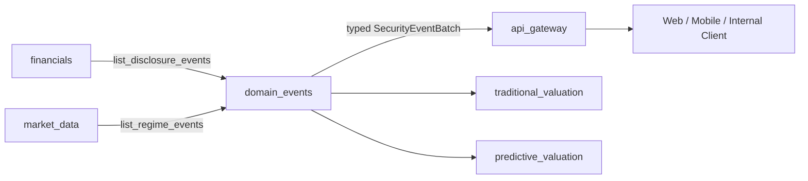

# Security Events Backend Design

## 1 文档定位

本文档定义 `manniu_backend.domain_events` 跨领域事件聚合模块，服务于研究页、预测估值、传统估值和后续事件时间线。

首期聚合两类已经由上游领域提交的个股事件：

- `FINANCIAL_DISCLOSED`：财报正式披露事件，由 `financials` 负责产生；
- `SECURITY_STYLE_CHANGED`：个股风格确认变更事件，由 `market_data` 负责产生。

`domain_events` 只负责读取、规范化、过滤、排序和返回统一事件对象，不负责产生上游事件、不复制领域判定规则、不直接调用 Tushare、不执行估值刷新。

本文档定义模块边界、内部事件服务和 API Gateway 接入契约，不实现 Django model、view、任务调度或迁移。实现前必须确认两个上游服务的字段、状态和点时语义。

参考设计：

- `docs/requirements/modules/api-gateway-design.md`
- `docs/requirements/modules/market-data-backend-design.md`
- `docs/requirements/modules/financials-backend-design.md`
- `docs/requirements/modules/traditional-valuation-backend-design.md`
- `docs/requirements/modules/predictive-valuation-backend-design.md`

## 2 首期范围与非目标

### 2.1 首期范围

1. 提供按证券、日期、事件类型查询的统一事件服务。
2. 聚合 `financials` 的财报披露事件和 `market_data` 的个股风格变更事件。
3. 保留每个事件的原始来源系统、来源事件键、来源版本、证券身份和来源日期。
4. 提供稳定排序、分页、`asof_date` 和有限结果集。
5. 通过 API Gateway 提供登录后的只读 HTTP 接口。
6. 为下游估值模块提供统一的内部读取边界，避免各模块重复拼接两个事件源。

### 2.2 非目标

- 不接管 `financials` 或 `market_data` 的事件检测、去重和持久化；
- 不修改或消费上游事件状态，不标记事件为已消费；
- 不调用 Tushare、模型推理、估值计算或财报同步任务；
- 不在查询请求中写入事件表、推进 checkpoint 或触发刷新任务；
- 不把市场风格 `MARKET_STYLE_CHANGED` 纳入首期个股事件接口；后续可单独扩展；
- 不提供事件确认、重试、发布、删除或人工修改接口；
- 不返回 SQL、原始 Provider payload、Token、连接串、内部路径或堆栈。

## 3 领域边界与架构



### 3.1 各模块职责

| 模块 | 负责 | 不负责 |
| --- | --- | --- |
| `financials` | 产生和持久化 `FINANCIAL_DISCLOSED` | 个股风格分类、公共 HTTP、跨域聚合 |
| `market_data` | 产生和持久化 `SECURITY_STYLE_CHANGED` | 财报披露判断、公共 HTTP、跨域聚合 |
| `domain_events` | 统一读取、过滤、规范化和分页两个事件源 | 事件生产、事件状态变更、领域规则复制 |
| `api_gateway` | 认证、scope、参数校验、序列化、错误封套和限流 | 直接查询事件表、拼接 ORM、复制事件语义 |
| `traditional_valuation` / `predictive_valuation` | 消费统一事件并写入本领域事件状态 | 直接读取另一领域私有事件表 |

### 3.2 依赖规则

允许的依赖方向：

```text
financials       ─┐
market_data      ─┼──> domain_events ───> api_gateway
traditional_valuation ───────────────────> domain_events
predictive_valuation  ───────────────────> domain_events
```

`financials` 和 `market_data` 不得反向导入 `domain_events`，避免循环依赖。`domain_events` 只能调用上游公开的 typed query service，例如 `DisclosureEventDetector.list_disclosure_events()` 和 `market_data.services.regime.list_regime_events()`；不得直接访问上游私有 model 或表。

## 4 统一事件类型

### 4.1 事件类型白名单

| `event_type` | `source_system` | 作用域 | 日期语义 |
| --- | --- | --- | --- |
| `FINANCIAL_DISCLOSED` | `financials` | 单只证券 + 财报期 | `effective_date`，优先 `actual_date`，否则 `ann_date` |
| `SECURITY_STYLE_CHANGED` | `market_data` | 单只证券 | `source_trade_date` |

首期接口只允许以上两个类型。未知事件类型不能通过客户端参数直接透传。

### 4.2 统一内部 DTO

建议定义不可变 typed DTO，而不是跨边界传递 Django model：

```python
@dataclass(frozen=True)
class SecurityEvent:
    event_type: Literal['FINANCIAL_DISCLOSED', 'SECURITY_STYLE_CHANGED']
    source_system: Literal['financials', 'market_data']
    source_event_key: str
    source_version: str | None
    ts_code: str
    security_id: int | None
    security_name: str | None
    scope_key: str
    event_date: date
    source_trade_date: date | None
    payload: dict[str, Any]
    status: str
    warnings: tuple[str, ...]

@dataclass(frozen=True)
class SecurityEventBatch:
    items: tuple[SecurityEvent, ...]
    page: int
    page_size: int
    total: int
    has_next: bool
    asof_date: date | None
    data_status: str
    warnings: tuple[str, ...]
```

`payload` 只保留冻结的业务字段，不能直接暴露上游整行数据。

### 4.3 事件 payload 白名单

`FINANCIAL_DISCLOSED` 至少返回：

```json
{
  "disclosure_id": 123,
  "financial_end_date": "2026-06-30",
  "report_type": "H1",
  "ann_date": "2026-08-28",
  "actual_date": "2026-08-28",
  "effective_date": "2026-08-28"
}
```

`SECURITY_STYLE_CHANGED` 至少返回：

```json
{
  "old_regime": "BALANCE",
  "new_regime": "GROWTH",
  "source_trade_date": "2026-09-18",
  "classifier_version": "security_regime_v1",
  "metrics": {}
}
```

`metrics` 必须沿用 `market_data` 已提交的指标，不由聚合模块重新计算。对外响应应限制指标字段，避免返回内部诊断信息。

## 5 内部事件服务

### 5.1 推荐服务接口

```python
list_security_events(
    *,
    ts_codes: list[str] | None = None,
    start_date: date | None = None,
    end_date: date | None = None,
    asof_date: date | None = None,
    event_types: list[str] | None = None,
    page: int = 1,
    page_size: int = 50,
) -> SecurityEventBatch
```

参数语义：

- `ts_codes`：规范化后的带交易所后缀代码；为空表示所有证券；
- `start_date/end_date`：按统一 `event_date` 过滤；
- `asof_date`：只返回 `event_date <= asof_date` 的事件；
- `event_types`：只能使用首期事件类型白名单；为空表示两类事件；
- `page` 从 1 开始；`page_size` 默认 50，最大 200；
- 日期范围和返回总量必须有界，禁止无界扫描或无界导出。

### 5.2 聚合和排序规则

两个上游服务分别查询后，`domain_events` 执行以下步骤：

1. 校验和规范化证券代码、事件类型、日期和分页参数；
2. 以 `source_event_key` 加 `source_system` 作为跨源去重身份；
3. 将上游返回对象映射为 `SecurityEvent`；
4. 丢弃不完整的事件，并在批次 warnings 中记录数量和原因；
5. 按 `event_date DESC, ts_code ASC, event_type ASC, source_event_key ASC` 稳定排序；
6. 在稳定排序后分页。

事件聚合服务不得使用数据库行顺序作为排序依据，也不得按事件状态或前端文案排序。

### 5.3 点时和缺失语义

- `FINANCIAL_DISCLOSED` 使用 `actual_date`，没有时使用 `ann_date`；
- `SECURITY_STYLE_CHANGED` 使用 `source_trade_date`；
- 显式 `asof_date` 不得返回之后的事件；
- 缺失事件日期不能伪造为当天，必须丢弃并记录 warning；
- 上游一个领域为空不代表整体失败，返回另一领域的有效事件并标记 `PARTIAL_SUCCESS`；
- 两个领域都不可用时返回 typed dependency error，不返回空的 `NO_DATA`；
- 两个领域均可用但没有匹配事件时返回 `NO_DATA` 和空列表。

### 5.4 只读和一致性

`list_security_events()` 必须是无副作用查询：

- 不写 PostgreSQL；
- 不修改上游事件 `status` 或 `consumed_at`；
- 不创建本地聚合快照；
- 不推进任何消费 checkpoint；
- 不调用 Tushare、模型或估值刷新任务。

首期不新增聚合事件表。历史来源和事件键直接由上游持久化记录提供；如未来需要高性能时间线，再单独设计不可变投影表和回填策略。

## 6 API Gateway 接入

### 6.1 外部接口

首期提供按证券查询的事件时间线接口：

```text
GET /api/v1/market-analysis/securities/:ts_code/events
```

请求要求：

- 登录认证；
- `market_analysis:read` scope；
- `market_analysis:history` scope 用于显式历史日期范围；
- 规范化证券代码；
- `start_date`、`end_date` 可选，范围最多 366 个自然日；
- `asof_date` 可选，不得晚于当前日期；
- `event_type` 可选，只允许 `FINANCIAL_DISCLOSED` 或 `SECURITY_STYLE_CHANGED`；
- `page` 默认 1，`page_size` 默认 50，最大 200。

示例：

```text
GET /api/v1/market-analysis/securities/603259.SH/events
  ?event_type=FINANCIAL_DISCLOSED
  &start_date=2025-01-01
  &end_date=2026-09-20
  &page=1
  &page_size=50
```

### 6.2 成功响应

```json
{
  "success": true,
  "api_version": "v1",
  "request_id": "uuid",
  "data": {
    "items": [
      {
        "event_type": "FINANCIAL_DISCLOSED",
        "source_system": "financials",
        "source_event_key": "financial-disclosed:123:2026-08-28:hash",
        "source_version": "revision-1",
        "security": {
          "ts_code": "603259.SH",
          "name": "药明康德"
        },
        "scope_key": "SECURITY:603259.SH:2026-06-30",
        "event_date": "2026-08-28",
        "source_trade_date": null,
        "payload": {
          "financial_end_date": "2026-06-30",
          "report_type": "H1",
          "ann_date": "2026-08-28",
          "actual_date": "2026-08-28",
          "effective_date": "2026-08-28"
        },
        "status": "COMMITTED",
        "warnings": []
      }
    ],
    "summary": {
      "total": 1,
      "financial_disclosed_count": 1,
      "security_style_changed_count": 0
    }
  },
  "meta": {
    "page": 1,
    "page_size": 50,
    "total": 1,
    "total_pages": 1,
    "has_next": false,
    "asof_date": "2026-09-20",
    "data_status": "COMPLETE",
    "warnings": []
  }
}
```

`source_event_key` 可用于审计和下游幂等，但不得包含未脱敏的 SQL 或凭证信息。若不希望向普通客户端暴露完整来源键，可返回稳定哈希并在内部服务保留原值；该策略必须在接口确认闸门冻结。

### 6.3 Gateway 职责

Gateway 负责：

1. 校验认证和 scope；
2. 校验 `ts_code`、日期范围、事件类型和分页；
3. 生成或透传 `X-Request-ID`；
4. 调用 `domain_events.list_security_events()`；
5. 序列化 typed DTO 为统一响应封套；
6. 映射依赖错误、参数错误和无数据状态；
7. 执行响应大小和请求超时限制；
8. 记录 request ID、过滤摘要、数据状态和下游耗时，不记录 Token 和 SQL。

Gateway 不得：

- 直接导入 `FinancialDisclosureRecord`、`RegimeEvent`；
- 在 view 中拼接两个领域的 ORM 查询；
- 根据事件 payload 重新判断风格或财报是否有效；
- 把两个来源的日期改写成同一个日期；
- 将缺失事件填充为静态事件或空事件。

### 6.4 错误和业务状态

| 场景 | HTTP | 错误/状态 |
| --- | --- | --- |
| 未认证 | 401 | `AUTHENTICATION_REQUIRED` |
| scope 不足 | 403 | `SCOPE_REQUIRED` |
| 代码或日期非法 | 400 | `INVALID_REQUEST` / `INVALID_SYMBOL` |
| 日期范围超过 366 天 | 400 | `RANGE_TOO_LARGE` |
| 事件类型不支持 | 400 | `INVALID_EVENT_TYPE` |
| 一个上游不可用 | 200 | `data_status=PARTIAL_SUCCESS` |
| 两个上游均不可用 | 503 | `UPSTREAM_DEPENDENCY_UNAVAILABLE` |
| 无匹配事件 | 200 | `data_status=NO_DATA` |

普通数据不足属于成功响应中的业务状态，不应被转换为 500。错误详情不得包含堆栈、SQL、数据库连接串或内部文件路径。

### 6.5 API Catalog 注册

在 `api_gateway/catalog.py` 增加公开只读目录项：

```text
id: market_data.security_events.list
method: GET
path: /api/v1/market-analysis/securities/:ts_code/events
visibility: public
access_mode: authenticated
required_scope: market_analysis:read
history_scope: market_analysis:history
```

目录参数必须定义 `ts_code`、`event_type`、`start_date`、`end_date`、`asof_date`、`page` 和 `page_size` 的类型、默认值、枚举和限制。目录不暴露上游 model 字段或内部事件表字段。

## 7 下游事件消费

传统估值和预测估值的事件导入服务统一调用：

```python
from domain_events.services.security_events import list_security_events
```

消费方必须：

- 使用 `source_system + source_event_key` 做幂等键；
- 保留源事件类型、版本、日期和 payload；
- 在本领域事件表中记录消费状态；
- 只在成功复制事件后推进自己的 checkpoint；
- 不修改 `domain_events` 或上游事件状态。

`domain_events` 不负责确认消费成功，也不负责重试下游失败。下游需要重试时重复读取相同的有界查询即可。

## 8 性能、并发与可观测性

- 两个上游查询应使用独立 timeout，并在 Gateway deadline 到期时取消；
- `ts_code` 查询必须优先使用上游索引或按证券过滤，禁止先读取全市场再在内存过滤；
- 聚合服务默认最大返回 200 条，响应体设置硬上限；
- 首期不做聚合结果持久化；如启用缓存，key 必须包含 API 版本、证券代码、事件类型、日期范围、as-of 和权限可见性；
- 日志记录 `request_id`、ts_code、事件类型、as-of、上游耗时、返回数量和 data_status；
- 指标建议包括：
  - `domain_events_requests_total{event_type,status}`；
  - `domain_events_dependency_duration_seconds{source_system}`；
  - `domain_events_partial_success_total{source_system}`；
  - `domain_events_returned_total{event_type}`。

## 9 测试与验收标准

### 9.1 内部服务测试

- 两个事件源均有数据时，返回统一排序和正确分页；
- 只存在财报事件时，返回 `COMPLETE`；
- 只存在风格事件时，返回 `COMPLETE`；
- 一个上游异常时，另一来源仍能返回，状态为 `PARTIAL_SUCCESS`；
- 两个上游异常时返回 typed dependency error；
- 同一来源事件重复出现时按来源键去重；
- 事件日期晚于 `asof_date` 时不会返回；
- 缺失日期不会被填充为当天；
- 不修改上游事件的 status、consumed_at 或 checkpoint；
- 不触发 Tushare、估值计算或数据库写入。

### 9.2 Gateway 合约测试

- 未认证请求在调用领域服务前返回 401；
- 缺少 scope 返回 403；
- 非法代码、事件类型、日期和分页返回 400；
- 超过 366 天返回 `RANGE_TOO_LARGE`；
- 成功响应包含统一封套、分页、事件类型、来源日期和 warnings；
- 单个上游不可用返回 200 加 `PARTIAL_SUCCESS`；
- 两个上游不可用返回 503；
- 不暴露 ORM、SQL、Token、堆栈和内部路径；
- API Catalog 中的路径与实际路由一致。

## 10 实施闸门与顺序

1. **字段确认**：确认 `FinancialDisclosureRecord` 的公告/实际发布字段、报告期和 source revision；确认 `RegimeEvent` 的来源日期、classifier version 和 payload 白名单。
2. **服务骨架**：创建 `domain_events` Django app、DTO、错误类型和 `list_security_events()`。
3. **上游适配**：只调用 `financials` 与 `market_data` 的公开事件 query service，不直接导入私有 model。
4. **下游迁移**：传统估值和预测估值先接入统一服务，再删除重复的双源拼接逻辑。
5. **Gateway 接入**：增加 view、URL、参数解析、统一序列化、scope 和 catalog 注册。
6. **测试闸门**：完成聚合、点时、部分成功、权限、只读性、超时和敏感信息脱敏测试。
7. **发布闸门**：完成 PostgreSQL 集成测试和真实事件抽样，确认两类事件可按证券和日期追溯。

## 11 待确认事项

- 是否对普通客户端暴露原始 `source_event_key`，还是仅返回稳定脱敏哈希；
- `event_date` 是否统一命名为 `effective_date`，或保留事件类型对应的来源日期字段；
- 是否首期开放跨证券事件列表，还是只开放 `/securities/:ts_code/events`；
- `PARTIAL_SUCCESS` 时是否在 `meta.warnings` 中返回具体失效的 source system；
- 是否需要为事件时间线增加 `MARKET_STYLE_CHANGED`；
- API Catalog 的 endpoint id、默认 page size 和 history scope 是否与 Gateway 最终实现一致。

## 12 验收结论

完成本设计后，系统应满足：

- 财报事件和个股风格事件仍由各自领域独立产生；
- 客户端和下游模块通过一个稳定的 `domain_events` 服务读取两类事件；
- 事件保留来源、版本、日期、状态和可审计身份；
- 单源不可用不会丢弃另一来源的有效事件；
- API Gateway 提供认证、权限、分页、错误和响应封套；
- 查询全程只读，不回源、不推理、不写库、不推进事件消费状态。
