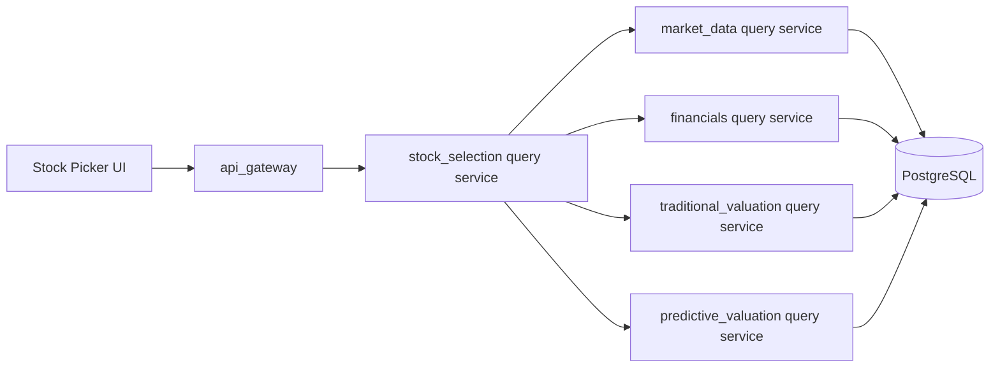

# Stock Selection Backend Design

## 1 文档定位

本文档定义 `manniu_backend` 的 `stock_selection` 选股领域需求，服务于前台股票选股工作台。目标是：接收结构化选股条件，从 PostgreSQL 中读取点时一致的证券、财务和已持久化估值结果，执行五大维度筛选及风险扫描，并返回财务指标、估值指标和评分。

本文档只定义需求、领域边界、输入输出契约和实施闸门，不实现 Django model、query service、API view、任务调度或数据库迁移。实现前必须逐项确认 PostgreSQL 字段、数据单位、当前结果表和内部服务返回类型。

参考设计：

- 前台设计：`docs/requirements/frontend/stock-selection-ui-design.md`
- 预设指标体系：`docs/requirements/modules/stock-selection-pre-select-filter-design.md`
- API Gateway：`docs/requirements/modules/api-gateway-design.md`
- 财务领域：`docs/requirements/modules/financials-backend-design.md`
- 传统估值领域：`docs/requirements/modules/traditional-valuation-backend-design.md`
- 预测估值领域：`docs/requirements/modules/predictive-valuation-backend-design.md`

## 2 首期范围与非目标

### 2.1 首期范围

1. 支持全市场或指定市场、SW 行业、报告期和选股日期条件。
2. 按《选股系统指标体系 V1.0》支持成长性、盈利质量、现金流质量、财务健康和估值水平五大维度的正向筛选。
3. 支持九个正向预设方案及独立的排雷模式；正向方案按 AND 组合，排雷命中任一风险条件即返回。
4. 从财务、行情及估值领域读取基础数据并按统一点时边界筛选。
5. 读取传统估值当前结果和预测估值当前结果，分别注入价值估分和模型估分。
6. 返回稳定分页、排序、来源日期、数据状态、风险命中项和逐行缺失原因。
7. 通过 API Gateway 对外提供认证后的只读查询接口。

### 2.2 非目标

- 不提供下单、撤单、持仓交易或自动交易能力。
- 不在查询请求中调用 Tushare、训练模型、执行模型推理、生成估值快照或写入业务表。
- 不由 `stock_selection` 复制财务评分、传统估值或预测估值公式。
- 首期不提供用户保存、覆盖、删除筛选器方案的写接口；预存筛选器仅作为前台配置/服务端白名单方案。
- 不支持无界全市场导出；CSV 导出由前端基于当前有界结果或后续独立导出需求处理。

## 3 领域边界与架构



### 3.1 `stock_selection` 负责

- 解析已规范化的选股请求。
- 取得有界证券 universe。
- 批量请求财务基础数据。
- 按筛选规则判定命中、未命中和数据不足。
- 批量关联传统估值与预测估值当前结果。
- 生成面向前台的行级结果、摘要统计、分页和稳定排序。
- 维护结果的 `data_status`、来源日期、版本和 warning，不伪造缺失值。

### 3.2 `stock_selection` 不负责

- 直接跨应用拼接 ORM 查询。
- 直接读取其他领域的私有 model 或表。
- 重新计算财务评价、低估分、预测信号分或买卖动作。
- 在缺少结果时把 `null` 改成 `0`、静态样例或前端推导值。

### 3.3 推荐内部服务边界

```python
stock_selection.screen(
    *,
    universe,
    filters,
    report_type,
    asof_date,
    page,
    page_size,
    sort_key,
    sort_direction,
)
```

该服务返回类型化结果对象，不返回 Django `QuerySet`、HTTP `Response` 或原始 ORM 行。

## 4 选股请求参数

### 4.1 请求语义

首期对外使用 `GET` 查询接口。所有参数必须有白名单、类型和范围校验；未提供的可选条件表示“不按该条件筛选”，不表示阈值为零。

| 参数 | 类型 | 必填 | 默认值 | 约束与说明 |
| --- | --- | --- | --- | --- |
| `preset` | string | 否 | `maniu-selected` | 只接受本节 V1.0 新预设；未提交的条件沿用 preset，显式筛选参数覆盖对应条件；版本见 `preset_version` |
| `screen_mode` | enum | 否 | `screen` | `screen` 或 `risk`；`risk` 未指定 preset 时使用 `risk-scan`，估值条件不参与；显式传入冲突预设时拒绝 |
| `pool` | enum | 否 | `market` | `market`；首期不开放用户私有股票池 |
| `market` | enum | 否 | `all` | `all`、`sh-main`、`sz-main`、`cyb`、`star` |
| `industry` | string | 否 | `all` | 规范 SW 行业代码；不接受展示名称替代代码 |
| `report_type` | string | 否 | `26H1` | 格式为 `YYQ1`、`YYH1`、`YYQ3`、`YYFY`，例如 `26Q1`、`26H1`；按年度和报告期先缩小候选财务池 |
| `asof_date` | date | 否 | 最新完成交易日 | 不得晚于当前日期；所有来源结果不得晚于该日期 |
| `revenue_yoy_min` / `revenue_yoy_max` | number | 否 | 未设置 | 百分比点；最大值、最小值均为可选，闭区间比较 |
| `profit_yoy_min` / `profit_yoy_max` | number | 否 | 未设置 | 净利润同比增长率，百分比点 |
| `ebit_yoy_min` / `ebit_yoy_max` | number | 否 | 未设置 | EBIT 同比增长率，百分比点；不得用净利润增长代替 |
| `roe_min` / `roe_max` | number | 否 | 未设置 | 百分比点 |
| `roic_min` / `roic_max` | number | 否 | 未设置 | 百分数值，从 `FinancialIndicatorRecord.raw_payload["roic"]` 提取；不乘以 100 |
| `gross_margin_min` / `gross_margin_max` | number | 否 | 未设置 | 毛利率百分比点 |
| `gross_margin_improved` | boolean | 否 | `false` | `true` 要求毛利率同比变化严格大于 0 |
| `net_profit_positive` | boolean | 否 | `false` | `true` 要求所选报告期 `FinancialIncomeRecord.n_income` 严格大于 0 |
| `operating_cash_flow_positive` | boolean | 否 | `false` | `true` 要求经营现金流金额严格大于 0 |
| `free_cash_flow_positive` | boolean | 否 | `false` | `true` 要求自由现金流严格大于 0；自由现金流定义由 financials 冻结 |
| `cash_profit_ratio_min` / `cash_profit_ratio_max` | number | 否 | 未设置 | 现金利润比暂按 `n_cashflow_act / n_income`；无量纲比值；`n_income <= 0` 时不可用 |
| `net_cash` | boolean | 否 | `false` | `true` 要求净现金企业；按现金及有息债务口径判定 |
| `debt_to_assets_min` / `debt_to_assets_max` | number | 否 | 未设置 | 资产负债率百分比点；风险模式使用 `>70` 风险条件 |
| `liquidity_ratio_min` / `liquidity_ratio_max` | number | 否 | 未设置 | 使用 `FinancialIndicatorRecord.current_ratio`；原始倍数，`1.5` 表示 1.5 倍 |
| `goodwill_to_equity_min` / `goodwill_to_equity_max` | number | 否 | 未设置 | 商誉/净资产百分比点；净资产非正时需定义为不可判定/风险 |
| `pe_ttm_min` / `pe_ttm_max` | number | 否 | 未设置 | PE(TTM)；亏损股和非正 PE 的比较/缺失语义待估值领域确认 |
| `pb_min` / `pb_max` | number | 否 | 未设置 | PB；净资产非正时不作为数值 0 处理 |
| `peg_min` / `peg_max` | number | 否 | 未设置 | PEG；增长率为零或负数时为不可用，不参与隐式转换 |
| `dividend_yield_min` / `dividend_yield_max` | number | 否 | 未设置 | 股息率百分比点 |
| `market_cap_min` / `market_cap_max` | number | 否 | 未设置 | 总市值，单位为人民币万元（`CNY_10K`）；前台以亿元编辑并乘 `10000` 后提交；小而美预设 20 亿至 200 亿元对应 `200000` 至 `2000000` |
| `sort` | enum | 否 | `score` | `score`、`value_valuation_score`、`model_valuation_score`、`revenue_yoy`、`profit_yoy`、`ebit_yoy`、`roe`、`roic`、`gross_margin`、`gross_margin_change`、`operating_cash_flow`、`free_cash_flow`、`cash_profit_ratio`、`debt_to_assets`、`liquidity_ratio`、`goodwill_to_equity`、`market_cap`、`pe_ttm`、`pb`、`peg`、`dividend_yield` |
| `direction` | enum | 否 | `desc` | `asc` 或 `desc` |
| `page` | integer | 否 | 1 | 从 1 开始 |
| `page_size` | integer | 否 | 20 | 范围 `1-200`，默认前台可使用 20 |

前台百分比阈值与财务模型的百分数字段统一使用百分点数值，例如 `10` 表示 `10%`；不得再乘以 100 或按比例值转换。流动比率使用倍数，现金利润比和 PEG 使用无量纲数值，现金流使用人民币元。总市值筛选使用人民币万元：前台亿元值乘 `10000` 后提交，直接与 `StockDailyFundamentalHistory.total_mv` 比较；结果行 `market_cap` 以人民币亿元返回，为 `total_mv / 10000`。未提供阈值表示沿用 preset；数值参数显式传空字符串表示清除该 preset 边界、不应用该阈值；显式 `false` 表示关闭对应布尔条件。区间下限不得大于上限。`report_type` 是候选池边界而不是仅用于响应展示：服务必须先按报告期年份、期末月份和 `ann_date <= asof_date` 查询可用财务证券，再执行逐证券筛选，以避免对全市场逐股扫描。

### 4.2 预存筛选器

V1.0 预存方案为只读白名单。下表是设计目标，不代表当前接口已支持全部规则：

| key | 默认条件 |
| --- | --- |
| `maniu-selected` | 营收/净利润/EBIT 增长 ≥8%；ROE ≥15%、ROIC ≥12%、毛利率改善；经营现金流与自由现金流为正；资产负债率 ≤50%、流动比率 ≥1.5；PE ≤25、股息率 ≥2% |
| `buffett-moat` | 营收/净利润增长 ≥5%；ROE ≥20%、ROIC ≥15%、毛利率 ≥40%；经营现金流与自由现金流为正；资产负债率 ≤50%；PE ≤30 |
| `high-growth` | 营收/净利润/EBIT 增长 ≥20%；ROE ≥10%；经营现金流为正；PEG ≤1.5 |
| `cash-cow` | ROE ≥15%、ROIC ≥12%；经营现金流与自由现金流为正、净现金；PE ≤20 |
| `undervalued` | ROE ≥10%；经营现金流为正；资产负债率 ≤60%；PE ≤15、PB ≤1.5 |
| `high-dividend` | ROE ≥10%；经营现金流为正；股息率 ≥5% |
| `small-beautiful` | 营收/净利润增长 ≥15%；ROE ≥15%；经营现金流为正；总市值 20亿~200亿元 |
| `turnaround` | 营收/净利润增长 ≥0%；ROE ≥8%；经营现金流为正；PB ≤2 |
| `net-cash-bargain` | 净利润为正、净现金；PE ≤12、PB ≤1.5 |
| `risk-scan` | 连续 2 年净利润增长为负、ROE <5%、经营现金流为负、资产负债率 >70%、商誉/净资产 >30%；命中任一条件，估值不参与 |

V1.0 完全替换旧预设；默认方案为 `maniu-selected`，不再保留 `quality-growth`、`steady-growth`、`cash-flow`、`low-risk` 的别名或默认行为。请求传入旧 key 时返回 `UNSUPPORTED_PRESET`。当前服务已实现本节 V1.0 预设、指标筛选与风险扫描契约。

具体阈值必须在实现前冻结为版本化配置。默认首页只突出 `maniu-selected`、`buffett-moat`、`high-growth`、`cash-cow`、`undervalued`。请求返回 `preset_key` 和 `preset_version`，避免前台无法解释历史结果使用的方案版本。选择预设后显式传入的条件覆盖同名预设条件；显式布尔 `false` 也覆盖预设 `true`。

## 5 财务基础数据来源与点时规则

### 5.1 来源边界

`stock_selection` 只调用 `financials` 暴露的 typed query service，例如：

```python
financials.query_screening_fundamentals(
    *, securities, asof_date, report_type
)
```

财务服务负责报告期选择、公告有效性、修订版本和 as-of 语义；选股服务不得自行从收入、利润或资产负债表 raw 表拼接事实。

### 5.2 必需基础字段

| 选股指标 | 推荐财务来源 | 单位 | 缺失处理 |
| --- | --- | --- | --- |
| `revenue_yoy` | `FinancialIndicatorRecord.or_yoy` | 百分数值 | 百分数点值；缺失则条件不可判定 |
| `profit_yoy` | `FinancialIndicatorRecord.netprofit_yoy`；利润金额字段使用 `FinancialIncomeRecord.n_income` | 百分数值 / CNY | 净利润金额统一使用 `n_income`；增长字段缺失不可视为 0 |
| `ebit_yoy` | `FinancialIncomeRecord.operate_profit` 同报告期同比派生 | 百分数值 | 不得用净利润增长代替 |
| `roe` | `FinancialIndicatorRecord.roe` | 百分数值 | 例如 `10` 表示 `10%`；不做比例转换 |
| `roic` | `FinancialIndicatorRecord.raw_payload["roic"]`（`fina_indicator` endpoint） | 百分数值 | 从 JSON key 提取并转换为 Decimal；核验库中 158,868 行有 key、155,854 行非空；按 `10` 表示 `10%`，不乘以 100 |
| `gross_margin` | `FinancialIndicatorRecord.grossprofit_margin` | 百分数值 | 例如 `40` 表示 `40%` |
| `gross_margin_change` | 当期与去年同期 `grossprofit_margin` 相减 | 百分点变化 | 缺少任一期间时不可判定 |
| `operating_cash_flow` | `FinancialCashFlowRecord.n_cashflow_act` | CNY | 与 0 比较；不展示为百分比 |
| `free_cash_flow` | `FinancialCashFlowRecord.raw_payload["free_cashflow"]`（`cashflow` endpoint） | CNY | 从 JSON key 提取并转换为 Decimal；核验库中 170,757 行有 key、131,846 行非空 |
| `cash_profit_ratio` | `FinancialCashFlowRecord.n_cashflow_act / FinancialIncomeRecord.n_income` | 无量纲比值 | 分子、分母使用同一报告期；`n_income` 缺失或 `<= 0` 时不可判定 |
| `liquidity_ratio` | `FinancialIndicatorRecord.current_ratio` | 倍数 | 使用指标表字段；例如 `1.5` 表示 1.5 倍 |
| `net_cash` | `FinancialBalanceSheetRecord.money_cap` 与短期/长期借款字段派生 | boolean + evidence | 现金覆盖 `st_borr`/`short_borrow` 与 `lt_borr`/`long_borrow`；必要字段缺失时不可判定 |
| `debt_to_assets` | `FinancialIndicatorRecord.debt_to_assets` | 百分数值 | 例如 `70` 表示 `70%`；不做比例转换 |
| `goodwill_to_equity` | `FinancialBalanceSheetRecord.raw_payload["goodwill"]`（`balancesheet` endpoint）；净资产=`total_assets - total_liab` | 百分数值 | 从 JSON key 提取并转换为 Decimal；核验库中 143,920 行有 key、68,120 行非空；计算 `goodwill / 净资产 * 100`；净资产 `<=0` 时不可判定 |
| `net_profit_yoy_negative_2y` | `FinancialIncomeRecord.n_income` 连续三个同报告期金额派生两个同比 | boolean + evidence | 两个同比均严格小于 0 才命中；任一报告点缺失则未评估 |
| `market_cap` | `StockDailyFundamentalHistory.total_mv` | 筛选比较为 CNY_10K；响应行为 CNY_100M | 源字段单位为万元人民币；取 `trade_date <= asof_date` 最近行；筛选直接比较源值，响应值为源值除以 `10000` |
| `pe_ttm` / `pb` | `StockDailyFundamentalHistory.pe_ttm` / `pb` | 无量纲倍数 | 使用 `asof_date` 前最近历史行；非正/无效估值按不可用处理 |
| `peg` | `pe_ttm / netprofit_yoy` | 无量纲倍数 | `netprofit_yoy` 按百分数值参与计算；增长率 `<=0` 或字段缺失时不可用 |
| `dividend_yield` | `StockDailyFundamentalHistory.dv_ratio` | 百分数值 | 使用 `asof_date` 前最近历史行；按百分数值处理，不再换算为比例 |

财务字段按 `ann_date <= asof_date` 选择最新有效公告版本，并保留 `financial_end_date`、`ann_date`、`report_type`、`source_revision_at` 或等价 provenance。行情基本面使用历史表按交易日点时读取，不得使用 latest 表回填历史日期。百分比字段均以百分数值存储/传输，例如 `15` 表示 `15%`；只有流动比率、现金利润比、PEG 等明确的倍数/比率字段使用无量纲值。`roic`、`free_cashflow`、`goodwill` 已核验存在于各自模型行的 `raw_payload` JSON 中，选股服务通过 typed query service 提取后进行 Decimal 归一化；不要求为本次选股新增 ORM 列或迁移。上表非空覆盖率是当前核验快照，运行时仍须将 JSON key 缺失、JSON null 和非法数值处理为不可判定并计入数据状态。

### 5.3 筛选判定

- `screen_mode=screen` 下所有启用的正向条件默认使用 AND 关系；双边阈值使用闭区间比较。
- `screen_mode=risk` 仅执行五项排雷规则，任意一项为真即命中；估值条件不参与，也不与正向筛选条件做 AND。
- 未设置的数值阈值不参与判断；启用条件所需指标缺失时，正向筛选判为不可匹配并记录缺失原因，不用 0 替代。
- 排雷模式中任一风险指标为真即可返回命中项；未命中的指标若缺失，则列入 `unassessed_risk_rules`，不得推断为无风险。连续两年负增长须有两个有效、可比的同比数据点。
- `gross_margin_improved=true` 要求变化值严格大于 0；缺失不能视为改善。
- `operating_cash_flow_positive=true` 要求原始经营现金流严格大于 0。
- `free_cash_flow_positive=true` 要求自由现金流严格大于 0；现金利润比及各财务比率仅按明确的归一化单位比较。
- 已退市、停牌状态或不属于请求 universe 的证券不进入结果，具体证券状态由 `market_data` 冻结。
- 正向筛选和风险扫描分别统计 `screened_count`、`matched_count` 及缺失/未评估数量；风险扫描另提供按风险项统计的命中数。

## 6 估值分注入

### 6.1 来源与映射

选股服务只读取两个领域的已持久化 current summary，不重算分数：

| 前台字段 | 来源领域 | 来源字段 | 说明 |
| --- | --- | --- | --- |
| `value_valuation_score` | `traditional_valuation` | `undervalue_score` 或冻结后的 summary score | 保留原始单位和数值 |
| `model_valuation_score` | `predictive_valuation` | `signal_score` | 保留原始单位和模型版本 |
| `pe_ttm` / `pb` / `peg` / `dividend_yield` | 对应估值/行情 typed query | 经确认的估值指标值 | 用于指标筛选和展示，不得从估值分反推 |

传统估值结果必须带 `valuation_variant`、`report_type`、`asof_date`、`source_trade_date`、`status` 和 `reason_code`。模型估值结果必须带 `report_type`、`financial_end_date`、`source_market_date`、`model_version`、`anchor_mode`、`status` 和 `reason_code`。

### 6.2 缺失与部分成功

- 财务条件命中但估值结果缺失时，个股仍可返回；对应分数为 `null`，状态为 `NOT_AVAILABLE`，并返回稳定原因码。
- 估值分为 `null` 时，禁止填充 0、沿用上一期、跨报告期回退或根据其他列推导。
- 传统估值和模型估值可以拥有不同来源日期，必须原样返回。
- 单个估值领域不可用时，列表整体可返回 `PARTIAL_SUCCESS`；所有领域和财务基础数据均不可用时才返回明确失败或 `DATA_NOT_READY`。
- 估值指标值（PE、PB、PEG、股息率）可按第 4 节阈值筛选；估值评分本身首期不作为筛选条件。两类字段均须冻结来源日期、单位和缺失语义。

## 7 结果响应需求

### 7.1 单行字段

前台财务表现表至少需要以下字段：

```json
{
  "ts_code": "300750.SZ",
  "name": "宁德时代",
  "sw_industry": {"code": "850931.SI", "name": "电力设备"},
  "financial_score": 92,
  "value_valuation_score": 81,
  "model_valuation_score": 86,
  "revenue_yoy": 18.4,
  "profit_yoy": 22.8,
  "ebit_yoy": 20.6,
  "roe": 19.7,
  "roic": 15.2,
  "gross_margin": 28.4,
  "gross_margin_change": 2.1,
  "operating_cash_flow": 3650000000,
  "free_cash_flow": 2100000000,
  "cash_profit_ratio": 0.92,
  "debt_to_assets": 42.1,
  "liquidity_ratio": 1.9,
  "goodwill_to_equity": 3.2,
  "market_cap": 1250,
  "pe_ttm": 22.6,
  "pb": 3.1,
  "peg": 1.2,
  "dividend_yield": 2.3,
  "risk_flags": [],
  "unassessed_risk_rules": [],
  "data_status": "OK",
  "warnings": []
}
```

缺失字段保持 `null`，不使用 `0` 替代。字段应附带单位或在响应 `meta` 中统一声明。

### 7.2 响应封套

响应沿用 API Gateway 统一封套，`data` 建议包含：

```json
{
  "screen_mode": "screen",
  "preset_key": "maniu-selected",
  "preset_version": "v1",
  "filters": {},
  "summary": {
    "market_stock_count": 5214,
    "screened_count": 5214,
    "matched_count": 86,
    "returned_count": 20,
    "unassessed_count": 0
  },
  "items": [],
  "risk_summary": null,
  "filter_units": {
    "market_cap": "CNY_10K"
  },
  "units": {
    "revenue_yoy": "percentage_points",
    "operating_cash_flow": "CNY",
    "liquidity_ratio": "multiple",
    "market_cap": "CNY_100M",
    "dividend_yield": "percentage_points"
  },
  "valuation_status": {
    "traditional": "COMPLETE",
    "predictive": "PARTIAL_SUCCESS"
  }
}
```

`meta` 至少返回 `page`、`page_size`、`total`、`total_pages`、`has_next`、`asof_date`、`financial_end_date`（适用时）、来源日期、`data_status`、`warnings` 和版本信息。

`screen_mode=risk` 时，`risk_summary` 返回每条风险规则的 `hit_count`、`unassessed_count` 和规则版本；每行 `risk_flags` 列出命中的规则 key、指标值和阈值，`unassessed_risk_rules` 列出因数据缺失而无法判断的规则。`screen_mode=screen` 时 `risk_summary` 为 `null`，普通筛选不附加风险标签。

### 7.3 排序和分页

- 默认按 `financial_score desc`，再按 `ts_code asc` 稳定排序；排序字段白名单包含五大维度的可排序指标和估值评分。
- 允许排序字段必须来自白名单；禁止客户端传入 SQL 表达式。
- 排序字段为缺失值时，缺失项排在最后，且规则在 contract test 中冻结。
- 分页必须在稳定排序后执行，不能由前端对全量结果重新排序。
- 列表结果有界，首期最大 `page_size=200`，不支持同步无界导出。

## 8 状态、错误与可观测性

### 8.1 业务状态

支持 `COMPLETE`、`PARTIAL_SUCCESS`、`NO_DATA`、`INSUFFICIENT_DATA`、`STALE`、`DATA_NOT_READY` 和 `FAILED`。每个估值域和每条记录可保留独立状态，不能用一个模糊 `degraded` 覆盖原因。

### 8.2 选股专用错误

| 错误码 | HTTP | 场景 |
| --- | --- | --- |
| `INVALID_SCREEN_FILTER` | 400 | 阈值、枚举或布尔条件非法 |
| `UNSUPPORTED_PRESET` | 422 | 预存方案不在白名单 |
| `SCREEN_RANGE_TOO_LARGE` | 400 | 日期或返回范围超出限制 |
| `SCREEN_DATA_NOT_READY` | 503 | 财务基础数据尚未就绪 |
| `VALUATION_DEPENDENCY_UNAVAILABLE` | 503 | 必要估值领域不可用且无法形成结果 |

日志和指标必须记录 `request_id`、筛选方案、规范化参数摘要、as-of、命中数、各下游耗时、数据状态和版本；不得记录 Token、完整 Authorization、SQL、连接串或模型私密路径。

## 9 API Gateway 接入需求

### 9.1 外部路径

```text
GET /api/v1/market-analysis/stock-selection/results
```

该接口要求登录和 `market_analysis:read` scope。若未来支持用户私有筛选器或股票池，应另行增加授权规则，不能通过 `pool` 参数绕过用户边界。

### 9.2 Gateway 职责

1. 校验认证、scope、日期、枚举、阈值、分页和排序白名单。
2. 规范化无后缀证券/行业输入；选股首期只接受规范 SW 行业代码。
3. 生成或透传 `X-Request-ID`。
4. 调用 `stock_selection.screen()`，不直接查询财务、估值或证券 ORM。
5. 返回统一成功/错误封套，保留领域状态、来源日期、版本和 warning。
6. 按用户、IP、endpoint 和全局配额限流；限制响应体大小和查询超时。

### 9.3 只读与一致性要求

该接口不得写入 PostgreSQL，不得推进 watermark，不得触发 Tushare、模型推理、估值快照创建或训练任务。缓存如启用，key 必须包含 API 版本、规范化筛选条件、`screen_mode`、`preset_version`、风险规则版本、`asof_date`、报告期、估值版本和权限可见性。

## 10 实施闸门与验收标准

### 10.1 接口确认闸门

实现前必须确认：

- PostgreSQL 中证券、SW 行业、财务指标、现金流、净现金判定字段及 `roic`、`free_cashflow`、`goodwill` raw_payload JSON key 的提取与 Decimal 归一化；核验 JSON 缺失/null/非法值处理，不要求新增 ORM 列或迁移。
- 财务同比、流动比率、ROIC、自由现金流、现金利润比、资产负债率、商誉/净资产和连续两年净利润负增长的 PostgreSQL 字段/派生口径、单位及缺失语义。
- 总市值、PE(TTM)、PB、PEG、股息率的真实数据来源、单位和 `asof_date` 选择规则。
- 传统估值 `undervalue_score` 的范围、版本和报告期选择。
- 预测估值 `signal_score` 的范围、模型版本、anchor 和当前结果选择。
- 五大维度的 API 请求参数、响应字段、单位元数据、风险规则 key、新预设 key/version；旧预设 key 不再兼容，默认使用 `maniu-selected`。
- `financial_score` 的权重、版本和是否直接复用 `financials.evaluation.overall.score`。
- `asof_date` 下财务报告有效边界与估值来源日期对齐规则。

### 10.2 验收标准

- 合法筛选参数可以返回稳定分页结果，且结果行可追溯到财务、传统估值和预测估值来源日期。
- 任何缺失值都保持 `null` 并有状态/原因，不被填充为 0 或静态样例。
- 财务条件判定不使用未来公告或未来行情；`asof_date` 测试不得发生 look-ahead。
- 传统估值分直接来自传统估值服务，模型估值分直接来自预测估值服务，选股服务不复制公式。
- 估值单域失败不会丢弃财务命中的股票，列表可返回 `PARTIAL_SUCCESS`。
- 未认证、scope 不足、非法参数、超范围、下游超时和数据未就绪均返回稳定错误语义。
- 查询不写库、不回源、不推理、不生成快照，且 contract test 能证明这些边界。

## 11 后续扩展

- 用户保存/编辑/删除筛选方案，需要独立的 `personal_user` 资源和写入审计。
- 估值分阈值筛选仍需单独冻结分数单位、缺失行为和跨领域 as-of 语义；本设计中的 PE/PB/PEG/股息率是指标值筛选，不是估值分筛选。
- 异步大范围导出需另行设计 operator-only job API，不放入同步查询。
- 结果快照和回测引用需要独立的批次标识、版本和不可变存档契约。
