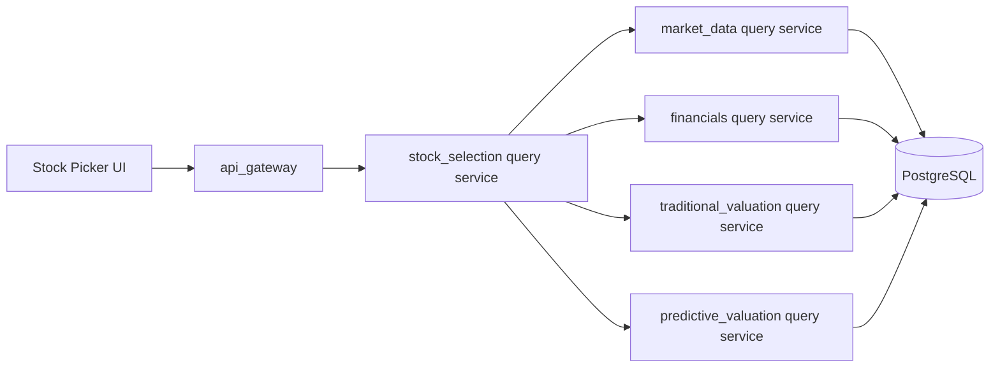

# Stock Selection Backend Design

## 1 文档定位

本文档定义 `manniu_backend` 的 `stock_selection` 选股领域需求，服务于前台“财务表现选股”工作台。首期目标是：接收结构化选股条件，从 PostgreSQL 中读取点时一致的证券、财务和已持久化估值结果，筛选符合条件的个股，并返回前台结果表所需的财务评分、价值估分和模型估分。

本文档只定义需求、领域边界、输入输出契约和实施闸门，不实现 Django model、query service、API view、任务调度或数据库迁移。实现前必须逐项确认 PostgreSQL 字段、数据单位、当前结果表和内部服务返回类型。

参考设计：

- 前台设计：`docs/requirements/frontend/stock-selection-ui-design.md`
- API Gateway：`docs/requirements/modules/api-gateway-design.md`
- 财务领域：`docs/requirements/modules/financials-backend-design.md`
- 传统估值领域：`docs/requirements/modules/traditional-valuation-backend-design.md`
- 预测估值领域：`docs/requirements/modules/predictive-valuation-backend-design.md`

## 2 首期范围与非目标

### 2.1 首期范围

1. 支持全市场或指定市场、SW 行业、报告期和选股日期条件。
2. 支持成长性、盈利质量和财务健康条件。
3. 从财务领域读取基础数据并按统一点时边界筛选。
4. 读取传统估值当前结果和预测估值当前结果，分别注入价值估分和模型估分。
5. 返回稳定分页、排序、来源日期、数据状态和逐行缺失原因。
6. 通过 API Gateway 对外提供认证后的只读查询接口。

### 2.2 非目标

- 不提供下单、撤单、持仓交易或自动交易能力。
- 不在查询请求中调用 Tushare、训练模型、执行模型推理、生成估值快照或写入业务表。
- 不由 `stock_selection` 复制财务评分、传统估值或预测估值公式。
- 首期不提供用户保存、覆盖、删除筛选器方案的写接口；预存筛选器仅作为前台配置/服务端白名单方案。
- 不支持无界全市场导出；CSV 导出由前端基于当前有界结果或后续独立导出需求处理。

## 3 领域边界与架构



### 3.1 `stock_selection` 负责

- 解析已规范化的选股请求。
- 取得有界证券 universe。
- 批量请求财务基础数据。
- 按筛选规则判定命中、未命中和数据不足。
- 批量关联传统估值与预测估值当前结果。
- 生成面向前台的行级结果、摘要统计、分页和稳定排序。
- 维护结果的 `data_status`、来源日期、版本和 warning，不伪造缺失值。

### 3.2 `stock_selection` 不负责

- 直接跨应用拼接 ORM 查询。
- 直接读取其他领域的私有 model 或表。
- 重新计算财务评价、低估分、预测信号分或买卖动作。
- 在缺少结果时把 `null` 改成 `0`、静态样例或前端推导值。

### 3.3 推荐内部服务边界

```python
stock_selection.screen(
    *,
    universe,
    filters,
    report_type,
    asof_date,
    page,
    page_size,
    sort_key,
    sort_direction,
)
```

该服务返回类型化结果对象，不返回 Django `QuerySet`、HTTP `Response` 或原始 ORM 行。

## 4 选股请求参数

### 4.1 请求语义

首期对外使用 `GET` 查询接口。所有参数必须有白名单、类型和范围校验；未提供的可选条件表示“不按该条件筛选”，不表示阈值为零。

| 参数 | 类型 | 必填 | 默认值 | 约束与说明 |
| --- | --- | --- | --- | --- |
| `preset` | string | 否 | `quality-growth` | 预存方案白名单；显式条件覆盖方案默认值 |
| `pool` | enum | 否 | `market` | `market`；首期不开放用户私有股票池 |
| `market` | enum | 否 | `all` | `all`、`sh-main`、`sz-main`、`cyb`、`star` |
| `industry` | string | 否 | `all` | 规范 SW 行业代码；不接受展示名称替代代码 |
| `report_type` | string | 否 | `26H1` | 格式为 `YYQ1`、`YYH1`、`YYQ3`、`YYFY`，例如 `26Q1`、`26H1`；按年度和报告期先缩小候选财务池 |
| `asof_date` | date | 否 | 最新完成交易日 | 不得晚于当前日期；所有来源结果不得晚于该日期 |
| `revenue_yoy_min` | number | 否 | 10 | 百分比点，范围 `0-100` |
| `profit_yoy_min` | number | 否 | 10 | 百分比点，范围 `0-100` |
| `ebit_yoy_min` | number | 否 | 10 | 百分比点，范围 `0-100` |
| `roe_min` | number | 否 | 10 | 百分比点，范围 `-100-100` |
| `gross_margin_improved` | boolean | 否 | `true` | 是否要求毛利率同比改善 |
| `operating_cash_flow_positive` | boolean | 否 | `true` | 是否要求经营现金流为正 |
| `liquidity_ratio_min` | number | 否 | 1.5 | 流动比率原始比值，范围 `0-100`，不得按百分比存储 |
| `net_cash` | boolean | 否 | `true` | 是否要求净现金企业 |
| `sort` | enum | 否 | `score` | `score`、`value_valuation_score`、`model_valuation_score`、`revenue_yoy`、`profit_yoy`、`ebit_yoy`、`roe`、`liquidity_ratio` |
| `direction` | enum | 否 | `desc` | `asc` 或 `desc` |
| `page` | integer | 否 | 1 | 从 1 开始 |
| `page_size` | integer | 否 | 20 | 范围 `1-200`，默认前台可使用 20 |

前台可传递的百分比阈值统一使用“百分点”语义，例如 `10` 表示 `10%`；领域内部必须在字段适配层明确原始单位。不得把 `0.10` 在不同接口中静默解释成两种单位。`report_type` 是候选池边界而不是仅用于响应展示：服务必须先按报告期年份、期末月份和 `ann_date <= asof_date` 查询可用财务证券，再执行逐证券筛选，以避免对全市场逐股扫描。

### 4.2 预存筛选器

首期预存方案为只读白名单：

| key | 默认条件 |
| --- | --- |
| `quality-growth` | ROE、营收增长、净利润增长、EBIT 增长、经营现金流、流动比率和净现金条件开启 |
| `steady-growth` | 较低增长门槛，优先盈利质量和现金流 |
| `cash-flow` | 经营现金流为正、净现金和流动比率条件开启 |
| `low-risk` | 盈利质量、流动比率和净现金条件开启，成长条件使用保守门槛 |

具体阈值必须在实现前冻结为版本化配置。请求返回 `preset_key` 和 `preset_version`，避免前台无法解释历史结果使用的方案版本。

## 5 财务基础数据来源与点时规则

### 5.1 来源边界

`stock_selection` 只调用 `financials` 暴露的 typed query service，例如：

```python
financials.query_screening_fundamentals(
    *, securities, asof_date, report_type
)
```

财务服务负责报告期选择、公告有效性、修订版本和 as-of 语义；选股服务不得自行从收入、利润或资产负债表 raw 表拼接事实。

### 5.2 必需基础字段

| 选股指标 | 推荐财务来源 | 单位 | 缺失处理 |
| --- | --- | --- | --- |
| `revenue_yoy` | income/indicator | percentage points | 缺失则该条件不可判定 |
| `profit_yoy` | income/indicator | percentage points | 缺失则该条件不可判定 |
| `ebit_yoy` | income/indicator 或领域已冻结 EBIT 指标 | percentage points | 不得用净利润增长代替 |
| `roe` | indicator | percentage points | 缺失则该条件不可判定 |
| `gross_margin_change` | indicator 或由 financials 提供的变化指标 | percentage points | 缺失则只能返回 unavailable |
| `operating_cash_flow` | cashflow | CNY | 与 0 比较，不展示为百分比 |
| `liquidity_ratio` | indicator/balance_sheet | 原始比值 | `1.5` 表示 1.5 倍 |
| `net_cash` | balance_sheet/cashflow 派生字段 | boolean + evidence | 必须由 financials 明确提供判定和证据 |

每条基础数据必须保留 `financial_end_date`、`ann_date`、`effective_date`、`report_type`、`source_revision` 或等价 provenance。金额、比例和同比的单位必须由响应契约显式声明。

### 5.3 筛选判定

- 所有启用条件默认使用 AND 关系。
- 数值条件采用 `value >= threshold`，财务健康条件采用 `liquidity_ratio >= 1.5` 和 `net_cash=true`。
- `gross_margin_improved=true` 要求变化值严格大于 0；缺失不能视为改善。
- `operating_cash_flow_positive=true` 要求原始经营现金流严格大于 0。
- 已退市、停牌状态或不属于请求 universe 的证券不进入结果，具体证券状态由 `market_data` 冻结。
- 不满足条件的证券不出现在结果页，但聚合统计应保留 `screened_count`、`matched_count` 和必要的排除原因统计。

## 6 估值分注入

### 6.1 来源与映射

选股服务只读取两个领域的已持久化 current summary，不重算分数：

| 前台字段 | 来源领域 | 来源字段 | 说明 |
| --- | --- | --- | --- |
| `value_valuation_score` | `traditional_valuation` | `undervalue_score` 或冻结后的 summary score | 保留原始单位和数值 |
| `model_valuation_score` | `predictive_valuation` | `signal_score` | 保留原始单位和模型版本 |

传统估值结果必须带 `valuation_variant`、`report_type`、`asof_date`、`source_trade_date`、`status` 和 `reason_code`。模型估值结果必须带 `report_type`、`financial_end_date`、`source_market_date`、`model_version`、`anchor_mode`、`status` 和 `reason_code`。

### 6.2 缺失与部分成功

- 财务条件命中但估值结果缺失时，个股仍可返回；对应分数为 `null`，状态为 `NOT_AVAILABLE`，并返回稳定原因码。
- 估值分为 `null` 时，禁止填充 0、沿用上一期、跨报告期回退或根据其他列推导。
- 传统估值和模型估值可以拥有不同来源日期，必须原样返回。
- 单个估值领域不可用时，列表整体可返回 `PARTIAL_SUCCESS`；所有领域和财务基础数据均不可用时才返回明确失败或 `DATA_NOT_READY`。
- 首期不按估值分进行筛选；后续若增加估值条件，必须单独冻结单位、缺失语义和排序契约。

## 7 结果响应需求

### 7.1 单行字段

前台财务表现表至少需要以下字段：

```json
{
  "ts_code": "300750.SZ",
  "name": "宁德时代",
  "sw_industry": {"code": "850931.SI", "name": "电力设备"},
  "financial_score": 92,
  "value_valuation_score": 81,
  "model_valuation_score": 86,
  "revenue_yoy": 18.4,
  "profit_yoy": 22.8,
  "ebit_yoy": 20.6,
  "roe": 19.7,
  "gross_margin_change": 2.1,
  "operating_cash_flow": 3650000000,
  "liquidity_ratio": 1.9,
  "data_status": "OK",
  "warnings": []
}
```

缺失字段保持 `null`，不使用 `0` 替代。字段应附带单位或在响应 `meta` 中统一声明。

### 7.2 响应封套

响应沿用 API Gateway 统一封套，`data` 建议包含：

```json
{
  "preset_key": "quality-growth",
  "preset_version": "v1",
  "filters": {},
  "summary": {
    "market_stock_count": 5214,
    "screened_count": 5214,
    "matched_count": 86,
    "returned_count": 20
  },
  "items": [],
  "valuation_status": {
    "traditional": "COMPLETE",
    "predictive": "PARTIAL_SUCCESS"
  }
}
```

`meta` 至少返回 `page`、`page_size`、`total`、`total_pages`、`has_next`、`asof_date`、`financial_end_date`（适用时）、来源日期、`data_status`、`warnings` 和版本信息。

### 7.3 排序和分页

- 默认按 `financial_score desc`，再按 `ts_code asc` 稳定排序。
- 允许排序字段必须来自白名单；禁止客户端传入 SQL 表达式。
- 排序字段为缺失值时，缺失项排在最后，且规则在 contract test 中冻结。
- 分页必须在稳定排序后执行，不能由前端对全量结果重新排序。
- 列表结果有界，首期最大 `page_size=200`，不支持同步无界导出。

## 8 状态、错误与可观测性

### 8.1 业务状态

支持 `COMPLETE`、`PARTIAL_SUCCESS`、`NO_DATA`、`INSUFFICIENT_DATA`、`STALE`、`DATA_NOT_READY` 和 `FAILED`。每个估值域和每条记录可保留独立状态，不能用一个模糊 `degraded` 覆盖原因。

### 8.2 选股专用错误

| 错误码 | HTTP | 场景 |
| --- | --- | --- |
| `INVALID_SCREEN_FILTER` | 400 | 阈值、枚举或布尔条件非法 |
| `UNSUPPORTED_PRESET` | 422 | 预存方案不在白名单 |
| `SCREEN_RANGE_TOO_LARGE` | 400 | 日期或返回范围超出限制 |
| `SCREEN_DATA_NOT_READY` | 503 | 财务基础数据尚未就绪 |
| `VALUATION_DEPENDENCY_UNAVAILABLE` | 503 | 必要估值领域不可用且无法形成结果 |

日志和指标必须记录 `request_id`、筛选方案、规范化参数摘要、as-of、命中数、各下游耗时、数据状态和版本；不得记录 Token、完整 Authorization、SQL、连接串或模型私密路径。

## 9 API Gateway 接入需求

### 9.1 外部路径

```text
GET /api/v1/market-analysis/stock-selection/results
```

该接口要求登录和 `market_analysis:read` scope。若未来支持用户私有筛选器或股票池，应另行增加授权规则，不能通过 `pool` 参数绕过用户边界。

### 9.2 Gateway 职责

1. 校验认证、scope、日期、枚举、阈值、分页和排序白名单。
2. 规范化无后缀证券/行业输入；选股首期只接受规范 SW 行业代码。
3. 生成或透传 `X-Request-ID`。
4. 调用 `stock_selection.screen()`，不直接查询财务、估值或证券 ORM。
5. 返回统一成功/错误封套，保留领域状态、来源日期、版本和 warning。
6. 按用户、IP、endpoint 和全局配额限流；限制响应体大小和查询超时。

### 9.3 只读与一致性要求

该接口不得写入 PostgreSQL，不得推进 watermark，不得触发 Tushare、模型推理、估值快照创建或训练任务。缓存如启用，key 必须包含 API 版本、规范化筛选条件、`asof_date`、报告期、估值版本和权限可见性。

## 10 实施闸门与验收标准

### 10.1 接口确认闸门

实现前必须确认：

- PostgreSQL 中证券、SW 行业、财务指标、现金流和净现金判定字段。
- 财务同比和流动比率的实际单位及缺失语义。
- 传统估值 `undervalue_score` 的范围、版本和报告期选择。
- 预测估值 `signal_score` 的范围、模型版本、anchor 和当前结果选择。
- `financial_score` 的权重、版本和是否直接复用 `financials.evaluation.overall.score`。
- `asof_date` 下财务报告有效边界与估值来源日期对齐规则。

### 10.2 验收标准

- 合法筛选参数可以返回稳定分页结果，且结果行可追溯到财务、传统估值和预测估值来源日期。
- 任何缺失值都保持 `null` 并有状态/原因，不被填充为 0 或静态样例。
- 财务条件判定不使用未来公告或未来行情；`asof_date` 测试不得发生 look-ahead。
- 传统估值分直接来自传统估值服务，模型估值分直接来自预测估值服务，选股服务不复制公式。
- 估值单域失败不会丢弃财务命中的股票，列表可返回 `PARTIAL_SUCCESS`。
- 未认证、scope 不足、非法参数、超范围、下游超时和数据未就绪均返回稳定错误语义。
- 查询不写库、不回源、不推理、不生成快照，且 contract test 能证明这些边界。

## 11 后续扩展

- 用户保存/编辑/删除筛选方案，需要独立的 `personal_user` 资源和写入审计。
- 估值分阈值筛选，需要先冻结分数单位、缺失行为和跨领域 as-of 语义。
- 异步大范围导出需另行设计 operator-only job API，不放入同步查询。
- 结果快照和回测引用需要独立的批次标识、版本和不可变存档契约。
