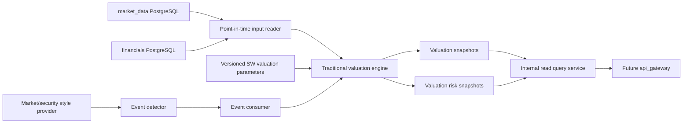

# Traditional Valuation Backend Design

## 1 Status And Scope

This document defines the planned `manniu_backend.traditional_valuation` Django
application. It ports the SW-industry-based traditional valuation flow described
in the five SmartInvestor valuation documents into the Maniu PostgreSQL backend.

The module calculates and persists PE, PB, PS, PEG, FCFF DCF, DDM, EV/EBITDA,
SW-history, and scarcity-overlay results when their required inputs are
available. It also persists the valuation risk result without replacing the raw
valuation output. Refresh is event-driven: a new financial disclosure, a market
style change, or an individual-security style change creates an idempotent
refresh event.

This is a design and contract document. Models, migrations, services, commands,
and external read APIs remain unimplemented until the database and interface
contracts in the implementation gates are confirmed.

## 2 Goals And Non-Goals

### 2.1 Goals

- Use SW L3/L2/L1 industry parameters as the primary traditional valuation
  assumption source.
- Keep formal financial-report valuation and disclosure-window blended valuation
  distinguishable and auditable.
- Preserve point-in-time safety: no financial or market row published after the
  valuation anchor may affect the result.
- Support deterministic replay, historical backfill, event retries, and
  idempotent current-read updates.
- Persist raw method results, optimized summary values, risk adjustment values,
  source dates, parameter versions, and provenance.
- Allow market-style and security-style changes to refresh the affected scope
  without waiting for a financial disclosure.

### 2.2 Non-goals

- This module does not own securities, trading bars, daily fundamentals,
  financial statements, disclosure records, Tushare adapters, or market-style
  classification.
- It does not call Tushare or perform an unpersisted upstream join in an HTTP
  request.
- It does not place orders, generate broker instructions, or automate trading.
- It does not silently substitute another report period, SW level, valuation
  variant, or profit bucket when the requested input is unavailable.

## 3 SmartInvestor Parity Target

The first Maniu release is a compatibility implementation, not a new valuation
definition. The reference behavior is the SmartInvestor traditional valuation
flow, including its input lineage, method names, fallback rules, summary fields,
and risk diagnostics. Maniu may use different Django models and service
boundaries, but an identical point-in-time input must produce the same method
availability and materially comparable prices.

The parity scope is deliberately split into three layers:

| Layer | Required Maniu behavior | Compatibility requirement |
| --- | --- | --- |
| Input and template | SW `L3 -> L2 -> L1 -> global` resolution, legacy fallback, formal/blended profit buckets, strict express gates | Preserve selected source, report period, mapping/template versions, and fallback reason |
| Calculation | `market_cap`, `pe`, `ps`, `pb`, `sw_history`, `peg`, `ev_ebitda`, `fcff_dcf`, `ddm`, `scarcity_overlay`, and market-style adjustment | Same method identifiers, units, eligibility, and skip reasons; no silent method substitution |
| Summary and risk | Composite/conservative values, method weights, optimized values, tiered template, and valuation risk | Raw rows remain unchanged; all adjustments are additive and explainable |

The implementation order is input lineage, method parity, summary parity, then
risk parity. A missing SmartInvestor feature is recorded as a typed coverage
gap and must not be hidden behind a generic `degraded=true` response. Parity
comparison uses a fixed security/date/report/bucket/variant corpus and stores
side-by-side JSON artifacts before any historical backfill.

## 4 Ownership And Data Flow



`market_data.Security` remains the source of security identity, canonical
versioned stock-to-SW L1/L2/L3 membership, EOD prices, daily fundamentals, and
market-style inputs. `financials` remains the source of typed `FinancialIncomeRecord`,
`FinancialBalanceSheetRecord`, `FinancialCashFlowRecord`,
`FinancialIndicatorRecord`, `FinancialExpressRecord`, and
`FinancialDisclosureRecord` records. The traditional module owns only
valuation configuration versions, calculation outputs, risk outputs, event
state, and run control data.

## 5 Industry Valuation Template

The industry template is a first-class input to traditional valuation. It is
not a hard-coded dictionary inside the calculation service and it is not
recomputed in the request path. The Maniu module should copy the existing
SmartInvestor `static/valuation_config` valuation files and their loader/service
behavior as-is first; later changes require a versioned migration and a
comparison artifact.

### 5.1 Static Configuration Files

The initial Maniu layout is:

```text
manniu_backend/static/valuation_config/
  valuation_defaults_CN.json
  valuation_defaults_CN_sw.json
  valuation_defaults_CN_sw_ref_5_10_20.json
  valuation_method_weights_CN.json
  scarcity_auto_profile_CN.json
  business_keyword_rules_CN.json
  citic_name_suggestions_CN.json
  update_schedule_CN.json
  update_schedule_state_CN.json
```

The files have different ownership and lifecycle and must not be collapsed into
one JSON document:

| File | Role | Update mode |
| --- | --- | --- |
| `valuation_defaults_CN.json` | Global defaults and legacy industry buckets | Versioned baseline, manually reviewed |
| `valuation_defaults_CN_sw.json` | Active SW valuation parameters by L1/L2/L3, keyed to a `market_data` SW mapping version | `syncswvaluation --params-only` |
| `valuation_defaults_CN_sw_ref_5_10_20.json` | Reference/fallback parameter profile using alternate history windows | Scheduled reference refresh |
| `valuation_method_weights_CN.json` | Composite-method weights by global, SW level, or industry bucket | Explicit configuration update |
| `scarcity_auto_profile_CN.json` | Risk-state thresholds, hysteresis, confirmation, cooldown, and circuit breaker | Explicit configuration update |
| `business_keyword_rules_CN.json` / `citic_name_suggestions_CN.json` | Optional business-text and CITIC matching inputs for comparison variants | Keyword refresh task |
| `update_schedule_CN.json` | Cadence and command arguments | Operator-reviewed schedule |
| `update_schedule_state_CN.json` | Runtime last-success state and task history | Scheduler-owned state; never used as valuation input |

All paths resolve from `settings.BASE_DIR`, with no current-working-directory
dependency. Static inputs are read-only during valuation. A generated file is
published atomically only after validation; a failed refresh must leave the
previous active file usable.

### 5.2 File Schema And Provenance

`valuation_defaults_CN.json` contains `version`, `market`, `changelog`,
`global_defaults`, and legacy `industries`. Each parameter set uses the direct
`test_valuation` argument names:

- relative targets: `pe_target`, `ps_target`, `pb_target`, `peg_target`,
  `ev_ebitda_target`;
- absolute-method arguments: `dcf_kwargs`, `ddm_kwargs`, `scenario_model`;
- sensitivity inputs: `sensitivity_grid`;
- optional history input: `sw_history_kwargs`.

The canonical `ts_code -> SW L3/L2/L1` membership, SW hierarchy, aliases, and
parent links are not copied into this module. They are resolved from the
versioned `market_data` SW mapping service. `valuation_defaults_CN_sw.json`
records the compatible `mapping_version` and must not activate against an
unknown, inactive, or different mapping version.

`valuation_defaults_CN_sw.json` contains `version`, `market`, `src`,
`updated_at`, `trade_date`, `sample_size`, `global_defaults`, and
`levels.L1/L2/L3`. Each level entry contains industry identity, `base_bucket`,
`member_count`, `params`, and `metrics`. `metrics` is audit context and must
not be treated as a substitute for `params` during serving. The generated
parameter payload also records `history_quantiles`, `history_anchors`, and
`target_source` when history data is available.

Every active template identity must be represented by:

```text
(market, sw_level, sw_code, template_version, source_trade_date, source_hash)
```

The `source_hash` is calculated over canonical JSON content. It is used to
detect material changes, create a new parameter version, and decide whether a
market-wide valuation refresh is required.

### 5.3 Template Resolution In `ValuationConfig`

The loader behavior is part of the compatibility contract. It must:

1. Resolve the canonical security SW identity through
  `market_data.resolve_industry_regime` (or its mapping-only companion) at an
  explicit `mapping_version`.
2. Load `valuation_defaults_<market>_sw.json` and verify its declared
  `mapping_version` equals the resolved mapping version.
3. Try parameter levels in order `L3 -> L2 -> L1`.
4. Return the first matching level's normalized `params`; use
  `global_defaults` only when no level has parameters.
5. Preserve the selected level, SW code/name, complete hierarchy, metrics,
  template version, and fallback reason in provenance.
6. For a forced industry request, resolve the code/name through `market_data`
  and then use the same hierarchy fallback order.
7. Recursively remove null and empty nested values, but never rename parameter
  keys or silently derive missing values.

The normalized parameter object is passed directly to the valuation engine. A
loader error for a missing mapping or missing active SW template is a typed
configuration failure, not permission to use an unrelated industry bucket.

### 5.4 Template Generation Algorithm

`traditional_valuation` owns parameter generation only. `market_data` owns the
separate SW mapping generation from `index_classify` and `index_member_all`,
including membership coverage, active/inactive membership handling, aliases,
version activation, and `INDUSTRY_MAPPING_CHANGED` emission. Traditional
generation consumes one explicit, active `mapping_version` and cannot publish
or replace stock-to-SW membership.

#### 5.4.1 Parameter Generation

For each L3 node, the generator:

1. Selects the current `daily_basic` cross section for the configured
  `trade_date`, including `pe_ttm`, `ps_ttm`, `pb`, `total_mv`, and `dv_ttm`.
2. Selects a bounded sample of representative members and reads financial
  indicators for growth and ROE context.
3. Calculates positive-value medians for PE, PS, PB, dividend yield, and market
  cap, plus median growth and ROE.
4. Loads the matching legacy/global base bucket from
  `valuation_defaults_CN.json`.
5. Bounds cross-sectional targets against base targets. The default target
  bounds are PE `0.6..1.8`, PS `0.6..2.0`, and PB `0.6..2.0` times the base.
6. When enabled, queries persisted/approved `sw_daily` history through the
  history-quantile service for 3Y/5Y/10Y windows, requiring at least 120
  samples per window by default.
7. Blends PE/PB cross-sectional targets with history anchors and the global
  baseline, retaining the bounds and recording `target_source`.
8. Adjusts DCF/DDM discount and growth assumptions using bounded growth and ROE
  quality signals, then creates a sensitivity grid.

L2 and L1 nodes are weighted aggregations of child nodes, using child member
count as the default weight. If a child is absent, the aggregate is built from
available children and records coverage. It must not invent a new direct
cross-section when the design calls for hierarchical aggregation.

The generated payload is an immutable candidate until validation completes.
Validation must check all level counts, parent links, parameter key shape,
numeric bounds, history metadata, and JSON serialization before publication.

### 5.5 Parameter Version Activation

The generated JSON is copied into a database-backed
`TraditionalValuationParameterVersion` record or a content-addressed local
artifact reference before it becomes active. The active pointer records the
template version, source hash, generation trade date, history settings, and
generator version. A new file must not overwrite the active parameter version
in place.

The calculation snapshot always records the exact active template version and
source hash. This permits replaying an old valuation even after a new SW
template is published.

## 6 Core Valuation Entry And Template Refresh

### 6.1 Single-Security Calculation Path

The compatible core entry is the following sequence, based on the existing
`prefillvaluationsnapshot` implementation:

```text
resolve active template
  -> get_stock_valuation_snapshot(...)
  -> test_valuation_light(..., snapshot=..., **template_params)
  -> extract method rows and valuation variants
  -> build raw/optimized summary
  -> build valuation-risk payload
  -> persist snapshot/current/risk transactionally
```

`get_stock_valuation_snapshot` is responsible for assembling the point-in-time
stock snapshot from market and financial sources. It receives the valuation
trade date, strict express controls, optional forced report end date, and the
profit-bucket mode. `test_valuation_light` is the method execution entry and
receives the already resolved snapshot plus the normalized template parameters;
it must not independently select a different SW template.

For the default SW baseline, the context is resolved by `get_sw_params_by_tscode`
and is labeled `sw_l3_baseline` even when L2/L1 parameter fallback was needed.
Optional business-match contexts call `get_sw_params_by_industry` for the
matched SW industries and produce separate variants such as
`business_match|L2|<sw_code>|<name>`. Variant identity is explicit and has
precedence over inferred fields in the valuation result row. A missing or NaN
variant normalizes to `default`; it must never be persisted as the literal
string `nan`.

The method extraction layer supports aliases for `pe`, `pb`, `ps`, `sw_history`,
`peg`, `fcff_dcf`, `ddm`, `ev_ebitda`, and `market_cap`. It retains the method's
implied price, equity value, industry context, comparison group, match score,
and variant. A method with no valid positive result is omitted with a reason.

### 6.2 Multi-Industry Traditional Valuation

One security may legitimately require more than one traditional valuation
context. The default SW industry is the baseline, while business-text matching
provides alternative industry assumptions for comparison. These are parallel
valuation variants, not multiple copies of the same method and not a frontend
concatenation feature.

#### 6.2.1 Variant Context Resolution

For each security, the Maniu implementation consumes the ranked result from
`market_data.get_business_industry_matches`; it does not run the business-text
matcher itself. Contexts are resolved in this order:

1. Add one `sw_l3_baseline` context from `ValuationConfig.get_sw_params_by_tscode`.
  The resolved level may fall back from L3 to L2/L1, but the context preserves
  the selected level, code, name, hierarchy, and parameter fallback reason.
2. When `business_match_topn > 0`, request at most that many ranked candidates
  from market data, normally with `level="L2"`. The default is `3`; `0`
  disables business-match contexts.
3. Consume candidates in the upstream `rank` order. Do not rerank by local
  database order, display name, or a newly calculated score. Persist the
  upstream `rank`, `match_score`, profile hash, mapping version, and rules
  version in variant provenance.
4. For every returned match, resolve parameters through
  `ValuationConfig.get_sw_params_by_industry(..., fuzzy=False)`. A failed
  industry parameter lookup skips only that candidate and does not remove the
  baseline context.
5. Create a `business_match` context containing `industry_level`,
  `industry_code`, `industry_name`, `match_score`, and its resolved parameter
  payload. The default CLI value is `business_match_topn=3`; `0` explicitly
  disables business matching.
6. Build the stable variant identity as:

  `compare_group|industry_level|industry_code|industry_name`

  with empty components removed and a maximum persisted length of 128
  characters. The baseline therefore looks like
  `sw_l3_baseline|L3|<code>|<name>`, while alternatives look like
  `business_match|L2|<code>|<name>`. Explicit non-empty variants from the
  valuation engine take precedence; null, empty, or literal `nan` becomes
  `default` only when no context identity is available.
7. Deduplicate contexts by this complete variant identity while preserving the
  first context's order. The baseline is retained even if a business match
  has the same industry identity.

The source profile for matching is market data's persisted
`CompanyProfile.main_business` plus `CompanyProfile.business_scope`. Market
data owns profile freshness, keyword/CITIC evidence, candidate ranking,
`top_n`, fallback status, and `profile_hash`; traditional valuation stores
these references as provenance. Missing profile, stale profile, or matcher
errors degrade business-match coverage only; they must not make the baseline
valuation fail or silently claim a business match. Traditional valuation must
never call `stock_company`/`ci_index_member` or instantiate the matcher as a
fallback.

#### 6.2.2 Variant Calculation Semantics

The stock input snapshot is built once per security/report/bucket/as-of identity
and reused for every context. Each context then invokes the same
`test_valuation_light` engine with its own resolved parameters. This guarantees
that differences between variants come from industry assumptions and not from
different financial rows or market prices. The context loop may apply a
configured interval when `sw_history` or business matching touches dense
upstream data sources, but throttling must not change calculation semantics.

For every requested method, extraction attaches the context metadata to each
row: `valuation_variant`, `compare_group`, `industry_level`, `industry_code`,
`industry_name`, and `match_score`. Rows with the same method and variant are
deduplicated before persistence. A missing method in one variant does not
remove that method from another variant and does not fail the whole security.

The output contract is therefore:

```text
security + report/bucket/as-of identity
  -> one shared point-in-time stock snapshot
  -> N resolved industry contexts
  -> N independent method sets
  -> N variant summaries and tier templates
  -> one selected active variant plus optional top-level blend
```

The upstream ranking is part of the input contract, not presentation metadata:
`rank=1` is the highest-ranked market-data candidate, and the valuation run
must retain the ordered candidate list and the requested/returned TopN counts.
If market data returns `business_fallback`, valuation records the fallback
reason and selected industry as a separate `business_fallback` context; it
must not label that context as `business_match`.

The active variant is selected from valid per-variant summaries using the
configured summary policy and match metadata. Selection is persisted as
`active_variant`/`is_active_variant`; clients must not infer it from row order.
When multiple variants are eligible, the top-level result is a backend-owned
blend. It uses normalized positive weights derived from match score, data
quality, and method coverage, then reapplies tier monotonicity, minimum gaps,
position caps, and downgrade rules. Each source variant remains queryable.

### 6.3 Verified Backfill Example

The following example records the expected persistence shape for a single-stock
backfill. It is an implementation verification sample, not a separate
valuation mode:

```text
python manage.py traditional_valuation backfill \
  --report-type H1 \
  --asof-date 2026-09-09 \
  --profit-bucket both \
  --business-match-topn 3 \
  --ts-codes 600000.SH
```

For `600000.SH`, the verified result contains two rows in
`traditional_valuation_snapshot`:

| `snapshot_id` | `profit_bucket` | `report_type` | `financial_end_date` | `source_trade_date` | `valuation_variant` |
| ---: | --- | --- | --- | --- | --- |
| 5 | `formal` | `H1` | `2026-06-30` | `2026-09-08` | `default` |
| 6 | `blended` | `H1` | `2026-06-30` | `2026-09-08` | `default` |

The two snapshots are intentional. `--profit-bucket both` expands into one
calculation for `formal` and one for `blended`; `profit_bucket` is part of the
snapshot identity. `formal` uses the formal financial source, while `blended`
may use an eligible express source under the strict express gates. They must
remain separate and auditable even when they use the same report period and
trade-date anchor.

Each snapshot has exactly one row in
`traditional_valuation_risk_snapshot` because risk is a one-to-one extension
of the valuation snapshot:

| `risk_snapshot_id` | `snapshot_id` | `risk_level` | `risk_score` |
| ---: | ---: | --- | ---: |
| 5 | 5 | `MEDIUM` | 58.4000 |
| 6 | 6 | `MEDIUM` | 63.6500 |

The verified `traditional_valuation_variant_summary_latest` rows are:

| `summary_id` | `snapshot_id` | `profit_bucket` | `valuation_variant` | `match_rank` | `is_active_variant` |
| ---: | ---: | --- | --- | ---: | --- |
| 1 | 5 | `formal` | `sw_l3_baseline` | - | `true` |
| 2 | 5 | `formal` | `business_match\|L2\|801783.SI\|股份制银行Ⅱ` | 1 | `false` |
| 3 | 5 | `formal` | `business_match\|L2\|801786.SI\|其他银行Ⅱ` | 2 | `false` |
| 4 | 6 | `blended` | `sw_l3_baseline` | - | `true` |
| 5 | 6 | `blended` | `business_match\|L2\|801783.SI\|股份制银行Ⅱ` | 1 | `false` |
| 6 | 6 | `blended` | `business_match\|L2\|801786.SI\|其他银行Ⅱ` | 2 | `false` |

This gives the following cardinality:

```text
2 profit buckets
  -> 2 valuation snapshots
  -> 2 risk snapshots, one per valuation snapshot
  -> 6 variant summaries, three per valuation snapshot
```

`--business-match-topn 3` requests up to three ranked business candidates. In
this sample, the baseline SW industry is `857831.SI`, so a matching candidate
with the same industry identity is not persisted again. The result therefore
contains the baseline plus two distinct business-match variants. A positive
`topn` value is an upper bound on resolved candidates, not a guarantee of that
many persisted rows.

Multiple variant summaries intentionally share one `snapshot_id`. The snapshot
represents the shared point-in-time financial and market input, while
`valuation_variant` identifies the industry assumption set evaluated against
that input. The relationship is therefore:

```text
one snapshot
  -> one risk snapshot
  -> one baseline variant summary
  -> zero or more business-match variant summaries
```

Consumers must select summaries by the complete variant identity, including
`security`, `report_type`, `profit_bucket`, `valuation_variant`, and
`style_profile`; they must not treat `snapshot_id` as unique in the variant
summary table or infer the active variant from row order. The active choice is
the row with `is_active_variant=true` (or the backend's explicit active
variant field).

### 6.4 Market-Style Adjustment Boundary

The existing market-overall adjustment is applied to method output before
summary aggregation only when the selected style profile enables it. It reads
the configured index set and historical `pe_ttm`, `pb`, and turnover percentile
state, then maps the state to an explicit multiplier:

- overvalued: default `0.95`;
- neutral: `1.00`;
- undervalued: default `1.05`.

The result records `asof_date`, state, score, multiplier, source, index count,
and fallback reason. A missing remote/source row produces a neutral fallback
diagnostic; it must not make the calculation appear to have used a valid market
style observation. Method-level and summary-level adjustments remain separate
from the raw valuation rows.

### 6.5 Prefill And Event Refresh Modes

The copied prefill behavior supports these independent dimensions:

| Dimension | Values | Rule |
| --- | --- | --- |
| Methods | `sw_history,pe,pb,ps,peg,fcff_dcf,ddm,scarcity_overlay` | Explicit allow-list; unsupported names fail validation |
| Profit bucket | `formal`, `blended`, `both` | `both` attempts both buckets and deduplicates batch conflict keys |
| Express | strict by default, `express_max_age_days=180` | Same eligibility rules as single-stock calculation |
| Refresh policy | `missing`, `all`, `disclosure` | Disclosure mode recalculates only rows with a newer disclosure signal |
| Price anchor | `disclosure_aligned`, `market_now`, `auto` | Forced report period uses disclosure alignment; ordinary style refresh uses market now |

| Industry contexts | `sw_l3_baseline` plus `business_match` candidates | `--business-match-topn=0` keeps only the baseline; positive values add at most N resolved L2 candidates |

The traditional event consumer uses the same calculation path as prefill, but
restricts the scope to the event's affected security/report/variant. It must not
create a second calculation implementation for event refresh.

### 6.6 Template Update Commands

The Maniu operator interface should preserve the source command semantics:

```text
python manage.py syncswvaluation \
  --params-only --mapping-version VERSION [--trade-date YYYYMMDD] \
  [--sample-size N] [--request-interval SECONDS] [--max-industries N] \
  [--history-years 3,5,10] [--history-quantile 0.5] \
  [--history-min-samples 120] [--params-output-suffix NAME] [--dry-run]
```

`syncswvaluation` does not call `index_classify` or `index_member_all`, and it
cannot update SW hierarchy or stock membership. It resolves the requested
active mapping version from `market_data`, then generates only traditional
parameter templates. History anchors are enabled by default and can be disabled
only for an explicit comparison run. `--params-output-suffix` writes a separate
reference artifact and must not move the active parameter pointer.

Snapshot warming remains a separate command:

```text
python manage.py prefillvaluationsnapshot \
  --scope 60|68|00|30|8 \
  --methods sw_history,pe,pb,ps,peg,fcff_dcf,ddm,scarcity_overlay \
  --profit-buckets both --express-max-age-days 180 \
  [--refresh-policy missing|all|disclosure] [--price-anchor-mode auto|disclosure_aligned|market_now]
```

Multi-industry warming adds the following options:

```text
  [--business-match-topn N]
  [--enable-market-style]
  [--market-style-profile unified|industry|adaptive]
  [--market-style-method market_style]
```

`--business-match-topn` defaults to `3` in the SmartInvestor-compatible
profile. `0` disables business matching. The command output must report the
number of baseline contexts, matched candidates, resolved variants, duplicate
variants, parameter-resolution failures, and matcher data sources. A successful
baseline with zero business-match candidates is valid; a run that cannot
produce any context for an eligible security is a failure.

The command must report the active template version/hash, trade date, selected
profit buckets, refreshed/skipped counts, disclosure reasons, method coverage,
and failures. A run with all requested items failing returns nonzero even if the
process itself did not raise an exception.

### 6.7 Schedule And Dependency Rules

The copied `update_schedule_CN.json` should initially preserve these tasks:

| Task | Default cadence | Dependency and result |
| --- | ---: | --- |
| `sw_mapping_sync` | 14 days | `market_data` refreshes and activates hierarchy/membership before parameter generation |
| `sw_params_refresh` | 30 days | Generates active 3/5/10-year history-anchor parameters against the active mapping version |
| `sw_params_refresh_reference` | 30 days | Generates 5/10/20-year comparison artifact |
| `valuation_snapshot_prefill` | 30 days | Prefix-batched valuation snapshot warming, formal + blended |
| `keyword_rules_refresh` | 90 days | Refreshes optional business/CITIC matching inputs |

The daily due runner executes due tasks from the state file and persists task
state only after a successful command. The ordering is `market_data` mapping,
active parameters, reference parameters, then snapshot prefill. A parameter refresh
that changes the source hash must enqueue a market-scope valuation refresh; a
reference-only artifact must not change the active valuation output.

Financial disclosure events and style events are not replaced by this cadence:

- disclosure events use `refresh-policy=disclosure` and affected-code scope;
- market-style changes fan out to affected market scope with
  `price-anchor-mode=market_now`;
- security-style changes recalculate only the affected security and active
  report periods/variants.

This keeps slow template maintenance separate from event-driven valuation
refresh while using one shared calculation and persistence path.

The engine is a local adapter around the established SmartInvestor valuation
semantics. It must not import Django models from `smartinvestor_be`; the Maniu
implementation reads approved shared projections and uses an explicit adapter
for the valuation formulas and SW parameter shape.

## 7 Valuation Contract

### 7.1 Input Resolution

Every calculation receives an explicit:

- canonical `ts_code`;
- `asof_date` and resolved `source_trade_date` (latest completed trading day
  on or before `asof_date`);
- requested report type: `Q1`, `H1`, `Q3`, or `FY`;
- financial end date preference, if supplied;
- profit bucket: `formal`, `blended`, or the configured single-bucket mode;
- SW industry level/code and parameter version;
- valuation variant and style profile;
- valuation engine version.

Financial inputs are selected using the newest eligible report under the
requested report type whose effective announcement date is on or before
`asof_date`. A future or unavailable requested end date resolves to the latest
available eligible period of that report type; if no period exists, the event
fails with a typed coverage error. This follows the live-feature contract's
as-of semantics and prevents future-period anchoring.

Express data uses the same three strict gates documented for SmartInvestor:

1. `ann_date <= asof_date`;
2. `express_end_date >= base_end_date`;
3. `asof_date - ann_date <= express_max_age_days`.

`formal` never applies express adjustment. `blended` may apply it only when
all gates pass; otherwise the result records the block reason and the exact
effective source. A blended request must not silently be reported as an
express-backed result when it fell back to formal data.

### 7.2 SW Parameter Resolution

Parameter lookup proceeds from the canonical security SW L3 mapping, then the
approved L2/L1 fallback rules. The selected row records:

- `sw_level`, `sw_code`, and `sw_name`;
- `parameter_version` and source effective date;
- target PE/PB/PS/PEG values and DCF/DDM inputs;
- history-anchor configuration and scarcity configuration;
- fallback reason, if any.

SW history anchors use the configured 3Y/5Y/10Y window and quantile. They are
combined with industry cross-sectional parameters and global defaults using the
same bounded rules as the source design. Scarcity overlay remains a separate
method row and must expose its profile, confidence, beta, cap, and risk-state
reason.

### 7.3 Method And Summary Outputs

The engine returns one row per available method. Missing prerequisites skip only
that method and record a machine-readable reason; they do not fabricate a price.
The raw method values are never smoothed or overwritten.

The summary contains at least:

- `composite_valuation_price_raw` and `composite_valuation_price_optimized`;
- `conservative_valuation_price_raw` and
  `conservative_valuation_price_optimized`;
- current-price gaps for raw and optimized values;
- method count, core method list, dispersion, reliability weight, and
  `composite_mode`;
- optimization version and input statistics.

The SmartInvestor-compatible buy-candidate summary is part of the valuation
calculation contract, not a frontend-only label. The current Maniu engine
already persists one `TraditionalValuationVariantSummaryLatest` row per
industry variant, but its persisted row currently contains only the composite
and conservative prices, method coverage, and provenance. It does not yet
persist the complete buy-candidate summary, and its variant calculation must
not be considered parity-complete until the following fields are produced by
the shared summary service and written during the same valuation transaction:

- `undervalue_score`;
- `buy_candidate`;
- `buy_candidate_reason`;
- `buy_candidate_rule_version`;
- `valuation_valid_methods`;
- `valuation_under_methods`;
- `valuation_core_methods`;
- `composite_valuation_price_raw` and `composite_valuation_price_optimized`;
- `conservative_valuation_price_raw` and
  `conservative_valuation_price_optimized`;
- `composite_valuation_gap_pct` and `conservative_valuation_gap_pct`;
- `summary_mode`, `summary_variant`, and `summary_report_end_date`;
- `summary_source` and the summary input statistics required for replay.

The exact database contract for
`TraditionalValuationVariantSummaryLatest` is:

1. Add typed columns for query-critical fields: `undervalue_score`,
   `buy_candidate`, `buy_candidate_rule_version`, and the raw/optimized gap
   fields. Keep `buy_candidate_reason`, method lists, summary mode, and other
   replay details in a `summary` JSON field (or an explicitly approved
   equivalent); do not encode method lists into text columns.
2. Keep `snapshot` as the shared point-in-time input/result reference. A
   variant summary is not a second market or financial snapshot and must not
   independently reload upstream data during persistence.
3. Preserve the complete variant identity and selection metadata already
   defined by this document: `security`, `report_type`, `profit_bucket`,
   `valuation_variant`, `style_profile`, `compare_group`, industry identity,
   `match_rank`, `match_score`, and `is_active_variant`.
4. Persist all variant summary rows before publishing/updating the current
   read model. A failed variant write rolls back the valuation result; a
   missing optional method may degrade that variant but must not produce a
   partial summary set.
5. Store the summary rule version, engine version, parameter version, mapping
   version, source trade date, and selected report dates in provenance so a
   historical `buy_candidate` value can be explained without recomputation.

The summary service must use the same normalized method map and current-price
anchor for every variant. It must preserve the SmartInvestor rule semantics:
core methods are PE/PB/PS; support methods are FCFF DCF/DDM; optional PEG is
included only when valid; invalid or non-positive method prices are excluded;
and `buy_candidate` is derived from core-method coverage, under-valuation
coverage, composite gap, and conservative gap. Maniu may implement the rule
inside its own service, but it must not maintain a second frontend-specific
definition. The persisted `summary` JSON is an audit copy of the calculated
result, not the source of a later recalculation.

The SmartInvestor implementation has two distinct layers that Maniu must keep
separate:

1. `summarize_buy_candidate(current_price, method_map, band_pct)` performs the
  buy-candidate calculation and returns the composite/conservative prices,
  score, candidate flag, valid/under/core method lists, reason, and rule
  version.
2. `_build_valuation_summary_payload(current_price, rows, band_pct,
  price_key="valuation_price", ts_code=None, freq="D")` is the API summary
  adapter. It does not recalculate methods and it does not choose the active
  industry variant. It converts valuation rows into the method map, adds
  anchor and display fields, and returns the API-facing subset of the summary.

#### 7.3.1 Buy-Candidate Decision Contract

The following is the normative SmartInvestor-compatible decision rule. The
rule version must be persisted as
`baseline_v20260414_core_guardrails` unless a deliberate rule change creates a
new version and a parity artifact.

The decision service first normalizes the valid method map for the variant:

- core methods: `pe`, `pb`, `ps`;
- support methods: `fcff_dcf`, `ddm`;
- optional method: `peg`.

Only positive, finite valuation prices are valid. `valuation_valid_methods`
contains every valid method. A method is included in
`valuation_under_methods` when:

```text
current_price <= valuation_price * (1 - band_pct)
```

where `band_pct` is the configured fractional band, with the compatible
default of `0.10` (10%). `valuation_core_methods` contains the valid core
methods after the documented core-price filtering and soft-weight rules. The
support and optional methods can contribute to the total under-valued method
count, but cannot replace the minimum core-method requirements. More
generally, every method present in the normalized `method_map` with a finite,
positive valuation price is included in `valuation_valid_methods`, regardless
of whether it is a core, support, optional, historical, market-style, or other
configured method. Any such valid method can also enter
`valuation_under_methods` when it satisfies the `band_pct` condition, and can
therefore contribute to `under_method_count` and the documented fallback
candidate pool. These additional methods still cannot replace the minimum
core-method requirements for `buy_candidate`.

The summary calculates at least:

- `composite_valuation_price`: the core weighted composite when enough core
  methods are available, otherwise the documented raw-core/all-method
  fallback, including any configured recovery anchor and size factor;
- `conservative_valuation_price`: the minimum valid effective core price when
  core prices are available; otherwise the minimum raw core price or fallback
  candidate price, in that order;
- `composite_gap_pct = (composite_valuation_price - current_price) /
  current_price`;
- `conservative_gap_pct = (conservative_valuation_price - current_price) /
  current_price`.

`buy_candidate` is `true` only when every condition below is true:

```text
core_method_count >= 2
core_under_count >= 1
under_method_count >= 2
composite_gap_pct >= -0.02
conservative_gap_pct >= -0.12
```

The conditions mean:

1. At least two effective core valuation methods are available.
2. At least one effective core method classifies the current price as
   under-valued under the core filtering/soft-weight rules.
3. At least two valid methods overall classify the current price as
   under-valued using `band_pct`.
4. The composite valuation price is not more than 2% below the current price.
5. The conservative valuation price is not more than 12% below the current
   price.

Missing current price, an empty method map, or no positive valid valuation
price produces `buy_candidate=false` with an explicit reason and no fabricated
gap. The implementation must persist the counts, method lists, prices, gap
values, band, and rule version so each decision can be replayed and audited.

#### 7.3.2 `_build_valuation_summary_payload` Compatibility Contract

For parity with SmartInvestor, Maniu's summary adapter must implement the
following sequence exactly:

1. Select `anchor_row` as the first row in `rows` whose
  `latest_trade_date` parses as a date. If none exists, use the first row;
  for an empty input use an empty row.
2. Parse `anchor_trade_date`. Resolve the anchor security from explicit
  `ts_code`, falling back to `anchor_row.ts_code`.
3. When both the anchor security and date exist, read the exact matching
  `StockTradingHistory` row using `freq` and `trade_date`. Use `close_qfq`
  first and `close` as fallback. This is the `anchor_close_price`.
4. Set `anchor_basis_price` to the anchor close. When
  `price_key="valuation_price_normalized_to_latest_share"`, and both
  `snapshot_total_share` and `current_total_share` are positive, adjust the
  anchor basis as:

  ```text
  anchor_basis_price = anchor_close_price
                * snapshot_total_share / current_total_share
  ```

5. Build `method_map_for_summary` by iterating `rows`. Normalize
  `valuation_method` using the SmartInvestor method-name normalizer, read the
  valuation price from `row[price_key]`, skip rows with an empty method or
  `None` price, and pass each remaining method as:

  ```json
  {
    "valuation_price": "<row price>",
    "candidate_count": 1
  }
  ```

  If the same normalized method appears more than once, the later row
  replaces the earlier entry, matching the current dictionary assignment
  behavior.
6. Call `summarize_buy_candidate(current_price, method_map_for_summary,
  band_pct)`. The adapter must not implement a second buy-candidate formula.
7. Classify the composite and conservative prices independently with the
  existing valuation classifier and the same `band_pct`, producing
  `under`, `fair`, or `over`, plus the gap:

  ```text
  gap_pct = (valuation_price - current_price) / current_price
  ```

  A missing or zero current price, or a missing valuation price, produces
  status `unknown` and a null gap.
8. Return the API summary fields with the current SmartInvestor units:
  `composite_valuation_gap_pct` and `conservative_valuation_gap_pct` are
  rounded percentage values (`gap_pct * 100`), while
  `composite_valuation_anchor_gap_pct` and
  `conservative_valuation_anchor_gap_pct` are calculated against
  `anchor_basis_price` by the return-percentage helper.

The adapter's returned fields are:

```text
anchor_trade_date
anchor_basis_price
undervalue_score
buy_candidate
valuation_under_methods
valuation_valid_methods
composite_valuation_price
composite_valuation_status
composite_valuation_gap_pct
composite_valuation_anchor_gap_pct
conservative_valuation_price
conservative_valuation_status
conservative_valuation_gap_pct
conservative_valuation_anchor_gap_pct
```

`buy_candidate_reason`, `buy_candidate_rule_version`, and
`valuation_core_methods` are results of the nested decision service but are
not currently emitted by `_build_valuation_summary_payload`. Maniu may persist
these additional audit fields in the variant summary, but doing so must be
additive and must not change the compatible API fields or their calculation.

When the persisted summary contains prices but lacks display gap/anchor
fields, SmartInvestor calls the same builder as a hydration step and fills
only null display fields. It does not replace an existing persisted value and
does not recompute or overwrite the persisted candidate decision.

At the variant endpoint level, the builder is called once per variant and
once for the normalized-share price key. Market-style fields are merged after
the base summary; optimized summaries are built by a separate optimization
step. These later steps must not be described as part of
`_build_valuation_summary_payload` itself.

For each valuation run, the persistence sequence is therefore:

```text
shared point-in-time inputs
  -> calculate raw method rows for baseline and industry variants
  -> normalize each variant method map
  -> calculate complete summary for each variant
  -> select active variant and calculate optional top-level blend
  -> persist snapshot, risk, and every variant summary atomically
  -> publish latest read models
```

The top-level snapshot may retain the selected summary and the blended
`traditional_tiered_template`, but it must not replace or discard the
per-variant summaries. Read APIs must expose both the active summary and the
variant collection, including `buy_candidate`, its reason, rule version, and
the variant identity used to calculate it.

Optimization is summary-only. It may use method coverage, method dispersion,
risk, and the documented market-cap factor, but it must not alter PE/PB/PS/PEG,
FCFF DCF, DDM, or other single-method rows.

### 7.4 Method Execution Contract

Each method receives one normalized point-in-time snapshot and one resolved
parameter set. It returns either a valid positive `implied_price` or a skipped
row with a stable `skip_reason`. Monetary inputs must retain their source unit;
the engine must normalize units once at the input boundary rather than inside
individual methods. `market_cap` is a current-price anchor and is excluded from
weighted composite valuation.

| Method | Required inputs and calculation | Skip or downgrade rule |
| --- | --- | --- |
| `market_cap` | `implied_price = close_price`; equity value is `close_price * total_share` when shares exist | Missing current price; anchor is not a theoretical valuation |
| `pe` | `equity_value = netprofit * target_pe`; `price = equity_value / total_share` | Missing/non-positive net profit, target PE, or shares |
| `ps` | `equity_value = revenue * target_ps`; `price = equity_value / total_share` | Missing/non-positive revenue, target PS, or shares |
| `pb` | `equity_value = equity_book_value * target_pb`; `price = equity_value / total_share` | Missing/non-positive book value, target PB, or shares |
| `sw_history` | Positive SW PE/PB/PS history; quantile anchors over 3Y/5Y/10Y, weighted `0.2/0.5/0.3`, then mapped to stock valuation | Window with fewer than `history_min_samples` is excluded; skip if no valid window or explicit fallback anchor |
| `peg` | `target_pe = target_peg * growth_rate_pct`; then use the PE formula | Growth must be positive and bounded; record raw growth, derived PE, quality flag, and skip reason |
| `ev_ebitda` | `EV = EBITDA * target_ev_ebitda`; `equity = EV - debt + cash`; `price = equity / total_share` | Missing/non-positive EBITDA, multiple, or shares; explicit bank/industry exclusion may downgrade to a configured method without labeling it EV/EBITDA |
| `fcff_dcf` | Discount explicit FCFF periods and terminal value: `EV = PV(explicit) + PV(FCFF_N * (1+g)/(r-g))`; `equity = EV - debt + cash` | Require `r > g`, valid FCFF/growth/cash/debt/shares; otherwise skip with parameter reason |
| `ddm` | `D1 = D0 * (1+g)`; `price = D1 / (r-g)`; `equity = price * total_share` | Require dividend data and `r > g`; non-dividend issuers skip |
| `scarcity_overlay` | `premium_pct = clamp(beta * score * confidence * 100, 0, cap_pct)`; `price = base_price * (1 + premium_pct/100)` | Requires valid base price, enabled profile, score, and confidence floor; never replaces the base method |

Every method row also records `input_field_names`, source record IDs or source
dates, parameter keys used, unit metadata, `valuation_variant`, and the exact
eligibility/skip diagnostic. This is required to explain differences from
SmartInvestor and to replay an old result.

### 7.5 Composite, Conservative, And Market-Style Outputs

The summary layer has three separate responsibilities:

1. `composite_valuation_price` aggregates valid theoretical methods. When
  `method_weights` are present, only explicitly weighted methods participate
  and weights are renormalized:

  `weighted_price = sum(price_i * weight_i) / sum(weight_i)`

  Without a usable weight profile, the configured robust aggregate is used
  (normally a median or trimmed median). `market_cap` and skipped rows never
  enter this calculation.
2. `conservative_valuation_price` uses the configured conservative core pool
  and protects against method disagreement. It is not the minimum of every
  method, because a broken or structurally unsuitable method must not dominate
  the result. The selected pool and rule are persisted.
3. `market_style` is an additive style price. It blends baseline composite and
  conservative values, then applies quality and risk caps:

  `blended = w * composite + (1-w) * conservative`

  `adjusted = blended * quality_multiplier`, followed by the configured
  `risk_cap_map`. The source state, `mom_60`, `vol_20`, `drawdown_120`, risk
  score, multiplier, cap, and fallback reason are persisted. Missing style
  data produces a neutral diagnostic, not a valid style observation.

Raw method rows, raw composite/conservative values, optimized values, and the
market-style result are separate fields. No optimization or risk adjustment may
overwrite the raw result. Current-price gaps use the same current-price anchor:
`gap_pct = (valuation_price - current_price) / current_price`.

### 7.6 Authoritative Three-Tier Valuation And Position Template

Traditional valuation additionally produces one authoritative three-tier template
from the completed method rows. `conservative`, `balanced`, and `aggressive`
are presentation/risk scenarios derived by `summary_service`; they are not
additional valuation methods, and a client must not recreate them from raw rows.
The output is deterministic for the same snapshot identity and is calculated
once per valuation variant before any top-level aggregation.

#### 7.6.1 Industry Regime Resolution

The shared `industry_regime_service` resolves one of `high_growth`, `balanced`,
`stable_value`, or `cyclical_resource`. It accepts the variant's SW L1/L2/L3
identity, the eligible profitability/leverage profile (`roe`, `gross_margin`,
`debt_to_assets`), and method coverage/dispersion. Resolution order is:

1. normalize `industry_code`/`index_code`, then exact-match the versioned SW
   mapping;
2. walk L3 to L2 to L1 parent mappings;
3. apply approved industry-name keyword rules;
4. return `balanced` with `regime_source=fallback` and a non-empty
   `fallback_reason`.

`market_data` supplies the resolved SW identity, industry regime, and
`mapping_version`/`rules_version`. Traditional valuation stores only its
versioned regime parameter packs and downgrade thresholds in
`static/valuation_config/traditional_tier_parameters_CN.json`, keyed by the
`market_data` regime value. It must validate compatibility with the consumed
mapping/rules versions and never embed, copy, or activate a SW mapping. Code
defaults are allowed only as a safe fallback for unavailable traditional tier
parameters, not for missing SW mapping. The same `market_data` service and
mapping version are the required source of truth for predictive valuation; a
frontend prefix table is not an authority.

#### 7.6.2 Tier Calculation, Variant Blend, And Guardrails

Each regime pack defines separate method-weight matrices for all three tiers,
down/up minimum gaps, volatility-specific range multipliers, and position
guidance. Before weighting, valid positive method prices are winsorized by the
configured per-regime bounds. The engine calculates each variant's three target
prices, applies the selected range multiplier and market/security-regime risk
controls, then enforces:

$$
conservative \le balanced \le aggressive
$$

and the configured minimum down/up spacing. It records target values both
before and after this correction; equal tiers are valid only when an explicit
coverage/degradation rule says a gap cannot be supported.

For `business_match` variants, the engine calculates a complete template per
variant. The top-level template blends target prices using normalized weights:

$$
variantWeight = matchScoreNorm \times dataQualityWeight \times coverageWeight
$$

It then reapplies monotonicity, minimum gaps, and position guidance to the
blended targets. If regime confidence is below its configured floor, valid
method count is insufficient, or dispersion is excessive, the engine falls
back to `stable_value` or `balanced`, widens the conservative margin, and caps
the aggressive position. The triggering condition and chosen fallback are
always recorded; no output may claim a high-confidence aggressive tier after a
downgrade.

#### 7.6.3 Template Contract

`TraditionalValuationSnapshot.summary` and the current read model retain both
the top-level `traditional_tiered_template` and
`traditional_tiered_template_by_variant`. The top-level value is the blended
template when multiple eligible variants exist; otherwise it is the selected
variant template. Each template contains at least:

- `conservative`, `balanced`, `aggressive` target price and position guidance;
- `selected_regime`, `regime_confidence`, `regime_source`, `regime_reasons`,
  `industry_code`, and `mapping_version`;
- `tier_spacing` with configured rule and before/after values;
- `method_coverage`, `dispersion`, applied weight profile, range multiplier,
  and volatility bucket;
- `downgrade_applied` and `downgrade_reason`;
- for the top-level blend: `variant_weights`, weight details, and
  `blend.applied/dominant_variant/active_variant/variant_count`.

The fields are additive. A missing template remains an explicit coverage error
with a reason so legacy clients can retain their fallback, but new clients must
prefer the top-level backend template and never blend variants locally.

### 7.7 Extended Valuation Methods

The following methods belong to `traditional_valuation`, not to
`market_data`. They consume point-in-time inputs from `market_data` and
`financials`, while their formulas, eligibility rules, fallback behavior, and
audit payloads are owned by the valuation engine.

#### 7.7.1 `ev_ebitda`

Inputs:

| Input | Source | Rule |
| --- | --- | --- |
| `ebitda` | `FinancialIncomeRecord` or an approved EBITDA projection | Preserve the provider monetary unit |
| `target_ev_ebitda` | SW/legacy valuation template | Must be positive |
| `cash` | `FinancialBalanceSheetRecord.money_cap` or an explicitly approved cash field | Same unit as EBITDA and debt |
| `debt` | `FinancialBalanceSheetRecord.st_borr + lt_borr` or an approved debt projection | Same unit as EBITDA and cash |
| `total_share` | `StockDailyFundamentalHistory.total_share` or latest snapshot | Preserve the Tushare raw unit unless a normalized field is explicit |
| `close` / `source_trade_date` | `MarketBarDailyHistory` | Latest completed row on or before `asof_date` |

The calculation is:

$$
EV = EBITDA \times target\_ev\_ebitda
$$

$$
EquityValue = EV - Debt + Cash,\qquad Price = EquityValue / TotalShare
$$

Missing EBITDA, multiple, shares, or required balance-sheet values skips only
this method and records a reason code. The summary may use other valid methods,
but must not label that fallback as `ev_ebitda`. Banks and other sectors where
EBITDA is not meaningful require an explicit SW-level exclusion or fallback
rule.

#### 7.7.2 `sw_history`

`sw_history` uses SW industry history as a valuation anchor. Inputs are the
canonical SW `index_code`, historical positive PE/PB/PS series, configured
windows, quantile, and minimum sample count. The default configuration is:

- windows: 3, 5, and 10 years;
- quantile: `0.5` (median);
- minimum samples: `120` observations per window;
- valid-window weights: `3Y:0.2`, `5Y:0.5`, `10Y:0.3`.

For each valid window the engine calculates PE/PB/PS quantile anchors, excludes
windows below the sample threshold, then combines the remaining anchors. The
combined anchor is mapped to stock PE/PB/PS valuation outputs. Every result
retains `index_code`, window coverage, quantiles, weights, and `target_source`.

All historical reads are bounded by `asof_date`; a current latest SW row cannot
be used for an older valuation replay. If no window is valid, the engine either
skips the method or uses the explicitly configured cross-sectional/global
template anchor and records that fallback in provenance.

#### 7.7.3 `scarcity_overlay`

`scarcity_overlay` is a controlled premium over a valid base valuation, not an
independent fundamental method. Inputs are `base_price`, `beta`, `score`,
`confidence`, `cap_pct`, and the enabled/profile state from
`scarcity_auto_profile_CN.json`. This `beta` is the scarcity elasticity
coefficient, not CAPM beta. `score` is normalized to `[0,1]` and confidence
must satisfy the configured floor.

$$
premium\_pct = clamp(beta \times score \times confidence \times 100, 0, cap\_pct)
$$

$$
overlay\_price = base\_price \times (1 + premium\_pct / 100)
$$

An unavailable score, below-floor confidence, disabled profile, or missing
base price produces an explicit skip/fallback result. The method records its
profile, inputs, confidence, cap, premium, and reason. It must never overwrite
the raw PE/PB/PS/PEG/DCF/DDM results or conceal the base valuation.

## 8 PostgreSQL Persistence

All tables use the existing PostgreSQL database. Monetary values and ratios use
`NUMERIC`; large explanations and source payloads use `JSONField`/PostgreSQL
JSONB. Database table names and exact foreign-key targets must be confirmed
against the current `market_data` and `financials` migrations before coding.

### 8.1 `TraditionalValuationParameterVersion`

Stores an immutable normalized parameter set imported from the approved SW
configuration source.

| Field | Type | Purpose |
| --- | --- | --- |
| `parameter_version` | `VARCHAR(64)` | Immutable configuration identity |
| `market` | `VARCHAR(8)` | Initially `CN` |
| `sw_level/code/name` | constrained text | Industry dimension |
| `effective_from/effective_to` | date, nullable | Parameter validity |
| `parameters` | JSONB | Full normalized method parameters |
| `source_hash` | `VARCHAR(128)` | Source-content audit |
| `engine_compatibility` | `VARCHAR(32)` | Supported engine range |
| `created_at` | timestamp | Audit |

Unique key: `(market, sw_level, sw_code, parameter_version)`.
The row is immutable after activation; a changed parameter set receives a new
version.

### 8.2 `TraditionalValuationSnapshot`

Append-only evidence for one calculation.

Recommended identity fields:

`security`, `asof_date`, `source_trade_date`, `report_type`,
`financial_end_date`, `profit_bucket`, `valuation_variant`,
`parameter_version`, and `valuation_engine_version`.

The row stores:

- raw method rows and method-level missing reasons;
- raw and optimized summaries, including the immutable per-variant
  `traditional_tiered_template_by_variant` and top-level
  `traditional_tiered_template`;
- current price and price-anchor mode;
- financial announcement/end dates and effective profit source;
- SW parameter metadata and style profile;
- input source dates, coverage state, and calculation timestamp;
- trigger type/event ID;
- provenance, diagnostics, and sanitized error metadata.

The idempotency key is the complete identity above. A changed engine,
parameter, style profile, or input bucket creates a new auditable snapshot; it
does not overwrite historical evidence.

### 8.3 `TraditionalValuationSnapshotLatest`

Read model upserted only when a successful snapshot is newer for the same
`(security_id, report_type, profit_bucket, valuation_variant, style_profile)`.
It stores the snapshot reference, as-of dates, selected summary, risk reference,
parameter/engine versions, and freshness metadata. A failed event never replaces
a successful current row.

### 8.4 `TraditionalValuationVariantSummaryLatest`

This is the current read model for one completed industry variant. It is
required in addition to method-level snapshots because a multi-industry result
must preserve each variant's composite/conservative summary and selection
metadata even when the top-level read model exposes only one active variant.

The row stores:

- `security_id`, `market`, report type/end date, profit bucket, and latest trade
  date;
- `valuation_variant`, `compare_group`, SW level/code/name, and `match_score`;
- composite and conservative raw/optimized prices, current-price gaps, method
  coverage, and summary diagnostics;
- `active_variant`, `is_active_variant`, summary policy/version, and source
  snapshot reference;
- tiered template, regime/mapping versions, variant weight details, and
  downgrade reasons when available.

Its natural key is `(security_id, market, report_type, profit_bucket,
valuation_variant, style_profile)`. Upserts are date-monotonic: an older
variant summary cannot replace a newer successful row. A business-match
candidate may be absent from this table when all of its methods are invalid,
but that absence must be represented in the run diagnostics rather than
silently treated as the baseline.

### 8.5 `TraditionalValuationRiskSnapshot`

Stores the `valuation_risk` V1.5+ result independently from valuation methods.
It records the snapshot reference, active variant, risk score/level/confidence,
all factor scores and trigger details, adjustment values, and risk engine
version. The adjustment output is advisory:

$$
discount = clamp(risk\_score / 250, 0.03, 0.35)
$$

The adjusted composite and conservative prices are persisted beside, not in
place of, the original summary values. Financial ratios such as debt-to-assets
are normalized to the documented percentage scale before threshold evaluation.

#### 8.5.1 Valuation Risk V1.5 Contract

Risk is a reliability assessment of the valuation conclusion, not a second
valuation engine. The risk service cleans rows with `valuation_price <= 0`,
calculates each factor independently, then produces the weighted score and
advisory adjustment. Missing fields increase uncertainty and are recorded as
factor diagnostics; they do not become zero-risk defaults.

The required factor catalog and weights are:

| Dimension | Factor | Weight |
| --- | --- | ---: |
| `valuation_stability` | `method_coverage` | 0.15 |
| `valuation_stability` | `method_dispersion` | 0.15 |
| `valuation_stability` | `core_method_presence` | 0.07 |
| `disclosure_quality` | `report_freshness` | 0.09 |
| `disclosure_quality` | `profit_source` | 0.07 |
| `disclosure_quality` | `data_completeness` | 0.06 |
| `disclosure_quality` | `report_alignment` | 0.07 |
| `context_dependency` | `variant_dependency` | 0.04 |
| `valuation_output` | `gap_pressure` | 0.04 |
| `asset_quality` | `leverage_stress` | 0.05 |
| `asset_quality` | `liquidity_structure` | 0.05 |
| `asset_quality` | `profitability_quality` | 0.05 |
| `asset_quality` | `receivable_pressure` | 0.04 |
| `asset_quality` | `inventory_pressure` | 0.04 |
| `asset_quality` | `goodwill_pressure` | 0.03 |

Each factor returns `factor_score` in `[0,100]`, `severity` (`LOW/MEDIUM/HIGH`),
`is_triggered`, normalized inputs, and a stable reason code plus human-readable
reason. A factor is triggered when its score is at least `40`. The total score
is `risk_score = clamp(sum(factor_score * weight), 0, 100)`.

The level mapping is `LOW < 33`, `MEDIUM 33..65.999`, and `HIGH >= 66`.
`confidence` starts at `85`, subtracts `15` when valid method count is below
three, `10` when announcement date is missing, and `10` when profit source is
missing, then clamps to `[0,100]`. The top three triggered factors by score
form the persisted summary.

Risk-adjusted prices are additive outputs:

`valuation_discount_pct = clamp(risk_score / 250, 0.03, 0.35)`

`effective_band_pct = base_band_pct * (1 + risk_score / 100)`

`adjusted_composite = composite_raw * (1 - valuation_discount_pct)`

`adjusted_conservative = conservative_raw * (1 - valuation_discount_pct)`

The service must normalize ratio-scale inputs before scoring. For example,
`debt_to_assets=0.58` and `debt_to_assets=58` represent the same 58% value;
the normalized percentage and original scale are both retained in diagnostics.
The risk row records the factor catalog/version, weights, dimensions, valid
method names, score thresholds, adjustment formula/version, and the valuation
snapshot identity used as input.

### 8.6 `TraditionalValuationEventState`

Idempotency, debounce, and retry state for one event.

| Field | Purpose |
| --- | --- |
| `event_type` | `FINANCIAL_DISCLOSED`, `MARKET_STYLE_CHANGED`, `SECURITY_STYLE_CHANGED` |
| `event_key` | Stable hash of source identity and effective version |
| `scope_key` | Market, security, or security/report-period scope |
| `status` | `PENDING`, `CLAIMED`, `SUCCEEDED`, `FAILED`, `DEAD_LETTER` |
| `source_version` | Upstream watermark/style version |
| `first_seen_at/claimed_at/completed_at` | Lifecycle audit |
| `attempt_count/next_retry_at` | Bounded retry |
| `last_error_code/last_error_message` | Sanitized failure |
| `coalesced_event_count` | Debounce observability |

Unique key: `(event_type, event_key)`. The event is not marked successful until
the affected snapshot/current/risk transaction commits.

### 8.7 `TraditionalValuationRun`

Records `validate`, `backfill`, `detect-events`, `consume-events`, and `refresh`
runs, including scope, date/report filters, parameter and engine versions,
planned/completed/failed counts, retry summary, and sanitized errors. It is not
a substitute for event state or a historical completion watermark.

Required indexes include `security_id` plus as-of date, report/bucket/variant
plus as-of date descending, latest identity, pending event status plus retry
time, and parameter lookup by SW level/code/version.

### 8.8 Cross-Module Model Naming And Foreign Keys

The model names and associations must follow the existing `market_data` and
`financials` design documents:

| Traditional model | Shared association | Rule |
| --- | --- | --- |
| `TraditionalValuationSnapshot` | `security_id -> market_data.Security` | Required for stock valuation; do not duplicate a security table or store an unrelated text-only identity |
| `TraditionalValuationSnapshotLatest` | `security_id -> market_data.Security` and `snapshot_id -> TraditionalValuationSnapshot` | One latest row per documented report/bucket/variant/style identity |
| `TraditionalValuationVariantSummaryLatest` | `security_id -> market_data.Security` and `snapshot_id -> TraditionalValuationSnapshot` | One latest summary per report/bucket/variant/style identity; preserves multi-industry contexts |
| `TraditionalValuationRiskSnapshot` | `snapshot_id -> TraditionalValuationSnapshot` | Risk is attached to a valuation snapshot, not directly to an unversioned stock row |
| `TraditionalValuationEventState` | `security_id -> market_data.Security`, nullable for market-scope events | Financial events also retain the source financial record identity and report-period key |
| `TraditionalValuationRun` | control-plane record | It does not replace `FinancialIngestionRun`, `FinancialIngestionWatermark`, `IngestionRun`, or `IngestionWatermark` |

Financial source provenance must use the existing `financials` model classes and
their primary keys where available:

- `FinancialIncomeRecord` and `FinancialIndicatorRecord` for formal earnings and
  growth/profitability inputs;
- `FinancialBalanceSheetRecord` and `FinancialCashFlowRecord` for PB, leverage,
  liquidity, FCFF, and DDM support;
- `FinancialExpressRecord` for the optional blended profit source;
- `FinancialDisclosureRecord` for publication-time event detection and
  effective public-date resolution.

The traditional module may retain source IDs and a JSON provenance payload, but
must not create duplicate financial tables or rename these upstream classes in
its own schema. `ts_code` may be retained as a denormalized audit field, but
`security_id` is the canonical relational key, matching the financials and
market-data designs.

## 9 Event-Driven Refresh

### 9.1 Event Types

| Event | Detection source | Scope | Recalculation |
| --- | --- | --- | --- |
| `FINANCIAL_DISCLOSED` | New/revised eligible financial or disclosure row | One security and report period | Rebuild formal and configured blended buckets for the affected period |
| `MARKET_STYLE_CHANGED` | Persisted market-style version differs from the last consumed state | Market or configured universe | Fan out to eligible securities in bounded chunks and run the market-style full refresh |
| `SECURITY_STYLE_CHANGED` | Persisted individual-style version differs from the last consumed state and passes confirmation | One security | Recalculate only that security's eligible report periods and configured variants |

### 9.2 Regime State And Full-Refresh Rules

The market-style detector and the valuation event consumer must implement the
following state contract. The only valid market styles are `BULL`, `BEAR`, and
`BALANCE`.

- A detected style is normalized and validated before it can affect state.
- An empty or invalid detection result never overwrites the previous valid
  state file or persisted state.
- The first valid run initializes the baseline and does not trigger a refresh.
- A market refresh is triggered only when both the current and previous states
  are valid and different.
- The refresh reason is persisted as `MARKET_REGIME_SWITCH`; the required
  downstream command contract remains:

```text
refresh_signal_snapshot --scope 60,00,30,68 --full-refresh --report-types LATEST,FUSION
```

The batch wrapper must not use percent-variable expansion inside a parenthesized
block for the detected style. It must use delayed expansion or an equivalent
safe assignment strategy so the value written to state cannot become `ECHO is
off.`. State-file writes are atomic: write a temporary file, validate the
content, then replace the prior file. A failed refresh must not advance the
previous-state marker.

Individual security style is classified by the canonical `market_data` regime
service and persisted in its `SecurityRegimeSnapshot` / `SecurityRegimeState`
models. Its valid states are `GROWTH`, `BALANCE`, `DEFENSIVE`, and `RISK_OFF`,
derived from MA20, MA60, 20-day volatility, and 60-day drawdown. A new state
must be observed for two consecutive days before a `SECURITY_STYLE_CHANGED`
event is created. The first observation establishes a baseline only. Once
confirmed, downstream orchestration may write a bounded stock-code file and
refresh only that stock's `LATEST,FUSION` snapshots; it must not trigger a
market-wide refresh.

Traditional valuation consumes these market-data regime events and must not
duplicate the classifier. The predictive domain may retain a compatible
`earnings_stock_regime_state` consumption/audit projection, but it is not a
second source of truth for classification. Event payloads store the market-data
source state, source version, confirmation dates, metrics, and refresh reason.
`MARKET_STYLE_CHANGED` and `SECURITY_STYLE_CHANGED` are downstream consumption
events after the market-data detector confirms the transition.

Every refreshed snapshot must preserve the trigger reason. Supported reasons
include `MARKET_REGIME_SWITCH`, `STOCK_REGIME_SWITCH`, `FINANCIAL_DISCLOSURE`,
`MONTHLY_FULL_REFRESH`, and `MANUAL_REFRESH`. A dashboard or query consumer
must read persisted snapshots only; loading a card must never invoke a live
valuation calculation.

The financial event must be gated by the available financial row and its
effective announcement date. It must not calculate against a stale or future
report period. A style event does not change the financial report selection; it
changes only the style profile and the resulting parameter/summary context.

Market-style fan-out is deterministic: the detector records the source style
version and affected universe, then creates one child event per security or a
bounded fan-out batch with a stable child key. One long transaction must not
hold the entire market universe.

Debounce rules coalesce repeated style revisions within the configured window.
A newer source version supersedes an unclaimed older event for the same scope,
but an already committed snapshot remains immutable.

### 9.3 Event Processing Transaction

For each claimed event:

1. Resolve all inputs from persisted PostgreSQL rows at the event as-of boundary.
2. Resolve the SW parameter version and style profile.
3. Resolve the baseline and configured business-match contexts, deduplicate
  variant identities, and calculate method rows with the shared stock snapshot.
4. Build one summary, risk result, and tier template per valid variant, then
  build the active-variant/top-level blend without discarding source variants.
5. Insert the append-only valuation snapshot, variant summaries, and risk
  snapshot.
6. Upsert the current read models only if the result is newer and successful.
7. Mark the event `SUCCEEDED` in the same transaction.

On failure, roll back domain writes, retain the event as retryable, increment
the attempt count, and store a sanitized error code. Exceeded retry limits move
the event to `DEAD_LETTER` and return a nonzero command status.

## 10 Services And Command Layout

```text
traditional_valuation/
  models.py
  services/
    input_resolver.py
    sw_parameter_service.py
    valuation_engine.py
    summary_service.py
    risk_service.py
    event_service.py
    query_service.py
  management/commands/
    traditional_valuation.py
  migrations/
```

`input_resolver` performs point-in-time reads only. `sw_parameter_service`
resolves immutable parameter versions. `valuation_engine` owns method execution
and method-level provenance. `summary_service` owns optimized summaries.
`risk_service` wraps the valuation-risk rules without changing raw values.
`event_service` owns detection, claims, debounce, fan-out, and retries.
`query_service` exposes bounded internal reads to a future gateway and never
calculates or writes on a cache miss.

### 10.1 Operator CLI

```text
python manage.py traditional_valuation \
  validate|backfill|detect-events|consume-events|refresh|status \
  [--scope all|ts-code] [--ts-codes CODE[,CODE...]] \
  [--start-date YYYYMMDD|--history-years N] [--end-date YYYYMMDD] \
  [--report-types Q1,H1,Q3,FY] [--profit-buckets formal,blended] \
  [--variants default,sw_l3_baseline,business_match] [--business-match-topn N] \
  [--event-types ...] \
  [--limit N] [--run-key KEY] [--retry-failed] [--dry-run]
```

`validate` performs no writes. `backfill` requires an explicit bounded range or
the configured default history window. `detect-events` creates only pending
idempotent events. `consume-events` processes bounded claimed work.
`refresh` runs detection then consumption and does not backfill history.
`status` reports coverage, stale current rows, pending/failed events, and the
active parameter/engine versions.

The command returns nonzero for invalid contracts, missing source coverage,
failed chunks, unresolved event failures, or reconciliation mismatches. Dry-run
writes no domain rows, run rows, event state, or watermarks.

## 11 Scheduling And Dependency Order

The scheduler must execute the following order:

1. Complete `market_data` EOD ingestion and successful watermarks.
2. Complete `financials` ingestion/disclosure synchronization.
3. Rebuild or validate the active SW parameter version when its cadence is due.
4. Detect financial, market-style, and security-style events.
5. Consume events with bounded retries and per-scope locks.
6. Publish only committed current rows for downstream reads.

Normal missing-coverage prefill is distinct from event refresh. A full refresh is
required after a material valuation-engine, SW-template, express-rule, or method
set change. Routine price movement alone does not require rebuilding an
announcement-anchored target; it may update a display return only in a separate
read policy approved by the API contract.

Proposed Windows entry points are:

- `traditional_valuation.bat refresh` for event detection and consumption;
- `traditional_valuation.bat backfill` for explicit historical initialization;
- a daily due-runner after upstream market and financial jobs complete.

Each script resolves the project root from its own location, uses the approved
Python runtime, writes sanitized timestamped logs, and stops on the first
nonzero command. No secret or connection string is logged.

## 12 Read Boundary

This module exposes no public HTTP endpoint in the first implementation.
`api_gateway` may later call `query_service` after authorization and a separate
request/response contract approval. A read response must identify at least:

- `ts_code`, `asof_date`, and `source_trade_date`;
- `report_type`, `financial_end_date`, `profit_bucket`;
- `valuation_variant`, `style_profile`;
- parameter version and valuation engine version;
- raw/optimized summary values and method rows;
- risk score/level/confidence and adjustment values;
- `source_data_status`, freshness, and degraded reasons.
- `active_variant`, `is_active_variant`, and per-variant summary rows including
  `compare_group`, industry identity, `match_score`, and variant diagnostics;
- `traditional_tiered_template` and
  `traditional_tiered_template_by_variant`, including regime/mapping versions,
  blend weights, tier-spacing audit, and downgrade diagnostics.

The query layer must support bounded security/date/report/variant filters and
pagination. It must never invoke Tushare, insert a snapshot, or silently fall
back across report periods or variants.

## 13 Test And Reconciliation Contract

### 13.1 Core Tests

- A repeated calculation with the same identity converges without duplicate
  snapshots.
- A changed parameter, style, bucket, or engine version preserves a separate
  auditable snapshot.
- A report-period request uses the newest eligible period on or before the
  as-of date and rejects an unavailable period when no fallback period exists.
- Express data is applied only when all three strict gates pass; formal output
  remains express-free.
- Summary optimization changes only summary fields, not single-method values.
- A multi-industry run always creates the SW baseline when its mapping is
  available, adds no more than the configured business-match Top-N candidates,
  and preserves the context order and stable variant identities.
- All variants reuse the same point-in-time stock snapshot; changing only the
  resolved industry template changes the variant result without changing
  report dates, market price, or profit-source diagnostics.
- A failed business-match candidate does not remove the baseline or fail other
  candidates; a no-context result fails the eligible security explicitly.
- Duplicate `(compare_group, industry_level, industry_code, industry_name)`
  contexts produce one persisted variant and one summary only.
- Each valid variant has an independent summary/current row, and the active
  variant plus top-level blend records its selection and weight reasons.
- Market-style adjustment is calculated independently for each variant and
  retains the active-variant marker; it must not collapse all variants into one
  industry context.
- Risk calculation persists both raw and adjusted values with the same snapshot
  reference.
- A successful event commits snapshot, current, risk, and event state together.
- A failed event rolls back output rows and remains retryable.
- A market-style event fans out deterministically and does not duplicate work.

### 13.2 Boundary And Failure Tests

- A non-trading `asof_date` resolves to the latest completed trading date.
- A future requested financial end date resolves to the latest available period
  of the selected report type rather than using future data.
- Missing PE/PB/PS inputs skip only the affected method and preserve a reason.
- Ratio-scale and percentage-scale debt-to-assets inputs produce the same risk
  threshold result after normalization.
- A stale express row is visible in diagnostics but cannot affect the result.
- Missing SW mapping or parameter version fails the affected scope rather than
  silently selecting an unrelated industry.
- A stale event cannot overwrite a newer current row.
- Dry-run and failed chunks create no partial valuation/current/risk state.
- Identical input identity, active configuration version, and source rows yield
  identical per-variant and blended tier templates.
- Every complete template has ordered tiers and satisfies its recorded minimum
  gap rule after correction; any exception has an explicit degradation reason.
- A SW mapping corpus run resolves every supplied industry code to a regime by
  exact/parent/keyword/fallback path and records its mapping version.
- A multi-variant result uses normalized positive blend weights, preserves each
  variant template, and reapplies spacing/position rules to the top-level
  template.
- The valuation run consumes market-data TopN candidates in rank order and
  persists `rank`, `match_score`, `profile_hash`, `mapping_version`, and
  `rules_version` for every business-match variant.
- Changing only the market-data candidate order or score changes the recorded
  variant provenance/selection deterministically; it must not trigger a local
  matcher or an undocumented re-ranking in traditional valuation.
- A market-data `NO_PROFILE`, `STALE_PROFILE`, or `business_fallback` status is
  surfaced as an explicit degraded reason, while the SW baseline remains
  independently calculable.

Reconciliation reports must include requested versus eligible securities,
report-period coverage, formal/blended counts, method coverage, event counts by
type/status, current-row freshness, risk coverage, and failure reasons.

### 13.3 SmartInvestor Comparison Acceptance

Before enabling a broad backfill, run a fixed parity corpus through the
SmartInvestor reference and Maniu with the same `ts_code`, trade date, report
type, profit bucket, variant, template version, and price anchor. The report
must compare:

- selected SW level/code/name, parameter version, profit source, report end
  date, express gate result, and all source dates;
- method presence/absence and skip reasons for every requested method;
- per-method prices, equity values, units, and method provenance;
- raw composite/conservative values, method weights, optimized values, market
  style fields, tiered template fields, and current-price gaps;
- risk factor scores, total score, level, confidence, discount, and adjusted
  prices.

Differences are classified as `input_lineage`, `template`, `formula`,
`eligibility`, `aggregation`, `risk`, or `expected_rounding`. A parity run is
not accepted when a difference is caused by an undocumented fallback, a future
financial row, mixed ratio units, or a missing source/skip reason. The artifact
must include counts by classification and the complete JSON payload for each
failed case.

## 14 Implementation Gates

1. Confirm exact PostgreSQL table and field names for `market_data` securities,
   EOD bars/fundamentals, company profiles, business-industry match snapshots,
   SW mapping/style inputs, and all required `financials` records.
2. Confirm the seven proposed traditional tables, foreign keys, natural keys,
   precision, JSON payload limits, and indexes.
3. Confirm the source of truth and schema for `MARKET_STYLE_CHANGED` and
   `SECURITY_STYLE_CHANGED`, including style version and affected scope.
4. Confirm the internal read request/response fields, including both tiered
  template fields and their additive explanation objects, with the downstream
  `api_gateway` owner before implementing an interface.
5. Confirm the regime configuration schema, SW mapping-version lifecycle,
  per-regime gap/position rules, and downgrade thresholds before enabling tier
  serving.
6. Implement `validate` and write side-by-side local reconciliation artifacts
   before any broad historical backfill.
7. Run a single-security dry-run for each report type and both profit buckets,
   compare method lineage with the SmartInvestor reference output, then enable
   bounded backfill.
8. Enable event detection and consumption only after snapshot uniqueness,
   transaction rollback, retry, and stale-current protections pass.
9. Enable multi-industry valuation only after market-data TopN ranking passes
  deterministic ordering, profile freshness, versioned replay, and baseline
  isolation checks.

## 15 TODO List

- [ ] 按本文档完成传统估值后端实现、基线一致性验证和单元测试，并在测试通过后更新本条状态。
